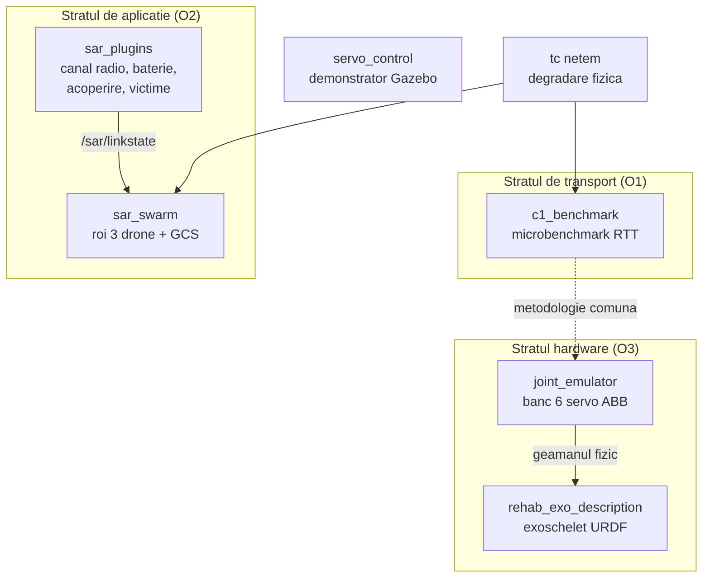

# Contributii la dezvoltarea sistemelor robotice prin controlul de la distanta in timp real

Depozit de cercetare doctorala -- IMSAR. Cod, protocoale experimentale si date sintetice
pentru evaluarea middleware-ului ROS 2 (`rmw_zenoh` vs. `rmw_cyclonedds_cpp`) in conditii
de retea degradata, cu aplicatie in robotica Search and Rescue (SAR) si tele-reabilitare.

---

## Rezumat

Studiile comparative existente asupra protocoalelor pub/sub (Zenoh, DDS, MQTT, Kafka)
raporteaza performanta exclusiv in conditii ideale de retea [1]. Prezentul depozit
operationalizeaza evaluarea in regimuri degradate realiste pentru misiuni SAR
(pierdere de pachete, latenta, jitter, combinatii), pe doua straturi de masura:
(i) stratul de transport -- microbenchmark RTT pe ecou; (ii) stratul de misiune --
roi de drone simulat cu metrici operationale (timp de finalizare, acoperire).
Suplimentar, depozitul contine emulatorul software al unui banc fizic cu sase
servomotoare ABB cuplate in perechi (trei articulatii), destinat validarii hardware
a controlului de impedanta prin legaturi degradate (tele-impedanta adaptiva).

## Directii de cercetare

- **Roiuri SAR.** Roi de patru drone autonome cu GCS, degradare de retea injectabila
  si metrici de misiune (acoperire, victime, timp) -- `sar_swarm`, `sar_plugins`.
- **Benchmark middleware (C1).** Microbenchmark de transport `rmw_zenoh` vs.
  `rmw_cyclonedds_cpp` sub `tc netem`, plus stratul aplicativ adaptiv la legatura
  -- `c1_benchmark`, `link_adaptive`.
- **Retea MESH multi-hop.** Recuperarea telemetriei intr-un roi partitionat prin
  relay hop-by-hop -- `mesh_plugin`.
- **Exoschelet / tele-reabilitare.** Validarea hardware a impedantei adaptive prin
  legaturi degradate -- `joint_emulator`, `rehab_exo_description`, `servo_control`.

> **Datele experimentale NU sunt versionate.** Rezultatele campaniilor (`results_c1/`,
> `sar_swarm/results/`, `teleop_rover/results/campaign_*/`, `stats_out/`, mediile
> virtuale) se regenereaza cu scripturile si se arhiveaza in afara depozitului. In git
> intra doar codul, scripturile de analiza, documentatia si cateva figuri reprezentative
> din `*/docs/`.

## 1. Obiective

| ID | Obiectiv | Pachet principal |
|----|----------|------------------|
| O1 | Cuantificarea degradarii transportului ROS 2 (RTT, pierdere) sub conditii netem | `c1_benchmark` |
| O2 | Masurarea impactului la nivel de misiune SAR (timp, acoperire, finalizare) | `sar_swarm`, `sar_plugins` |
| O3 | Validarea hardware a impedantei adaptive la calitatea legaturii | `joint_emulator`, `rehab_exo_description` |

## 2. Arhitectura sistemului



Degradarea de retea este aplicata FIZIC (`tc qdisc ... netem`) pe interfata de test;
injectoarele simulate raman dezactivate in campanii (`scenario:=none.yaml`), astfel
incat diferentele masurate apartin exclusiv middleware-ului.

## 3. Taxonomia pachetelor

Fiecare nume trimite la README-ul pachetului.

| Pachet | Tip | Rol | Verificari |
|--------|-----|-----|------------|
| [`c1_benchmark`](c1_benchmark/README.md) | script | benchmark transport + misiune, articolul A1 (SSRR 2026) | 11 + selftest figuri |
| [`sar_swarm`](sar_swarm/README.md) | script | roiul SAR: 4 drone, GCS, injector, sonda, ecran de misiune | >100 (3 suite) |
| [`sar_plugins`](sar_plugins/README.md) | script | plugin-uri de mediu: canal, baterie, acoperire, victime | 55 |
| [`mesh_plugin`](mesh_plugin/README.md) | ament | retea MESH multi-hop peste roi (relay hop-by-hop, ETX) | selftest 31 |
| [`link_adaptive`](link_adaptive/README.md) | ament | strat adaptiv la starea legaturii (NOMINAL/DEGRADED/CRITICAL) | selftest 22/22 |
| [`joint_emulator`](joint_emulator/README.md) | script | bancul cu 6 servomotoare: impedanta, encodere, vizualizare | 34 |
| [`teleop_rover`](teleop_rover/README.md) | script | roverul teleoperat: link degradat, pilot/manual, perceptie + go-to-goal | 22 + SIL |
| [`rehab_exo_description`](rehab_exo_description/README.md) | ament | exoscheletul de reabilitare (URDF, launch, failsafe) | tag `rehab-v0.3.0` |
| [`servo_control`](servo_control/README.md) | ament | demonstratorul istoric: motor Gazebo cu comanda tastatura | -- |
| [`curs_ros2`](curs_ros2/README.md) | ament | exercitii de curs ROS 2 (14 module) | test/ (lint + logica) |
| [`curs_ros2_interfaces`](curs_ros2_interfaces/README.md) | ament | interfete custom (msg/srv/action) pentru curs | -- |
| [`gen_articol`](gen_articol/README.md) | script | generator de schelete de articole stiintifice (LaTeX) | -- |

## 4. Metodologia experimentala

**Conditiile de retea** (aplicate cu `tc netem` pe interfata de test):

| Conditie | Parametri netem |
|----------|-----------------|
| `ideal` | fara qdisc |
| `loss_5` / `loss_15` / `loss_30` | `loss 5%` / `loss 15%` / `loss 30%` |
| `lat200_jit50` | `delay 200ms 50ms` |
| `lat200_l15` | `delay 200ms` + `loss 15%` |

**Metrici.** Transport: RTT (p50/p95/p99) pe ecou si pierderea end-to-end in limita
unui termen per esantion. Misiune: timpul de finalizare, acoperirea finala,
rata de finalizare (cenzurata la dreapta de bugetul de timp).

**Reproducibilitate.** Fiecare rulare scrie un manifest JSON (seed, versiuni, conditie);
datele brute se arhiveaza in `~/c1_archive/` (in afara depozitului); in depozit intra
numai sumarele CSV si figurile. Inaintea oricarei campanii: `./preflight.sh`
(detecteaza qdisc rezidual si procese vii).

## 5. Mediul software

| Componenta | Versiune |
|------------|----------|
| Sistem de operare | Ubuntu 24.04 LTS |
| ROS 2 | Jazzy Jalisco |
| Simulator | Gazebo (ros_gz) |
| Middleware comparat | `rmw_zenoh_cpp`, `rmw_cyclonedds_cpp` |
| Limbaj | Python 3.12 |
| Emulare retea | iproute2 / tc netem |

## 6. Compilare si verificare

```bash
# garda: nu se construieste peste o campanie in mers
pgrep -af "run_campaign|bench_|rmw_zenohd" && echo "STOP" || echo "liber"

cd ~/ros2_ws
source /opt/ros/jazzy/setup.bash
colcon build --symlink-install
source install/setup.bash

# testul de fum al intregului depozit (fara ROS, sigur oricand)
cd ~/ros2_ws/src && ./smoke_all.sh
```

## 7. Conventii de dezvoltare

1. Logica pura, testata izolat, precede nodurile ROS (noduri subtiri; mesaje JSON pe `std_msgs/String`).
2. Datele de iesire ale nodurilor: CSV in `~/sar_data/`; rezultatele campaniilor: in afara pachetelor.
3. Un singur publisher pe `/sar/linkstate` (nodul de canal radio SAU injectorul de defecte).
4. Comentariile din cod: romana fara diacritice. Commit imediat dupa fiecare jalon verificat.
5. Inghet de cod pe `c1_benchmark` si `sar_swarm` in perioada premergatoare submisiei.

## 8. Rezultate sintetice (campania C1)

Cifre din campania curata peer-to-peer (mediu curat inainte de fiecare rulare), N=10
(9 pentru zenoh/loss_30), payload 4096 B; sursa: `c1_benchmark/NOTA_METODOLOGICA_C1.md`.
p95 RTT in ms, CV = std/medie:

| Conditie | p95 DDS [ms] | CV DDS | p95 Zenoh [ms] | CV Zenoh | pierdere DDS | pierdere Zenoh |
|----------|--------------|--------|----------------|----------|--------------|----------------|
| loss_15    | 1019 | 10% | 560  | 23%  | 1.4%  | 8.5%  |
| loss_25    | 2145 | 3%  | 5392 | 100% | 26.5% | 34.1% |
| loss_30    | 2317 | 2%  | 8709 | 63%  | 41.0% | 57.8% |
| lat200_l15 | 2548 | 1%  | 3893 | 49%  | 36.0% | 20.8% |

Observatia centrala (loopback): CycloneDDS are latenta de coada mare dar PREDICTIBILA
(CV sub 20%, monotona cu pierderea), pe cand Zenoh are latenta mare SI imprevizibila
(CV 50-100%; la loss_25, variatie de un ordin de marime intre rulari identice). Pentru
teleoperare in timp real, unde conteaza predictibilitatea, CycloneDDS este net preferabil
pe loopback. Versiunea initiala arata Zenoh aparent imun la pierdere mica -- artefact de
stare reziduala, care NU se foloseste. Comparatia autoritara necesita HIL pe doua masini
fizice. Conditiile `ideal` / `loss_5` / `lat200_jit50` nu au inca cifre consolidate
(TODO: de completat din campania reala).

In domeniul tele-impedantei, simularea demonstreaza ca amortizarea pe viteza intarziata
destabilizeaza bucla de la ~10-20 ms; solutia validata este amortizarea locala cu
rigiditate adaptiva transmisa prin legatura (pasiva pana la 120 ms).

## 9. Pornirea rapida a fiecarei aplicatii

| Aplicatie | Comanda de pornire | Documentatia |
|---|---|---|
| Benchmark transport (C1) | `python3 run_campaign.py --iface lo --reps 2 --out ~/c1_results` | `c1_benchmark/README.md` |
| Roiul SAR | `ros2 launch launch/sar_ros.launch.py scenario:=baseline.yaml` | `sar_swarm/README.md` |
| Etajul de misiune | `ros2 launch nodes/mission_sar.launch.py profile:=open_field` | `sar_plugins/README.md` |
| Bancul cu 6 servo | 4 terminale: emulator + encodere + RViz + panou | `joint_emulator/README.md` |
| Exoscheletul (exercitii) | `ros2 launch rehab_exo_description gazebo.launch.py` | `rehab_exo_description/README.md` |
| Tele-reabilitarea | `ros2 launch rehab_exo_description telerehab.launch.py telerehab:=true` | `rehab_exo_description/README.md` |
| Roverul teleoperat | `ros2 launch ./launch/teleop.launch.py lat:=200 mode:=pilot` | `teleop_rover/README.md` |
| Motorul demonstrator | `ros2 launch servo_control servo_launch.py` | `servo_control/README.md` |

## 10. Referinte

[1] W.-Y. Liang, Y. Yuan, H.-J. Lin, "A Performance Study on the Throughput and
    Latency of Zenoh, MQTT, Kafka, and DDS", arXiv:2303.09419, 2023.
[2] Eclipse Zenoh, https://zenoh.io
[3] Eclipse Cyclone DDS, https://github.com/eclipse-cyclonedds/cyclonedds
[4] ROS 2 Jazzy Jalisco, https://docs.ros.org/en/jazzy
[5] tc-netem(8), Linux man-pages, iproute2.
