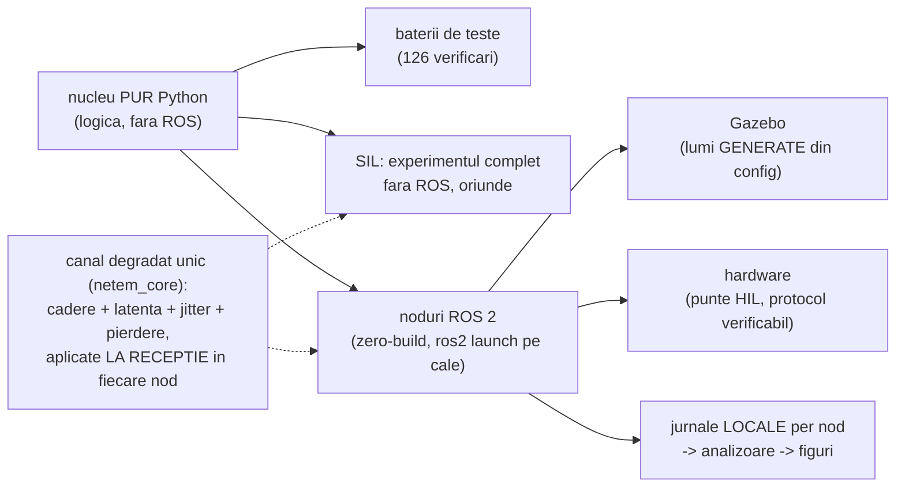

# Sisteme robotice cu control la distanță în timp real — workspace doctoral ROS 2

**Repo-ul tezei „Contribuții la dezvoltarea sistemelor robotice prin control la distanță în timp real" (IMSAR): trei aplicații complete pe aceeași coloană vertebrală — nucleu de logică pur (testat automat), simulare software-in-the-loop, ROS 2, Gazebo și punte spre hardware — toate construite în jurul aceleiași întrebări de cercetare: ce se întâmplă cu controlul robotic atunci când rețeaua se degradează, și cum se compară middleware-urile (CycloneDDS / Zenoh / FastDDS) în condiții realiste, nu ideale.**

   

---

## Cele trei aplicații

| Pachet | Ce este | Tipul de control studiat | Stare |
|---|---|---|---|
| [`rehab_exo_description`](rehab_exo_description/README.md) | Scaun medical de recuperare locomotorie: 6 servomotoare, pacient integrat, axe de ajustare, senzori, panou de operator, telemetrie | control **local** prin traiectorii sigure (baza pentru tele-reabilitare) | Gazebo **confirmat funcțional**; raport tehnic de 11 pagini |
| [`sar_swarm`](sar_swarm/README.md) | 4 drone Search & Rescue + GCS în mediu apocaliptic: explorare cooperativă, store-and-forward, injecție de defecte, om-în-buclă | control **supervizor** la distanță (comenzi discrete) sub degradare de rețea | 6 scenarii **măsurate**; 101 teste; meniu RMW; ecran cu date + banc de defecte |
| [`teleop_rover`](teleop_rover/README.md) | Rover diferențial teleoperat pe slalom: pilot-model reproductibil sau om la manșă, strat de siguranță, punte HIL | control în **buclă închisă** în timp real (cazul dur al tezei) | măturare 75 de rulări **măsurată**; 25 teste; validat ROS real = SIL; HIL pe loopback |

Tiparul comun, validat de trei ori (și lecția de arhitectură a repo-ului):



## Rezultate măsurate (selecție)

**SAR — misiunea sub degradare** (toate scenariile găsesc 5/5 victime; SIL, store-and-forward activ):

| Scenariu | Timp | Acoperire | Observația de teză |
|---|---|---|---|
| referință | 106.5 s | 95.2% | RTT p95 = 98 ms |
| pierdere 30% | 129.3 s | 95.1% | +21% timp — misiunea rezistă |
| vârf latență 2 s | 130.5 s | 95.7% | RTT p95 = 4.4 s, absorbit după vindecare |
| partiție 2v2 | 150 s (plafon) | 91.6% | 80 s deconectat; recuperare 0.05 s |
| **concluzia** | — | — | **latența de 2 s costă mai mult decât pierderea de 30%** |

**Pierderea legăturii cu GCS** — demonstrată cu date (jurnal local pe dronă + analizor): `LINKED → LOCAL_EXPLORE` (15 s, explorare autonomă, restanța de hartă urcă la 96 de celule) `→ RETURN_TO_LINK` (3 s) `→ LOITER` (cercuri de ~3 m) `→` la reconectare restanța se golește dintr-o rafală și GCS realocă.

**Teleoperarea în buclă închisă** (pilot identic, 5 rulări/condiție; bucla trece prin rețea de două ori):

| Latență (un sens) | Comportament măsurat |
|---|---|
| ≤ 200 ms | stabil: slalom terminat în 29–36 s, CTE p95 ≈ 0.8 m, zero opriri |
| 200 → 500 ms | **pragul de rupere**: pilotul orbitează porțile pe date vechi, misiunea nu se mai termină |
| 1000 ms | comenzile încalcă pragul de vechime → sistemul **eșuează în siguranță** (8→35 opriri/rulare la pierdere 0→30%), nu în derivă |

Validare încrucișată: rularea ROS reală a terminat slalomul la 200 ms în **35.3 s** — în fereastra prezisă de SIL (34–36 s). Simularea e predictor al stratului real.

## Pornire rapidă

```bash
sudo apt install -y python3-tk ros-jazzy-ros-gz ros-jazzy-gz-ros2-control \
  ros-jazzy-ros2-control ros-jazzy-ros2-controllers ros-jazzy-rmw-cyclonedds-cpp
git clone https://github.com/alexandru-tech-web/ROS2.git ~/ros2_ws/src
cd ~/ros2_ws && colcon build && source install/setup.bash   # doar pt. rehab

# 1) Recuperare medicală — stația de operator:
ros2 launch rehab_exo_description operator.launch.py

# 2) SAR — meniul de misiune (middleware + mod + scenariu, dintr-o fereastră):
cd ~/ros2_ws/src/sar_swarm && python3 sar_launcher.py

# 3) Teleoperare — experimentul fără ROS, apoi tu la manșă cu 500 ms latență:
cd ~/ros2_ws/src/teleop_rover && python3 sweep_teleop.py
ros2 launch ./launch/teleop.launch.py lat:=500 jit:=100 mode:=manual
```

Fiecare pachet are README propriu cu toate comenzile, scenariile și figurile.

## Legătura cu programul doctoral

- **C1 (articol-țintă, SSRR 2026)** — benchmarking `rmw_zenoh` vs CycloneDDS sub degradare realistă de rețea: microbenchmark-ul de transport (latency pub/sub + tc netem) **plus etajele de aplicație construite aici**: misiunea SAR (`sar_ros.launch.py` cu `RMW_IMPLEMENTATION` comutat din meniu) și teleoperarea (`teleop.launch.py`, metrici: CTE, timp, opriri). Pe mașini separate, injectoarele se înlocuiesc cu **tc netem real** fără a schimba nodurile.
- **Metrica nouă a tezei**: latența și rata de reușită a **comenzii umane** sub degradare — jurnalizată nativ (`op_commands.csv` la SAR: sent→ack→done; `robot_log.csv` la teleop: vârsta comenzii, opririle de siguranță).
- **Tele-reabilitare** (direcția următoare): același canal + SafetyGate altoite pe `/exercise_cmd` al scaunului de recuperare — a treia aplicație devine și ea „la distanță".

## Structura repo-ului

```text
src/  (rădăcina acestui repo)
├── rehab_exo_description/   scaunul de recuperare (URDF v3, control, interfețe)
├── sar_swarm/               roiul SAR (nuclee+SIL+ROS+Gazebo, meniu, defecte)
├── teleop_rover/            teleoperarea (nucleu+SIL+ROS+Gazebo+HIL)
├── servo_control/           exerciții timpurii de control (istoric)
└── README.md                acest fișier
```

## Lecții transversale (jurnalul de dezvoltare al repo-ului)

1. **Nucleu pur + teste înainte de orice rulare live** — de trei ori la rând, defectele reale (gardă la sol, ack-uri suprapuse, prag de percentilă) au fost prinse de teste/SIL, nu de Gazebo.
2. **Degradarea se aplică LA RECEPȚIE, per nod** — un singur dicționar de stare a legăturilor (`linkstate`) face același cod corect în SIL, ROS pur și Gazebo; și a expus o lacună reală (pierderea nu se aplica în stratul ROS până la bancul de defecte custom).
3. **Jurnale LOCALE pe fiecare nod** — singura sursă completă în exact perioada interesantă (deconectarea, când centrul nu te mai vede).
4. **Siguranța nu e toleranța controlerului**: la rehab, toleranțele JTC abortau traiectoria („mișcă puțin și se oprește"); la teleop, siguranța corectă = watchdog + respingerea comenzilor vechi, măsurabile, în amonte de hardware.
5. **rclpy e strict cu tipurile parametrilor** — `lat:=200` ≠ `200.0`; parametrii numerici expuși în launch se declară cu `dynamic_typing`.
6. **Git: o singură rădăcină de repo, aleasă conștient** (aici: `src/`); `.git` imbricat = submodul-fantomă; două repo-uri pe același remote = push-uri respinse în lanț.
7. **Lumile Gazebo se GENEREAZĂ din aceeași configurație ca logica** — ruinele/porțile din simulator sunt literal obstacolele/traseul algoritmilor; zero derive între ele.

## Foaie de parcurs: ce dezvoltăm și îmbunătățim în continuare

**M1 — Precizia modelelor.** Rehab: mesh-uri STL din Fusion360 montate pe cadrele URDF existente + inerții/mase din CAD (cadrele și convențiile sunt deja fixate — înlocuirea e locală); limite de mișcare per pacient din literatura clinică. Rover: dinamică de actuator (limită de accelerație pe v/ω în `DiffDrive.step` — 3 linii, apoi re-rulat sweep-ul: pragul de rupere se mută?). Drone: pasul mare e modelul multirotor (înclinare, vânt) sau PX4 SITL — de planificat după C1. *Ce cumpără: cifre transferabile pe hardware, recenzori liniștiți.*

**M2 — Lumi mai realiste.** Asset-uri Gazebo Fuel (clădiri dărâmate reale) și teren cu heightmap în lumea SAR; zgomot de senzor (LiDAR/cameră) și iluminare variabilă; fumul să atenueze REAL senzorii în Gazebo, nu doar în SIL (în SIL efectul există deja: detecție ×0.4 în fum — de oglindit printr-un filtru pe scanul LiDAR). *Ce cumpără: percepție credibilă; demonstrații vizuale puternice pentru prezentări.*

**M3 — Hardware-in-the-loop. Nucleul e gata:** protocol serial verificabil (`hw_link.py`, 8 teste: sume de control, fragmentare, zgomot), backend `use_hardware` în roverul teleoperat cu **SafetyGate rămas în amonte**, mod loopback (HIL complet fără fire — testat) și `hil_firmware_reference.ino` pentru ESP32/Arduino cu watchdog la bord. Pașii rămași: șasiu cu 2 motoare + encodere (înlocuiesc dead-reckoning-ul), apoi **același sweep, pe robot fizic, prin tc netem real** — capitolul experimental suprem al tezei. Pentru rehab: schelet `hardware_interface` ros2_control pe același protocol. *Ce cumpără: „control la distanță în timp real" demonstrat pe hardware, nu doar în simulare.*

## Licență

Apache-2.0 (per pachet, în `package.xml` / README-uri).
