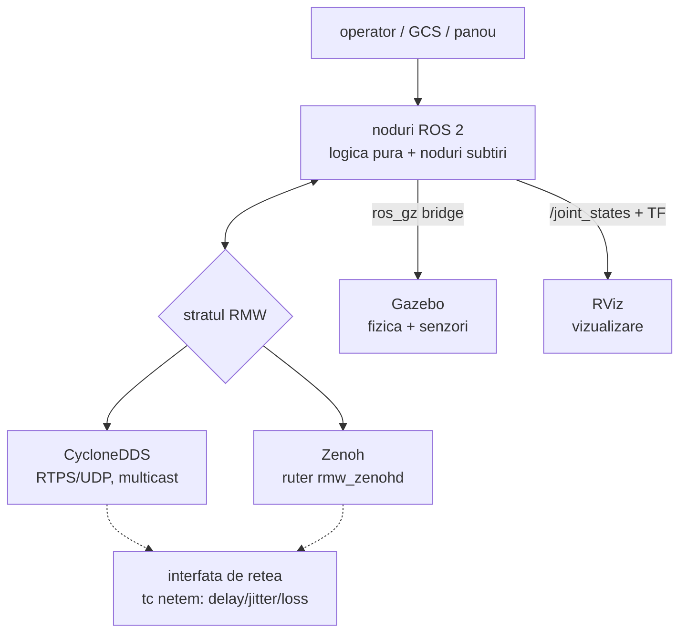

# Tehnologiile depozitului — ROS 2, Gazebo, RViz si protocoalele de comunicatie

Referinta tehnica unitara a stivei folosite in acest depozit. Fiecare concept
este ancorat intr-un exemplu concret din pachetele de aici, astfel incat
documentul sa serveasca atat ca material de fundamentare (teza), cat si ca ghid
practic. Comenzile presupun Ubuntu 24.04 + ROS 2 Jazzy.

---

## 1. ROS 2 (Jazzy Jalisco)

ROS 2 nu este un sistem de operare, ci un strat de comunicatie (middleware) plus
conventii si unelte pentru sisteme robotice distribuite: procesele (nodurile)
schimba date prin primitive standardizate, fara sa stie unul de existenta
celuilalt — doar de numele si tipul canalului.

### 1.1 Primitivele grafului de calcul

| Primitiva | Model | Cand se foloseste | Exemplu din depozit |
|---|---|---|---|
| Topic | pub/sub, N-la-N, asincron | fluxuri continue: senzori, telemetrie, comenzi | `/sar/telemetry`, `/joint/state`, `/teleop/cmd` |
| Serviciu | cerere/raspuns, sincron | operatii scurte, cu rezultat imediat | `/ajusteaza_prag` (curs M13) |
| Actiune | obiectiv + feedback + rezultat, anulabil | sarcini lungi | `/fibonacci` (curs M6) |
| Parametru | configuratie per nod, modificabila live | praguri, rate, moduri | `emulator_node`: `k`, `b`, `adaptive` |

### 1.2 Interfetele de mesaje

Tipuri standard folosite in depozit: `std_msgs` (String, Float64,
Float64MultiArray, Empty), `sensor_msgs` (JointState, LaserScan, Image),
`geometry_msgs` (Twist), `nav_msgs` (Odometry), `rosgraph_msgs` (Clock).

Tipuri proprii: se definesc in fisiere `.msg`/`.srv`/`.action` intr-un pachet
SEPARAT de tip ament_cmake (rosidl genereaza codul la build) — mecanismul complet
este demonstrat in `curs_ros2_interfaces` si documentat in
`curs_ros2/docs/07_interfete_custom.md`.

Conventia acestui depozit pentru logica de aplicatie: JSON pe
`std_msgs/String`. Motivatia: zero build la schimbarea schemei, citibil in
`ros2 topic echo`, identic pe orice RMW (esential pentru comparatia C1) si
suficient pentru rate de zeci de Hz. Pretul (fara verificare de tip la
compilare) este acceptat constient si compensat prin teste pe nucleele pure.

### 1.3 QoS — calitatea serviciului

Fiecare publisher/subscriber are un profil QoS; conexiunea exista doar daca
profilurile sunt compatibile.

| Politica | Valori uzuale | Efect |
|---|---|---|
| reliability | `reliable` / `best_effort` | cu sau fara retransmisii |
| durability | `volatile` / `transient_local` | mesajul ramane pentru abonatii tarzii ("latched") |
| history + depth | `keep_last`, N | adancimea cozii |
| deadline / lifespan / liveliness | durate | contracte temporale (avansat) |

Reguli practice: senzorii de mare frecventa merg pe `best_effort` (un esantion
pierdut nu merita o retransmisie tarzie); comenzile si evenimentele merg pe
`reliable`; starile care trebuie vazute de abonatii care apar tarziu (ex.
`/robot_description`) merg pe `transient_local`. Inspectie:
`ros2 topic info /topic --verbose`. Demonstratia practica: `curs_ros2` M8.

### 1.4 Lansarea si orchestrarea

`ros2 run pachet executabil` porneste UN nod; `ros2 launch` orchestreaza
sisteme. Elementele launch folosite in depozit, fiecare cu un exemplu real:

| Element | Rol | Exemplu |
|---|---|---|
| `DeclareLaunchArgument` + `LaunchConfiguration` | argumente `nume:=valoare` | `scenario:=loss_30.yaml` in `sar_ros.launch.py` |
| `Node` | porneste un executabil instalat | `parameter_bridge` in `sar_gazebo.launch.py` |
| `ExecuteProcess` | porneste orice proces (zero-build) | toate nodurile `python3` din pachetele-script |
| `TimerAction` | intarzie pornirea | puntea la 5 s in `servo_launch.py` |
| `IfCondition` | porneste conditionat | `dashboard:=true` in `sar_ros.launch.py` |
| `OpaqueFunction` | logica Python la lansare | alegerea RMW + pornirea automata a routerului in `teleop_perception.launch.py` |

### 1.5 TF2 si starea robotului

Lantul standard: `URDF` -> `robot_state_publisher` (+ `/joint_states`) ->
arborele de transformari TF -> orice consumator (RViz, planificatoare).
`joint_state_publisher_gui` ofera slidere pentru inspectie manuala. URDF-ul se
poate scrie direct sau genera (xacro la `rehab_exo`, generator Python la
`joint_emulator/tools/gen_bench_model.py`). Verificare: `check_urdf fisier.urdf`,
`ros2 run tf2_tools view_frames`.

### 1.6 Workspace si colcon

```
~/ros2_ws/
├── src/        # pachetele (acest depozit)
├── build/      # artefacte intermediare
├── install/    # pachetele instalate (de aici ruleaza ros2 run/launch)
└── log/
```

Underlay/overlay: `source /opt/ros/jazzy/setup.bash` apoi
`source ~/ros2_ws/install/setup.bash`, in fiecare terminal. Build:
`colcon build --symlink-install` (modificarile Python nu mai cer rebuild);
`--packages-select` pentru un singur pachet. Tipuri de pachete: `ament_python`
(setup.py + entry_points) si `ament_cmake` (CMakeLists; obligatoriu pentru
interfete). Regula depozitului: niciun build peste o campanie in mers
(`pgrep -af "run_campaign|bench_|rmw_zenohd"`).

### 1.7 CLI — fisa de comenzi

```bash
ros2 node list | ros2 node info /nod
ros2 topic list | echo | hz | bw | info --verbose | pub --once /t std_msgs/String "data: 'x'"
ros2 service list | ros2 service call /srv tip "{...}"
ros2 action list | ros2 action send_goal /act tip "{...}" --feedback
ros2 param list | get | set /nod parametru valoare
ros2 interface show pachet/msg/Tip
ros2 bag record -a   |   ros2 bag play dosar/
ros2 doctor          # diagnoza mediului
rqt_graph            # graful nodurilor si topicurilor
```

---

## 2. Middleware-ul si protocoalele de comunicatie

### 2.1 Stratul RMW — de ce se poate compara fara a schimba codul

ROS 2 separa API-ul (rclpy/rclcpp) de transport printr-un strat numit RMW
(ROS MiddleWare). Implementarea se alege printr-o variabila de mediu, fara
nicio modificare in aplicatie:

```bash
export RMW_IMPLEMENTATION=rmw_cyclonedds_cpp   # sau rmw_zenoh_cpp
```

Acesta este fundamentul metodologic al benchmarkului C1: aceleasi noduri,
acelasi trafic, doua transporturi.

### 2.2 DDS / CycloneDDS

DDS (Data Distribution Service, standard OMG) este transportul istoric al
ROS 2: protocolul de fir RTPS peste UDP, descoperire complet distribuita prin
multicast (fiecare participant anunta si afla restul), QoS bogat implementat la
nivel de protocol. `reliable` inseamna retransmisii agresive pana la livrare.
Filozofia: NU pierde — recupereaza tot, chiar daca livrarea intarzie.
Consecinta masurata in C1: sub pierdere de pachete, coada de latenta creste
(p95 pana la secunde), dar pierderea end-to-end ramane mica... pana cand
retransmisiile insele satureaza legatura (45.6% pierdere la lat200+loss15).

### 2.3 Zenoh / rmw_zenoh

Zenoh unifica pub/sub si query intr-un protocol proiectat pentru retele
eterogene si degradate (WAN, wireless). In `rmw_zenoh`, nodurile sunt sesiuni
client/peer, iar descoperirea trece printr-un RUTER:

```bash
ros2 run rmw_zenoh_cpp rmw_zenohd        # ruterul, PORNIT INTOTDEAUNA PRIMUL
```

— de aceea toate launch-urile si scripturile depozitului pornesc routerul
inaintea nodurilor (in `teleop_perception.launch.py` pornirea e automata).
Filozofia: livreaza PROASPAT — sub presiune prefera sa piarda esantioane vechi
decat sa blocheze fluxul. Consecinta masurata: cozi mult mai mici la degradare
usoara/medie si de 3x mai putine pierderi in conditia combinata, cu pretul a
~25% esantioane pierdute la loss_15 pur.

### 2.4 Comparatia masurata (sinteza C1)

| Conditie | p95 DDS | p95 Zenoh | pierdere DDS | pierdere Zenoh |
|---|---|---|---|---|
| ideal | 1.5 ms | 1.7 ms | 0% | 0% |
| loss_15 | 1060 ms | 758 ms | 1.1% | 25.3% |
| lat200_l15 | 2540 ms | 2463 ms | 45.6% | 14.9% |

Doua filozofii de fiabilitate, nu un castigator universal: alegerea depinde de
flux (comanda critica vs. telemetrie de volum). Detalii si metodologie:
`c1_benchmark/README.md`.

### 2.5 Alte protocoale din peisaj

MQTT (broker central, QoS 0/1/2) domina IoT, dar brokerul e punct unic de esec
si adauga un salt; Kafka (jurnal distribuit) tinteste throughput si persistenta,
nu latenta de control. Pentru bucle de control robotic in timp real raman DDS
si Zenoh; studiul comparativ de referinta: Liang et al., arXiv:2303.09419.

### 2.6 Emularea retelei: tc netem

Degradarea se aplica FIZIC pe interfata, ca diferentele masurate sa apartina
exclusiv middleware-ului (injectoarele simulate se opresc in campanii):

```bash
sudo tc qdisc add dev lo root netem delay 200ms 50ms loss 15%   # aplica
tc qdisc show dev lo                                            # verifica
sudo tc qdisc del dev lo root                                   # OBLIGATORIU la final
```

Igiena: `c1_benchmark/preflight.sh` detecteaza qdisc rezidual;
`rehab_exo_description/scripts/netem_profiles.sh` ofera profiluri predefinite
(`loss15|loss30|sar|wifi_slab|clear`).

### 2.7 Fluxuri mari (video)

Imaginile se transporta comprimat: `ros2 run image_transport republish raw
compressed ...` — exemplul camerei dronei d1 (`sar_plugins`, punte + republish).
Fluxul video este si cel mai bun "stres-test" natural pentru RMW.

---

## 3. Gazebo (gz sim)

### 3.1 Rolul si arhitectura

Gazebo moderne (gz-sim, integrat in Jazzy prin `ros_gz`) = motor de fizica +
randare + senzori simulati. Pornire: `gz sim -r lume.sdf` (`-r` = run imediat).
Gazebo este SINGURUL loc unde exista forte si coliziuni — RViz doar deseneaza.

### 3.2 SDF — limbajul lumilor

Ierarhia: `<world>` -> `<model>` -> `<link>` (cu `<visual>`, `<collision>`,
`<inertial>`) -> `<joint>` -> `<sensor>`/`<plugin>`. Doua lectii platite in
acest depozit: (1) un model fara coliziuni CADE prin podea si "dispare" — daca
e decor sau banc ancorat, declara `<static>true</static>` (vezi
`joint_emulator/gz/joint_bench_world.sdf`); (2) heightmap-urile cer imagine
2^k+1 (129x129), cale absoluta `file://` si prezenta in collision SI visual
(`teleop_rover/gen_rough_world.py`).

### 3.3 Plugin-urile folosite in depozit

| Plugin gz | Rol | Unde |
|---|---|---|
| `DiffDrive` | propulsie skid-steer din Twist | roverul (`teleop_rover`) |
| `JointPositionController` | urmarirea pozitiei pe articulatie | bancul (`joint_emulator`) |
| `ApplyJointForce` | cuplu extern pe articulatie | fortele pacientului (`rehab_exo`) |
| `Sensors` (+ ogre2) | camera, gpu_lidar | terenul accidentat (`teleop_rover`) |
| `Imu` | accelerometru/giroscop | `rehab_exo` (extensii) |

### 3.4 Puntea ros_gz

`parameter_bridge` traduce mesaje intre cele doua lumi; sintaxa directiei:

```
/topic@TipROS]TipGZ     ROS -> GZ      (ex. comenzi)
/topic@TipROS[TipGZ     GZ -> ROS      (ex. senzori, odometrie)
```

Exemple reale: `/model/rover/cmd_vel@geometry_msgs/msg/Twist]gz.msgs.Twist`;
`/clock@rosgraph_msgs/msg/Clock[gz.msgs.Clock`; pentru imagini exista puntea
dedicata `ros_gz_image image_bridge`. Listele lungi se tin in YAML:
`-p config_file:=...` (`joint_emulator/gz/bridge_bench.yaml`,
`rehab_exo_description/config/gz_patient_bridge.yaml`).

### 3.5 CLI si capcane

```bash
gz topic -l | gz topic -e -t /topic     # inspectia lumii gz
gz sdf -k lume.sdf                      # validarea SDF
```

Cand simularea da timpul, nodurile ROS primesc `use_sim_time:=true` si puntea
de `/clock` (vezi `rehab_exo_description/launch/gazebo.launch.py`). Camera si
gpu_lidar cer randare GPU (ogre2).

---

## 4. RViz 2

RViz vizualizeaza STAREA sistemului: nu are fizica (eforturile raportate sunt 0
— de aceea `sensor_recorder` noteaza ca torque exista doar in Gazebo). Lantul
minim: URDF -> `robot_state_publisher` -> TF -> RViz (display RobotModel +
Fixed Frame corect). Display-uri folosite: RobotModel, TF, LaserScan, Image.
Configuratiile se salveaza in fisiere `.rviz` si se incarca din launch
(`joint_emulator/rviz/joint_bench.rviz`, `rehab_exo_description/rviz/rehab.rviz`).
Capcana invatata: in Jazzy, materialele URDF globale nu se rezolva intotdeauna —
culorile se declara INLINE per `<visual>`.

| | Gazebo | RViz |
|---|---|---|
| fizica, coliziuni, forte | DA | NU |
| senzori simulati | DA | doar afisare |
| sursa de adevar | lumea SDF | TF + topicuri |
| rol in depozit | fizica si senzorii | fereastra catre stare |

---

## 5. Cum se leaga totul in acest depozit



| Tehnologia | Demonstrata in |
|---|---|
| pub/sub, QoS, RMW interschimbabil | `c1_benchmark`, `curs_ros2` M2/M8 |
| servicii, actiuni, parametri, lifecycle | `curs_ros2` M4–M6, M11 |
| launch avansat (argumente, conditii, timere) | toate launch-urile; `teleop_perception` |
| TF2, URDF/xacro, robot_state_publisher | `rehab_exo_description`, `joint_emulator` |
| Gazebo: lumi, plugin-uri, punti | `sar_swarm`, `teleop_rover`, `joint_emulator`, `rehab_exo` |
| degradare de retea controlata | `c1_benchmark/netem.py`, `netem_profiles.sh` |
| Zenoh vs DDS pe metrici reale | campania C1 + experimentele de misiune |

## 6. Referinte

[1] ROS 2 Jazzy — https://docs.ros.org/en/jazzy
[2] ROS 2 Design (QoS, RMW) — https://design.ros2.org
[3] Gazebo — https://gazebosim.org/docs
[4] Eclipse Zenoh — https://zenoh.io ; rmw_zenoh — https://github.com/ros2/rmw_zenoh
[5] Eclipse Cyclone DDS — https://cyclonedds.io
[6] Liang et al., "Zenoh, MQTT, Kafka, DDS — performanta", arXiv:2303.09419, 2023
[7] tc-netem(8), iproute2
[8] ros_gz — https://github.com/gazebosim/ros_gz
