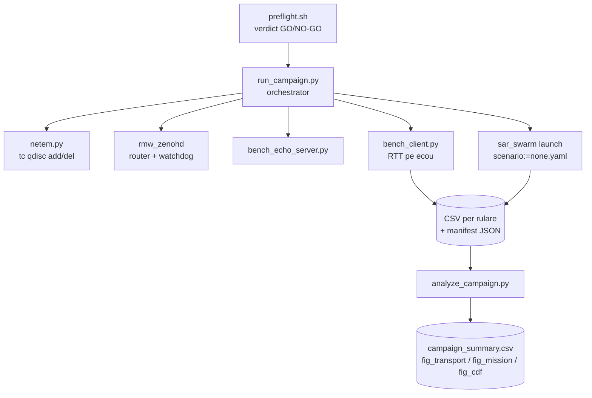

# c1_benchmark — Documentatie tehnica

Benchmark `rmw_zenoh` vs. `rmw_cyclonedds_cpp` sub degradare de retea controlata
(tc netem), pe doua straturi: transport (RTT pe ecou) si misiune SAR completa.
Pachet-sursa al articolului A1 (tinta: SSRR 2026).

## 1. Fluxul de proces



Bucla orchestratorului: `pentru fiecare RMW x conditie x repetitie`: aplica netem →
porneste serverul si clientul (plus stratul de misiune) → colecteaza → curata tc
(`finally`, garantat). Routerul Zenoh este supravegheat (`ZENOH_ROUTER_CHECK_ATTEMPTS`).

## 2. Inventarul fisierelor

| Fisier | Rol | Verificare |
|--------|-----|------------|
| `bench_core.py` | nucleul pur: conditii, statistici RTT, plan, extractor misiune | `test_bench_core.py` (11) |
| `bench_echo_server.py` / `bench_client.py` | microbenchmarkul de transport | rulare directa |
| `netem.py` | aplica/curata/arata conditia pe interfata (`--dry` pentru plan) | idempotent |
| `run_campaign.py` | orchestratorul campaniei | `--dry` |
| `analyze_campaign.py` | agregare + figurile articolului | `--selftest` |
| `preflight.sh` | garda de mediu (qdisc rezidual, procese vii) | verdict explicit |
| `paper/main.tex`, `paper/references.bib` | scheletul IEEE (ipoteze H1–H4) | `pdflatex` |
| `paper/experimental_protocol.md` | protocolul de laborator, cu bife | — |

## 3. Definitia metricilor

```
RTT_i        = t_pong_i - t_ping_i                 (ceasul aceleiasi masini)
pierdere     = 1 - (esantioane sosite in termen) / (esantioane trimise)
p50/p95/p99  = percentilele distributiei RTT pe celula (RMW, conditie)
mission_time = durata pana la criteriul de finalizare; cenzurata la buget
coverage_end = acoperirea zonei la finalul rularii  (0..1)
```

Masurarea pe ecou (dus-intors pe aceeasi masina) elimina problema sincronizarii
ceasurilor intre publisher si subscriber.

## 4. Sintaxe de pornire

```bash
cd ~/ros2_ws/src/c1_benchmark

# 0) verificarile fara ROS
python3 test_bench_core.py                 # 11/11
python3 analyze_campaign.py --selftest     # validarea fluxului de analiza

# 1) garda de mediu (obligatoriu inaintea oricarei campanii)
./preflight.sh                             # asteptat: VERDICT: GO

# 2) planul campaniei (nu ruleaza nimic)
python3 run_campaign.py --dry

# 3) repetitia generala (~40 min)
sudo -v
python3 run_campaign.py --iface lo --reps 2 --duration 10 --out ~/c1_results

# 4) campania completa (~3–4 h; masina ramane libera)
python3 run_campaign.py --iface lo --reps 5 --out ~/c1_results_full

# 5) analiza si figurile
python3 analyze_campaign.py ~/c1_results_full
ls ~/c1_results_full/analysis/             # campaign_summary.csv + fig_*.png

# 6) integrarea in articol
cp ~/c1_results_full/analysis/fig_*.png paper/figs/
cd paper && pdflatex main.tex && bibtex main && pdflatex main.tex && pdflatex main.tex
```

Argumentele orchestratorului:

| Argument | Semnificatie | Implicit |
|----------|--------------|----------|
| `--iface` | interfata pe care se aplica netem | obligatoriu |
| `--reps` | repetitii per celula | 5 |
| `--duration` | durata unei rulari de transport [s] | configurata in plan |
| `--out` | directorul de rezultate (IN AFARA depozitului) | `results_c1/` |
| `--dry` | tipareste planul fara executie | — |

## 5. Conditiile de retea

| Conditie | Comanda tc echivalenta |
|----------|------------------------|
| `ideal` | (fara qdisc) |
| `loss_5` | `tc qdisc add dev <if> root netem loss 5%` |
| `loss_15` | `tc qdisc add dev <if> root netem loss 15%` |
| `loss_30` | `tc qdisc add dev <if> root netem loss 30%` |
| `lat200_jit50` | `tc qdisc add dev <if> root netem delay 200ms 50ms` |
| `lat200_l15` | `tc qdisc add dev <if> root netem delay 200ms loss 15%` |

Nota: pierderea teoretica best-effort pe ecou la `loss_30` este 1-(1-0.3)^2 = 51%;
valorile masurate sub 51% indica recuperare partiala prin mecanismele RMW.

## 6. Rezultatele campaniei (sumar)

| Conditie | p95 DDS [ms] | p95 Zenoh [ms] | pierdere DDS | pierdere Zenoh | misiune DDS [s] | misiune Zenoh [s] |
|---|---|---|---|---|---|---|
| ideal | 1.5 | 1.7 | 0.0% | 0.0% | 120.8 | 135.2 |
| loss_5 | 146 | 25 | 0.0% | 1.0% | 122.0 | 135.5 |
| loss_15 | 1060 | 758 | 1.1% | 25.3% | 116.0 | 124.0 |
| loss_30 | 2590 | 3748 | 42.2% | 36.6% | 123.2 | 150.5 |
| lat200_jit50 | 913 | 481 | 4.2% | 2.7% | 138.0 | 126.0 |
| lat200_l15 | 2540 | 2463 | 45.6% | 14.9% | 118.5 | 148.5 |

Interpretare: (i) la degradare usoara, Zenoh ofera cozi de 3–6x mai mici la pierdere
~0; (ii) la pierdere pura moderata, compromis explicit — DDS recupereaza (1.1%) cu
pretul cozii, Zenoh livreaza proaspat cu pretul a 25% esantioane; (iii) in conditia
combinata, la coada egala, DDS pierde 45.6% vs. 14.9% — separarea decisiva;
(iv) la nivel de misiune diferentele se comprima — autonomia absoarbe degradarea.

## 7. Igiena datelor

```bash
# arhivarea datelor brute (NU intra in git)
mkdir -p ~/c1_archive && cp -r ~/c1_results_full ~/c1_archive/$(date +%F)_campanie/

# in depozit intra numai sumarele si figurile
git add paper/figs/ paper/main.tex
git commit -m "C1: datele campaniei (sumar + figuri)"
git tag c1-data-v1 && git push --tags && git push
```
