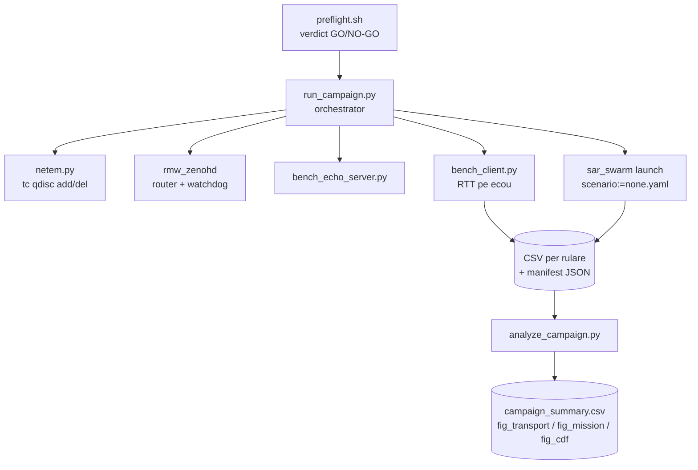

# c1_benchmark -- Documentatie tehnica

Benchmark `rmw_zenoh` vs. `rmw_cyclonedds_cpp` sub degradare de retea controlata
(tc netem), pe doua straturi: transport (RTT pe ecou) si misiune SAR completa.
Pachet-sursa al articolului A1 (tinta: SSRR 2026).

## 1. Fluxul de proces



Bucla orchestratorului: `pentru fiecare RMW x conditie x repetitie`: aplica netem ->
porneste serverul si clientul (plus stratul de misiune) -> colecteaza -> curata tc
(`finally`, garantat). Routerul Zenoh este supravegheat (`ZENOH_ROUTER_CHECK_ATTEMPTS`).

## 2. Inventarul fisierelor

| Fisier | Rol | Verificare |
|--------|-----|------------|
| `bench_core.py` | nucleul pur: conditii, statistici RTT, plan, extractor misiune | `test_bench_core.py` (12) |
| `bench_echo_server.py` / `bench_client.py` | microbenchmarkul de transport | rulare directa |
| `netem.py` | aplica/curata/arata conditia pe interfata (`--dry` pentru plan) | idempotent |
| `run_campaign.py` | orchestratorul campaniei | `--dry` |
| `analyze_campaign.py` | agregare + figurile articolului | `--selftest` |
| `preflight.sh` | garda de mediu (qdisc rezidual, procese vii) | verdict explicit |
| `campaign_stats.py`, `crossover.py` | statistici suplimentare + analiza punctului de crossover | rulare directa |
| `reproduce_pdia.py`, `ml_dataset.csv` | analiza ML (caracterizator RTT) + setul de date agregat | rulare directa |
| `analysis/*.py`, `docs/` | scripturi de figuri auxiliare + REZUMAT_CAMPANIE_EXPERIMENTALA.md | rulare directa |
| `NOTA_METODOLOGICA_C1.md` | nota de validitate (artefact de stare reziduala, limita loopback) | -- |

TODO: directorul `paper/` (main.tex, references.bib, experimental_protocol.md,
figs/) nu exista inca in pachet. Pana il creezi, sectiunile care il refera
(integrarea figurilor, pdflatex, ipotezele H1-H4) raman de completat.

## 3. Definitia metricilor

```
RTT_i        = t_pong_i - t_ping_i                 (ceasul aceleiasi masini)
pierdere     = 1 - (esantioane sosite in termen) / (esantioane trimise)
p50/p95/p99  = percentilele distributiei RTT pe celula (RMW, conditie)
mission_time = durata pana la criteriul de finalizare; cenzurata la buget
coverage_end = acoperirea zonei la finalul rularii  (0..1)
```

Masurarea pe ecou (dus-intors pe aceeasi masina) elimina problema sincronizarii
ceasurilor intre publisher si subscriber.

## 4. Sintaxe de pornire

```bash
cd ~/ros2_ws/src/c1_benchmark

# 0) verificarile fara ROS
python3 test_bench_core.py                 # 12 verificari
python3 analyze_campaign.py --selftest     # validarea fluxului de analiza

# 1) garda de mediu (obligatoriu inaintea oricarei campanii)
./preflight.sh                             # asteptat: VERDICT: GO

# 2) planul campaniei (nu ruleaza nimic)
python3 run_campaign.py --dry

# 3) repetitia generala (~40 min)
sudo -v
python3 run_campaign.py --iface lo --reps 2 --duration 10 --out ~/c1_results

# 4) campania completa (~3-4 h; masina ramane libera)
python3 run_campaign.py --iface lo --reps 5 --out ~/c1_results_full

# 5) analiza si figurile
python3 analyze_campaign.py ~/c1_results_full
ls ~/c1_results_full/analysis/             # campaign_summary.csv + fig_*.png

# 6) integrarea in articol
# TODO: directorul paper/ nu exista inca; pasul de mai jos devine valabil
# dupa ce este creat (paper/figs/, paper/main.tex, paper/references.bib).
# cp ~/c1_results_full/analysis/fig_*.png paper/figs/
# cd paper && pdflatex main.tex && bibtex main && pdflatex main.tex && pdflatex main.tex
```

Argumentele orchestratorului:

| Argument | Semnificatie | Implicit |
|----------|--------------|----------|
| `--iface` | interfata pe care se aplica netem | `lo` |
| `--reps` | repetitii per celula | 5 |
| `--rmws` | RMW-urile comparate (virgula) | `cyclonedds,zenoh` |
| `--conditions` | subset de conditii rulate (virgula); implicit toate | toate |
| `--layers` | straturile masurate (virgula) | `transport,mission` |
| `--duration` | durata unei rulari de transport [s] | `20.0` |
| `--mission-timeout` | plafonul unei rulari de misiune [s] | `170.0` |
| `--out` | directorul de rezultate (IN AFARA depozitului) | `results_c1/` |
| `--dry` | tipareste planul fara executie | -- |

## 5. Conditiile de retea

Definite in `bench_core.py` (`CONDITIONS`); comanda exacta o construieste
`netem_cmd` (verificata in `test_bench_core.py`). Forma generala folosita este
`tc qdisc replace dev <if> root netem delay <lat>ms <jit>ms loss <p>%`
(idempotenta prin `replace`); pentru rafale se adauga corelatia `loss <p>% <corr>%`.

| Conditie | delay | jitter | pierdere | corelatie (rafala) |
|----------|-------|--------|----------|--------------------|
| `ideal` | 0ms | 0ms | 0.0% | -- |
| `loss_5` | 0ms | 0ms | 5.0% | -- |
| `loss_15` | 0ms | 0ms | 15.0% | -- |
| `loss_20` | 0ms | 0ms | 20.0% | -- |
| `loss_25` | 0ms | 0ms | 25.0% | -- |
| `loss_30` | 0ms | 0ms | 30.0% | -- |
| `loss_20_burst` | 0ms | 0ms | 20.0% | 50.0% |
| `loss_25_burst` | 0ms | 0ms | 25.0% | 50.0% |
| `loss_30_burst` | 0ms | 0ms | 30.0% | 50.0% |
| `lat200_jit50` | 200ms | 50ms | 0.0% | -- |
| `lat200_l15` | 200ms | 50ms | 15.0% | -- |

Exemplu (loss_15): `tc qdisc replace dev lo root netem delay 0ms 0ms loss 15.0%`.

Nota: pierderea teoretica best-effort pe ecou la `loss_30` este 1-(1-0.3)^2 = 51%;
valorile masurate sub 51% indica recuperare partiala prin mecanismele RMW.

Nota metodologica: conditiile `*_burst` sunt EXCLUSE din campania de referinta
(netem corelat nu pastreaza media impusa; vezi `NOTA_METODOLOGICA_C1.md`).

## 6. Rezultatele campaniei (transport, loopback, N=10)

ATENTIE -- limita de validitate (vezi `NOTA_METODOLOGICA_C1.md` si
`docs/REZUMAT_CAMPANIE_EXPERIMENTALA.md`): tabelul de mai jos este o referinta de
LOOPBACK (un singur host, netem pe `lo`), nu o comparatie autoritara. O campanie
initiala arata Zenoh aparent imun la pierdere mica; aceasta s-a dovedit un artefact
de stare reziduala de mediu (router/proces ramas, conditii de cursa) si NU se
foloseste. Cifrele finale de mai jos provin din campania curata peer-to-peer, mediu
curat inainte de fiecare rulare, N=10 (9 pentru zenoh/loss_30), payload 4096 B.
Comparatia echitabila Zenoh vs CycloneDDS necesita HIL pe doua masini fizice.

p95 RTT [ms], CV = std/medie, CI95 = interval de incredere 95% (din
`NOTA_METODOLOGICA_C1.md` sectiunea 7):

| Conditie | N | p95 DDS [ms] | CV DDS | p95 Zenoh [ms] | CV Zenoh | pierdere DDS | pierdere Zenoh |
|----------|---|--------------|--------|----------------|----------|--------------|----------------|
| loss_15    | 10 | 1019 (+/-77) | 10%  | 560 (+/-91)   | 23%  | 1.4%  | 8.5%  |
| loss_20    | 10 | 1746 (+/-73) | 6%   | 972 (+/-381)  | 55%  | 7.7%  | 16.9% |
| loss_25    | 10 | 2145 (+/-43) | 3%   | 5392 (+/-3867)| 100% | 26.5% | 34.1% |
| loss_30    | 10/9 | 2317 (+/-39) | 2% | 8709 (+/-4216)| 63%  | 41.0% | 57.8% |
| lat200_l15 | 10 | 2548 (+/-23) | 1%   | 3893 (+/-1354)| 49%  | 36.0% | 20.8% |

Interpretare (loopback, conform documentelor de metodologie):
(i) CycloneDDS are latenta de coada mare dar PREDICTIBILA (CV sub 20%, CI95
strans), monotona cu pierderea; (ii) Zenoh are latenta de coada mare SI
imprevizibila (CV 50-100%; la loss_25 variatie de un ordin de marime, ~0.9-18.5 s
intre rulari identice), imprevizibilitate reprodusa pe N=1 si pe N=10 -> trasatura
reala pe acest montaj; (iii) pentru teleoperare in timp real, unde conteaza
predictibilitatea, CycloneDDS este net preferabil pe loopback.

TODO: stratul de misiune (timp de finalizare per conditie) si conditiile `ideal` /
`loss_5` / `lat200_jit50` nu au cifre consolidate in pachet; de completat din
campania reala inainte de orice submisie (vezi nota despre HIL).

## 7. Igiena datelor

```bash
# arhivarea datelor brute (NU intra in git)
mkdir -p ~/c1_archive && cp -r ~/c1_results_full ~/c1_archive/$(date +%F)_campanie/

# in depozit intra numai sumarele si figurile
# (figurile si rezumatul ilustrat sunt in docs/; campaign_summary.csv se
#  genereaza de analyze_campaign.py si se copiaza in repo separat de datele brute)
git add docs/
git commit -m "C1: datele campaniei (sumar + figuri)"
git tag c1-data-v1 && git push --tags && git push
```
