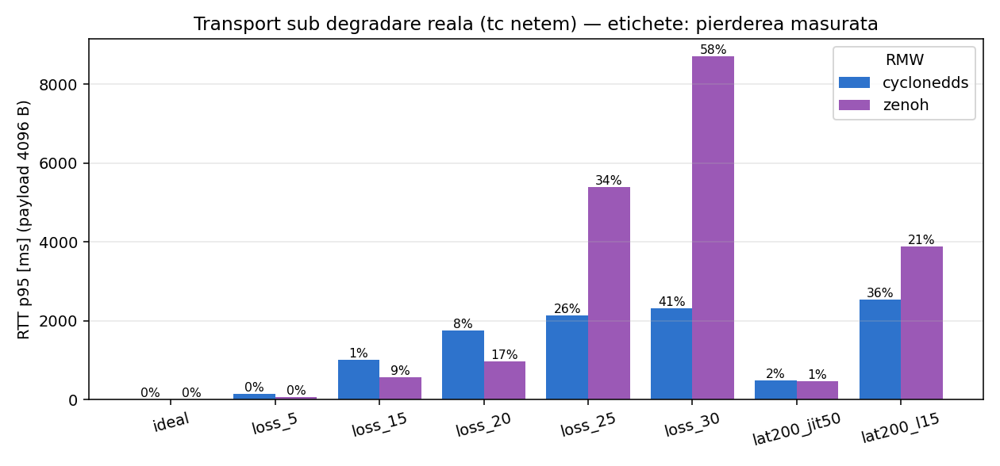
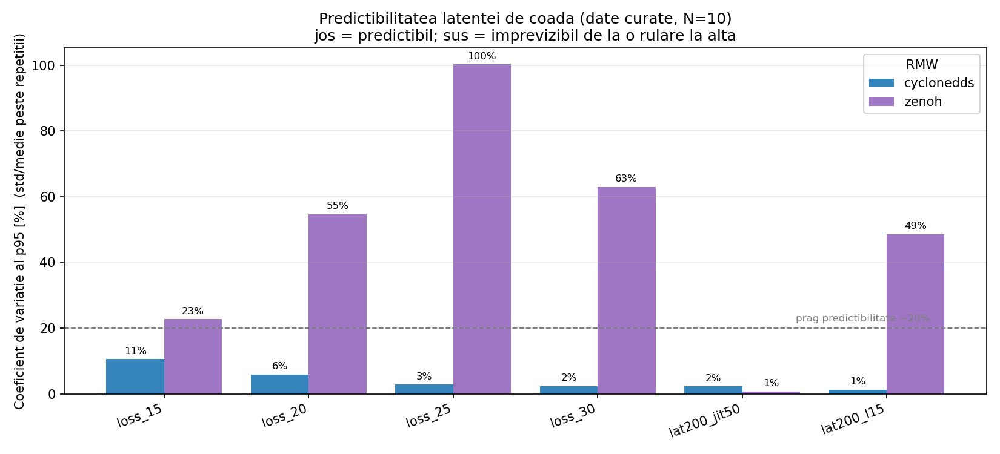
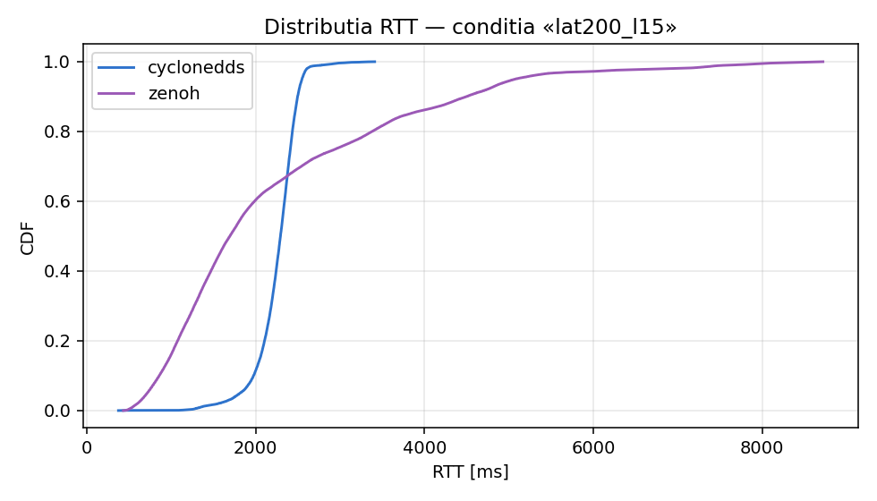
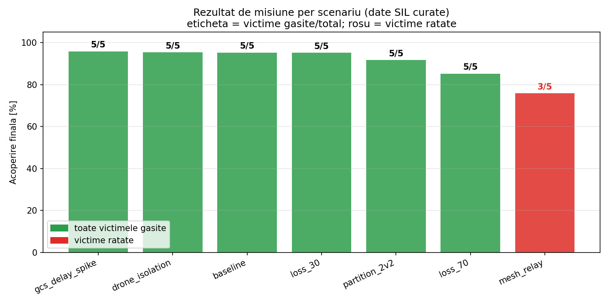
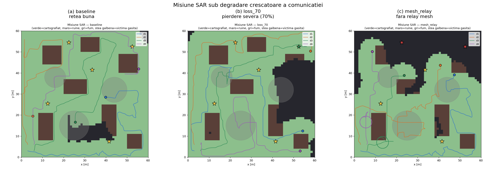

# Campania experimentala C1 + demonstrator SAR -- rezumat ilustrat

Doctorand: Alexandru. Etapa: benchmark middleware (C1) si demonstrator SAR (SIL),
inainte de validarea hardware-in-the-loop (HIL).

## Pe scurt: ce s-a intamplat

Am masurat doua straturi distincte: (1) un microbenchmark de transport sub
degradare de retea reala (tc netem), si (2) un demonstrator SAR de roi de drone
in simulare. Verificand rezultatele, am descoperit ca o coloana de date (Zenoh,
transport) era contaminata de stare reziduala de mediu; am izolat-o prin
verificare directa, am re-rulat curat (N=10) si am ajuns la o concluzie
metodologica clara. Rezultat: pe loopback, CycloneDDS are latenta predictibila,
Zenoh imprevizibila; comparatia autoritara cere HIL pe doua masini.

## 1. Ce am masurat (doua straturi care NU se confunda)

- **Transport (microbenchmark):** bench_client <-> bench_echo_server (noduri
  ROS 2), RTT per mesaj, 50 Hz, payload 64/4096/65536 B, degradare reala cu
  `tc netem` pe `lo`. Doua middleware peer-to-peer: rmw_cyclonedds_cpp si
  rmw_zenoh_cpp. Masoara TRANSPORTUL.
- **Demonstrator SAR (SIL):** roi de 4 drone, cautare prin acoperire, detectie
  victime prin proximitate, harta fuzionata la GCS. Foloseste un model SOFTWARE
  de canal (nu netem real), determinist. Masoara APLICATIA (acoperire, victime).

## 2. Integritatea datelor (verificarea care a salvat rezultatul)

Anomalie: Zenoh aparea imun la pierdere mica (loss_15: p95 ~2 ms, 0% pierdere) --
fizic implauzibil. Verificari directe:
- Shared-memory: dezactivat implicit pe ROS 2 Jazzy (confirmat in config). Nu el.
- Bypass pe lo: `ifstat` arata ~400 KB/s in timpul rularilor -> netem se aplica.
- Router Zenoh: crapa sub pierdere -> rulari instabile.
- Mediu CURAT (P2P): Zenoh e lovit consistent (loss_15: 499/307/711 ms pe 3 rulari).

Concluzie: imunitatea era un artefact de stare reziduala, nereproductibil. Am
re-rulat curat, N=10, ambele RMW peer-to-peer.

## 3. Transport sub degradare (loopback, N=10 curat)

**Magnitudinea** -- p95 creste cu pierderea; DDS scaleaza neted, Zenoh sare la
pierdere mare:

**Predictibilitatea (rezultatul cheie)** -- coeficientul de variatie al p95 peste
repetitii. DDS sub pragul de 20% (predictibil); Zenoh 50-100% (imprevizibil de la
o rulare la alta, la aceeasi conditie):

**Distributia** -- la lat200_l15, cozile nici nu se suprapun: DDS strans
(~1.3-3.1 s), Zenoh imprastiat pana la ~8.3 s:

Sinteza N=10 (p95, payload 4096):

| RMW        | loss_15 | loss_20 | loss_25        | loss_30        |
|------------|---------|---------|----------------|----------------|
| CycloneDDS | 1019 ms (CV 10%) | 1746 ms (CV 6%) | 2145 ms (CV 3%) | 2317 ms (CV 2%) |
| Zenoh      | 560 ms (CV 23%)  | 972 ms (CV 55%) | 5392 ms (CV 100%) | 8709 ms (CV 63%) |

Concluzie strat transport: **CycloneDDS = latenta de coada predictibila; Zenoh =
latenta de coada imprevizibila** (variatie de un ordin de marime, 0.9-18.5 s la
loss_25). Pentru teleoperare in timp real, predictibilitatea e ce conteaza.

> LIMITA: rezultat de LOOPBACK (un singur host). Comparatia autoritara Zenoh vs
> DDS se face pe legatura fizica (HIL, doua masini) -- pasul urmator.

## 4. Demonstrator SAR (SIL -- model software de canal)

**Gradatie dupa severitatea comunicatiei** -- comms bune: toate victimele gasite;
comms degradate: acoperire scazuta si victime ratate:

**Vizual** -- baseline acoperit complet; loss_70 lasa zone neexplorate (negru);
mesh_relay rateaza victime (stele rosii):

Concluzie strat SAR: simularea arata lantul cauzal **calitatea comunicatiei ->
rezultatul misiunii** (de la 5/5 victime, acoperire 0.95, la 3/5, acoperire 0.76).

> LIMITA: SIL cu model software de canal, determinist -- demonstrator CONCEPTUAL,
> nu validare hardware. Validarea fizica vine la C4.

## Concluzie generala

- DDS predictabil, Zenoh imprevizibil sub degradare (loopback, N=10, reproductibil).
- Demonstratorul SAR ilustreaza legatura comms -> misiune.
- Pasul urmator autoritar: HIL pe doua masini (laptop + Raspberry Pi 4), netem pe
  Ethernet real, fara loopback / shared-memory / stare reziduala.

## Reproductibilitate (protocol fixat)

Inainte de fiecare rulare de transport: curatenie (`pkill -f rmw_zenohd;
rm -f /dev/shm/*zenoh* /dev/shm/fastrtps_*`), peer-to-peer fara router, SHM off
(implicit), repetitii prin `run_campaign.py --reps N`. Conditiile *_burst excluse
(netem corelat nu pastreaza media).

---
### Fisiere figuri (a se pastra in ACELASI folder cu acest .md)
- `fig_transport.png`      -- din <campanie_curata>/c1_transport/analysis/
- `fig_variability_c1.png` -- ruleaza: python3 variability_c1.py <campanie_curata>/c1_transport
- `fig_cdf.png`            -- din <campanie_curata>/c1_transport/analysis/
- `fig_mission_scenarios.png` -- din <run_SIL>/sil/  (sau ruleaza mission_scenarios.py)
- `fig_maps_panel.png`     -- din <run_SIL>/sil/  (sau ruleaza maps_panel.py)
