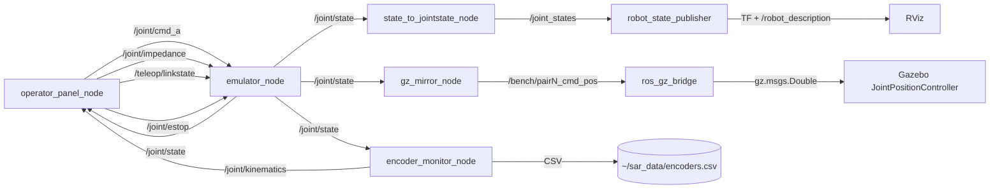

# joint_emulator — Documentatie tehnica

Emulatorul software al bancului fizic cu sase servomotoare ABB cuplate rigid in trei
perechi (= trei articulatii). Motorul A actioneaza; motorul B citeste encoderul si
aplica un cuplu de opozitie dupa o lege de impedanta, adaptabila la calitatea
legaturii. Pachetul contine fizica pura, stratul de tele-impedanta, filtrarea
encoderelor, nodurile ROS 2, panoul operatorului si vizualizarea RViz/Gazebo.

## 1. Graful de noduri si topicuri



## 2. Schema mesajelor (JSON pe std_msgs/String)

```json
// /joint/cmd_a — cuplul motorului de comanda
{"pair": 0, "tau": 0.5}

// /joint/impedance — parametrii legii motorului B
{"pair": 0, "k": 20.0, "b": 0.8, "th0": 0.0}

// /teleop/linkstate — degradarea masurii encoderului
{"ms": 60, "jit": 0, "loss": 0.0, "down": false}

// /joint/state — starea publicata de emulator (50 Hz)
{"0": {"t": 23.28, "th": 0.025, "om": 0.0, "tau_b": -0.5, "k_ef": 20.0}, "1": {...}}

// /joint/kinematics — cinematica filtrata din encodere
{"0": {"t": 24.08, "th": 0.02454, "om": -0.0002, "acc": -0.003, "om_raw": 0.0}}
```

## 3. Legile de control

```
Impedanta fixa:      tau_B = -K (th - th0) - B om          (+ clamp, deadband, rampa)
Impedanta adaptiva:  K_ef = K0 / (1 + 0.10 age_ms)
                     B_ef = B0 (1 + 0.03 age_ms)
                     amortizarea pe viteza LOCALA (om_local), nu pe cea sosita prin link
Pacient virtual:     tau = -K (th - th_rest) - B' om,  B' = B*catch_gain daca |om| > catch_om
Estimator encoder:   filtru alpha-beta-gamma (a=0.25, b=0.02, g=0.0005, 1 kHz, 4096 cpr)
                     viteza RMS 0.026 rad/s fata de 0.58 brut (de 22x mai curata)
```

Rezultatul de arhitectura (fig. `figs/joint_sweep.png`): impedanta totul-prin-link
devine instabila de la ~10–20 ms (energia injectata creste la mii de J; inmuierea
lui K nu o salveaza, vinovata fiind amortizarea pe viteza intarziata). Amortizarea
locala + rigiditatea adaptiva raman pasive (E~0) pana la 120 ms, cu pretul corect:
articulatia devine mai moale (th = tau / K_ef).

## 4. Parametrii nodurilor

`emulator_node.py`:

| Parametru | Implicit | Semnificatie |
|-----------|----------|--------------|
| `backend` | `sim` | `sim` azi; `modbus` dupa identificarea drive-urilor |
| `n_pairs` | 3 | numarul de perechi |
| `rate_hz` | 200 | frecventa buclei de control |
| `k`, `b` | 20.0, 0.8 | impedanta initiala |
| `tau_max` | 2.0 | limita dura de cuplu [Nm] |
| `adaptive` | false | legea adaptiva la varsta masurii |
| `state_hz` | 50 | frecventa publicarii starii |

`encoder_monitor_node.py`:

| Parametru | Implicit | Semnificatie |
|-----------|----------|--------------|
| `quantize_cpr` | 4096 | cuantizarea encoderului; 0 = pozitia vine deja cuantizata |
| `alpha`,`beta`,`gamma` | 0.25, 0.02, 0.0005 | castigurile estimatorului |
| `csv_path` | `~/sar_data/encoders.csv` | jurnalul pentru grafice |

## 5. Sintaxe de pornire

Fiecare terminal: `source /opt/ros/jazzy/setup.bash && cd ~/ros2_ws/src/joint_emulator`

| T | Comanda | Rol |
|---|---------|-----|
| 1 | `python3 nodes/emulator_node.py --ros-args -p adaptive:=true` | fizica perechilor |
| 2 | `python3 nodes/encoder_monitor_node.py` | encodere: viteza/accel + CSV |
| 3 | `ros2 launch launch/viz_rviz.launch.py` | RViz cu modelul bancului |
| 4 | `python3 nodes/operator_panel_node.py` | panoul: slidere + grafice de reactie |

Oglinda Gazebo (optionala; fizica ramane in emulator — o singura sursa de adevar):

| T | Comanda |
|---|---------|
| 5 | `gz sim -r gz/joint_bench_world.sdf` |
| 6 | `ros2 run ros_gz_bridge parameter_bridge --ros-args -p config_file:=gz/bridge_bench.yaml` |
| 7 | `python3 nodes/gz_mirror_node.py` |

Verificare in linia de comanda, fara panou:

```bash
ros2 topic pub --once /joint/cmd_a std_msgs/String "data: '{\"pair\":0,\"tau\":0.5}'"
ros2 topic echo --once /joint/state        # asteptat: th -> tau/K, tau_b -> -tau
ros2 topic echo --once /joint/kinematics   # om/acc filtrate; th cuantizat (pas 2pi/4096)
```

## 6. Simularea fara ROS

```bash
python3 test_joint_core.py                   # 34/34
python3 sil_joint.py echilibru               # th_final = tau/K = 0.0500 rad
python3 sil_joint.py pacient_spastic         # membrul cu catch (scala Tardieu)
python3 sil_joint.py adaptiv_vs_fix --ms 60  # FIX: ~1242 J / ADAPTIV: ~0 J
python3 sil_joint.py delay_sweep             # tabelul E vs latenta
python3 plot_joint.py                        # figs/joint_sweep.png + joint_duel.png
python3 plot_encoder.py                      # figs/encoder_traces.png + encoder_filter.png
python3 plot_encoder.py ~/sar_data/encoders.csv   # graficele din datele LIVE
```

## 7. Modelul 3D

Geometria URDF (RViz) si SDF (Gazebo) se genereaza dintr-un singur tabel:

```bash
python3 tools/gen_bench_model.py     # rescrie urdf/joint_bench.urdf + gz/joint_bench_world.sdf
```

Modelul Gazebo este static (ancorat); articulatiile sunt urmarite de
`JointPositionController` pe topicurile `/bench/pairN_cmd_pos` — Gazebo este oglinda
vizuala, nu o a doua fizica.

## 8. Drumul spre fier si regulile de siguranta

```
L0 (incheiat)  nucleul pur + 34 verificari
L1             placuta drive-urilor ABB -> harta de registre in modbus_backend.py
               (CONFIG gol intentionat; refuza pornirea pana la completare din manual)
               -> coast-down -> J si frecarea reale in PairSim
L2             echilibru pe O SINGURA pereche, cuplu < 10–15% din nominal
L3             tele-impedanta Zenoh vs. DDS PE FIER (linkstate identic cu simularea)
```

Reguli inviolabile: motorul B numai in mod CUPLU (niciodata pozitie-contra-pozitie
pe ax rigid); doua bariere de cuplu independente (clamp software + limita de curent
in drive); watchdog 100 ms cu trecere la cuplu zero; E-stop fizic; bucla rapida
Modbus ruleaza LOCAL pe Raspberry Pi (50–100 Hz), prin retea trec doar referintele.
