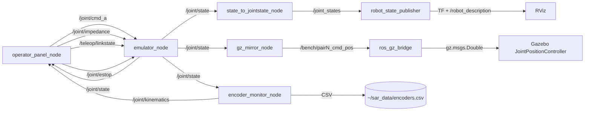

# joint_emulator -- emulatorul software al bancului cu sase servomotoare ABB (contributie C4)

Emulatorul software al bancului fizic cu sase servomotoare ABB cuplate rigid in
trei perechi (= trei articulatii). In fiecare pereche, motorul A actioneaza, iar
motorul B citeste encoderul si aplica un cuplu de opozitie dupa o lege de
impedanta, adaptabila la calitatea legaturii. Pachetul ofera fizica pura
(ROS-free, testabila izolat), stratul de tele-impedanta, filtrarea encoderelor,
nodurile ROS 2 subtiri, panoul operatorului si vizualizarea RViz/Gazebo. Este
geamanul software al lui rehab_exo_description si bancul de validare hardware
(C4) pentru teleoperarea prin retele degradate; carligul de cercetare comun
restului tezei este legatura degradata {ms, jit, loss, down}.

## 1. Scop

Demonstrarea, pe un banc cu doua servomotoare cuplate rigid pe acelasi ax, a
unei lectii de arhitectura pentru controlul de impedanta prin legaturi
degradate: amortizarea pe o viteza intarziata pompeaza energie si destabilizeaza
bucla, in timp ce o schema cu amortizare LOCALA (langa drive) plus rigiditate
adaptiva la varsta masurii ramane pasiva. Scopul secundar este sa ofere un
mediu identic de cod peste simulare (azi) si peste fierul ABB (dupa
identificarea drive-urilor), fara modificari deasupra interfetei de drive.

Pachetul NU este un pachet ament inregistrat (nu exista package.xml /
setup.py); nodurile se ruleaza ca scripturi Python sau prin launch (vezi
sectiunea 6).

## 2. Context si loc in arhitectura

Problema demonstratorului C4 (exoschelet / tele-reabilitare): un controler de
impedanta care tine echilibrul perfect cand masura encoderului e proaspata
poate deveni instabil cand bucla trece printr-o legatura cu latenta -- exact
conditia de teleoperare degradata studiata de coloana stiintifica a tezei
(benchmark rmw_zenoh vs. rmw_cyclonedds_cpp sub tc netem). Bancul izoleaza acest
fenomen pe un singur grad de libertate mecanic, masurabil prin energia injectata
de motorul B (semnal de pasivitate).

Locul in arhitectura sistemului:
- consuma acelasi vocabular de degradare {ms, jit, loss, down} ca teleop_rover
  si restul repo-ului (topicul /teleop/linkstate);
- este geamanul fizic al lui rehab_exo_description (3 perechi = sold / genunchi /
  glezna pentru un picior);
- pregateste backend-ul real ABB prin Modbus (modbus_backend.py), cu decizia de
  arhitectura ca bucla rapida sa traiasca pe un Raspberry Pi langa banc, iar
  prin Zenoh/DDS sa calatoreasca doar referinta si rigiditatea.

## 3. Arhitectura

### 3.1 Structura nucleu pur -> nod ROS -> SIL

Algoritmii stau intr-un nucleu PUR fara ROS, testat in izolare; nodurile ROS
sunt subtiri si schimba JSON pe std_msgs/String (stilul repo-ului):

```
nucleu pur (ROS-free):  joint_core.py, encoder_core.py, teleimpedance.py,
                        drive_iface.py (SimBackend), modbus_backend.py (schelet)
verificare pura:        test_joint_core.py (34 verificari), sil_joint.py (scenarii)
noduri ROS subtiri:     nodes/emulator_node.py, nodes/encoder_monitor_node.py,
                        nodes/state_to_jointstate_node.py, nodes/gz_mirror_node.py,
                        nodes/operator_panel_node.py
vizualizare:            launch/viz_rviz.launch.py, urdf/, rviz/, gz/, tools/
figuri:                 plot_joint.py, plot_encoder.py -> figs/
```

### 3.2 Graful de noduri si topicuri



### 3.3 Schema mesajelor (JSON pe std_msgs/String)

```json
// /joint/cmd_a -- cuplul motorului de comanda
{"pair": 0, "tau": 0.5}

// /joint/impedance -- parametrii legii motorului B
{"pair": 0, "k": 20.0, "b": 0.8, "th0": 0.0}

// /teleop/linkstate -- degradarea masurii encoderului
{"ms": 60, "jit": 0, "loss": 0.0, "down": false}

// /joint/state -- starea publicata de emulator (state_hz, implicit 50)
{"0": {"t": 23.28, "th": 0.025, "om": 0.0, "tau_b": -0.5, "k_ef": 20.0}, "1": {}}

// /joint/kinematics -- cinematica filtrata din encodere (rate_hz, implicit 50)
{"0": {"t": 24.08, "th": 0.02454, "om": -0.0002, "acc": -0.003, "om_raw": 0.0}}
```

Nota onestitate: state_to_jointstate_node mapeaza fiecare pereche k pe
articulatia URDF "pair{k}_joint", cu position=th, velocity=om, effort=tau_b.
gz_mirror_node publica doar pozitia (Float64) pe /bench/pair{k}_cmd_pos pentru
N_PAIRS=3 fixat in cod; Gazebo este oglinda vizuala (JointPositionController
urmareste pozitia), nu o a doua fizica.

## 4. Inventar fisiere

| Fisier | Rol | Cum se verifica |
|--------|-----|-----------------|
| `joint_core.py` | nucleul pur: ImpedanceLaw, VirtualLimb (catch spastic), DelayLine, EnergyMonitor, SafetyGate, PairSim, run_equilibrium | `test_joint_core.py` |
| `encoder_core.py` | encoder: EncoderModel (cuantizare), NaiveDiff, KinematicEstimator (alpha-beta-gamma), EncoderLogger (CSV) | `test_joint_core.py` |
| `teleimpedance.py` | canalul de masura degradat DegradedMeasure + AdaptiveImpedance + run_teleimpedance | `test_joint_core.py` |
| `drive_iface.py` | contractul unic spre fier + SimBackend (perechea simulata) | `test_joint_core.py` |
| `modbus_backend.py` | scheletul backend-ului ABB prin Modbus; CONFIG gol intentionat, refuza pornirea pana la completare din manual | inspectie cod (TODO hardware) |
| `test_joint_core.py` | bateria de verificari pura (fara ROS/fier) | `python3 test_joint_core.py` (34/34) |
| `sil_joint.py` | mediul de simulare complet: scenarii numite, urme CSV, bilant in consola | `python3 sil_joint.py <scenariu>` |
| `nodes/emulator_node.py` | nodul ROS al bancului peste SimBackend (azi) / ModbusBackend (viitor) | rulare ROS (sectiunea 6) |
| `nodes/encoder_monitor_node.py` | viteza/acceleratie filtrate din /joint/state + CSV | rulare ROS |
| `nodes/state_to_jointstate_node.py` | pod /joint/state -> sensor_msgs/JointState pe /joint_states | rulare ROS / launch |
| `nodes/gz_mirror_node.py` | oglinda Gazebo: /joint/state -> /bench/pairN_cmd_pos (Float64) | rulare ROS |
| `nodes/operator_panel_node.py` | panoul operatorului (matplotlib/Tk): slidere + ESTOP + grafice de reactie | rulare ROS (necesita desktop) |
| `launch/viz_rviz.launch.py` | robot_state_publisher + pod state_to_jointstate + RViz | `ros2 launch launch/viz_rviz.launch.py` |
| `tools/gen_bench_model.py` | generatorul geometriei: o tabela -> urdf/joint_bench.urdf + gz/joint_bench_world.sdf | `python3 tools/gen_bench_model.py` |
| `urdf/joint_bench.urdf` | modelul RViz (GENERAT, nu se editeaza de mana) | regenerare din tools |
| `gz/joint_bench_world.sdf` | lumea Gazebo ancorata (GENERAT) | regenerare din tools |
| `gz/bridge_bench.yaml` | configul ros_gz_bridge pentru cele 3 topicuri ROS_TO_GZ | inspectie / rulare bridge |
| `rviz/joint_bench.rviz` | configul RViz (Fixed Frame = base_link) | deschidere in RViz |
| `plot_joint.py` | figs/joint_sweep.png + figs/joint_duel.png | `python3 plot_joint.py` |
| `plot_encoder.py` | figs/encoder_traces.png + figs/encoder_filter.png (demo sau CSV) | `python3 plot_encoder.py [csv]` |
| `requirements.txt` | dependinte pip externe: matplotlib, pymodbus (pymodbus doar pe hardware) | `pip install -r requirements.txt` |
| `README_JOINT.md` | nota de proiect istorica (plan etapizat L0-L3, reguli de siguranta) | document insotitor |

## 5. Date tehnice

Legile de control (definitii reale din cod, unitati SI: rad, rad/s, Nm, s):

```
Impedanta fixa (ImpedanceLaw):
    tau_B = -K (th - th0) - B om          (+ clamp la tau_max, deadband, rampa)
Impedanta adaptiva (AdaptiveImpedance):
    K_ef = K0 / (1 + ck age_ms),  ck = 0.10 implicit
    B_ef = B0 (1 + cb age_ms),    cb = 0.03 implicit
    amortizarea pe viteza LOCALA (om_local), nu pe cea sosita prin link
Pacient virtual (VirtualLimb):
    tau = -K (th - th_rest) - B' om
    B' = B catch_gain daca |om| > catch_om   (rezistenta spastica, scala Tardieu)
Fizica perechii (PairSim):
    J th'' = tau_A + tau_B - b_fric om - tau_coulomb sign(om)
Estimator encoder (KinematicEstimator):
    filtru alpha-beta-gamma; castiguri implicite a=0.25, b=0.02, g=0.0005
    acordate pentru 1 kHz si 4096 cpr
Pasivitate (EnergyMonitor):
    E = integ(tau_B om) dt; E marginit = pasiv, E nemarginit = instabil
```

Metrici masurate (rulari reproductibile, ROS-free, seed fix):

| Marime | Valoare | Sursa |
|--------|---------|-------|
| Viteza estimator vs. derivata bruta (RMS) | 0.026 vs. 0.58 rad/s (de circa 22x mai curata) | `test_joint_core.py`, sinusoida 4096 cpr / 1 kHz |
| Echilibru sub treapta 0.5 Nm la K=10 Nm/rad | th_final = 0.0500 rad (teoretic tau/K), E_B ~= 0 J | `sil_joint.py echilibru` |
| Duel fix vs. adaptiv la 60 ms latenta | FIX E_max = 1241.969 J (th_final -23 rad); ADAPTIV E_max = 0.000 J (K_ef = 5.6, B_ef = 3.40) | `sil_joint.py adaptiv_vs_fix --ms 60` |
| Matura de latenta (E_fix [J], adaptiv ramane 0) | 10->26.7, 20->82.4, 30->285.5, 40->588.1, 50->863.4, 60->1242.0, 80->1742.8 | `sil_joint.py delay_sweep` |

Interpretare: impedanta totul-prin-link devine instabila de la latente mici
(energia injectata creste monoton la mii de J, prin amortizarea pe viteza
intarziata); amortizarea locala plus rigiditatea adaptiva raman pasive (E ~= 0)
pana la 120 ms in test, cu pretul corect ca articulatia devine mai moale
(th = tau / K_ef). Figura-cheie pentru C4 este `figs/joint_sweep.png`.

Parametrii nodurilor (declare_parameter, valori implicite reale):

`emulator_node.py`:

| Parametru | Implicit | Semnificatie |
|-----------|----------|--------------|
| `backend` | `sim` | doar `sim` acceptat azi; orice altceva opreste nodul (vezi modbus_backend.py) |
| `n_pairs` | 3 | numarul de perechi |
| `rate_hz` | 200.0 | frecventa buclei de control |
| `k`, `b` | 20.0, 0.8 | impedanta initiala |
| `tau_max` | 2.0 | limita dura de cuplu [Nm] |
| `adaptive` | false | comuta legea adaptiva la varsta masurii |
| `state_hz` | 50.0 | frecventa publicarii /joint/state |

`encoder_monitor_node.py`:

| Parametru | Implicit | Semnificatie |
|-----------|----------|--------------|
| `state_topic` | `/joint/state` | intrarea (de la emulator_node) |
| `out_topic` | `/joint/kinematics` | iesirea filtrata |
| `rate_hz` | 50.0 | frecventa publicarii |
| `csv_path` | `~/sar_data/encoders.csv` | jurnalul pentru grafice |
| `alpha`, `beta`, `gamma` | 0.25, 0.02, 0.0005 | castigurile estimatorului |
| `quantize_cpr` | 4096 | recuantizare in simulare; 0 = pozitia vine deja cuantizata de la fier |

`state_to_jointstate_node.py`: `state_topic` (implicit `/joint/state`).

## 6. Sintaxe de pornire

Pachetul NU este ament inregistrat (nu exista package.xml / setup.py); deci NU
folositi `ros2 run joint_emulator ...`. Nodurile se ruleaza ca scripturi
`python3` din directorul pachetului; importurile de nucleu pur merg si standalone,
si instalat, prin `sys.path.insert` in fiecare nod.

### 6.1 Verificare fara ROS (ruleaza oriunde)

```bash
cd ~/ros2_ws/src/joint_emulator

python3 test_joint_core.py                   # 34/34 verificari
python3 sil_joint.py echilibru               # th_final = tau/K = 0.0500 rad
python3 sil_joint.py pacient_spastic         # membrul cu catch (scala Tardieu)
python3 sil_joint.py adaptiv_vs_fix --ms 60  # FIX ~1242 J / ADAPTIV ~0 J
python3 sil_joint.py delay_sweep             # tabelul E vs. latenta
python3 plot_joint.py                        # figs/joint_sweep.png + joint_duel.png
python3 plot_encoder.py                      # figs/encoder_traces.png + encoder_filter.png
python3 plot_encoder.py ~/sar_data/encoders.csv   # graficele din datele LIVE
```

Optiuni sil_joint.py: `--ms --jit --loss --t_end --trace cale.csv --seed`.

### 6.2 Rulare ROS 2 (Jazzy)

Fiecare terminal nou: `source /opt/ros/jazzy/setup.bash && cd ~/ros2_ws/src/joint_emulator`.

| T | Comanda | Rol |
|---|---------|-----|
| 1 | `python3 nodes/emulator_node.py --ros-args -p adaptive:=true` | fizica perechilor |
| 2 | `python3 nodes/encoder_monitor_node.py` | encodere: viteza/accel + CSV |
| 3 | `ros2 launch launch/viz_rviz.launch.py` | RViz cu modelul bancului |
| 4 | `python3 nodes/operator_panel_node.py` | panoul: slidere + grafice (necesita desktop) |

launch/viz_rviz.launch.py porneste robot_state_publisher si rviz2 prin
launch_ros Node (pachete ament reale) si state_to_jointstate_node prin
ExecuteProcess cu python3 (nod ROS-free din acest pachet). Emulatorul se
porneste SEPARAT (terminalul 1).

Oglinda Gazebo (optionala; fizica ramane in emulator -- o singura sursa de adevar):

| T | Comanda |
|---|---------|
| 5 | `gz sim -r gz/joint_bench_world.sdf` |
| 6 | `ros2 run ros_gz_bridge parameter_bridge --ros-args -p config_file:=gz/bridge_bench.yaml` |
| 7 | `python3 nodes/gz_mirror_node.py` |

Verificare in linia de comanda, fara panou:

```bash
ros2 topic pub --once /joint/cmd_a std_msgs/String "data: '{\"pair\":0,\"tau\":0.5}'"
ros2 topic echo --once /joint/state        # asteptat: th -> tau/K, tau_b -> -tau
ros2 topic echo --once /joint/kinematics   # om/acc filtrate; th cuantizat (pas 2pi/4096)
```

### 6.3 Regenerarea modelului 3D

```bash
python3 tools/gen_bench_model.py     # rescrie urdf/joint_bench.urdf + gz/joint_bench_world.sdf
```

Fisierele urdf/ si gz/ sunt GENERATE dintr-o singura tabela de geometrie -- nu se
editeaza de mana.

### 6.4 Limitari de pornire (onestitate)

- `backend:=sim` este singura cale functionala azi; orice alt backend opreste
  emulator_node cu mesaj explicit pana cand modbus_backend.py este completat din
  manualul drive-ului.
- operator_panel_node.py cere un desktop (matplotlib TkAgg) si emulatorul +
  monitorul de encodere pornite separat.
- Oglinda Gazebo si bridge-ul cer ros_gz_bridge / gz sim instalate; topicurile
  gz se confirma cu `gz topic -l | grep cmd_pos` (cele 3 topicuri).

## 7. Verificare

Verificarea pura ruleaza fara ROS si fara fier:

```bash
python3 test_joint_core.py                   # rezultat: 34/34 verificari trecute
```

Numarul real este 34/34 (confirmat prin rulare in acest mediu). Bateria acopera:
legea de impedanta (zero la echilibru, opozitie, clamp, deadband, rampa);
pacientul virtual cu catch spastic; intarzierea (10 ms = 10 esantioane la 1 kHz);
fizica perechii (th_final ~= tau/K, viteza finala ~= 0, pasivitate); carligul
tezei (stabil la 0 ms, instabil la 60 ms, degradare monotona cu latenta);
watchdog-ul de siguranta (cuplu zero cand encoderul tace, ramane declansat);
contractul SimBackend (aceeasi fizica prin interfata, perechi independente,
estop); tele-impedanta (livrare dupa latenta, loss=1 nu livreaza, adaptiv pasiv
la 60 si 120 ms, duelul fix vs. adaptiv); stratul de encoder (cuantizare, viteza
filtrata de circa 22x mai curata decat derivata bruta, convergenta pe pozitie
constanta).

Scenariile sil_joint.py (sectiunea 6.1) tiparesc bilantul in consola si pot
scrie urme CSV cu `--trace`. plot_joint.py si plot_encoder.py produc figurile in
figs/ (fara argument, plot_encoder.py genereaza un demo local).

TODO hardware: modbus_backend.py este schelet; harta de registre ABB (cuplu /
pozitie / viteza / enable + scari) lipseste din cod si se completeaza din manualul
drive-ului dupa citirea placutei. Nu exista inca masuratori pe fier (L1-L3 din
README_JOINT.md raman de parcurs). Toate cifrele din sectiunea 5 sunt SIL.

## 8. Igiena datelor si reproductibilitate

- Jurnalele de encodere se scriu in `~/sar_data/encoders.csv` (in afara
  depozitului). Datele brute / urmele live nu intra in git; in repo intra doar
  codul, figurile generate (figs/) si modelele generate (urdf/, gz/).
- urdf/joint_bench.urdf si gz/joint_bench_world.sdf sunt artefacte GENERATE de
  tools/gen_bench_model.py dintr-o singura tabela; orice schimbare de geometrie
  se face in generator si se regenereaza, nu se editeaza fisierele rezultate.
- Reproductibilitatea cifrelor: scenariile sil_joint.py si test_joint_core.py
  folosesc seed fix, deci rezultatele din sectiunea 5 sunt deterministe pe
  acelasi cod. Sunt rezultate SIL (simulare); inainte de orice afirmatie pe
  hardware trebuie inlocuite cu masuratori reale pe banc (L1-L3).
- Reguli de siguranta inainte de fier (din README_JOINT.md, neschimbate): motorul
  B numai in mod CUPLU (niciodata pozitie-contra-pozitie pe ax rigid); doua
  bariere de cuplu independente (clamp software + limita de curent in drive);
  watchdog 100 ms cu trecere la cuplu zero; E-stop fizic; bucla rapida Modbus pe
  Raspberry Pi (50-100 Hz), prin retea trec doar referintele si rigiditatea.
