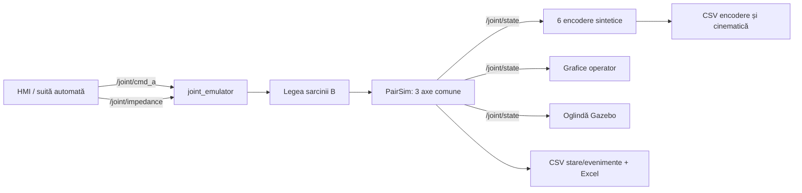
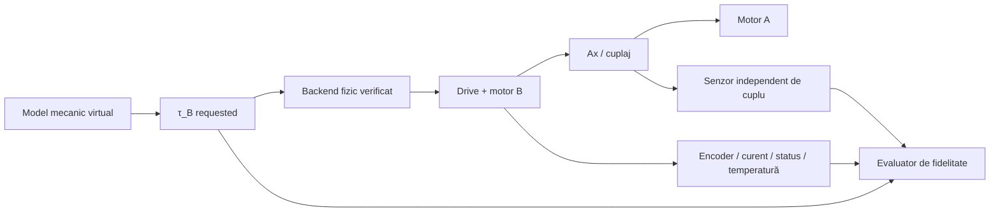
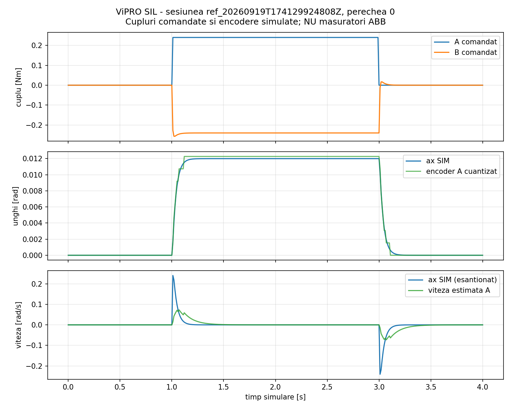
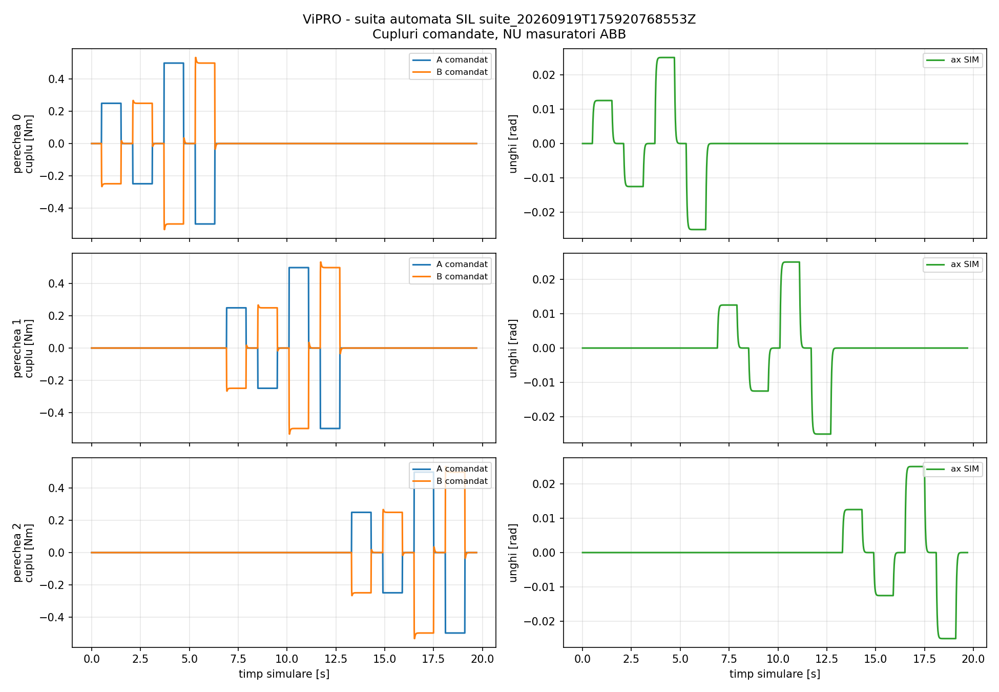

# Raport tehnico-științific al platformei experimentale ViPRO

## Evaluarea predictivă a fidelității fizice în emularea sarcinilor mecanice virtuale pe un banc mecatronic multiport

**Versiunea raportului:** 1.0  
**Data:** 24 septembrie 2026  
**Platformă software:** ROS 2 Jazzy, Gazebo Sim 8, Python 3.12  
**Repository analizat:** `joint_emulator`, revizia `bc1e9a46ebd66bcb85fbcd57d085c8f0132148e3`  
**Stadiul demonstrat:** Software-in-the-Loop (SIL); integrarea ABB fizică nu este încă demonstrată  
**Statutul noutății:** contribuție candidată, în curs de verificare bibliografică  

> [!IMPORTANT]
> Valorile numerice prezentate pentru inerție, frecare, rigiditate, amortizare,
> limite de cuplu, rate și encodere descriu simulatorul actual. Ele nu sunt
> specificații ale motoarelor sau drive-urilor ABB. Orice valoare hardware care
> nu este susținută de plăcuță, manual, configurație, calibrare sau măsurare
> rămâne `UNKNOWN`.

---

## Rezumat

ViPRO este conceput ca un banc mecatronic cu trei perechi de actuatoare,
notate conceptual `(A0,B0)`, `(A1,B1)` și `(A2,B2)`. În fiecare pereche,
actuatorul A reprezintă sistemul testat, iar actuatorul B trebuie să realizeze
fizic o sarcină calculată printr-un model mecanic virtual. A și B sunt declarate
ca fiind conectate rigid la același port mecanic. Obiectivul cercetării nu este
doar generarea unei comenzi de cuplu, ci verificarea măsurabilă a faptului că
sarcina resimțită fizic de A reproduce mecanica solicitată.

Platforma software actuală implementează trei perechi simulate, control de
impedanță, șase canale de encoder sintetice, protecții software, jurnalizare
CSV/Excel, interfață grafică, vizualizare Gazebo și o suită deterministă de
teste. Au fost verificate la data raportului 48 de teste pentru schema de date,
metricile de fidelitate și instrumentul RTU read-only, respectiv 88 de
verificări ale nucleului simulatorului. Suita SIL cu 12 trepte semnate a trecut
12/12 cazuri.

Aceste rezultate validează implementarea software, reproducibilitatea și
fluxul de date. Ele nu demonstrează fidelitatea fizică a bancului ABB deoarece
nu este încă disponibil în ROS un semnal independent și calibrat al cuplului de
port, iar modelele exacte ale motoarelor, drive-urilor, protocolul, ratele,
limitele și lanțul fizic de siguranță nu sunt încă documentate.

Direcția de cercetare propusă este caracterizarea și predicția fidelității
fizice în funcție de mecanismul virtual solicitat și regimul de funcționare,
urmată de o decizie cu risc controlat `ACCEPT/REJECT`, o extensie multiport și,
doar dacă rezultatele o justifică, adaptarea cererilor care nu pot fi redate
fidel.

---

## 1. Titlul și întrebarea cercetării

### Titlu recomandat

**Evaluarea predictivă și certificarea experimentală a fidelității fizice în
emularea multiport a sarcinilor mecanice virtuale**

Titlu în limba engleză:

**Predictive evaluation and experimental certification of physical fidelity
in multiport virtual mechanical load emulation**

### Întrebarea centrală

> Dacă un actuator real este testat împotriva unei sarcini mecanice virtuale
> aplicate de un al doilea actuator, putem demonstra că primul actuator resimte
> mecanica solicitată și nu o versiune distorsionată de limitările emulatorului?

### Întrebarea predictivă

> Poate fi estimată, înaintea executării unei cereri noi, probabilitatea ca
> sarcina să fie redată în limita unei erori admisibile, fără o rată trivială de
> respingere?

### Încadrarea în tema doctorală

În teza privind contribuții la dezvoltarea sistemelor robotice prin control la
distanță în timp real, ViPRO poate demonstra trasabilitatea completă:

```text
cerere mecanică de nivel înalt
        ↓
model mecanic virtual
        ↓
control local în timp real
        ↓
acționare fizică B
        ↓
efect mecanic asupra lui A
        ↓
măsurare independentă și evaluare de fidelitate
```

Legătura la distanță poate transporta cererea sau parametrii modelului. Bucla
rapidă și protecțiile trebuie să rămână locale. Studiul rețelelor degradate nu
este necesar ca axă principală a acestei cercetări.

---

## 2. Problema inginerească și gap-ul candidat

Emularea dinamică a sarcinilor și Hardware-in-the-Loop mecanic sunt domenii
deja dezvoltate. Literatura demonstrează bancuri actuator–dinamometru,
compensarea inerției și frecării, controlul cuplului și limitele de bandă ale
emulatoarelor. Domeniul haptic tratează separat stabilitatea și domeniul de
impedanțe redabile.

Prin urmare, nu constituie noutate, luate separat:

- cuplarea a două motoare și aplicarea unei sarcini virtuale;
- redarea unei inerții, rigidități sau amortizări;
- utilizarea ROS 2, Gazebo, HIL, MPC, pasivității sau a unui geamăn digital;
- identificarea generică a unui model sau calcularea unei erori de urmărire;
- implementarea unui sistem cu trei axe.

### Gap candidat

Din revizuirea preliminară rezultă o oportunitate care trebuie verificată
sistematic, fără a fi revendicată încă drept noutate:

> Lipsește o metodologie experimentală unificată care să condiționeze
> fidelitatea fizică de mecanismul virtual solicitat și de regimul de lucru, să
> prezică fidelitatea înainte de executare, să controleze explicit riscul de
> acceptare greșită și să extindă evaluarea de la porturi individuale la
> cuplări mecanice multiport.

Lanțul candidat este:

```text
mecanism virtual solicitat + regim de operare
        ↓
fidelitate fizică măsurată și incertitudine
        ↓
predicție înainte de execuție
        ↓
ACCEPT / REJECT cu risc de false acceptance controlat
        ↓
extensie multiport: diagonală + termeni de cuplare
        ↓
adaptare opțională la cel mai apropiat mecanism redabil
```

Lucrări apropiate confirmă relevanța emulării dinamice și necesitatea
caracterizării limitelor hardware, dar nu sunt suficiente pentru a valida
automat gap-ul propus: [Martin și Emami, 2011](https://doi.org/10.1109/TIE.2010.2072890),
[Kyslan și Ďurovský, 2013](https://doi.org/10.7305/automatika.54-3.184) și
[Mazzoleni și Bryant, 2024](https://doi.org/10.1177/1045389X241244506).
Fundamentele domeniului de impedanțe redabile trebuie raportate la
[Colgate și Brown, 1994](https://doi.org/10.1109/ROBOT.1994.351077) și la
[Colonnese și Okamura, 2015](https://doi.org/10.1177/0278364914559294).

---

## 3. Topologia ViPRO

### 3.1 Interpretarea conceptuală fizică

Pentru fiecare pereche `i`:

- `A_i` este actuatorul testat;
- `B_i` este actuatorul de sarcină;
- A și B sunt declarate ca fiind rigid cuplate la același ax;
- modelul mecanic virtual calculează sarcina care trebuie realizată de B.

Ideal:

\[
q_{A_i}\approx q_{B_i}=q_i,
\qquad
\dot q_{A_i}\approx\dot q_{B_i}=\dot q_i.
\]

Modelul virtual general poate fi scris:

\[
\boldsymbol\tau_d=
M_d\ddot{\mathbf q}+D_d\dot{\mathbf q}+K_d\mathbf q,
\]

unde `M_d`, `D_d` și `K_d` pot deveni matrici `3×3`. Termenii din afara
diagonalei reprezintă cuplare virtuală intenționată, nu interferență parazită.

### 3.2 Arhitectura demonstrată în software



Lanțul fizic necesar, încă absent, este:



### 3.3 Situația curentă a backend-ului

Runtime-ul acceptă exclusiv `SimBackend`. Fișierul `modbus_backend.py` este un
schelet istoric nefuncțional, cu registre și scalări necunoscute, și nu este
conectat la nodul de execuție. Protocolul real ABB rămâne `UNKNOWN`.

---

## 4. Inventarul tehnic actual

### 4.1 Valori confirmate în simulator

| Parametru | Valoare | Unitate | Proveniență | Interpretare |
|---|---:|---|---|---|
| Număr perechi | 3 | — | `CODE_CONFIG` | A0/B0, A1/B1, A2/B2 în SIM |
| Stare mecanică per pereche | un singur `q, dq` | rad, rad/s | `CODE_CONFIG` | ax comun ideal |
| Inerție implicită `J` | 0,004 | kg·m² | `CODE_CONFIG` | numai plantă SIM |
| Frecare vâscoasă | 0,01 | N·m·s/rad | `CODE_CONFIG` | numai plantă SIM |
| Frecare Coulomb | 0 | N·m | `CODE_CONFIG` | numai plantă SIM |
| Rigiditate implicită `K` | 20 | N·m/rad | `CODE_CONFIG` | lege virtuală B |
| Amortizare implicită `B` | 0,8 | N·m·s/rad | `CODE_CONFIG` | lege virtuală B |
| Limită cuplu SIM | ±2 | N·m | `CODE_CONFIG` | nu este limită ABB |
| Timer ROS nominal | 200 | Hz | `CODE_CONFIG` | lansarea completă |
| Subpas numeric | 0,0005 | s | `CODE_CONFIG` | 10 subpași/timer; nu dovedește 2 kHz real |
| Publicare stare | 100 | Hz | `CODE_CONFIG` | override în `full_sim.launch.py` |
| Publicare cinematică | 50 | Hz | `CODE_CONFIG` | poziție/viteză/accelerație estimate |
| Cuantizare encoder SIM | 4096 | count/rev | `CODE_CONFIG` | nu este rezoluție ABB |
| Watchdog SIM | 0,1 | s | `CODE_CONFIG` | gate în timpul simulat |
| Director implicit de date | `/home/ubuntu/Analiza_Teza/ViPRO/DATE` | — | `CODE_CONFIG` | configurabil la lansare |

Modelul actual al axului este:

\[
J\ddot q=\tau_A+\tau_B-b\dot q-\tau_c\operatorname{sgn}(\dot q).
\]

În modul implicit de impedanță:

\[
\tau_B=-K(q-q_0)-B\dot q,
\]

urmat de limitare și de gate-ul de siguranță software.

### 4.2 Hardware declarat, dar neverificat

| Element | Stare curentă | Ce trebuie obținut |
|---|---|---|
| Șase servomotoare ABB | `MANUAL_REFERENCE`, model necunoscut | fotografii clare ale plăcuțelor, type code, serie |
| Drive-uri ABB | existență declarată, model/firmware necunoscute | plăcuțe, firmware, backup parametri, manual exact |
| Modul/controller RTU | `UNKNOWN` | model, porturi, rol, topologie și configurație |
| Protocol fizic | `UNKNOWN` | schemă și dovadă: Modbus/CAN/EtherCAT/analog/etc. |
| Mod control A/B | `UNKNOWN` | configurarea drive-urilor și semantica comenzilor |
| Encodere | `UNKNOWN` | tip, rezoluție, zero, semn, raport, rată, timestamp |
| Reductor/raport transmisie | `UNKNOWN` | model și raport verificat |
| Cuplaj/ax | existență declarată | dimensiuni, rigiditate, joc, rezonanțe, lagăre |
| Curent motor | canal `UNKNOWN` | definiție fizică, scalare, bandă, calibrare |
| Estimare cuplu drive | canal `UNKNOWN` | algoritm, punct de referință, scalare, independență |
| Senzor independent de cuplu | existență `UNKNOWN` | model, montaj, conditioner, certificat de calibrare |
| Temperatură | canal `UNKNOWN` | motor/drive, unitate, rată, praguri documentate |
| Limite fizice | `UNKNOWN` | cuplu, curent, rată, viteză, poziție, putere, termic |
| E-stop/STO | `UNKNOWN` | schemă, test documentat și procedură de reset |

Documentul probator complet este
[inventarul ViPRO](../research/docs/vipro_inventory.md).

---

## 5. Interfețe ROS și fluxul semnalelor

| Topic | Tip | Rol actual |
|---|---|---|
| `/joint/cmd_a` | `std_msgs/String`, JSON | comandă de cuplu A în SIM |
| `/joint/impedance` | `std_msgs/String`, JSON | `K`, `B`, `q0`, mod adaptiv |
| `/joint/estop` | `std_msgs/String` | oprire software globală memorată |
| `/joint/reset_estop` | `std_msgs/String` | rearmare condiționată, numai SIM |
| `/joint/linkstate` | `std_msgs/String`, JSON | parametri ai canalului simulat |
| `/joint/state` | `std_msgs/String`, JSON | stare și comenzi SIM per pereche |
| `/joint/kinematics` | `std_msgs/String`, JSON | cinematică estimată a axelor comune |
| `/joint/motor_kinematics` | `std_msgs/String`, JSON | șase canale A/B sintetice |
| `/joint_states` | `sensor_msgs/JointState` | vizualizare ROS; `effort` copiază comanda B |
| `/bench/pair{k}_cmd_pos` | `std_msgs/Float64` | poziție pentru oglinda Gazebo |

`tau_a_cmd` și `tau_b` sunt comenzi calculate, nu măsurări de cuplu.
`JointState.effort` este un alias al comenzii SIM B. Folosirea unuia dintre
aceste semnale ca „adevăr fizic” ar produce validare circulară.

---

## 6. Date și trasabilitate

### 6.1 Fișiere generate în prezent

| Artefact | Conținut |
|---|---|
| `session_<id>_states.csv` | stare SIM, comenzi, K/B efectiv, energie, fault |
| `session_<id>_events.csv` | comenzi și evenimente operator |
| `motor_encoders_<id>.csv` | șase encodere sintetice A/B |
| `encoders_<id>.csv` | cinematică estimată pe cele trei axe |
| `session_<id>_sim_config.csv` | configurația simulatorului |
| `session_<id>_encoder_config.csv` | configurația estimatorului |
| `session_<id>_export_<utc>.xlsx` | snapshot Excel cu foi separate |
| `*_analysis.json` | indicatori calculați pentru sesiune/trial |
| `*_summary.csv` | rezumatul suitei automate |
| `*_plot.png` | figură derivată din datele sesiunii |

Fișierele CSV primare sunt create fără suprascriere implicită. Excel este un
export derivat, nu sursa primară.

### 6.2 Ceasurile actuale

- `time_s` / `t_s`: timp acumulat `PairSim`, domeniu de simulare;
- `time_utc`: moment UTC de callback/scriere;
- `JointState.header.stamp`: ceas ROS la traducerea mesajului.

Lipsesc încă pentru hardware:

- timestamp monoton de achiziție;
- index de secvență la sursă;
- timestamp nativ al dispozitivului;
- momentul confirmării/aplicării comenzii;
- măsurarea offsetului, driftului și jitterului între ceasuri.

### 6.3 Contractul minim pentru un trial fizic

Fiecare trial trebuie să păstreze:

```text
session_id, trial_id, mechanism_id, excitation_id
hardware IDs, firmware, software commit, configuration hash
calibration IDs și incertitudini
timestamp monoton, UTC auxiliar, device time și sequence index
comanda înainte și după limitare, receipt/acknowledgement
q_A, q_B, dq, tau_port, current, drive torque estimate
status, fault, saturation, stale, measurement-invalid
temperatură și stare inițială/finală
```

Datele trebuie separate în `raw`, `processed` și `derived`; datele brute nu se
suprascriu.

---

## 7. Rezultate existente — exclusiv SIL

### 7.1 Trial de referință pe perechea 0

Sesiunea `ref_20260919T174129924808Z` aplică o treaptă de `0,24 N·m` pe A0,
cu `K=20 N·m/rad`, `B=0,8 N·m·s/rad` și eșantionare raportată la `100 Hz`.

| Indicator | Rezultat SIL |
|---|---:|
| Unghi staționar | 0,012 rad |
| Unghi teoretic `tau/K` | 0,012 rad |
| Eroare staționară | 0 rad |
| Rise time 10–90% | 0,08 s |
| Settling time 2% | 0,15 s |
| Overshoot | 0% |
| Viteză maximă adevăr SIM | 0,240471 rad/s |
| Cuplu B comandat staționar | −0,24 N·m |
| Diferență maximă encoder A–B | 0 rad |
| Eroare maximă encoder cuantizat–SIM | 0,000733 rad |
| RMSE viteză estimată–SIM | 0,024424 rad/s |



**Figura 1.** Răspunsul treaptă al perechii 0 în simulator. Cuplul B este
comandă/model SIM, nu măsurare fizică.

### 7.2 Suita automată pe trei perechi

Sesiunea `suite_20260919T175920768553Z` conține câte patru trepte pe fiecare
pereche: `±0,25 N·m` și `±0,50 N·m`, aplicate unei singure perechi la un
moment dat.

| Caracteristică | Rezultat SIL |
|---|---:|
| Cazuri trecute | 12/12 |
| Perechi testate | 0, 1, 2 |
| Rigiditate virtuală | 20 N·m/rad |
| Amortizare virtuală | 0,8 N·m·s/rad |
| Rată declarată a datelor | 100 Hz |
| Rise time 10–90% | aproximativ 0,08 s în toate cazurile |
| Settling time 2% | aproximativ 0,15 s în toate cazurile |
| Overshoot maxim | 0% |
| Mișcare maximă a perechilor necomandate | 0 rad |
| Eroare maximă encoder cuantizat–SIM | 0,000713 rad |
| RMSE viteză estimată–SIM | 0,0360–0,0718 rad/s |



**Figura 2.** Rezumatul suitei deterministe SIL. Egalitatea perfectă între
perechi și lipsa variației între repetări provin din modelul determinist și nu
reprezintă repetabilitate hardware.

### 7.3 Interpretarea corectă

Rezultatele demonstrează:

- consistența ecuației implementate;
- semnul opus al comenzilor A și B;
- izolarea logică a perechilor simulate;
- cuantizarea și estimarea cinematică;
- jurnalizarea completă de la inițializare la export;
- reproductibilitatea deterministă a protocolului.

Rezultatele nu demonstrează:

- cuplul fizic transmis prin ax;
- banda, întârzierea sau repetabilitatea drive-urilor ABB;
- calibrarea encoderelor reale;
- rigiditatea/jocul cuplajului;
- fidelitatea unui mecanism fizic emulat.

---

## 8. Metricile de fidelitate pregătite

Pentru un trial cu semnale independente și sincronizate:

\[
e_\tau[k]=\tau_{observed}[k]-\tau_{requested}[k],
\]

\[
RMSE=\sqrt{\frac{1}{N}\sum e_\tau^2},
\qquad
E_{\tau,NRMSE}=\frac{RMSE}{RMS(\tau_{requested})+\epsilon}.
\]

Pipeline-ul offline implementează:

- RMSE, MAE și eroare absolută maximă;
- eroare normalizată și raport de amplitudine;
- estimarea întârzierii, numai când este matematic validă;
- eroarea de lucru mecanic din `tau·dq`;
- măști pentru saturație, fault, stale și măsurare invalidă;
- verificarea timestampurilor, duplicatelor, golurilor și NaN/Inf;
- protecție la excitație insuficientă și numitor aproape zero;
- proveniența fiecărui rezultat.

O analiză poate purta eticheta `PHYSICAL_FIDELITY` numai dacă observația este
`MEASURED` și explicit independentă. O observație `SIMULATED`, `DERIVED` sau
`IDENTIFIED` nu poate fi promovată la adevăr fizic.

Documentație: [fidelity_metrics.md](../research/docs/fidelity_metrics.md).

---

## 9. Ipotezele și așteptările cercetării

### H1 — Fidelitate dependentă de cerere și regim

Eroarea de redare nu este constantă, ci depinde de parametrii mecanismului,
amplitudine, frecvență, starea termică și constrângerile emulatorului:

\[
E_F=F(M,D,K,\Omega,\mathcal E).
\]

**Așteptare:** eroarea și întârzierea cresc în apropierea limitelor de bandă,
cuplu, rată de cuplu, viteză, putere sau temperatură. Aceasta este o ipoteză de
testat, nu un rezultat actual.

### H2 — Predicție înainte de execuție

Un model identificat pe sesiuni separate poate prezice suficient de bine
fidelitatea pentru a clasifica cereri noi.

**Criteriu de falsificare:** metoda nu depășește baseline-uri simple pe
mecanisme, excitații și sesiuni neutilizate la ajustare.

### H3 — Risc controlat de acceptare greșită

\[
P(E_F>\varepsilon_F\mid A=ACCEPT)\leq\alpha,
\]

raportând simultan rata de acceptare:

\[
\pi_A=P(A=ACCEPT).
\]

**Criteriu de falsificare:** riscul este redus numai prin respingerea aproape a
tuturor cererilor.

### H4 — Efect multiport

Faptul că fiecare port este redabil separat nu garantează fidelitatea
mecanismului cuplat.

**Așteptare:** termenii off-diagonal și excitațiile simultane introduc limite
care nu sunt vizibile în trei teste independente 1-DOF.

### H5 — Adaptare certificată, extensie condiționată

Pentru o cerere respinsă se poate căuta mecanismul cel mai apropiat care
rămâne în domeniul acceptat. H5 se investighează numai după confirmarea H1–H4
și poate fi eliminată dacă literatura sau datele o invalidează.

---

## 10. Programul experimental

### ViPRO-00 — caracterizarea bancului real

1. **00A — inventar:** hardware, topologie, drive-uri, protocol și limite.
2. **00B — metrologie:** sensul fizic al cuplului, curentului și estimărilor.
3. **00C — timing:** rate reale, jitter și întârziere encoder–cuplu fizic.
4. **00D — identificare:** inerție, frecare, dinamica de cuplu, bandă și delay.

Fără ViPRO-00 nu se poate formula o concluzie de fidelitate fizică.

### ViPRO-01A — amortizare virtuală, o singură pereche

Primul model fizic propus este:

\[
\tau_d(t)=D_v\dot q(t).
\]

Se variază, în domeniul sigur stabilit ulterior:

- coeficientul `D_v`;
- amplitudinea excitației;
- frecvența;
- sensul, dacă se observă asimetrie.

Rezultatul trebuie să fie o hartă de fidelitate și incertitudine, nu o
afirmație globală că bancul este fidel. Protocolul complet este în
[vipro_01a_virtual_damping.md](../research/docs/experiment_protocols/vipro_01a_virtual_damping.md).

### ViPRO-01B — model J–D–K

\[
\tau_d=J_v\ddot q+D_v\dot q+K_vq.
\]

Designul experimental trebuie să folosească eșantionare eficientă a spațiului
și îmbogățirea controlată a frontierei, nu un grid factorial inutil de mare.

### ViPRO-02 — două porturi

Se introduc matrici `2×2` cu termeni off-diagonal și se testează dacă două
porturi acceptabile separat devin ne-fidele atunci când sunt cuplate.

### ViPRO-03 — trei porturi

Se estimează matricea fizică de impedanță/admitanță `3×3`, raportând separat:

- răspunsul diagonal;
- cuplarea dorită off-diagonal;
- interferența parazită;
- faza, coerența și incertitudinea.

---

## 11. Semnalele necesare pentru campania fizică

| Semnal | Rol | Poate valida independent? |
|---|---|---:|
| `tau_B_requested` după limitări | referința cerută | Nu |
| `q_A`, `q_B` calibrate | cinematică și verificarea cuplajului | Numai cinematic |
| `dq_A`, `dq_B` | model, putere, regim | Condiționat |
| curent motor B | diagnostic/estimare indirectă | Nu, fără model și calibrare |
| cuplu estimat de drive | diagnostic | De regulă nu; necesită validare externă |
| `tau_port_sensor` | cuplu mecanic în ax | Da, dacă este independent și calibrat |
| temperaturi motor/drive | drift și condiții de operare | Context |
| status/fault/saturation | validitatea trial-ului | Context |
| device timestamp + monoton | aliniere temporală | Timing |
| command receipt/application | trasabilitatea comenzii | Timing |

Fără `tau_port_sensor`, studiul poate raporta o estimare fizică cu incertitudine,
dar nu trebuie să pretindă validare independentă absolută.

---

## 12. Graficele recomandate pentru fiecare experiment

### Grafice obligatorii

1. `tau_requested` și `tau_port_measured` în timp, fără aliniere artificială.
2. Eroarea `e_tau(t)` și intervalul de incertitudine.
3. `q_A`, `q_B` și diferența `q_A-q_B`.
4. `dq` și, dacă este necesar, `ddq` cu metoda de estimare declarată.
5. Puterea `tau·dq` și lucrul mecanic cumulat.
6. Curent, cuplu estimat de drive și cuplu independent, pe axe separate.
7. Temperatură și drift pe durata sesiunii.
8. Perioada de eșantionare, jitterul și distribuția întârzierii end-to-end.
9. Măști de saturație, fault, stale și măsurare invalidă.
10. Hartă `E_F(D_v,A,f)` cu incertitudine și domeniul testat explicit.

### Pentru multiport

- matricea amplitudine/fază a transferurilor `3×3`;
- erori diagonale și off-diagonal separate;
- coerență și intervale de încredere;
- comparație între excitație individuală și simultană.

---

## 13. GO/NO-GO înaintea acționării fizice

### GO pentru achiziție read-only

Necesită:

- inventar și mapare A/B fără ambiguitate;
- protocol confirmat prin documentația exactă;
- encodere și status-uri citite cu timestamp monoton;
- valori brute păstrate fără interpretări ghicite;
- nicio scriere, enable sau reset prin instrumentul de descoperire.

### GO pentru comandă fizică

Necesită suplimentar:

- schemă E-stop/STO și procedură verificată;
- limite aprobate și impuse în drive și software;
- mod de comandă documentat;
- polaritate verificată printr-o procedură autorizată la energie redusă;
- watchdog local și comportament fail-closed;
- rampă și termen-limită pentru comandă;
- revenire sigură fără reaplicarea unei comenzi vechi.

### GO pentru fidelitate fizică

Necesită suplimentar:

- referință independentă de cuplu;
- calibrare și buget de incertitudine;
- aliniere temporală validată;
- excitație suficientă față de zgomot;
- protocol, ferestre, excluderi și praguri fixate înaintea confirmării.

Starea actuală este:

```text
GO_ACQUISITION:       NO_GO
GO_COMMAND:           NO_GO
GO_PHYSICAL_FIDELITY: NO_GO
```

Aceasta nu este o deficiență a raportului, ci delimitarea corectă a dovezilor
disponibile.

---

## 14. Lista concretă pentru laborator

De obținut, în ordinea priorității:

1. Fotografii clare ale tuturor plăcuțelor motoarelor.
2. Fotografii și modele exacte ale drive-urilor ABB.
3. Identificarea modulului denumit „RTU” și a tuturor porturilor sale.
4. Vedere generală a dulapului, cablurilor și topologiei.
5. Scheme electrice și planul bornelor.
6. Backup/export al parametrilor drive-urilor și proiectului controllerului.
7. Manualele exacte pentru type code și firmware.
8. Maparea fizică motor–drive–canal–A/B pentru toate cele trei perechi.
9. Datele encoderelor, reductoarelor, axelor, lagărelor și cuplajelor.
10. Identificarea oricărui traductor de cuplu și a conditionerului său.
11. Canalele disponibile: poziție, viteză, curent, torque estimate, temperatură,
    status, fault și timestamp.
12. Documentația E-stop, STO, interlock, enable și reset.
13. Limitele nominale și de vârf, fără extrapolări din simulator.

Nu este necesară pornirea motoarelor pentru această etapă.

---

## 15. Structura primei fișe de laborator

```text
Data / operator:
Obiectivul sesiunii:
Session ID:
Repository commit / config hash:

Pereche testată:
Motor A / drive / canal:
Motor B / drive / canal:
Encoder A / encoder B:
Senzor de cuplu / amplificator / calibrare:
Cuplaj / raport / punct de măsurare:

Mod de control A:
Mod de control B:
Rate declarate / rate măsurate:
Limite și procedură de siguranță:
Stare inițială / temperaturi:

Protocol / trial IDs:
Evenimente, fault-uri, saturații:
Fișiere brute și hash-uri:
Observații:
Decizie GO/NO-GO pentru pasul următor:
```

---

## 16. Riscuri și amenințări la validitate

### Riscuri critice

1. Validare circulară: comanda este utilizată și ca observație.
2. Lipsa unui senzor independent de cuplu.
3. Semn, unitate sau punct mecanic de referință ambiguu.
4. Aliniere temporală imposibilă între comandă și cuplu.
5. Accelerație estimată slab din encodere cuantizate.
6. Drift termic mai mare decât efectul parametrilor investigați.
7. Frontiera este dominată numai de saturații triviale.
8. Predictorul nu generalizează între sesiuni.
9. Cuplarea multiport este sub nivelul de zgomot.
10. Literatura prioritară rezolvă deja contribuția candidat.

### Reguli de protecție științifică

- trial-ul, nu eșantionul ROS, este unitatea experimentală;
- train/calibration/test se separă pe trial-uri și sesiuni complete;
- pilotul și shakedown-ul nu devin retrospectiv date confirmatorii;
- fault-urile și saturațiile nu se elimină pentru a îmbunătăți scorul;
- întârzierea nu se elimină din eroarea primară;
- un rezultat negativ riguros este acceptabil și publicabil.

---

## 17. Contribuții candidate și livrabile

### C1 — caracterizarea fidelității fizice

O hartă experimentală:

\[
E_F=F(M,D,K,\Omega,\mathcal E),
\]

cu repetabilitate, incertitudine și delimitarea domeniului valid.

### C2 — certificarea predictivă

Predicție și decizie `ACCEPT/REJECT` pentru cereri neutilizate la ajustare,
raportând false acceptance și acoperirea acceptării.

### C3 — fidelitatea multiport

Demonstrarea condițiilor în care rezultatele port-cu-port nu prezic fidelitatea
termenilor de cuplare.

### C4 — adaptarea cererii

Extensie condiționată: mecanism alternativ apropiat de cel cerut, dar aflat în
domeniul predictiv acceptat.

### Livrabile publicabile posibile

1. Metodologie metrologică și benchmark ViPRO-01.
2. Predictor de fidelitate cu validare pe sesiuni și mecanisme rezervate.
3. Studiu multiport 2×2/3×3 cu separarea diagonalei și cuplării.
4. Dataset versionat, manifest, calibrări și pipeline reproductibil.

---

## 18. Starea verificărilor software

La 24 septembrie 2026 au fost rulate:

```bash
cd /home/ubuntu/ros2_ws/src/joint_emulator
PYTHONDONTWRITEBYTECODE=1 /usr/bin/python3 -m unittest discover -s research/tests -v
/usr/bin/python3 test_joint_core.py
```

Rezultate:

```text
research/tests:       48/48 teste trecute
test_joint_core.py:   88/88 verificări trecute
suita SIL existentă: 12/12 trial-uri trecute
```

Aceste verificări acoperă nucleul SIM, encoderele sintetice, watchdog-ul,
E-stop-ul SIM, exportul, geometria, schema experimentală, metricile offline și
instrumentul RTU read-only. Nu acoperă comunicația sau acționarea ABB.

---

## 19. Concluzie și următorul pas

ViPRO este suficient de matur ca infrastructură SIL pentru a începe un raport
doctoral coerent. Contribuția nu este platforma în sine, ci metoda prin care se
demonstrează, se prezice și eventual se adaptează fidelitatea mecanică realizată
fizic.

Ordinea recomandată este:

\[
\boxed{
\text{inventar hardware}
\rightarrow
\text{achiziție read-only}
\rightarrow
\text{metrologie cuplu + timing}
\rightarrow
\text{identificare}
\rightarrow
\text{ViPRO-01A}
\rightarrow
\text{predicție}
\rightarrow
\text{multiport}
}
\]

Următorul rezultat concret nu trebuie să fie un controler mai complex, ci un
manifest hardware complet și un traseu măsurabil de la `tau_B_requested` la
`tau_port_sensor`, cu unități, calibrare, timestamp și incertitudine.

---

## Referințe și documente interne

### Documente ViPRO

- [Inventar bazat pe dovezi](../research/docs/vipro_inventory.md)
- [Graful ROS](../research/docs/ros_graph.md)
- [Catalogul semnalelor](../research/docs/signals.md)
- [Separarea control–validare](../research/docs/control_vs_validation_signals.md)
- [Contractul de date](../research/docs/data_schema.md)
- [Reconcilierea schemei](../research/docs/schema_reconciliation.md)
- [Metricile de fidelitate](../research/docs/fidelity_metrics.md)
- [Cerințele integrării fizice](../research/docs/physical_integration_requirements.md)
- [Checklist-ul de dovezi fizice](../research/docs/physical_evidence_checklist.md)
- [Protocolul ViPRO-01A](../research/docs/experiment_protocols/vipro_01a_virtual_damping.md)

### Literatură de bază

1. J. Martin și M. R. Emami, „Dynamic Load Emulation in Hardware-in-the-Loop
   Simulation of Robot Manipulators”, *IEEE Transactions on Industrial
   Electronics*, 2011. DOI: [10.1109/TIE.2010.2072890](https://doi.org/10.1109/TIE.2010.2072890).
2. K. Kyslan și F. Ďurovský, „Dynamic Emulation of Mechanical Loads—An
   Approach Based on Industrial Drives’ Features”, *Automatika*, 2013. DOI:
   [10.7305/automatika.54-3.184](https://doi.org/10.7305/automatika.54-3.184).
3. N. Mazzoleni și M. Bryant, „Hardware-in-the-loop dynamic load emulation of
   robotic systems actuated by fluidic artificial muscles”, *Journal of
   Intelligent Material Systems and Structures*, 2024. DOI:
   [10.1177/1045389X241244506](https://doi.org/10.1177/1045389X241244506).
4. J. E. Colgate și J. M. Brown, „Factors Affecting the Z-Width of a Haptic
   Display”, *ICRA*, 1994. DOI:
   [10.1109/ROBOT.1994.351077](https://doi.org/10.1109/ROBOT.1994.351077).
5. N. Colonnese și A. M. Okamura, „M-Width: Stability and Accuracy of Haptic
   Rendering of Virtual Mass”, *The International Journal of Robotics
   Research*, 2015. DOI:
   [10.1177/0278364914559294](https://doi.org/10.1177/0278364914559294).

> Bibliografia de mai sus poziționează raportul, dar nu reprezintă încă o
> revizuire sistematică. Noutatea rămâne candidată până la completarea matricei
> bibliografice și a analizei lucrărilor care pot invalida C1–C4.
