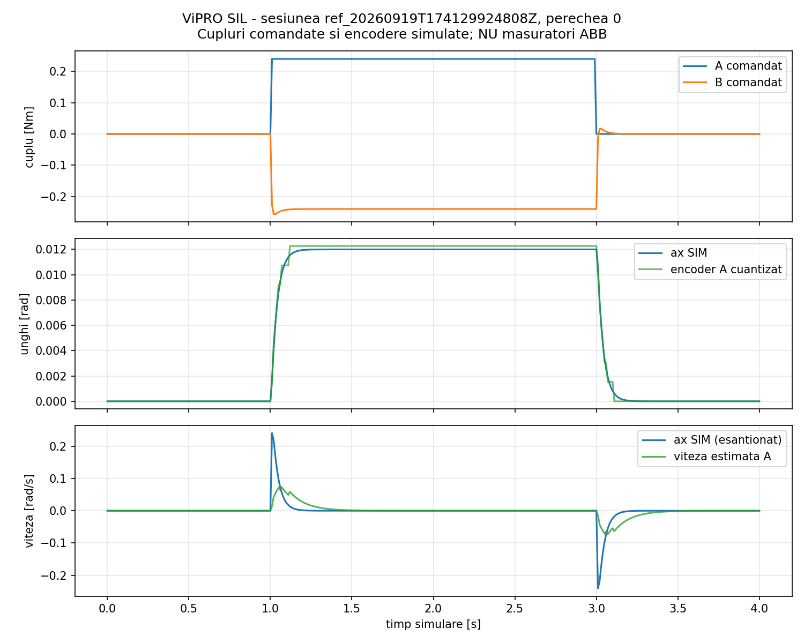
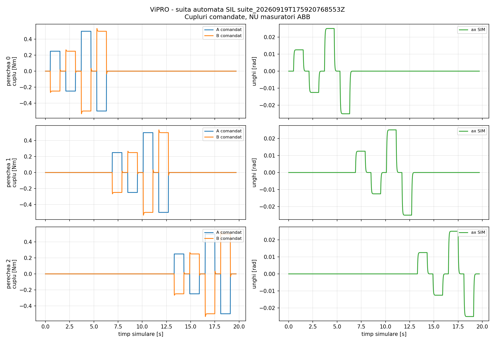

# Fișa documentului

| Câmp | Valoare |
|---|---|
| Tipul documentului | raport tehnico-științific de etapă |
| Scop | definirea bazei experimentale și a traseului de validare fizică ViPRO |
| Versiune | 2.0 |
| Data | 24 septembrie 2026 |
| Revizie Git de bază | `02697c079a5274ff427ca60076ec4372cf681e58` |
| Starea arborelui de lucru | modificări locale necomise; hash-ul nu reproduce încă integral documentul |
| Platformă software | ROS 2 Jazzy, Gazebo Sim 8, Python 3.12 |
| Nivel de validare atins | Software-in-the-Loop (SIL) |
| Nivel de validare neatins | integrare ABB și fidelitate mecanică fizică |
| Instituție | — |
| Responsabil document | — |
| Aprobare coordonator | — |

> **Regulă de interpretare.** Parametrii numerici ai simulatorului nu sunt
> specificații ale motoarelor, drive-urilor sau traductoarelor ABB. O valoare
> hardware fără plăcuță, manual exact, configurație, calibrare ori măsurare
> rămâne `UNKNOWN`.

## Convențiile privind dovezile

| Etichetă | Semnificație |
|---|---|
| `CODE_CONFIG` | valoare observată în cod sau configurație |
| `MANUAL_REFERENCE` | valoare susținută de un manual identificabil |
| `DERIVED` | valoare calculată, cu relația și intrările declarate |
| `MEASURED` | valoare obținută printr-un lanț identificat și calibrat |
| `UNKNOWN` | informație indisponibilă; nu este înlocuită prin presupuneri |

# Rezumat executiv

ViPRO este o platformă experimentală cu trei perechi conceptuale de actuatoare,
`(A0,B0)`, `(A1,B1)` și `(A2,B2)`. În fiecare pereche, actuatorul A reprezintă
sistemul testat, iar actuatorul B trebuie să realizeze fizic sarcina calculată
de un model mecanic virtual. Cei doi actuatori sunt considerați conectați la
același port mecanic.

Problema științifică nu este dacă software-ul poate genera o comandă de cuplu,
ci dacă se poate demonstra, cu trasabilitate metrologică, că sarcina resimțită
de A reproduce mecanismul solicitat în limite cunoscute. Această distincție
separă o demonstrație de simulare de un rezultat experimental fizic.

Platforma actuală implementează trei perechi simulate, control de impedanță,
șase encodere sintetice, protecții software, jurnalizare CSV/Excel, HMI,
vizualizare Gazebo, teste automate și un pipeline offline pentru metricile de
fidelitate. Suita SIL cu 12 trepte semnate a trecut toate cele 12 cazuri.

Rezultatele curente confirmă consistența nucleului numeric și a infrastructurii
de date. Ele nu validează fidelitatea fizică, deoarece nu există în ROS un
semnal confirmat, independent și calibrat al cuplului mecanic de port. Modelele
exacte ale motoarelor și drive-urilor, protocolul fizic, ratele, limitele,
timestampurile de dispozitiv și lanțul E-stop/STO sunt încă parțial sau total
`UNKNOWN`.

Direcția doctorală propusă este caracterizarea și predicția fidelității fizice
în funcție de mecanismul virtual și regimul de operare. Rezultatul urmărit este
o decizie `ACCEPT/REJECT` cu risc controlat, urmată de evaluarea cuplărilor
multiport și, numai dacă datele justifică, adaptarea cererilor neredabile.

| Întrebare de decizie | Răspuns la data raportului |
|---|---|
| Este simulatorul funcțional și testabil? | Da, pentru domeniul SIL documentat. |
| Sunt exporturile și metricile pregătite? | Da, pentru semnale cu proveniență explicită. |
| Este backend-ul ABB demonstrat? | Nu. |
| Este cuplul fizic observat independent? | `UNKNOWN`; nu există dovadă disponibilă. |
| Se poate revendica fidelitate fizică? | Nu. |
| Următorul rezultat necesar | inventar hardware și achiziție read-only validată |

# 1. Contextul și obiectivele cercetării

## 1.1 Încadrarea în tema doctorală

Tema doctorală urmărește contribuții la dezvoltarea sistemelor robotice prin
control la distanță în timp real. ViPRO poate susține această temă printr-o
arhitectură în care comunicația transmite cererea mecanică sau parametrii
modelului, iar bucla rapidă, limitările și protecțiile rămân locale:

```text
cerere mecanică de nivel înalt
        ↓
model mecanic virtual
        ↓
control local în timp real
        ↓
acționare fizică B
        ↓
efect mecanic asupra lui A
        ↓
măsurare independentă și evaluare de fidelitate
```

Studiul rețelelor degradate poate constitui un banc separat. Nu este necesar
să fie suprapus peste ViPRO pentru ca platforma să producă o contribuție
științifică autonomă.

## 1.2 Titlul de cercetare candidat

**Evaluarea predictivă și certificarea experimentală a fidelității fizice în
emularea multiport a sarcinilor mecanice virtuale**

**Predictive evaluation and experimental certification of physical fidelity
in multiport virtual mechanical load emulation**

> În acest raport, „certificare” desemnează o decizie experimentală trasabilă
> în interiorul unui domeniu declarat. Termenul nu desemnează certificare legală,
> de produs sau de conformitate.

## 1.3 Întrebările cercetării

**Întrebarea centrală:** dacă un actuator real este testat împotriva unei
sarcini mecanice virtuale aplicate de un al doilea actuator, poate fi demonstrat
că primul actuator resimte mecanica solicitată și nu o versiune distorsionată
de limitările emulatorului?

**Întrebarea predictivă:** poate fi estimată înaintea execuției probabilitatea
ca o cerere nouă să fie redată în limita unei erori admisibile, fără o rată
trivială de respingere?

## 1.4 Gap-ul candidat

Emularea dinamică a sarcinilor, Hardware-in-the-Loop mecanic, compensarea
inerției și frecării, controlul cuplului și studiul impedanțelor redabile sunt
domenii existente. Nu constituie separat noutate:

- cuplarea a două motoare;
- aplicarea unei inerții, rigidități sau amortizări virtuale;
- utilizarea ROS 2, Gazebo, HIL, MPC sau a unui geamăn digital;
- identificarea generică a unui model;
- existența a trei axe.

Oportunitatea de cercetare, încă nerevendicată drept noutate confirmată, este:

> dezvoltarea unei metodologii experimentale care condiționează fidelitatea
> fizică de mecanismul virtual și regimul de operare, o prezice înaintea
> execuției, controlează riscul de acceptare greșită și extinde evaluarea de la
> porturi individuale la cuplări multiport.

## 1.5 Obiective operaționale

| ID | Obiectiv | Dovada de închidere |
|---|---|---|
| O1 | trasabilitatea completă a bancului | inventar, topologie și lanț de semnal fără ambiguități |
| O2 | măsurarea fidelității fizice | cuplu de port independent, timing și incertitudine |
| O3 | caracterizarea domeniului redabil | hartă experimentală mecanism–regim–eroare |
| O4 | predicția înainte de execuție | evaluare pe sesiuni și mecanisme neutilizate la ajustare |
| O5 | extinderea multiport | separarea termenilor diagonali, cuplării dorite și interferenței |

## 1.6 Ipoteze falsificabile

| ID | Ipoteză | Condiție de respingere |
|---|---|---|
| H1 | fidelitatea depinde sistematic de mecanism și regim | nu apare o dependență peste incertitudinea măsurării |
| H2 | fidelitatea poate fi prezisă pentru cereri noi | metoda nu depășește baseline-uri simple pe trial-uri rezervate |
| H3 | decizia poate controla riscul de acceptare greșită | riscul scade numai prin respingerea aproape tuturor cererilor |
| H4 | cuplarea multiport produce limite nevizibile 1-DOF | termenii off-diagonal rămân sub nivelul de zgomot/incertitudine |
| H5 | unele cereri respinse pot fi adaptate sigur | nu există alternativă apropiată în domeniul predictiv acceptat |

H5 este condiționată de confirmarea H1–H4 și poate fi eliminată fără a invalida
contribuția principală.

# 2. Domeniul raportului și nivelurile de dovadă

## 2.1 Ce acoperă raportul

Raportul descrie starea verificabilă a platformei software, contractul de date,
metodologia de fidelitate, rezultatele SIL existente și programul de trecere la
experiment fizic. El nu certifică motoare, drive-uri, senzori, comunicații sau
funcții de siguranță hardware.

## 2.2 Niveluri de validare

| Nivel | Obiect evaluat | Stare |
|---|---|---|
| L0 — model | ecuații, semne, limite și integrare numerică | demonstrat prin teste software |
| L1 — SIL | răspunsul celor trei perechi și lanțul de date | demonstrat în domeniul testat |
| L2 — achiziție fizică | citirea encoderelor/statusurilor fără comandă | nedemonstrat |
| L3 — commissioning | comandă fizică limitată și fail-closed | nedemonstrat |
| L4 — metrologie | cuplu independent, calibrare, timing, incertitudine | nedemonstrat |
| L5 — fidelitate | comparație solicitat–realizat pe trial-uri fizice | nedemonstrat |
| L6 — predicție/multiport | generalizare și risc controlat | planificat |

Prin urmare, formulările „cuplu măsurat”, „fidelitate fizică” și
„certificare experimentală” nu se utilizează pentru semnalele SIM.

# 3. Platforma experimentală ViPRO

## 3.1 Principiul mecanic

Pentru fiecare pereche `i`, actuatorul `A_i` este sistemul testat, iar `B_i`
este actuatorul de sarcină. În ipoteza cuplajului rigid:

\[
q_{A_i}\approx q_{B_i}=q_i,
\qquad
\dot q_{A_i}\approx\dot q_{B_i}=\dot q_i.
\]

Modelul mecanic virtual multiport poate fi exprimat prin:

\[
\boldsymbol\tau_d=
M_d\ddot{\mathbf q}+D_d\dot{\mathbf q}+K_d\mathbf q.
\]

Matricele `M_d`, `D_d` și `K_d` pot conține termeni diagonali și termeni
off-diagonal. Termenii off-diagonal reprezintă cuplare virtuală intenționată;
interferența parazită trebuie estimată separat.

## 3.2 Arhitectura demonstrată în software

```text
HMI / suită automată
      │ comenzi A și parametri de impedanță
      ▼
joint_emulator ──► legea sarcinii B
      │
      ▼
PairSim: trei axe comune ideale
      ├──► /joint/state ──► HMI și logging
      ├──► encodere sintetice A/B
      ├──► cinematică estimată
      └──► oglindă geometrică Gazebo
```

Lanțul fizic necesar, încă nedemonstrat, este:

```text
model virtual → τB cerut → backend verificat → drive/motor B
                                                  ║
                                           ax și cuplaj
                                                  ║
                                               motor A
                                                  │
                     encoder / curent / status / τport independent
                                                  ▼
                                      evaluator de fidelitate
```

## 3.3 Modelul simulatorului

Modelul curent al fiecărui ax este:

\[
J\ddot q=\tau_A+\tau_B-b\dot q-\tau_c\operatorname{sgn}(\dot q).
\]

În modul implicit de impedanță:

\[
\tau_B=-K(q-q_0)-B\dot q,
\]

urmat de limitarea cuplului și de gate-ul de siguranță software.

## 3.4 Parametri confirmați exclusiv pentru SIL

| Parametru | Valoare | Proveniență | Observație |
|---|---:|---|---|
| Număr de perechi | 3 | `CODE_CONFIG` | A0/B0, A1/B1, A2/B2 |
| Stare mecanică/pereche | un singur `q,dq` | `CODE_CONFIG` | ax comun ideal |
| Inerție implicită `J` | 0,004 kg·m² | `CODE_CONFIG` | plantă SIM |
| Frecare vâscoasă | 0,01 N·m·s/rad | `CODE_CONFIG` | plantă SIM |
| Frecare Coulomb | 0 N·m | `CODE_CONFIG` | plantă SIM |
| Rigiditate `K` | 20 N·m/rad | `CODE_CONFIG` | lege virtuală B |
| Amortizare `B` | 0,8 N·m·s/rad | `CODE_CONFIG` | lege virtuală B |
| Limită cuplu | ±2 N·m | `CODE_CONFIG` | nu este limită ABB |
| Timer ROS nominal | 200 Hz | `CODE_CONFIG` | lansare completă |
| Subpas numeric | 0,0005 s | `CODE_CONFIG` | nu dovedește 2 kHz real |
| Publicare stare | 100 Hz | `CODE_CONFIG` | override de lansare |
| Publicare cinematică | 50 Hz | `CODE_CONFIG` | estimare SIM |
| Cuantizare encoder | 4096 count/rev | `CODE_CONFIG` | nu este rezoluție ABB |
| Watchdog | 0,1 s | `CODE_CONFIG` | domeniu SIM |

## 3.5 Backend fizic

Runtime-ul acceptă în prezent numai `SimBackend`. Fișierul
`modbus_backend.py` este un schelet istoric nefuncțional, cu registre și
scalări necunoscute, și nu este conectat la nodul de execuție. Protocolul real
ABB rămâne `UNKNOWN`. Inventarul necunoscutelor este păstrat în Anexa C.

# 4. Metrologia și contractul de date

## 4.1 Separarea comenzii de observație

`tau_a_cmd` și `tau_b` sunt comenzi calculate. În configurația actuală,
`JointState.effort` copiază comanda B. Niciunul dintre aceste canale nu este o
măsurare independentă a cuplului mecanic. Utilizarea comenzii atât ca referință,
cât și ca observație ar produce validare circulară.

| Semnal | Rol experimental | Validare independentă? |
|---|---|---:|
| `tau_B_requested` după limitări | referință | Nu |
| `q_A`, `q_B` calibrate | cinematică și cuplaj | Numai cinematic |
| `dq_A`, `dq_B` | putere și regim | Condiționat |
| curent motor B | estimare indirectă | Nu, fără model/calibrare |
| cuplu estimat de drive | diagnostic | Necesită validare externă |
| `tau_port_sensor` | cuplu mecanic în ax | Da, dacă este independent și calibrat |
| temperaturi | drift și context | Context |
| fault/saturation/stale | validitatea trial-ului | Context |
| timestamp dispozitiv/monoton | aliniere | Timing |

Fără `tau_port_sensor`, se poate raporta numai o estimare fizică împreună cu
ipotezele și incertitudinea ei, nu validare independentă absolută.

## 4.2 Timp și sincronizare

În starea software actuală există:

- `time_s`/`t_s`: timp acumulat de `PairSim`;
- `time_utc`: timpul UTC al callbackului sau scrierii;
- `JointState.header.stamp`: ceas ROS la traducerea mesajului.

Pentru hardware lipsesc încă dovada timestampului monoton de achiziție,
indexul de secvență la sursă, timpul nativ al dispozitivului, confirmarea
aplicării comenzii și măsurarea offsetului, driftului și jitterului.

## 4.3 Contractul minim al unui trial fizic

Fiecare trial trebuie să păstreze:

```text
session_id, trial_id, mechanism_id, excitation_id
hardware IDs, firmware, software commit, configuration hash
calibration IDs, date și incertitudini
timestamp monoton, UTC auxiliar, device time, sequence index
comanda înainte/după limitare și receipt/application time
q_A, q_B, dq_A, dq_B, tau_port, current, drive torque estimate
status, fault, saturation, stale, measurement-invalid
temperaturi și stare inițială/finală
```

Datele trebuie împărțite în `raw`, `processed` și `derived`. Datele brute nu se
suprascriu; orice transformare trebuie versionată și reproductibilă.

## 4.4 Metricile de fidelitate

Pentru semnale independente și sincronizate:

\[
e_\tau[k]=\tau_{\mathrm{observed}}[k]-\tau_{\mathrm{requested}}[k],
\]

\[
RMSE=\sqrt{\frac{1}{N}\sum_{k=1}^{N}e_\tau^2[k]},
\]

\[
E_{\tau,\mathrm{NRMSE}}=
\frac{RMSE}{RMS(\tau_{\mathrm{requested}})+\epsilon}.
\]

Pipeline-ul offline implementează RMSE, MAE, eroare maximă, eroare de
amplitudine, întârziere când este identificabilă, eroare de lucru mecanic,
măști de invaliditate și verificări ale timestampurilor. O analiză poate purta
eticheta `PHYSICAL_FIDELITY` numai dacă observația este `MEASURED` și explicit
independentă.

# 5. Metodologia și programul experimental

## 5.1 Principii de proiectare

- trial-ul, nu eșantionul ROS, este unitatea experimentală;
- pilotul și shakedown-ul nu devin retrospectiv date confirmatorii;
- sesiunile de train/calibration/test se separă complet;
- fault-urile și saturațiile nu sunt eliminate pentru îmbunătățirea scorului;
- întârzierea nu este eliminată din eroarea primară;
- ordinea trial-urilor și condițiile termice trebuie controlate;
- un rezultat negativ riguros este acceptabil.

## 5.2 ViPRO-00 — caracterizarea bancului

| Etapă | Scop | Rezultat necesar |
|---|---|---|
| 00A — inventar | hardware, topologie, protocol, limite | manifest complet cu proveniență |
| 00B — metrologie | sens fizic pentru cuplu, curent și estimări | lanț de măsurare și calibrare |
| 00C — timing | rate, jitter, delay, sincronizare | distribuții și incertitudini temporale |
| 00D — identificare | inerție, frecare și dinamica de cuplu | modele și domenii de validitate |

Fără ViPRO-00 nu se formulează concluzii de fidelitate fizică.

## 5.3 ViPRO-01A — amortizare virtuală 1-DOF

Primul mecanism fizic propus este:

\[
\tau_d(t)=D_v\dot q(t).
\]

Se variază `D_v`, amplitudinea, frecvența și, dacă apare asimetrie, sensul.
Rezultatul urmărit este o hartă de fidelitate cu incertitudine și domeniu valid,
nu o afirmație globală că bancul este fidel.

## 5.4 ViPRO-01B — mecanism J–D–K

\[
\tau_d=J_v\ddot q+D_v\dot q+K_vq.
\]

Spațiul experimental trebuie eșantionat eficient, cu îmbogățirea controlată a
frontierei de redabilitate, nu printr-un grid factorial inutil de mare.

## 5.5 ViPRO-02 și ViPRO-03 — cuplare multiport

ViPRO-02 introduce matrici `2×2` cu termeni off-diagonal. ViPRO-03 extinde
evaluarea la `3×3` și raportează separat răspunsul diagonal, cuplarea dorită,
interferența parazită, faza, coerența și incertitudinea.

# 6. Rezultate existente — exclusiv SIL

## 6.1 Trial de referință pe perechea 0

Sesiunea `ref_20260919T174129924808Z` aplică o treaptă de `0,24 N·m` pe A0,
cu `K=20 N·m/rad`, `B=0,8 N·m·s/rad` și rata raportată de `100 Hz`.

| Indicator | Rezultat SIL |
|---|---:|
| Unghi staționar | 0,012 rad |
| Unghi teoretic `tau/K` | 0,012 rad |
| Eroare staționară | 0 rad |
| Rise time 10–90% | 0,08 s |
| Settling time 2% | 0,15 s |
| Overshoot | 0% |
| Viteză maximă adevăr SIM | 0,240471 rad/s |
| Cuplu B comandat staționar | −0,24 N·m |
| Diferență maximă encoder A–B | 0 rad |
| Eroare maximă encoder cuantizat–SIM | 0,000733 rad |
| RMSE viteză estimată–SIM | 0,024424 rad/s |



**Figura 1.** Răspunsul la treaptă al perechii 0. Cuplul B este o comandă a
modelului SIM, nu o măsurare fizică.

## 6.2 Suita automată pe trei perechi

Sesiunea `suite_20260919T175920768553Z` conține patru trepte pentru fiecare
pereche: `±0,25 N·m` și `±0,50 N·m`, aplicate unei singure perechi la un moment
dat.

| Caracteristică | Rezultat SIL |
|---|---:|
| Cazuri trecute | 12/12 |
| Perechi testate | 0, 1, 2 |
| Rigiditate virtuală | 20 N·m/rad |
| Amortizare virtuală | 0,8 N·m·s/rad |
| Rată declarată | 100 Hz |
| Rise time 10–90% | aproximativ 0,08 s |
| Settling time 2% | aproximativ 0,15 s |
| Overshoot maxim | 0% |
| Mișcare maximă a perechilor necomandate | 0 rad |
| Eroare maximă encoder cuantizat–SIM | 0,000713 rad |
| RMSE viteză estimată–SIM | 0,0360–0,0718 rad/s |



**Figura 2.** Rezumatul suitei SIL. Egalitatea perfectă între perechi și lipsa
variației între repetări provin din caracterul determinist al modelului și nu
reprezintă repetabilitate hardware.

## 6.3 Verificări software raportate

La data raportului sunt consemnate:

| Suită | Rezultat |
|---|---:|
| `research/tests` | 48/48 teste trecute |
| `test_joint_core.py` | 88/88 verificări trecute |
| suita SIL | 12/12 trial-uri trecute |

Aceste verificări acoperă nucleul SIM, encoderele sintetice, watchdog-ul,
E-stop-ul SIM, exportul, geometria, schema experimentală, metricile offline și
instrumentul RTU read-only. Nu acoperă comunicația sau acționarea ABB.

# 7. Discuție și limite de validitate

## 7.1 Ce demonstrează rezultatele

- consistența ecuației implementate;
- semnul opus al comenzilor A și B;
- izolarea logică a perechilor simulate;
- cuantizarea și estimarea cinematică;
- jurnalizarea de la inițializare la export;
- reproductibilitatea deterministă a protocolului SIL.

## 7.2 Ce nu demonstrează rezultatele

- cuplul mecanic transmis prin ax;
- banda, întârzierea ori repetabilitatea drive-urilor ABB;
- calibrarea encoderelor reale;
- rigiditatea, jocul sau rezonanțele cuplajului;
- performanța lanțului real E-stop/STO;
- fidelitatea fizică a unui mecanism emulat.

## 7.3 Amenințări principale

1. comanda este confundată cu observația;
2. lipsește un senzor independent de cuplu;
3. semnul, unitatea sau punctul mecanic de referință sunt ambigue;
4. comandă și măsurare nu pot fi aliniate temporal;
5. accelerația este estimată slab din encodere cuantizate;
6. driftul termic depășește efectul parametrului investigat;
7. frontiera este dominată numai de saturații triviale;
8. predictorul nu generalizează între sesiuni;
9. cuplarea multiport rămâne sub incertitudinea măsurării;
10. literatura prioritară invalidează una dintre contribuțiile candidate.

# 8. Planul de trecere la experimentul fizic

## 8.1 Porți GO/NO-GO

| Poartă | Condiții minime | Stare |
|---|---|---:|
| achiziție read-only | inventar, protocol, mapare A/B, timestamp monoton, păstrare raw | `NO_GO` |
| comandă fizică | E-stop/STO, limite aprobate, polaritate, watchdog, fail-closed | `NO_GO` |
| fidelitate fizică | cuplu independent, calibrare, timing, excitație și protocol fixat | `NO_GO` |

Această stare delimitează corect dovezile disponibile; nu reprezintă un eșec al
platformei SIL.

## 8.2 Priorități pentru laborator

1. plăcuțele celor șase motoare;
2. modelele și firmware-ul drive-urilor ABB;
3. identificarea modulului denumit „RTU” și a porturilor sale;
4. topologia dulapului, cablurilor și bornelor;
5. schemele electrice;
6. backupul parametrilor ABB și proiectului controllerului;
7. maparea motor–drive–canal–A/B;
8. datele encoderelor, reductoarelor, axelor și cuplajelor;
9. existența și traseul unui traductor de cuplu;
10. documentația E-stop, STO, interlock, enable și reset.

Pornirea motoarelor nu este necesară pentru etapa de inventariere.

## 8.3 Grafice obligatorii în campania fizică

1. `tau_requested` și `tau_port_measured`, fără aliniere artificială;
2. eroarea `e_tau(t)` și intervalul de incertitudine;
3. `q_A`, `q_B` și `q_A-q_B`;
4. `dq` și metoda declarată de estimare a lui `ddq`;
5. puterea `tau·dq` și lucrul mecanic cumulat;
6. curent, torque estimate și cuplu independent;
7. temperatură și drift;
8. perioada de eșantionare, jitter și delay end-to-end;
9. măștile de saturație, fault, stale și invalid;
10. harta de fidelitate cu incertitudine și domeniul testat.

Pentru multiport se adaugă matricea `3×3` amplitudine/fază, erorile diagonale și
off-diagonal, coerența și comparația dintre excitația individuală și simultană.

# 9. Contribuții științifice candidate

| ID | Contribuție candidată | Dovadă necesară |
|---|---|---|
| C1 | hartă metrologică a fidelității fizice | trial-uri repetate, incertitudine și domeniu valid |
| C2 | predictor cu decizie `ACCEPT/REJECT` | test pe sesiuni/mecanisme rezervate și false acceptance raportat |
| C3 | evaluarea fidelității multiport | matrice fizică și separarea cuplării dorite de interferență |
| C4 | adaptarea unei cereri neredabile | mecanism alternativ apropiat, rămas în domeniul certificat |

C1–C4 nu sunt rezultate obținute la data raportului. Ele sunt contribuții
candidate care trebuie confruntate cu literatura și validate experimental.

Livrabilele posibile sunt un benchmark metrologic ViPRO-01, un predictor
validat pe sesiuni rezervate, un studiu multiport `2×2/3×3` și un dataset
versionat cu manifest, calibrări și pipeline reproductibil.

# 10. Concluzii și următorul pas

ViPRO este suficient de matur ca infrastructură SIL și de date pentru a susține
o cercetare doctorală coerentă. Noutatea nu trebuie atribuită simplului banc cu
motoare sau simulatorului, ci metodei prin care fidelitatea mecanică fizică
este măsurată, delimitată, prezisă și, eventual, adaptată.

Ordinea justificată este:

\[
\boxed{\begin{aligned}
\text{inventar hardware} &\rightarrow \text{achiziție read-only}\\
&\rightarrow \text{metrologie cuplu + timing}\\
&\rightarrow \text{identificare} \rightarrow \text{ViPRO-01A}\\
&\rightarrow \text{predicție} \rightarrow \text{multiport}.
\end{aligned}}
\]

Următorul rezultat concret este un manifest hardware complet și un traseu
măsurabil de la `tau_B_requested` la `tau_port_sensor`, cu unități, calibrare,
timestamp și incertitudine. Până atunci, dezvoltarea unui predictor ML sau a
unui backend care scrie în drive-uri ar fi prematură.

# Referințe

1. J. Martin și M. R. Emami, „Dynamic Load Emulation in Hardware-in-the-Loop
   Simulation of Robot Manipulators”, *IEEE Transactions on Industrial
   Electronics*, 2011. DOI:
   [10.1109/TIE.2010.2072890](https://doi.org/10.1109/TIE.2010.2072890).
2. K. Kyslan și F. Ďurovský, „Dynamic Emulation of Mechanical Loads—An
   Approach Based on Industrial Drives’ Features”, *Automatika*, 2013. DOI:
   [10.7305/automatika.54-3.184](https://doi.org/10.7305/automatika.54-3.184).
3. N. Mazzoleni și M. Bryant, „Hardware-in-the-loop dynamic load emulation of
   robotic systems actuated by fluidic artificial muscles”, *Journal of
   Intelligent Material Systems and Structures*, 2024. DOI:
   [10.1177/1045389X241244506](https://doi.org/10.1177/1045389X241244506).
4. J. E. Colgate și J. M. Brown, „Factors Affecting the Z-Width of a Haptic
   Display”, *ICRA*, 1994. DOI:
   [10.1109/ROBOT.1994.351077](https://doi.org/10.1109/ROBOT.1994.351077).
5. N. Colonnese și A. M. Okamura, „M-Width: Stability and Accuracy of Haptic
   Rendering of Virtual Mass”, *The International Journal of Robotics
   Research*, 2015. DOI:
   [10.1177/0278364914559294](https://doi.org/10.1177/0278364914559294).
6. B. N. Taylor și C. E. Kuyatt, *Guidelines for Evaluating and Expressing the
   Uncertainty of NIST Measurement Results*, NIST Technical Note 1297, 1994.

Bibliografia poziționează raportul, dar nu este încă o revizuire sistematică.
Noutatea rămâne candidată până la completarea matricei bibliografice.

# Anexa A — Interfețe ROS 2

| Topic | Tip | Rol actual |
|---|---|---|
| `/joint/cmd_a` | `std_msgs/String`, JSON | comandă de cuplu A în SIM |
| `/joint/impedance` | `std_msgs/String`, JSON | `K`, `B`, `q0`, mod adaptiv |
| `/joint/estop` | `std_msgs/String` | oprire software memorată |
| `/joint/reset_estop` | `std_msgs/String` | rearmare condiționată, numai SIM |
| `/joint/linkstate` | `std_msgs/String`, JSON | parametri ai canalului simulat |
| `/joint/state` | `std_msgs/String`, JSON | stare și comenzi SIM per pereche |
| `/joint/kinematics` | `std_msgs/String`, JSON | cinematică estimată |
| `/joint/motor_kinematics` | `std_msgs/String`, JSON | șase canale A/B sintetice |
| `/joint_states` | `sensor_msgs/JointState` | vizualizare; `effort` copiază B |
| `/bench/pair{k}_cmd_pos` | `std_msgs/Float64` | oglindă geometrică Gazebo |

# Anexa B — Artefacte și trasabilitate

| Artefact | Conținut |
|---|---|
| `session_<id>_states.csv` | stare SIM, comenzi, K/B, energie, fault |
| `session_<id>_events.csv` | comenzi și evenimente operator |
| `motor_encoders_<id>.csv` | șase encodere sintetice A/B |
| `encoders_<id>.csv` | cinematică estimată pe trei axe |
| `session_<id>_sim_config.csv` | configurația simulatorului |
| `session_<id>_encoder_config.csv` | configurația estimatorului |
| `session_<id>_export_<utc>.xlsx` | snapshot Excel cu foi separate |
| `*_analysis.json` | indicatori calculați |
| `*_summary.csv` | rezumatul suitei automate |
| `*_plot.png` | figură derivată din sesiune |

CSV-urile primare sunt create fără suprascriere implicită. Excel este un
export derivat, nu sursa primară.

# Anexa C — Inventarul hardware rămas `UNKNOWN`

| Element | Stare | Dovadă necesară |
|---|---|---|
| șase servomotoare ABB | model necunoscut | plăcuțe, type code, serie |
| drive-uri ABB | model/firmware necunoscute | plăcuțe, firmware, backup |
| modul/controller „RTU” | `UNKNOWN` | model, porturi, rol, configurație |
| protocol fizic | `UNKNOWN` | schemă și documentație exactă |
| mod control A/B | `UNKNOWN` | parametrii drive-urilor |
| encodere | `UNKNOWN` | tip, rezoluție, zero, semn, rată |
| reductoare | `UNKNOWN` | model și raport verificat |
| cuplaj/ax | existență declarată | dimensiuni, rigiditate, joc, rezonanțe |
| curent motor | canal `UNKNOWN` | definiție, scalare, bandă, calibrare |
| torque estimate drive | canal `UNKNOWN` | algoritm și independență |
| senzor de cuplu | existență `UNKNOWN` | model, montaj, conditioner, calibrare |
| temperatură | canal `UNKNOWN` | locație, unitate, rată, praguri |
| limite fizice | `UNKNOWN` | cuplu, curent, viteză, putere, termic |
| E-stop/STO | `UNKNOWN` | schemă, test și procedură de reset |

# Anexa D — Fișa minimă de laborator

```text
Data / operator:
Obiectivul sesiunii:
Session ID:
Repository commit / config hash:

Pereche testată:
Motor A / drive / canal:
Motor B / drive / canal:
Encoder A / encoder B:
Senzor de cuplu / amplificator / calibrare:
Cuplaj / raport / punct de măsurare:

Mod de control A:
Mod de control B:
Rate declarate / rate măsurate:
Limite și procedură de siguranță:
Stare inițială / temperaturi:

Protocol / trial IDs:
Evenimente, fault-uri, saturații:
Fișiere brute și hash-uri:
Observații:
Decizie GO/NO-GO pentru pasul următor:
```

# Anexa E — Documente interne de referință

- [Inventarul ViPRO](../research/docs/vipro_inventory.md)
- [Graful ROS](../research/docs/ros_graph.md)
- [Catalogul semnalelor](../research/docs/signals.md)
- [Separarea control–validare](../research/docs/control_vs_validation_signals.md)
- [Contractul de date](../research/docs/data_schema.md)
- [Reconcilierea schemei](../research/docs/schema_reconciliation.md)
- [Metricile de fidelitate](../research/docs/fidelity_metrics.md)
- [Cerințele integrării fizice](../research/docs/physical_integration_requirements.md)
- [Checklist-ul de dovezi](../research/docs/physical_evidence_checklist.md)
- [Protocolul ViPRO-01A](../research/docs/experiment_protocols/vipro_01a_virtual_damping.md)
- [Poarta GO/NO-GO ViPRO-01A](../research/docs/experiment_protocols/vipro_01a_go_no_go.md)
