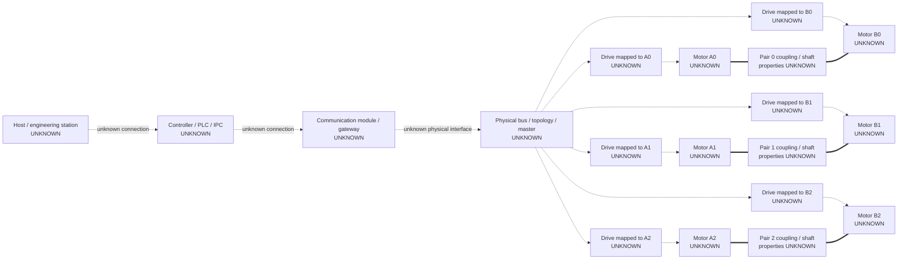
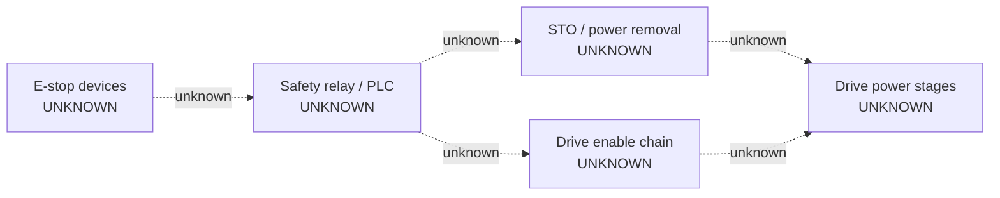

# ViPRO physical bench topology — inspection template

This document is intentionally unpopulated. Complete it only from physical
inspection, exact manuals, wiring drawings and approved exports. Use
`CONFIRMED`, `UNKNOWN`, `NOT_PRESENT` or `NOT_APPLICABLE` for every row.

## Inspection metadata

| Field | Value |
|---|---|
| Inspection ID | `UNKNOWN` |
| Bench/asset ID | `UNKNOWN` |
| Laboratory/location | `UNKNOWN` |
| Inspection UTC start/end | `UNKNOWN` |
| Inspectors | `UNKNOWN` |
| Responsible laboratory person | `UNKNOWN` |
| Equipment power/safety state | `UNKNOWN` |
| Applicable schematic revision | `UNKNOWN` |
| Evidence-directory URI | `UNKNOWN` |
| Manifest SHA-256 | `UNKNOWN` |

## Status legend

| Status | Use |
|---|---|
| `CONFIRMED` | Direct observation or applicable authoritative evidence exists |
| `UNKNOWN` | Evidence absent, inaccessible, ambiguous or conflicting |
| `NOT_PRESENT` | Evidence establishes absence in the inspected scope |
| `NOT_APPLICABLE` | Verified architecture makes the item inapplicable |

## High-level topology

Replace only `UNKNOWN` nodes/edges supported by evidence. Do not turn the
logical A/B research roles into physical cabinet mappings without proof.



The solid mechanical layout is the canonical research hypothesis, not a
completed physical audit. Attach evidence to each confirmed edge.

## Component inventory and physical location

| Asset ID | Provisional role | Cabinet/bench location | Manufacturer | Model/type | Part/order no. | Serial | Firmware | Status | Evidence |
|---|---|---|---|---|---|---|---|---|---|
|  |  |  |  |  |  |  |  | `UNKNOWN` |  |
|  |  |  |  |  |  |  |  | `UNKNOWN` |  |
|  |  |  |  |  |  |  |  | `UNKNOWN` |  |

Do not reuse serial numbers as public logical IDs in analysis files if access
controls require pseudonymous asset identifiers. Retain the protected mapping.

## Logical-to-physical A/B mapping

| Logical role | Physical asset ID | Drive asset ID | Cabinet terminal/channel | Encoder/source | Mapping evidence | Status |
|---|---|---|---|---|---|---|
| A0 |  |  |  |  |  | `UNKNOWN` |
| B0 |  |  |  |  |  | `UNKNOWN` |
| A1 |  |  |  |  |  | `UNKNOWN` |
| B1 |  |  |  |  |  | `UNKNOWN` |
| A2 |  |  |  |  |  | `UNKNOWN` |
| B2 |  |  |  |  |  | `UNKNOWN` |

Mapping evidence should combine at least two compatible sources when possible:
cable trace, terminal labels, drawing, drive parameter/export and controlled
read-only identification. A software logical ID alone is insufficient.

## Mechanical topology

| Pair | A asset | B asset | Coupling/reducer parts | Common-axis evidence | Torque-sensor location | Other bearings/load | Status | Evidence |
|---|---|---|---|---|---|---|---|---|
| 0 |  |  |  |  |  |  | `UNKNOWN` |  |
| 1 |  |  |  |  |  |  | `UNKNOWN` |  |
| 2 |  |  |  |  |  |  | `UNKNOWN` |  |

### Mechanical parameters

| Item | Pair | Value | SI unit | Method/source | Uncertainty | Status | Evidence |
|---|---:|---:|---|---|---|---|---|
| Gear ratio A |  |  | 1 |  |  | `UNKNOWN` |  |
| Gear ratio B |  |  | 1 |  |  | `UNKNOWN` |  |
| Coupling torsional stiffness |  |  | N·m/rad |  |  | `UNKNOWN` |  |
| Backlash/deadband |  |  | rad |  |  | `UNKNOWN` |  |
| Relevant inertia |  |  | kg·m² |  |  | `UNKNOWN` |  |
| Friction parameters |  |  | mixed SI |  |  | `UNKNOWN` |  |

Do not copy PairSim defaults into this table.

## Communication buses

Create one row per physically separate segment.

| Bus ID | Physical layer | Protocol | Master/controller | Nodes/endpoints | Connector/cable | Topology | Termination/bias | Isolation | Status | Evidence |
|---|---|---|---|---|---|---|---|---|---|---|
| bus-01 |  |  |  |  |  |  |  |  | `UNKNOWN` |  |
| bus-02 |  |  |  |  |  |  |  |  | `UNKNOWN` |  |

Never equate RS-485 physical layer with Modbus RTU without protocol evidence.
Never assume two connectors belong to the same segment without tracing.

## Cable and endpoint map

| Cable ID | Endpoint 1 asset/port/pin | Endpoint 2 asset/port/pin | Printed label | Cable type/shield | Reference/earth | Function | Status | Evidence |
|---|---|---|---|---|---|---|---|---|
|  |  |  |  |  |  |  | `UNKNOWN` |  |
|  |  |  |  |  |  |  | `UNKNOWN` |  |
|  |  |  |  |  |  |  | `UNKNOWN` |  |

Use manual pin names verbatim. Record generic interpretations separately.

## Existing master and service-access assessment

| Question | Finding | Status | Evidence |
|---|---|---|---|
| Is a master already present? |  | `UNKNOWN` |  |
| Which asset is master? |  | `UNKNOWN` |  |
| Can a second master coexist? |  | `UNKNOWN` |  |
| Is a passive tap technically supported? |  | `UNKNOWN` |  |
| Is there an isolated service port? |  | `UNKNOWN` |  |
| Is communication powered while torque/enable is safely disabled? |  | `UNKNOWN` |  |
| Is an approved read-only access method documented? |  | `UNKNOWN` |  |

If an existing master is possible, `RTU_READ_GO` remains false and the RPi must
not transmit.

## Safety and enable topology

Replace this placeholder only from the schematic and approved inspection.



| Safety function | Initiator | Logic/device | Output path | Feedback | Reset behavior | Test/approval evidence | Status |
|---|---|---|---|---|---|---|---|
| Emergency stop |  |  |  |  |  |  | `UNKNOWN` |
| Safe Torque Off |  |  |  |  |  |  | `UNKNOWN` |
| Drive enable/disable |  |  |  |  |  |  | `UNKNOWN` |
| Guard/interlock |  |  |  |  |  |  | `UNKNOWN` |

Software stop or a fieldbus command must not be entered as the independent
physical E-stop.

## Power domains and isolation

| Domain ID | Nominal type/value | Supplies | Isolation boundary | State during read-only inspection | Status | Evidence |
|---|---|---|---|---|---|---|
| logic/control |  |  |  |  | `UNKNOWN` |  |
| communication |  |  |  |  | `UNKNOWN` |  |
| drive control |  |  |  |  | `UNKNOWN` |  |
| motor power |  |  |  |  | `UNKNOWN` |  |
| sensor/conditioner |  |  |  |  | `UNKNOWN` |  |

## Measurement signal paths

Use one row per signal and side. Preserve the physical source and every
conversion step.

| Signal ID | Physical quantity/reference point | Sensor/source | Conditioner/drive algorithm | Native representation | Transport/object | Acquisition host | Raw timestamp | SI calibration | Status | Evidence |
|---|---|---|---|---|---|---|---|---|---|---|
| q-A0 | angular position |  |  |  |  |  |  |  | `UNKNOWN` |  |
| q-B0 | angular position |  |  |  |  |  |  |  | `UNKNOWN` |  |
| current-B0 | current definition `UNKNOWN` |  |  |  |  |  |  |  | `UNKNOWN` |  |
| drive-torque-B0 | torque reference `UNKNOWN` |  |  |  |  |  |  |  | `UNKNOWN` |  |
| port-torque-0 | mechanical torque location `UNKNOWN` |  |  |  |  |  |  |  | `UNKNOWN` |  |

Duplicate the pattern for pairs 1 and 2 and other available measurements.

## Clock and timestamp topology

| Clock ID | Device/host | Domain | Tick unit/resolution | Wrap | Synchronization source/method | Offset/drift evidence | Signals using it | Status |
|---|---|---|---|---|---|---|---|---|
|  |  |  |  |  |  |  |  | `UNKNOWN` |
|  |  |  |  |  |  |  |  | `UNKNOWN` |

UTC wall time is supplementary. Duration and ordering require a characterized
monotonic/device clock relation.

## Documentation-to-asset applicability

| Document/export ID | Type/revision | Exact model/firmware | Covered asset IDs | Relevant sections | Original file/hash | Status |
|---|---|---|---|---|---|---|
|  |  |  |  |  |  | `UNKNOWN` |
|  |  |  |  |  |  | `UNKNOWN` |

## Unresolved conflicts and next actions

| Item ID | Conflicting/absent evidence | Current status | Required next evidence | Owner | Target date |
|---|---|---|---|---|---|
|  |  | `UNKNOWN` |  |  |  |

## Read-only decision gate

Set each item using evidence. `RTU_READ_GO` is false unless all required rows
are `CONFIRMED`.

| Gate | Status | Evidence |
|---|---|---|
| Exact module/drive model identified | `UNKNOWN` |  |
| Manual confirms Modbus RTU / RS-485 | `UNKNOWN` |  |
| Serial parameters confirmed | `UNKNOWN` |  |
| Slave IDs confirmed | `UNKNOWN` |  |
| Read-only registers confirmed | `UNKNOWN` |  |
| Existing-master condition resolved | `UNKNOWN` |  |
| Wiring/isolation/topology approved | `UNKNOWN` |  |
| Responsible person authorizes probing | `UNKNOWN` |  |

```text
RTU_READ_GO = false
```

Changing that decision belongs to a reviewed post-inspection reconciliation,
not to this template.
