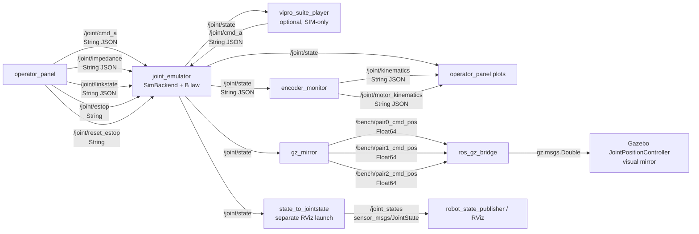
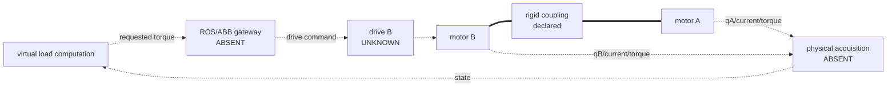

# ViPRO ROS graph — TASK-001

## Scope

This is the graph implemented in the repository. It is a **SIM graph**. No ABB
gateway, physical drive node, physical encoder node, `ros2_control` hardware
interface, service, or action was found.

## Full simulation launch

`joint_emulator/launch/full_sim.launch.py:53-92,103-135` starts the following
processes: Gazebo, `ros_gz_bridge`, `joint_emulator`, `encoder_monitor`,
`gz_mirror`, and optionally `operator_panel`.

The physical side that would be required is absent:

## Node/process inventory

| Node/process | Started by | Publishes | Subscribes | Rate / trigger | Evidence | Notes |
|---|---|---|---|---|---|---|
| `joint_emulator` | `full_sim.launch.py` or direct Python | `/joint/state` (`std_msgs/String`) | `/joint/cmd_a`, `/joint/impedance`, `/joint/estop`, `/joint/reset_estop`, configurable link topic (all `std_msgs/String`) | control timer default/full-launch 200 Hz; state node default 50 Hz, full-launch 100 Hz | `nodes/emulator_node.py:45-53,107-153`; `launch/full_sim.launch.py:53-63,112-115` | Accepts only `backend=sim` |
| `encoder_monitor` | full launch or direct Python | `/joint/kinematics`, `/joint/motor_kinematics` (`std_msgs/String`) | configurable state topic, default `/joint/state` (`std_msgs/String`) | report timer 50 Hz; processing/logging on every state callback | `nodes/encoder_monitor_node.py:42-64,109-164` | Generates/requantizes SIM encoder data |
| `operator_panel` | optional full launch/direct Python | five command topics | state and both kinematics topics | commands event-driven; plot refresh 150 ms | `nodes/operator_panel_node.py:47-73,123-156,341-344` | K/B updates are broadcast to all pairs |
| `vipro_suite_player` | manually, never from full launch | `/joint/cmd_a` | `/joint/state` | transition/event-driven; freshness check uses OS monotonic clock | `nodes/suite_player_node.py:26-45,73-119` | Refuses sources other than `sim` |
| `gz_mirror` | full launch/direct Python | three `/bench/pair*_cmd_pos` (`std_msgs/Float64`) | `/joint/state` | on every state message | `nodes/gz_mirror_node.py:16-28` | Position visualization only |
| `joint_gz_bridge` | full launch | GZ `/bench/pair*_cmd_pos` (`gz.msgs.Double`) | ROS `/bench/pair*_cmd_pos` | on message | `launch/full_sim.launch.py:85-92`; `gz/bridge_bench.yaml:1-17` | Direction is ROS→GZ only |
| Gazebo JointPositionController ×3 | Gazebo world | visualization state internal to Gazebo | GZ position topics | simulator update, not specified in repo | `gz/joint_bench_world.sdf:145-150` | P=15, D=0.3 are visualization-controller settings |
| `state_to_jointstate` | separate `viz_rviz.launch.py` | `/joint_states` (`sensor_msgs/JointState`) | configurable `/joint/state` | on every state message | `nodes/state_to_jointstate_node.py:14-31`; `launch/viz_rviz.launch.py:17-27` | `effort` is copied from SIM `tau_b` command |
| `robot_state_publisher` + RViz | separate RViz launch | standard TF output | `/joint_states` through standard package behavior | on JointState | `launch/viz_rviz.launch.py:17-27` | Not part of full Gazebo launch |

No `create_service`, `create_client`, action server, or action client occurs in
`joint_emulator` source.

## Topics and message contracts

QoS is supplied as an integer depth. Reliability and durability are not
explicitly configured in project code and are therefore recorded as
`UNKNOWN`, rather than inferred from library defaults.

| Topic | Type | Producer(s) | Consumer(s) | Depth producer/subscriber | Payload / meaning | Evidence |
|---|---|---|---|---|---|---|
| `/joint/cmd_a` | `std_msgs/msg/String` | `operator_panel`, optional `vipro_suite_player` | `joint_emulator` | 10 / 10 | JSON `{pair, tau}`; requested A torque in N·m | `operator_panel_node.py:65,123-126`; `emulator_node.py:107,159-176` |
| `/joint/impedance` | `std_msgs/msg/String` | `operator_panel` | `joint_emulator` | 10 / 10 | JSON `{pair,k,b[,th0]}` | `operator_panel_node.py:66,128-132`; `emulator_node.py:108,180-207` |
| `/joint/linkstate` | `std_msgs/msg/String` | `operator_panel` | `joint_emulator` | 10 / 10 | JSON link impairment; default link topic is parameterized | `operator_panel_node.py:67,133-134`; `emulator_node.py:52,111,209-216` |
| `/joint/estop` | `std_msgs/msg/String` | `operator_panel` | `joint_emulator` | 10 / 10 | any message requests global SIM ESTOP | `operator_panel_node.py:68,136-140`; `emulator_node.py:109,218-220` |
| `/joint/reset_estop` | `std_msgs/msg/String` | `operator_panel` | `joint_emulator` | 10 / 10 | any message requests conditional SIM rearm | same sources; `emulator_node.py:221-258` |
| `/joint/state` | `std_msgs/msg/String` | `joint_emulator` | encoder monitor, HMI, Gazebo mirror, optional suite player and JointState bridge | 10 / 30,30,30,10,30 | JSON dictionary by pair; SIM state and commands | `emulator_node.py:112,313-345`; subscriber files cited above |
| `/joint/kinematics` | `std_msgs/msg/String` | `encoder_monitor` | `operator_panel` | 10 / 30 | JSON `{t,th,om,acc,om_raw}` by pair | `encoder_monitor_node.py:46-49,111,160-164`; `operator_panel_node.py:71,92-103` |
| `/joint/motor_kinematics` | `std_msgs/msg/String` | `encoder_monitor` | `operator_panel` | 10 / 30 | JSON A/B synthetic encoder estimates + `delta_th` | `encoder_monitor_node.py:48,112-164`; `operator_panel_node.py:72-73,105-121` |
| `/bench/pair{0,1,2}_cmd_pos` | `std_msgs/msg/Float64` | `gz_mirror` | `ros_gz_bridge` | 10 / bridge UNKNOWN | common-axis visualization position in rad | `gz_mirror_node.py:19-28`; `gz/bridge_bench.yaml:3-17` |
| GZ `/bench/pair{0,1,2}_cmd_pos` | `gz.msgs.Double` | bridge | Gazebo controllers | UNKNOWN | visualization position in rad | `gz/bridge_bench.yaml:3-17`; `gz/joint_bench_world.sdf:148-150` |
| `/joint_states` | `sensor_msgs/msg/JointState` | `state_to_jointstate` | standard ROS visualization stack | 10 / standard package config | positions, velocities, and `effort=tau_b_cmd` | `state_to_jointstate_node.py:14-31` |

## Control ownership

### A side

- HMI owns manual A commands; the suite player may also publish and explicitly
  detects interference (`suite_player_node.py:73-85`). There is no arbitration
  node.
- `joint_emulator` clips commands to the SIM `tau_max` and writes them to even
  logical motor IDs (`emulator_node.py:159-176`).
- No physical A drive is commanded.

### B side

- `joint_emulator` alone computes B commands from the simulated B/common-axis
  state and writes them to odd logical motor IDs (`emulator_node.py:276-307`).
- The default law is fixed impedance; adaptive impedance and local-contact
  variants are available (`emulator_node.py:68-90`).
- No ROS topic exposes a direct B command input, and no physical B drive is
  commanded.

## Timing boundaries visible in the graph

| Boundary | Available time evidence | Missing evidence |
|---|---|---|
| A command arrival → SIM application | event log carries SIM `time_s` and write-time UTC | callback receipt monotonic timestamp, sequence |
| SIM state generation → state publication | same process; state includes SIM `t` | publish/receive monotonic timestamps |
| state receipt → encoder output | input SIM `t`; callback write-time UTC | processing duration and separate acquisition time |
| state receipt → Gazebo command | no timestamp in `Float64` | publish/receive/physical-render timestamps |
| encoder acquisition → physical B torque | not implemented | entire physical path |

This graph cannot support end-to-end physical delay measurement until the
missing hardware nodes and timestamps exist. Detailed logging and timing audits
remain TASK-003 and TASK-005 respectively.
