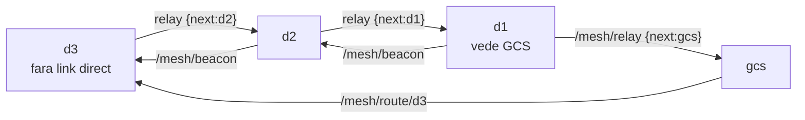

# mesh_plugin

Strat de retea MESH multi-hop peste roiul SAR: o drona fara legatura directa
cu GCS ajunge prin vecini (relay hop-by-hop). Schimba topologia din STEA in
MESH si recupereaza telemetria pe care o partitie de roi ar pierde-o. Feeds
contributia C3 a tezei.

Nucleu pur (fara ROS), aliniat la literatura clasica de mesh: metrica ETX
(De Couto, MIT 2004; folosita in OLSR / B.A.T.M.A.N. / Babel), rutare Dijkstra,
relay dirijat cu dedup si TTL. Refoloseste modelul radio al proiectului
(`radio_link.py`), deci e fizic consistent cu restul tezei.

---

## 1. Descrierea proiectului

In topologia STEA, fiecare drona vorbeste DIRECT cu GCS. Cand o drona se
indeparteaza dincolo de raza radio (sau o partitie taie legatura), GCS-ul
orbeste: nu mai primeste telemetria ei, deci nu crediteaza acoperirea/victimele
descoperite de ea. Pe profiluri radio severe (urban_rubble: cladiri prabusite,
raza utila ~70 m) asta se intampla des.

Stratul MESH rezolva: daca d3 nu vede GCS dar vede d1, iar d1 vede GCS, atunci
d3 ajunge la GCS prin relay d3 -> d1 -> gcs. Reteaua devine rezilienta la
indepartare si la caderea unor noduri. Demonstratia centrala: poti BLOCA o
drona (doborata / radio mort) si vezi ca multi-hop-ul fie se reconfigureaza
(alt drum), fie raporteaza corect ce noduri raman izolate.

---

## 2. Grafic de comunicatie



Fiecare nod emite periodic un BEACON (pozitia + id) pe care vecinii il aud
in functie de distanta -> topologie. Din topologie, fiecare nod calculeaza
next-hop-ul spre GCS (Dijkstra pe cost ETX). Un pachet de RELAY poarta campul
`next` = vecinul care trebuie sa-l preia; doar acela il forwardeaza mai departe,
recalculandu-si propriul next-hop. NU flooding -> trafic minim.

---

## 3. Work tree

```
mesh_plugin/
├── mesh_core.py          NUCLEU PUR (fara ROS): PDR->ETX, MeshGraph (Dijkstra),
│                         DirectedRelay (dedup+TTL), star vs mesh, blocare nod
├── test_mesh_core.py     31 verificari (ETX, rutare, relay, partition, blocare)
├── sil_mesh.py           SIL star vs mesh: reachability + livrare + figuri
├── mesh_node.py          nod ROS subtire: telemetrie -> topologie -> /mesh/routes
│                         + /mesh/status; comenzi block/unblock pe /mesh/control
├── mesh_demo.py          demo LIVE Tkinter: buton "blocheaza drona" + harta cu
│                         link direct / relay / izolat + rutele multi-hop
└── docs/
    ├── mesh_reachability.png   drone care ajung la GCS: stea vs mesh in timp
    ├── mesh_delivery.png       pachete telemetrie livrate (cumulat)
    ├── mesh_topology.png       topologia la final (link direct vs relay)
    └── mesh_demo_preview.png   cum arata demo-ul live (normal vs drona blocata)
```

---

## 4. Descrierea detaliata (functii)

### `mesh_core.py` -- nucleul pur

| Functie / clasa | Rol |
|---|---|
| `pdr_from_link(link, d)` | PDR = 1 - loss(distanta) din modelul radio (radio_link.py) |
| `etx(pdr_fwd, pdr_rev)` | ETX = 1/(PDR_fwd * PDR_rev); ETX=1 perfect, inf = link mort |
| `MeshGraph(link, pdr_min)` | graf de adiacenta; muchii cu cost ETX; `set_positions`, `block_node`/`unblock_node` |
| `MeshGraph.shortest_paths_to(dest)` | Dijkstra pe ETX -> (dist, next_hop) per nod |
| `MeshGraph.reachable_set(dest)` | nodurile care ajung la dest (ETX finit) |
| `MeshGraph.hop_count_to(dest)` | numarul de hopuri pe ruta aleasa |
| `DirectedRelay(id, ttl)` | releu pe un nod: `new_packet`, `on_receive` (deliver/forward/drop) cu dedup pe (src,seq) + TTL |
| `deliver_once(graph, relays, src, payload)` | simuleaza livrarea unui pachet hop-by-hop (determinist sau stochastic) |
| `star_reachable(graph, dest)` | cine ajunge la GCS in STEA (doar legatura directa) |
| `mesh_vs_star(graph, dest)` | bilantul complet: cine ajunge in stea vs mesh, cine e recuperat de mesh |

Parametri cheie: `pdr_min` (sub acest PDR muchia nu exista; implicit 0.10),
`ttl` (max hopuri; implicit 8).

### `sil_mesh.py` -- demonstratia

Dronele pornesc langa GCS si se imprastie; d3/d4 ajung dincolo de raza directa
dar raman in spatele lui d1/d2. La fiecare pas masoara cate drone ajung la GCS
si cate pachete se livreaza, in stea vs mesh. Argument: `--profile`
(open_field | urban_rubble | forest).

---

## 5. Learning: pornire + teste

```bash
cd ~/ros2_ws/src/mesh_plugin

# nucleul pur (fara ROS):
python3 mesh_core.py            # selftest 20/20
python3 test_mesh_core.py       # suita completa 31/31

# demonstratia star vs mesh (figuri in docs/):
python3 sil_mesh.py                          # urban_rubble (multi-hop activ)
python3 sil_mesh.py --profile open_field     # raza mare: mesh = stea (corect)
python3 sil_mesh.py --profile forest

# DEMO LIVE (buton "blocheaza drona", vezi relay-ul):
python3 mesh_demo.py            # standalone (fara ROS, ruleaza oriunde)
python3 mesh_demo.py --ros      # cu roiul pornit: pozitii reale din /sar/telemetry

# nodul ROS (publica rutele, asculta blocarile):
python3 mesh_node.py --ros-args -p profile:=urban_rubble -p pdr_min:=0.10
```

Demo-ul live: fiecare drona are un buton "blocheaza". Blochezi o drona si vezi
pe harta cum reteaua se reconfigureaza -- daca era un releu, dronele din spate
fie isi gasesc alt drum (linie verde noua), fie devin rosii (izolate). Sub
harta, bilantul star vs mesh in timp real. mesh_demo.py merge si fara ROS
(scenariu intern de imprastiere), util la aparare/prezentare.

Ce verifica testele (`test_mesh_core.py`, 31):
- **ETX**: link perfect=1, PDR=0.5 -> 4, PDR=0 -> infinit, asimetric, monotonie.
- **PDR din radio**: scade cu distanta, ~1 aproape, ~0 departe.
- **Dijkstra**: pe lant GCS-d1-d2-d3, doar d1 vede GCS direct, mesh ajunge la
  toate, next-hop corect (d3->d2->d1->gcs), hop count 1/2/3.
- **Relay**: livrare prin 3 hopuri, dedup (acelasi (src,seq) o data), TTL
  expira, pachet 'next'!=id ignorat.
- **Star vs mesh**: partition 2v2 -> stea pierde d3/d4, mesh le recupereaza.
- **Blocare**: d2 doborat -> d3 izolat; deblocare -> d3 ajunge iar; blocarea
  unei frunze nu rupe restul.
- **Stochastic**: livrare partiala pe lant lung (0 < rata < 1).
- **Determinism**: aceeasi topologie -> aceleasi rute.

Rezultat tipic (urban_rubble): STEA livreaza ~78% din pachete, MESH 100%
(+28%); la final stea ajunge la 2/4 drone, mesh la 4/4 (recupereaza d3, d4).

Learnings (capcane platite):
- **Calibrarea razei conteaza.** Multi-hop-ul e relevant doar cand raza radio
  e mica fata de imprastierea roiului. Pe `open_field` (raza ~300 m) dronele
  raman in raza directa -> mesh = stea (corect, nu un bug). Pe `urban_rubble`
  (raza ~70 m) multi-hop-ul devine esential -- exact mediul SAR greu.
- **Cheia muchiei trebuie sortata consecvent.** Stocarea muchiei cu o ordine
  si cautarea cu alta (lexicografica) da ETX=inf fals pe unele muchii -> rute
  gresite doar in modul stochastic. Cheie mereu `(a,b) cu a<b`.

---

## 6. Documentatie tehnica

### ETX si rutarea

ETX (Expected Transmission Count) estimeaza cate transmisii sunt necesare ca un
pachet sa ajunga cu succes pe o legatura: `ETX = 1/(PDR_fwd * PDR_rev)`. Pe un
drum multi-hop, costul total e suma ETX-urilor muchiilor. Dijkstra alege drumul
de cost minim spre GCS. Spre deosebire de hop-count (care ignora calitatea
linkului), ETX prefera drumuri cu legaturi bune chiar daca au mai multe hopuri
-- standardul in mesh-urile reale (OLSR-LQ, Babel).

### Relay dirijat (nu flooding)

Fiecare pachet poarta `next` = next-hop-ul calculat de emitator. La receptie, un
nod il proceseaza DOAR daca `next == id_propriu`; altfel il ignora. Asta evita
furtuna de broadcast a flooding-ului. Nodul care preia: deduplica pe (src,seq),
decrementeaza TTL, recalculeaza propriul next-hop (topologia se poate fi
schimbat intre timp -- robust la mobilitate) si forwardeaza.

### Blocarea unei drone (demonstratia ceruta)

`block_node(id)` scoate un nod din retea (drona doborata / radio mort): toate
muchiile lui dispar, rutele se recalculeaza. Daca nodul era un RELEU critic,
nodurile din spatele lui devin izolate (vizibil in `mesh_vs_star`); daca era o
frunza, restul retelei nu e afectat. Asta e demonstratia live: blochezi o drona
si vezi pe harta cum multi-hop-ul fie gaseste alt drum, fie raporteaza ce a
ramas izolat.

### Limite oneste

- Modelul radio e simetric (acelasi PDR ambele sensuri) -- ETX real masoara
  ambele directii separat; aici le aproximam egale (rezonabil in simulare).
- Rutarea e recalculata global (Dijkstra centralizat) in SIL; un mesh real e
  distribuit (fiecare nod cu vedere partiala) -- nodul ROS va aproxima asta cu
  beacon-uri periodice si tabele locale.
- Livrarea determinista (pe ruta ETX) e folosita pentru reachability curata;
  modul stochastic (PDR pe fiecare hop) e disponibil pentru analiza de
  fiabilitate end-to-end.
