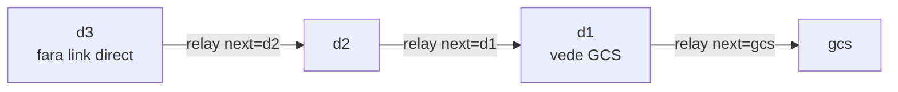

# mesh_plugin -- retea mesh multi-hop intre drone (contributia C3)

Strat de retea MESH multi-hop peste roiul SAR: o drona fara legatura directa
cu statia de la sol (GCS) ajunge la GCS prin vecini, prin relay dirijat hop-cu-hop.
Schimba topologia roiului din STEA (fiecare drona vorbeste DIRECT cu GCS) in MESH,
si recupereaza telemetria pe care o partitie de roi ar pierde-o. Pachetul aduce
contributia C3 a tezei (rezilienta la partitie / extindere a razei prin relee).
Nucleul de rutare e pur (fara ROS), aliniat la literatura clasica de mesh:
metrica ETX (De Couto, MIT 2004; folosita in OLSR-LQ / B.A.T.M.A.N. / Babel),
rutare Dijkstra, relay dirijat cu deduplicare si TTL.

## 1. Scop

Cand o drona iese din raza radio directa a GCS (sau o partitie taie legatura),
in topologia STEA GCS-ul orbeste: nu mai primeste telemetria ei, deci nu
crediteaza acoperirea/victimele descoperite de ea. Stratul MESH rezolva aceasta
pierdere: daca d3 nu vede GCS dar vede d1, iar d1 vede GCS, atunci d3 ajunge la
GCS prin relay d3 -> d1 -> gcs. Demonstratia centrala: poti BLOCA o drona
(doborata / radio mort) si vezi ca multi-hop-ul fie se reconfigureaza (alt drum),
fie raporteaza corect ce noduri raman izolate.

Contributia este masurabila pe doua planuri:
- reachability (geometric, static): cate drone ajung la GCS in stea vs mesh;
- misiune (dinamic, cuplat la scenariile de degradare): cata telemetrie si cate
  victime afla GCS-ul, cu si fara relay.

## 2. Context si loc in arhitectura

Pachetul sta DEASUPRA modelului radio al proiectului (log-distance,
`radio_link.py`), deci e fizic consistent cu restul tezei: distanta -> PDR ->
ETX, aceeasi moneda (pierderea de pachete) ca in benchmark-ul C1. Ruleaza in
PARALEL cu roiul existent (drone/GCS din sar_swarm), citind pozitiile dronelor si
nemodificand nodurile lor. Nivelul de aplicatie nu inlocuieste DDS/Zenoh, ci adauga
un strat de rutare multi-hop la nivel logic peste transportul ROS 2.

Avertisment important de structura (verificat in sursa): pachetul contine DOUA
implementari paralele ale aceluiasi concept, cu API-uri diferite:

| Cale | API nucleu | Lansare | Status |
|------|-----------|---------|--------|
| `mesh_plugin/mesh_plugin/*.py` (pachetul ament intern) | `MeshTopology` + `routing_table` + `reachability`; beacon/relay distribuite per nod | `ros2 run` / `ros2 launch` (entry_points din setup.py) | versiunea INSTALATA + smoke-testata; **CANONICA** (vezi nota de mai jos) |
| `mesh_plugin/*.py` (radacina pachetului) | `MeshGraph` + `DirectedRelay`; Dijkstra centralizat; demo Tkinter; SIL de misiune cuplat la sar_swarm | `python3 <fisier>.py` (NU prin `ros2 run`) | COMPANION de analiza/figuri (NU canonica); pastrata -- vezi nota |

Entry_points din `setup.py` (`mesh_plugin.mesh_node:main`, ...) trimit la pachetul
INTERN, deci `ros2 run mesh_plugin mesh_node` ruleaza versiunea `MeshTopology`
(beacon/relay), nu rescrierea `MeshGraph` din radacina. Cele doua nu impart cod
si nu se importa reciproc. Aceasta documentatie acopera ambele si marcheaza clar
care comanda atinge care implementare.
DECIZIE (iunie 2026 -- canonica marcata, ambele pastrate, fara consolidare acum):
versiunea CANONICA este `MeshTopology` (pachetul ament intern). Motiv: este ceea ce
`ros2 run mesh_plugin` executa, este versiunea instalata si smoke-testata
(`verifica_tot.sh`), si implementeaza multi-hop DISTRIBUIT (beacon/relay per nod) --
adica forma deployabila a contributiei C3. Rescrierea din radacina (`MeshGraph`,
Dijkstra centralizat) ramane ca COMPANION de analiza/vizualizare: genereaza figurile din
`docs/`, ofera demo-ul Tkinter si SIL-ul de misiune cuplat la sar_swarm, si serveste ca
referinta idealizata (oracol centralizat) fata de care se compara routing-ul distribuit.
Cele doua NU se consolideaza acum (roadmap: fara rescrieri ale pachetelor incheiate); raman
separate, cu rolurile de mai sus. Pentru rezultatul C3 deployabil foloseste `ros2 run`
(MeshTopology); pentru figuri/demo foloseste scripturile din radacina (MeshGraph).

## 3. Arhitectura

### 3.1 Lantul metodologic (nucleu pur -> nod -> SIL)

Ambele implementari respecta regula de fier a proiectului: algoritmul de rutare
sta intr-un modul FARA ROS, testat in izolare cu `_selftest()`, peste care se
aseaza un nod ROS subtire (JSON pe `std_msgs/String`) si o demonstratie SIL.

```
radio_link.py (log-distance, PDR(d))
        |
        v
   ETX = 1 / (PDR_fwd * PDR_rev)        [De Couto 2004]
        |
        v
   topologie (graf de adiacenta, cost ETX pe muchii)
        |
        v
   Dijkstra spre GCS -> tabel next-hop per nod
        |
        v
   relay dirijat hop-cu-hop (next, dedup pe (src,seq), TTL)
        |
        +--> nod ROS subtire (publica rute, releaza telemetria)
        +--> SIL (stea vs mesh; figuri)
```

### 3.2 Rescrierea din radacina (MeshGraph) -- topologia relay



Fiecare nod calculeaza next-hop-ul spre GCS (Dijkstra pe cost ETX). Un pachet de
RELAY poarta campul `next` = vecinul care trebuie sa-l preia; doar acela il
forwardeaza, recalculandu-si propriul next-hop. NU flooding -> trafic minim.

### 3.3 Nodul ROS intern (MeshTopology) -- topicuri

Cate un `mesh_node` per drona (d1..dN) plus unul pentru GCS (pozitie fixa,
`static_x`/`static_y`). Topicuri (JSON pe `std_msgs/String`):

| Topic | Sens | Continut |
|-------|------|----------|
| `/mesh/beacon` | publica + asculta | `{id, x, y, t, seq}`; descoperire de vecini (beacon expira la 3.0 s) |
| `/mesh/relay` | publica + asculta | `{src, dst, seq, ttl, next, path, payload?}`; proceseaza doar `next == id` |
| `/mesh/route/<id>` | publica | `{id, next, hops, etx, path, reachable}`; observabilitate per nod |
| `<pose_topic>` | asculta | pozitia proprie (daca nodul nu e static) |
| `<ingest_topic>` | asculta | telemetria proprie a dronei (daca `ingest=true`) |
| `<egress_topic>` | publica (doar GCS) | telemetria livrata, repusa in circuit (ex. `/sar/telemetry`) |

### 3.4 Nodul ROS din radacina (MeshGraph) -- topicuri DIFERITE

Nodul `mesh_node.py` din radacina (rulabil doar cu `python3`) este un agregator
centralizat, nu un nod-per-drona. Topicuri:

| Topic | Sens | Continut |
|-------|------|----------|
| `/sar/telemetry` (parametru `pose_topic`) | asculta | pozitiile dronelor |
| `/mesh/control` | asculta | `{"action":"block"|"unblock"|"reset","id":"d3"}` |
| `/mesh/routes` | publica (1 Hz, latched) | per drona: next, hops, etx, direct, reachable, blocked |
| `/mesh/status` | publica (1 Hz) | bilantul star vs mesh: n_star, n_mesh, recovered, isolated |

Cele doua noduri folosesc topicuri si parametri diferiti si nu sunt
interoperabile. `mesh_plugins.launch.py` lanseaza versiunea INTERNA
(`/mesh/beacon` + `/mesh/relay`).

## 4. Inventar fisiere

Tabelul separa cele doua implementari. "verificare" = cum confirmi ca fisierul
face ce spune.

### 4.1 Pachetul ament intern (versiunea instalata, ros2 run / launch)

| Fisier | Rol | Verificare |
|--------|-----|------------|
| `mesh_plugin/mesh_core.py` | nucleu pur: `rssi_dbm`, `pdr_from_rssi`, `etx`, `MeshTopology`, `shortest_path`, `routing_table`, `reachability`, `simulate_delivery` | `python3 mesh_core.py` (21/21) |
| `mesh_plugin/mesh_node.py` | nod ROS per-drona: beacon, relay dirijat, tabel de rute, ingest/egress optional | `ros2 run mesh_plugin mesh_node` |
| `mesh_plugin/sil_mesh.py` | SIL reachability (importa `MeshTopology, reachability`) | `ros2 run mesh_plugin sil_mesh` |
| `mesh_plugin/sil_mesh_mission.py` | SIL misiune (importa `MeshTopology, reachability`) | `ros2 run mesh_plugin sil_mesh_mission` |
| `mesh_plugin/__init__.py` | marker de pachet (gol) | - |
| `launch/mesh_plugins.launch.py` | lanseaza un `mesh_node` per drona + GCS, in paralel cu roiul | `ros2 launch mesh_plugin mesh_plugins.launch.py` |
| `package.xml`, `setup.py`, `setup.cfg` | metadate ament_python; entry_points; `script_dir`/`install_scripts` | `ros2 pkg executables mesh_plugin` |
| `resource/mesh_plugin` | marker ament_index | - |
| `requirements.txt` | dependinte pip (matplotlib, numpy, PyYAML); tkinter = `apt install python3-tk` | - |
| `verifica_tot.sh` | verificare end-to-end (structura, offline, colcon, instalare) | `./verifica_tot.sh --offline` |

### 4.2 Rescrierea din radacina (rulabila doar cu python3)

| Fisier | Rol | Verificare |
|--------|-----|------------|
| `mesh_core.py` | nucleu pur: `pdr_from_link`, `etx`, `MeshGraph` (Dijkstra), `DirectedRelay` (dedup+TTL), `deliver_once`, `star_reachable`, `mesh_vs_star`, `block_node`/`unblock_node` | `python3 mesh_core.py` (20/20) |
| `test_mesh_core.py` | suita externa de verificari (ETX, PDR, Dijkstra, relay, partition, blocare, stochastic, determinism) | `python3 test_mesh_core.py` (31/31) |
| `mesh_node.py` | nod ROS agregator: telemetrie -> `/mesh/routes` + `/mesh/status`; comenzi block/unblock pe `/mesh/control` | `python3 mesh_node.py --ros-args ...` |
| `sil_mesh.py` | SIL star vs mesh (geometric): reachability + livrare + 3 figuri | `python3 sil_mesh.py` (4/4, exit 0) |
| `sil_mesh_mission.py` | SIL misiune CU vs FARA mesh, cuplat la scenariile de degradare | `python3 sil_mesh_mission.py --scenario mesh_relay` (3/3) |
| `mesh_demo.py` | demo LIVE Tkinter: buton "blocheaza drona" + harta cu link direct / relay / izolat | `python3 mesh_demo.py` |
| `radio_link.py` | model radio log-distance partajat (`LogDistanceRadioLink`, `make_link`, profiluri) | importat de nucleu |
| `node_utils.py` | QoS (best_effort/reliable/latched), `now_s`, parsare telemetrie JSON | importat de nod |
| `sar_core.py`, `swarm_core.py`, `netem_core.py`, `world_config.py` | dependintele SIL de misiune (lume, cinematica, canal, scenarii) | importate de `sil_mesh_mission.py` |
| `scenarios/*.yaml` | 7 scenarii de degradare (vezi sectiunea 5) | citite de `sil_mesh_mission.py` |
| `docs/*.png` | figuri pentru documentatie (instalate prin `data_files`) | - |
| `mesh_*.png` (in radacina) | figuri generate de SIL-urile din radacina | suprascrise la rulare |

Nota onestitate: `mesh_node.py`, `sil_mesh.py`, `sil_mesh_mission.py`, `mesh_core.py`
exista in DOUA exemplare (radacina vs `mesh_plugin/`), cu CONTINUT DIFERIT.
Fisierele din radacina nu se importa unele pe altele cu cele interne. Modulele de
suport SIL (`sar_core.py` etc.) si `radio_link.py`/`node_utils.py` exista doar in
radacina si NU sunt instalate de `setup.py` (nu apar in `data_files`); de aceea
SIL-urile din radacina ruleaza cu `python3` din directorul pachetului, nu prin
`ros2 run`.

## 5. Date tehnice

### 5.1 Metrici si definitii (din cod)

```
PDR(d)       = 1 - loss(distanta)        din modelul radio log-distance
ETX          = 1 / (PDR_fwd * PDR_rev)   ETX=1 link perfect, inf = link mort
cost cale    = suma ETX-urilor muchiilor de pe drum (Dijkstra minimizeaza)
hop_count    = numarul de hopuri pe ruta aleasa de Dijkstra
reachable    = nodurile cu ETX finit pana la GCS
recovered    = mesh_reachable - star_reachable  (cine ajunge DOAR prin relay)
```

Masurarea pe ETX leaga rutarea de pierderea de pachete -- aceeasi moneda ca tot
restul tezei. ETX prefera drumuri cu legaturi bune chiar daca au mai multe
hopuri (spre deosebire de hop-count, care ignora calitatea linkului); acesta
este standardul OLSR-LQ / Babel.

### 5.2 Parametri (valori reale din cod/launch)

Nucleul (ambele implementari):

| Parametru | Semnificatie | Implicit |
|-----------|--------------|----------|
| `pdr_min` | sub acest PDR pe o directie, muchia NU exista | 0.10 |
| `ttl` / `relay_ttl` | numar maxim de hopuri pentru un pachet | 8 |

Nodul ROS intern (`mesh_plugin/mesh_node.py`) si `mesh_plugins.launch.py`:

| Parametru | Semnificatie | Implicit |
|-----------|--------------|----------|
| `id` | identitatea nodului (d1..dN sau GCS) | `d1` |
| `gcs` | id-ul statiei sink | `GCS` |
| `pose_topic` | topicul de pozitie (daca nu e static) | `/sar/pose/d1` |
| `static_x` / `static_y` | setate -> pozitie fixa (nodul GCS) | 9.0e9 (= nesetat) |
| `beacon_hz` | frecventa beacon | 2.0 |
| `route_hz` | frecventa publicarii tabelei de rute | 1.0 |
| `tx_dbm`, `path_loss_n`, `sens_dbm`, `width_db` | parametrii radio interni | 0.0, 3.0, -40.0, 3.0 |
| `ingest`, `ingest_topic`, `egress_topic` | transport optional de telemetrie prin mesh | false, "", "" |

Nodul ROS din radacina (`mesh_node.py`) declara in plus: `profile`
(`open_field` | `urban_rubble` | `forest`), `gcs_x`, `gcs_y`, `rate_hz`.

Avertisment de potrivire (verificat): `mesh_plugins.launch.py` foloseste exact
parametrii nodului INTERN (`id`, `static_x`, `tx_dbm`, `ingest`, `egress_topic`,
`relay_ttl`). NU exista parametri `profile`/`gcs_x` in nodul intern; aceia apar
doar in nodul din radacina, care nu se lanseaza prin launch.

### 5.3 Profiluri radio (din `radio_link.py`)

| Profil | n_exp | shadow_sigma_db | snr_mid | Comentariu |
|--------|-------|-----------------|---------|------------|
| `open_field` | 2.4 | 2.0 | 8.0 | camp deschis; raza directa mare -> mesh = stea |
| `urban_rubble` | 3.3 | 5.0 | 10.0 | moloz / cladiri prabusite; raza mica -> relay esential |
| `forest` | 2.9 | 4.0 | 9.0 | intermediar |

### 5.4 Scenarii de degradare (`scenarios/*.yaml`, citite de SIL de misiune)

| Scenariu | Eveniment cheie | Relay ajuta? |
|----------|-----------------|--------------|
| `baseline` | retea nominala, fara evenimente | nu e cazul |
| `loss_30` / `loss_70` | pierdere ridicata | (degradare globala) |
| `gcs_delay_spike` | varf de intarziere la GCS | (degradare globala) |
| `drone_isolation` | izolarea completa a d2 (t=25..60) | masurat: fara castig (vezi 7) |
| `partition_2v2` | partitie 2 vs 2: {gcs,d1,d2} vs {d3,d4} (t=30..70) | masurat: fara castig (vezi 7) |
| `mesh_relay` | taie DOAR d3-gcs si d4-gcs (`set_link up:false`, t=10..90); pastreaza d3-d1, d4-d2; S&F oprit | DA: +55% telemetrie livrata |

`mesh_relay` este singurul scenariu in care SIL de misiune din radacina
demonstreaza castigul relay-ului, fiindca taie EXACT legaturile directe lasand
puntea multi-hop intacta. Sub o partitie de grup (`partition_2v2`,
`drone_isolation`) intregul lant relay este si el taiat, deci mesh-ul nu poate
ajuta -- comportament corect, dar nu o demonstratie de castig.

## 6. Sintaxe de pornire

### 6.1 Verificari fara ROS (rescrierea din radacina)

```bash
cd ~/ros2_ws/src/mesh_plugin

# nucleul pur:
python3 mesh_core.py            # selftest 20/20
python3 test_mesh_core.py       # suita externa 31/31

# SIL star vs mesh (geometric; scrie mesh_reachability/delivery/topology.png):
python3 sil_mesh.py                          # urban_rubble: stea 78%, mesh 100%
python3 sil_mesh.py --profile open_field     # raza mare: mesh = stea (corect)
python3 sil_mesh.py --profile forest

# SIL misiune CU vs FARA mesh (cuplat la scenarii):
python3 sil_mesh_mission.py --scenario mesh_relay     # +55% telemetrie (3/3)
python3 sil_mesh_mission.py                            # partition_2v2 (2/3, vezi 7)

# DEMO LIVE (buton "blocheaza drona", vezi relay-ul):
python3 mesh_demo.py            # standalone (fara ROS, ruleaza oriunde)
python3 mesh_demo.py --ros      # cu roiul pornit: pozitii reale din /sar/telemetry

# nodul ROS agregator din radacina (NU prin ros2 run; importa radio_link local):
python3 mesh_node.py --ros-args -p profile:=urban_rubble -p pdr_min:=0.10
```

### 6.2 Build si rulare prin ament (versiunea instalata, MeshTopology)

```bash
cd ~/ros2_ws
colcon build --packages-select mesh_plugin --symlink-install
source install/setup.bash               # in FIECARE terminal nou

# confirma executabilele inregistrate:
ros2 pkg executables mesh_plugin        # mesh_node, sil_mesh, sil_mesh_mission

# un nod per drona (versiunea beacon/relay):
ros2 run mesh_plugin mesh_node --ros-args -p id:=d3 -p gcs:=GCS \
    -p pose_topic:=/sar/pose/d3

# roiul mesh intreg, in paralel cu sar_swarm:
ros2 launch mesh_plugin mesh_plugins.launch.py
ros2 launch mesh_plugin mesh_plugins.launch.py path_loss_n:=3.5
# cu transport de telemetrie prin mesh (integrare in roi):
# (prefixul de ingestare e fix in launch: INGEST_PREFIX="/sar/telemetry/";
#  argumentele expuse sunt ingest, egress_topic, gcs_x/gcs_y si parametrii radio)
ros2 launch mesh_plugin mesh_plugins.launch.py ingest:=true \
    egress_topic:=/sar/telemetry
```

### 6.3 Verificare automata end-to-end

```bash
cd ~/ros2_ws/src/mesh_plugin
./verifica_tot.sh --offline     # structura + selftest + SIL-uri, fara colcon
./verifica_tot.sh               # tot: + colcon build + ros2 pkg executables
./verifica_tot.sh --clean       # build curat (sterge build/install pachet)
```

Limitari: `mesh_demo.py` cere `python3-tk`; modul `--ros` cere rclpy + roiul
pornit. SIL-urile din radacina ruleaza din directorul pachetului (importa
`radio_link.py`, `sar_core.py` etc. prin `sys.path.insert`), nu prin `ros2 run`.

## 7. Verificare

Numere reale, obtinute prin rulare la documentare (2026-06-25, masina locala):

| Verificare | Comanda | Rezultat real |
|-----------|---------|---------------|
| nucleu radacina (selftest) | `python3 mesh_core.py` | 20/20 |
| suita externa radacina | `python3 test_mesh_core.py` | 31/31 (0 FAIL) |
| nucleu intern (selftest) | `python3 mesh_plugin/mesh_core.py` | 21/21 |
| SIL reachability | `python3 sil_mesh.py` | 4/4, exit 0; STEA 78.1%, MESH 100.0%, recuperate d3,d4 |
| SIL reachability (open_field) | `python3 sil_mesh.py --profile open_field` | mesh = stea (100%/100%), 0 recuperate (corect) |
| SIL misiune (mesh_relay) | `python3 sil_mesh_mission.py --scenario mesh_relay` | 3/3, exit 0; telemetrie 1224 -> 1896 (+55%); victime finale 5/5 in ambele, dar mesh le afla mai devreme (timp pana GCS stie 5: 90.3 s -> 64.0 s) |
| SIL misiune (partition_2v2) | `python3 sil_mesh_mission.py` | 2/3, exit 1; FARA = CU mesh (2056 = 2056) -- vezi mai jos |
| SIL misiune (drone_isolation) | `python3 sil_mesh_mission.py --scenario drone_isolation` | 2/3, exit 1; fara castig |
| executabile inregistrate | `ros2 pkg executables mesh_plugin` | mesh_node, sil_mesh, sil_mesh_mission |

Ce verifica suita `test_mesh_core.py` (31 de verificari):
- ETX: link perfect=1, PDR=0.5 -> 4, PDR=0 -> infinit, asimetric, monotonie.
- PDR din radio: scade cu distanta, ~1 aproape, ~0 departe, in [0,1].
- Dijkstra: pe lant GCS-d1-d2-d3, doar d1 vede GCS direct; mesh ajunge la toate;
  next-hop d3->d2->d1->gcs; hop count 1/2/3; ETX creste cu hopurile.
- Relay: livrare prin 3 hopuri, dedup pe (src,seq), TTL expira, `next`!=id ignorat.
- Star vs mesh: partition 2v2 -> stea pierde d3/d4, mesh le recupereaza.
- Blocare: d2 doborat -> d3 izolat; deblocare -> d3 ajunge iar; blocarea unei
  frunze nu rupe restul.
- Stochastic: livrare partiala pe lant lung (0 < rata < 1).
- Determinism: aceeasi topologie -> aceleasi rute.

Avertisment de onestitate (corectie fata de README-ul vechi): SIL de misiune din
radacina NU produce un castig de mesh pe `partition_2v2` (rezultat masurat: FARA
mesh = CU mesh, ambele 2056 telemetrie livrata, 5/5 victime la 70.2 s, 2/3
verificari, exit 1). Cauza din cod: scenariul `partition` taie intregul grup
{d3,d4} de {gcs,d1,d2}, iar `sil_mesh_mission.py` verifica fiecare legatura din
lantul relay cu `ch.link_up(...)` -- daca grupul e taiat, si puntea relay e
taiata, deci mesh-ul nu poate ajuta. Demonstratia de castig se face pe scenariul
`mesh_relay`, care taie DOAR legaturile directe d3-gcs si d4-gcs si pastreaza
puntea d3-d1 / d4-d2 (rezultat masurat: +55% telemetrie, ambele variante ajung la
5/5 victime dar mesh le afla mai devreme -- 90.3 s vs 64.0 s, 3/3 exit 0).

Rezultatele de mai sus sunt din rulari SIL la N=1 -- (SIL, N=1 -- de inlocuit cu
N=5) inainte de orice integrare in articol; nucleul fiind determinist (seed fix),
valorile sunt reproductibile, dar marja statistica nu este inca raportata.

## 8. Igiena datelor si reproductibilitate

Figurile din `docs/` sunt instalate prin `data_files` si folosite in documentatie.
SIL-urile din radacina REGENEREAZA figuri in radacina pachetului
(`mesh_reachability.png`, `mesh_delivery.png`, `mesh_topology.png`,
`mesh_mission_victims.png`, `mesh_mission_delivery.png`); cele interne genereaza
`sil_mesh_reachability.png`, `sil_mesh_snapshot.png`, `sil_mesh_mission.png`.
Aceste fisiere se suprascriu la rulare si nu sunt date brute de campanie.

```bash
# reproducerea figurilor din radacina (deterministe, seed fix):
cd ~/ros2_ws/src/mesh_plugin
python3 sil_mesh.py                                  # reachability/delivery/topology
python3 sil_mesh_mission.py --scenario mesh_relay    # victims/delivery de misiune

# build curat daca ros2 run nu vede schimbarile (wrapper-ele se genereaza la build):
cd ~/ros2_ws && rm -rf build/mesh_plugin install/mesh_plugin
colcon build --packages-select mesh_plugin --symlink-install
source install/setup.bash
```

In depozit intra codul, scenariile si figurile de documentatie; eventualele
rulari de campanie (N=5) se arhiveaza in afara depozitului, conform regulilor de
igiena ale proiectului (`build/`, `install/`, `log/`, `__pycache__/`, `*.pyc` si
directoarele de rezultate raman in `.gitignore`).
