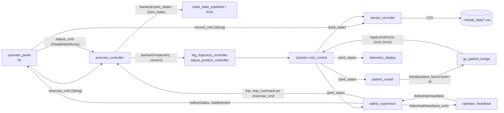

# rehab_exo_description -- demonstratorul exoschelet de reabilitare (C4)

Descrierea URDF/xacro a unui exoschelet medical pentru membrele inferioare cu 6
servomotoare (2 sold + 2 genunchi + 2 glezna) si 5 axe prismatice de ajustare,
impreuna cu nodurile ROS 2 care il anima: un controler de exercitii peste un
nucleu pur (FARA ROS), un supervizor de siguranta, un model de pacient, panou si
telemetrie de operator, inregistrare de senzori si raportare. Este demonstratorul
de telereabilitare al contributiei C4 (teleoperare in timp real peste retele
degradate): puntea de heartbeat operator-robot si profilurile tc netem permit
masurarea aceleiasi degradari de retea (rmw_zenoh vs rmw_cyclonedds_cpp) ca in
benchmark-ul A1, dar pe sarcina de comanda a unui dispozitiv medical.

NOTA MEDICALA: valorile exercitiilor si limitele sunt de DEMONSTRATIE / simulare,
NU prescriptii clinice si NU un controler medical certificat (vezi package.xml si
config/safety_limits.yaml).

## 1. Scop

Pachetul livreaza trei lucruri:

1. Modelul cinematic al exoscheletului (URDF + xacro + RViz + lume Gazebo), cu 6
   articulatii revolute sagitale si 5 axe prismatice de reglaj la pacient.
2. Lantul de control reproductibil: un nucleu pur `exercise_core.py` (repertoriu
   de exercitii -> traiectorie cosinus -> garda de siguranta) condus de un nod
   ROS subtire `exercise_controller.py`, in doua backend-uri (RViz pe
   `/joint_states` sau ros2_control pe traiectorie in Gazebo).
3. Stratul de telereabilitare pentru C4: heartbeat operator-robot cu masurare
   RTT/pierdere, supervizor failsafe la pierderea legaturii, model de pacient ca
   sarcina dinamica si profiluri de degradare a retelei identice metodologic cu
   benchmark-ul A1.

Pachetul este un demonstrator de simulare/dezvoltare, nu production-grade.

## 2. Context si loc in arhitectura

Coloana stiintifica a tezei este benchmark-ul `rmw_zenoh` vs `rmw_cyclonedds_cpp`
sub degradare controlata (tc netem). C1 masoara transportul si o misiune SAR; C4
muta aceeasi intrebare pe un al doilea demonstrator -- un dispozitiv de
reabilitare teleoperat -- unde calitatea legaturii are consecinta directa de
siguranta: daca legatura cu operatorul cade, exoscheletul trebuie sa revina lin la
repaus.

Locul in repo (vezi src/CLAUDE.md sectiunea 7): `rehab_exo_description`,
`servo_control` si `joint_emulator` formeaza grupul C4 (exoschelet + motor). Acest
pachet este stratul de descriere, exercitii si lansare; pe fier, fizica si bucla
rapida traiesc separat in `joint_emulator` (Raspberry Pi langa drive-uri,
interfata `drive_iface`/Modbus). Cele 3 perechi ale bancului ABB corespund
articulatiilor sold / genunchi / glezna ale unui picior.

Comparatia de middleware se aplica exact ca in A1: pe ambele statii, inainte de
pornire,

    export RMW_IMPLEMENTATION=rmw_zenoh_cpp        # sau rmw_cyclonedds_cpp

apoi se ruleaza aceeasi sesiune sub fiecare profil de retea, iar
`operator_heartbeat.py` scrie masuratorile (RTT, pierdere) intr-un CSV etichetat.

## 3. Arhitectura

### 3.1. Stratificarea nucleu pur -> nod -> SIL

```
exercise_core.py            nucleu PUR (fara ROS, fara I/O):
  Program / Player            repertoriu -> traiectorie cosinus -> garda viteza
  clamp / clamp_adjust        limite de articulatie + regula de cuplare la sol
        |
        v
exercise_controller.py      nod ROS subtire: parametri, topicuri, doua backend-uri
        |
        v
Gazebo (ros2_control) SAU RViz (/joint_states)   = nivelul SIL / vizualizare
```

Conventia de metodologie a proiectului (core pur + nod subtire) este respectata
pentru lantul de exercitii. Nucleul `exercise_core.py` NU contine inca o functie
`_selftest()` (vezi sectiunea 7 -- TODO).

### 3.2. Graful de noduri si topicuri (telereabilitare completa)



Topicurile principale (toate `std_msgs`/`sensor_msgs`, fara interfete proprii):

| Topic | Tip | Sens | Producator -> consumator |
|---|---|---|---|
| `/exercise_cmd` | std_msgs/String | comanda | operator_panel, safety_supervisor -> exercise_controller |
| `/adjust_cmd` | std_msgs/Float64MultiArray (5) | comanda | operator_panel -> exercise_controller |
| `/record_cmd` | std_msgs/String | comanda | operator_panel -> sensor_recorder |
| `/joint_states` | sensor_msgs/JointState | stare | exercise_controller (RViz) sau gz_ros2_control -> toti consumatorii |
| `/leg_trajectory_controller/joint_trajectory` | trajectory_msgs/JointTrajectory | comanda | exercise_controller (backend trajectory) -> ros2_control |
| `/adjust_position_controller/commands` | std_msgs/Float64MultiArray | comanda | exercise_controller -> ros2_control |
| `/safety/status` | std_msgs/String (OK / TRIPPED:...) | stare | safety_supervisor |
| `/safety/event` | std_msgs/String | eveniment | safety_supervisor |
| `/safety/reset` | std_msgs/Empty | comanda | operator -> safety_supervisor |
| `/telerehab/heartbeat` | std_msgs/String ("seq;t_ns") | comanda | operator_heartbeat -> safety_supervisor |
| `/telerehab/heartbeat_echo` | std_msgs/String | ecou | safety_supervisor -> operator_heartbeat |
| `/telerehab/network_health` | std_msgs/String ("cheie=valoare ...") | stare | operator_heartbeat |
| `/rehab/patient_force/<joint>` x6 | std_msgs/Float64 [Nm] | comanda | patient_model -> gz_patient_bridge |
| `/patient_model/scale` | std_msgs/Float64 | comanda | operator -> patient_model |

## 4. Inventar fisiere

Verificarea sintaxei tuturor scripturilor: `python3 -m py_compile scripts/*.py`
(trece -- vezi sectiunea 7). Directorul `scripts/` contine 11 fisiere `.py`:
cele 10 instalate ca PROGRAMS in `lib/` (vezi `ros2 pkg executables`) plus
unealta offline `patch_urdf_extensions.py` (NU se instaleaza ca executabil).

| Fisier | Rol | Cum se verifica |
|---|---|---|
| `scripts/exercise_core.py` | NUCLEU PUR: 12 exercitii + 4 sesiuni + `neutral`; Program/Player, garda de viteza, `clamp_adjust` | import direct (sectiunea 7); NU are inca `_selftest()` (TODO) |
| `scripts/exercise_controller.py` | nod ROS: reda programele in backend `joint_states` sau `trajectory`; sub `/exercise_cmd`, `/adjust_cmd` | `ros2 run rehab_exo_description exercise_controller.py` |
| `scripts/safety_supervisor.py` | supervizor de siguranta: trip pe cuplu/viteza si pe pierderea heartbeat-ului; echo heartbeat | `ros2 topic echo /safety/status` |
| `scripts/operator_heartbeat.py` | statia operatorului: heartbeat numerotat, RTT (EMA), pierdere, jurnal CSV | `ros2 topic echo /telerehab/network_health` |
| `scripts/patient_model.py` | pacient virtual: arc-amortizor + tremor -> cupluri pe articulatii | `ros2 topic echo /rehab/patient_force/left_knee_joint` |
| `scripts/operator_panel.py` | panou Tk al operatorului (exercitii / ajustare / inregistrare) | `ros2 run rehab_exo_description operator_panel.py` (necesita python3-tk) |
| `scripts/telemetry_display.py` | afisaj live Tk (pozitie/viteza/torque, ultimele ~12 s) | `ros2 run rehab_exo_description telemetry_display.py` (python3-tk) |
| `scripts/sensor_recorder.py` | inregistrare CSV a tuturor celor 11 articulatii in `~/rehab_data/` | `ros2 run rehab_exo_description sensor_recorder.py` |
| `scripts/plot_recording.py` | CSV -> figura PNG (3 panouri) + statistici; FARA ROS | `python3 scripts/plot_recording.py <csv>` |
| `scripts/session_report.py` | CSV -> raport PDF (ROM, simetrie, SPARC, repetari, cuplu); FARA ROS | `python3 scripts/session_report.py <csv> --inspect` |
| `scripts/patch_urdf_extensions.py` | insereaza in URDF 6 plugin-uri ApplyJointForce + 3 senzori IMU; idempotent, cu backup .bak si validare XML | `python3 scripts/patch_urdf_extensions.py urdf/rehab_exo.urdf` |
| `scripts/netem_profiles.sh` | profiluri tc netem (degradarea legaturii) | `sudo scripts/netem_profiles.sh status` |
| `urdf/rehab_exo.urdf` | URDF expandat, autoritar (folosit de launch); limite per articulatie | `check_urdf` sau `xacro`/`ros2 launch ... display` |
| `urdf/rehab_exo.xacro` | varianta parametrica (macro-uri); limite generice 0..3.14159 | `xacro urdf/rehab_exo.xacro` |
| `config/controllers.yaml` | ros2_control: joint_state_broadcaster + leg_trajectory_controller + adjust_position_controller | citita din plugin-ul gz_ros2_control |
| `config/safety_limits.yaml` | limitele supervizorului (effort_max, velocity_max per articulatie) | parametru `limits_file` |
| `config/patient_demo.yaml` | profil demonstrativ de pacient (k, b, q_rest, tremor) | parametru `profile_file` |
| `config/gz_patient_bridge.yaml` | puntea ros_gz: 6 cmd_force (ROS->GZ) + 3 IMU (GZ->ROS) | `ros2 run ros_gz_bridge parameter_bridge -p config_file:=...` |
| `launch/*.launch.py` | 10 fisiere de lansare (vezi sectiunea 6) | `ros2 launch rehab_exo_description <fisier>` |
| `worlds/rehab_world.sdf` | lume Gazebo cu sistemele de senzori (IMU activ; FT/contact pentru extensii viitoare) | `gz sim worlds/rehab_world.sdf` |
| `rviz/rehab.rviz` | configuratia RViz a demonstratorului | incarcata de display/demo/operator |
| `CMakeLists.txt`, `package.xml` | pachet ament_cmake: instaleaza share/ + 10 PROGRAMS in lib/ | `colcon build --packages-select rehab_exo_description` |
| `requirements.txt` | dependinte pip (matplotlib, numpy, PyYAML); tkinter = `apt install python3-tk` | -- |
| `docs/INSTALL_EXTENSII.md` | ghid de instalare/testare a extensiilor de telereabilitare (in romana cu diacritice, doc citit de om) | -- |

## 5. Date tehnice (din cod/config)

### 5.1. Articulatii si limite (din urdf/rehab_exo.urdf + exercise_core.py)

6 articulatii revolute (servomotoare) + 5 prismatice (ajustare) = 11 articulatii
in `/joint_states`. Conventia de semn (identica URDF <-> software): rotatie
pozitiva pe axa Y = extensie; flexie = negativ.

| Articulatie | Limite software (exercise_core) [rad] | Semantica |
|---|---|---|
| hip (sold) | -0.45 .. +0.70 | `+` ridica coapsa |
| knee (genunchi) | 0.00 .. +1.75 | `+` extensie (gamba in fata) |
| ankle (glezna) | -0.60 .. +0.60 | `+` dorsiflexie (varf sus) |

Limitele software din `exercise_core.LIMITS` coincid cu limitele per articulatie
din URDF-ul expandat (ex. hip `-0.45..0.7`). Varianta xacro foloseste limite
generice `0..3.14159` (0-180 grade, mentionate in package.xml); URDF-ul expandat
este cel autoritar la rulare.

Axele prismatice (`ADJUST_LIMITS`, exercise_core): seat_lift 0.0..0.15 m;
left/right_thigh_ext si left/right_shank_ext 0.0..0.08 m fiecare. Regula de
cuplare (garda la sol, demonstrata prin FK): `shank_ext <= seat_lift + 0.03`
(`SHANK_EXT_MARGIN`). Verificat: cu lift=0, o cerere de shank=0.08 m este taiata
la 0.03; cu lift=0.10, ramane 0.08.

| Marime | Valoare | Sursa |
|---|---|---|
| VEL_MAX (servomotoare) | 2.0 rad/s | `exercise_core.VEL_MAX` = `velocity` din URDF |
| ADJUST_VEL (rampa ajustare) | 0.03 m/s | `exercise_core.ADJUST_VEL` |
| SHANK_EXT_MARGIN | 0.03 m | `exercise_core.SHANK_EXT_MARGIN` |
| rata implicita backend joint_states | 50 Hz | parametru `rate_hz` |
| update_rate ros2_control | 100 Hz | `config/controllers.yaml` |

Traiectoria foloseste interpolare cosinus (`cosine_blend`): viteza zero la capete,
viteza de varf `(b-a)*pi/(2*T)`. `Program` REFUZA la constructie orice segment a
carui viteza de varf depaseste VEL_MAX (verificat: un segment de 0.1 s pe hip cu
delta 0.7 rad ar cere 11.0 rad/s si arunca ValueError). Siguranta gleznei:
exercitiile de glezna ridica intai gambele (knee +0.30 rad) inainte de
plantarflexie, ca varful piciorului sa nu coboare sub podea.

### 5.2. Repertoriul de exercitii (exercise_core.py)

12 exercitii atomice + 4 sesiuni + comanda STOP `neutral`. Orice nume merge in
`exercise:=` la lansare sau pe `/exercise_cmd`.

| Grupa | Exercitii atomice (reps implicite) |
|---|---|
| glezna | `ankle_pump` (3), `ankle_alternating` (3), `ankle_holds` (2) |
| genunchi | `knee_extension` (3), `knee_alternating` (2), `knee_pulses` (2) |
| sold | `hip_raise` (3), `hip_alternating` (2), `hip_hold` (2) |
| combinat | `alternating_march` (3), `full_extension` (2), `leg_wave` (2) |
| STOP | `neutral` -- revenire lina (2.5 s) la postura sezut din pozitia curenta |

Sesiunile (inlantuiri, fiecare exercitiu incepe si se termina in postura neutra,
deci cusatura e continua); duratele de mai jos sunt MASURATE prin construirea
programului (sectiunea 7), nu estimate:

| Sesiune | Continut | Durata masurata |
|---|---|---|
| `ankle_session` | ankle_pump x3, ankle_alternating x3, ankle_holds x2 | 57.3 s |
| `knee_session` | knee_extension x2, knee_alternating x2, knee_pulses x2 | 54.6 s |
| `hip_session` | hip_raise x2, hip_alternating x2, hip_hold x2 | 49.4 s |
| `combined_session` | leg_wave x2, alternating_march x3, full_extension x2 | 61.4 s |

### 5.3. Supervizor de siguranta (safety_supervisor.py + safety_limits.yaml)

Trip (failsafe) pe oricare din trei conditii -> publica `stop_command` (implicit
`neutral`) pe `/exercise_cmd`:

1. cuplu: `|effort|` > `effort_max` per articulatie;
2. viteza: `|velocity|` > `velocity_max` per articulatie;
3. legatura: heartbeat-ul operatorului lipseste > `heartbeat_timeout` (doar daca
   `enable_heartbeat=true`, activat de `telerehab:=true`).

| Parametru | Implicit | Sursa |
|---|---|---|
| `heartbeat_timeout` | 0.6 s | declare_parameter |
| `startup_grace` | 2.0 s | perioada ignorata la pornire (varfuri de effort la spawn) |
| `rate` | 50 Hz | bucla de supraveghere |
| `stop_command` | `neutral` | comanda publicata la trip |
| effort_max (hip/knee) | 60.0 Nm | `safety_limits.yaml` |
| effort_max (ankle) | 30.0 Nm | `safety_limits.yaml` |
| velocity_max (hip/knee) | 1.2 rad/s | `safety_limits.yaml` |
| velocity_max (ankle) | 1.5 rad/s | `safety_limits.yaml` |

Daca YAML-ul lipseste, nodul foloseste limite implicite din cod (effort_max 60/30,
velocity_max 1.5). Rearmare dupa trip: `/safety/reset` (std_msgs/Empty).

### 5.4. Model de pacient (patient_model.py + patient_demo.yaml)

Per articulatie: `tau = -k*(q - q_rest) - b*qd + tremor(t)`, apoi
`tau = clamp(tau * scale, -tau_max, +tau_max)`.

| Marime | Valoare (profil demo) | Sursa |
|---|---|---|
| `tau_max` | 15.0 Nm | `patient_demo.yaml` (limitator global) |
| k (hip/knee/ankle) | 6.0 / 5.0 / 3.0 Nm/rad | `patient_demo.yaml` |
| b (hip/knee/ankle) | 1.5 / 1.2 / 0.8 Nm*s/rad | `patient_demo.yaml` |
| tremor | 0.8 Nm @ 5.0 Hz pe genunchi | `patient_demo.yaml` |
| `rate` | 100 Hz | declare_parameter |
| `scale` | 0..2 (clamp pe `/patient_model/scale`) | declare_parameter |

Comentariul din cod descrie banda tipica parkinsoniana 4-6 Hz; profilul demo
foloseste 5.0 Hz. La oprire nodul publica 0 Nm pe toate articulatiile.

### 5.5. Operator heartbeat (operator_heartbeat.py)

| Parametru | Implicit | Observatie |
|---|---|---|
| `hb_rate` | 20 Hz | frecventa heartbeat |
| `loss_timeout` | 1.0 s | un ecou nesosit pana aici = pierdut |
| `window` | 100 | fereastra de calcul a pierderii |
| `rtt_warn` / `rtt_crit` | 150 / 400 ms | praguri DEGRADED / CRITICAL |
| `loss_warn` / `loss_crit` | 5 / 20 % | praguri DEGRADED / CRITICAL |
| `log_csv` | true | scrie `~/rehab_data/network_health_<timestamp>.csv` |
| `label` | `$RMW_IMPLEMENTATION` sau `necunoscut` | eticheta in CSV |

RTT raportat ca media mobila exponentiala (EMA, alfa=0.15). NOTA: implicitul lui
`label` este variabila de mediu `RMW_IMPLEMENTATION` (sau `necunoscut` daca nu e
setata), nu un sir fix -- de aceea, dupa `export RMW_IMPLEMENTATION=...`, eticheta
se completeaza singura; o poti suprascrie cu `-p label:=...`.

### 5.6. Profiluri de retea (netem_profiles.sh)

Interfata implicita `lo` (override cu `IFACE=eth0 ...`). Subcomenzi reale (toate
prin `tc qdisc ... netem`):

| Subcomanda | Echivalent netem |
|---|---|
| `status` | `tc qdisc show dev <if>` |
| `clear` / `loss0` | sterge qdisc (conditii ideale) |
| `loss5` | `loss 5%` |
| `loss15` | `loss 15%` |
| `loss30` | `loss 30%` |
| `sar` | `loss 10% delay 40ms 20ms distribution normal` |
| `wifi_slab` | `loss 5% delay 80ms 40ms distribution normal` |

### 5.7. Raport de sesiune (session_report.py)

Metrici per articulatie din CSV-urile sensor_recorder: ROM (max-min, grade),
indice de simetrie L/R `SI = 200*(L-R)/(L+R)` [%], SPARC (spectral arc length,
Balasubramanian et al. 2015 -- citare in docstring-ul codului), numar de repetari
(detectie de cicluri cu histerezis), cuplu mediu/maxim si RMS de urmarire daca
exista coloane `_cmd`. Iesire: raport PDF in `~/rehab_data/rapoarte/`, cu 2-3
pagini -- pozitii articulare (pagina 1), cupluri masurate (pagina 2, scrisa DOAR
daca CSV-ul are coloane de effort) si tabelul de metrici (ultima pagina).

## 6. Sintaxe de pornire

```bash
# 0) build + source (pachet ament_cmake)
cd ~/ros2_ws && source /opt/ros/jazzy/setup.bash
colcon build --packages-select rehab_exo_description --symlink-install
source install/setup.bash

# verificare de sintaxa (nivelul 0, fara ROS)
python3 -m py_compile ~/ros2_ws/src/rehab_exo_description/scripts/*.py
```

Cele 10 fisiere de lansare (toate pornesc nodurile prin `launch_ros Node` cu
`package="rehab_exo_description"`, deci `ros2 run`/`ros2 launch` sunt valide):

| Launch | Ce porneste |
|---|---|
| `display.launch.py` | rsp + joint_state_publisher_gui + RViz (inspectie URDF cu slidere) |
| `demo.launch.py` | rsp + RViz; exercise_controller il pornesti separat (vezi docstring) |
| `demo_all.launch.py` | rsp + RViz + exercise_controller (ruleaza automat `exercise:=`) |
| `exercitii_sold.launch.py` | demo_all cu `exercise:=hip_session` (49.4 s) |
| `exercitii_genunchi.launch.py` | demo_all cu `exercise:=knee_session` (54.6 s) |
| `exercitii_glezna.launch.py` | demo_all cu `exercise:=ankle_session` (57.3 s) |
| `exercitii_combinat.launch.py` | demo_all cu `exercise:=combined_session` (61.4 s) |
| `gazebo.launch.py` | gz sim (lume `empty.sdf`) + rsp(xacro) + punte /clock + spawn + lant controllere (jsb -> leg_trajectory -> adjust -> exercise_controller backend=trajectory + sensor_recorder); use_sim_time |
| `operator.launch.py` | statia operatorului FARA fizica: rsp + RViz + exercise_controller (backend=joint_states) + sensor_recorder + operator_panel |
| `telerehab.launch.py` | peste Gazebo: safety_supervisor [+ patient_model + punte ros_gz] |

```bash
# vizualizare URDF cu slidere
ros2 launch rehab_exo_description display.launch.py

# o sesiune intr-o singura comanda (RViz, fara fizica)
ros2 launch rehab_exo_description exercitii_genunchi.launch.py reps:=1
ros2 launch rehab_exo_description demo_all.launch.py exercise:=knee_extension reps:=3

# simulare cu fizica (Gazebo + ros2_control)
ros2 launch rehab_exo_description gazebo.launch.py

# statia operatorului (panou Tk, fara fizica)
ros2 launch rehab_exo_description operator.launch.py
```

Argumentele `telerehab.launch.py`:

| Argument | Implicit | Semnificatie |
|---|---|---|
| `telerehab` | false | activeaza watchdog-ul pe heartbeat (timeout 0.6 s) |
| `with_patient` | false | porneste patient_model + punte ros_gz (necesita URDF patch-uit) |
| `profile` | `config/patient_demo.yaml` | profilul pacientului |
| `limits` | `config/safety_limits.yaml` | pragurile supervizorului |
| `stop_command` | `neutral` | comanda publicata la trip |

### 6.1. Comenzi pe topicuri

```bash
# porneste un exercitiu / o sesiune din terminal
ros2 topic pub --once /exercise_cmd std_msgs/String "data: 'knee_extension'"
ros2 topic pub --once /exercise_cmd std_msgs/String "data: '{\"exercise\":\"hip_session\",\"reps\":2}'"

# STOP lin (revenire la sezut)
ros2 topic pub --once /exercise_cmd std_msgs/String "data: 'neutral'"

# ajustarea cadrului: [seat_lift, l_thigh, r_thigh, l_shank, r_shank] in metri
ros2 topic pub --once /adjust_cmd std_msgs/Float64MultiArray "data: [0.05, 0.02, 0.02, 0.0, 0.0]"

# inregistrare senzori in ~/rehab_data/
ros2 topic pub --once /record_cmd std_msgs/String "data: 'start sedinta_test'"
ros2 topic pub --once /record_cmd std_msgs/String "data: 'stop'"

# rearmarea supervizorului dupa un trip
ros2 topic pub --once /safety/reset std_msgs/Empty "{}"

# scalarea fortelor pacientului in mers (0..2)
ros2 topic pub --once /patient_model/scale std_msgs/Float64 "data: 1.5"
```

### 6.2. Fluxul de telereabilitare (doua statii, comparatia RMW)

```bash
# STATIA ROBOT: simularea cu fizica, apoi extensiile peste ea
ros2 launch rehab_exo_description gazebo.launch.py
ros2 launch rehab_exo_description telerehab.launch.py telerehab:=true with_patient:=true

# STATIA OPERATOR
ros2 run rehab_exo_description operator_heartbeat.py --ros-args -p label:=cyclone_ideal
ros2 run rehab_exo_description operator_panel.py
# optional: ros2 run rehab_exo_description telemetry_display.py

# degradarea legaturii in timpul sedintei (interfata lo implicita)
sudo scripts/netem_profiles.sh loss15      # apoi: sudo scripts/netem_profiles.sh clear

# comparatia middleware: pe AMBELE statii, INAINTE de pornire
export RMW_IMPLEMENTATION=rmw_zenoh_cpp     # + ros2 run rmw_zenoh_cpp rmw_zenohd
# sau: export RMW_IMPLEMENTATION=rmw_cyclonedds_cpp
```

La disparitia heartbeat-ului > 0.6 s, supervizorul publica `stop_command`
(implicit `neutral`) -- exoscheletul revine lin la repaus.

### 6.3. Extensii Gazebo (model de pacient + IMU)

`patient_model` aplica cupluri prin plugin-ul ApplyJointForce, care trebuie
inserat in URDF intai:

```bash
python3 scripts/patch_urdf_extensions.py \
    ~/ros2_ws/src/rehab_exo_description/urdf/rehab_exo.urdf
cd ~/ros2_ws && colcon build --packages-select rehab_exo_description && source install/setup.bash
```

LIMITARE: `gazebo.launch.py` porneste lumea cu `gz_args` HARDCODAT la `empty.sdf`
si NU expune un argument `gz_args`; pentru senzorii IMU din `rehab_world.sdf`
(care incarca `gz-sim-imu-system`) lumea trebuie schimbata editand
`gazebo.launch.py`. TODO: expune `gz_args`/`world` ca DeclareLaunchArgument in
gazebo.launch.py daca se doreste comutarea lumii din linia de comanda.

### 6.4. Rapoarte offline (fara ROS)

```bash
python3 scripts/plot_recording.py ~/rehab_data/<sesiune>.csv        # PNG + statistici
python3 scripts/session_report.py ~/rehab_data/<sesiune>.csv --inspect   # listeaza coloanele
python3 scripts/session_report.py ~/rehab_data/<sesiune>.csv        # PDF in ~/rehab_data/rapoarte/
```

## 7. Verificare

Verificarile rulate efectiv in acest pachet:

1. Sintaxa tuturor scripturilor:
   `python3 -m py_compile scripts/*.py` -> trece pentru toate cele 11 scripturi
   din `scripts/` (10 noduri/utilitare instalate + `patch_urdf_extensions.py`).
2. Nucleul pur, prin import direct (NU exista inca `_selftest()`): construirea
   tuturor exercitiilor si sesiunilor, masurarea duratelor (sectiunea 5.2),
   numararea (12 exercitii + 4 sesiuni; 6 + 5 = 11 articulatii), si:
   - garda de viteza: un segment de 0.1 s pe hip cu delta 0.7 rad arunca
     `ValueError` (cere 11.0 rad/s > VEL_MAX = 2.0) -- CONFIRMAT;
   - regula de cuplare: `clamp_adjust` taie shank=0.08 la 0.03 cand lift=0, dar
     pastreaza 0.08 cand lift=0.10 -- CONFIRMAT.
3. Pachet construit: cele 10 executabile apar in
   `ros2 pkg executables rehab_exo_description` (instalate in
   `install/.../lib/rehab_exo_description/`).

NU exista teste unitare formale (`test_*.py`) si nici `_selftest()` in
`exercise_core.py`. TODO: adauga `exercise_core._selftest()` (in spiritul
metodologiei core pur + selftest a proiectului) care sa verifice automat garda de
viteza, regula de cuplare la sol, continuitatea cusaturii intre exercitii in
sesiuni si garda la podea a gleznei prin FK. Testele care cer ROS / Gazebo (lantul
de control, supervizorul, puntea de pacient) sunt descrise calitativ in
docs/INSTALL_EXTENSII.md si nu au numar de teste de raportat.

## 8. Igiena datelor si reproductibilitate

- Datele brute (`~/rehab_data/*.csv`, rapoartele PDF, figurile PNG) sunt scrise IN
  AFARA depozitului (`~/rehab_data/`) si NU intra in git, conform regulii de igiena
  a proiectului (src/CLAUDE.md sectiunea 5). In repo intra doar codul si
  configuratiile.
- `patch_urdf_extensions.py` modifica `urdf/rehab_exo.urdf` in loc, dar face backup
  `.bak`, este idempotent (markerul `REHAB_EXT v1` previne dublarea) si valideaza
  XML-ul inainte de scriere. Reversibil prin restaurarea din `.bak`.
- Etichetarea experimentelor RMW: `operator_heartbeat.py` scrie automat eticheta
  (`label`, implicit `$RMW_IMPLEMENTATION`) si masuratorile in CSV -- datele brute
  pentru graficele comparative rmw_zenoh vs cyclonedds. Marcheaza profilul netem
  activ in eticheta inainte de fiecare rulare.
- Reproductibilitate: nucleul `exercise_core.py` este determinist si fara I/O;
  traiectoriile si duratele se reproduc identic prin import direct (sectiunea 7).
  Comutarea RMW se face prin `RMW_IMPLEMENTATION` pe ambele statii.
- TODO: rezultatele de telereabilitare sub degradare (RTT/pierdere per RMW per
  profil netem) nu sunt inca o campanie consolidata in acest pachet; cand se
  colecteaza, se marcheaza provizoriile cu "(SIL, N=1 -- de inlocuit cu N=5)" si
  intra in git doar sumarele si figurile, nu CSV-urile brute.
