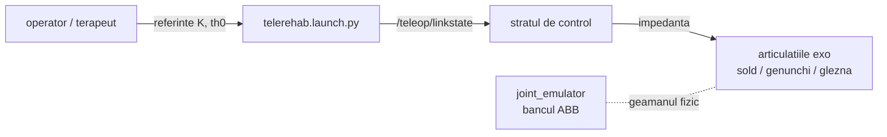

# rehab_exo_description — Documentatie tehnica

Descrierea ROS 2 a exoscheletului de reabilitare: modelul URDF, fisierele de
lansare si lantul de tele-reabilitare. Pachet ament (construit de colcon).
Versiunea curenta: eticheta `rehab-v0.3.0`.

## 1. Pozitia in arhitectura



Relatia cu `joint_emulator`: cele trei articulatii ale exoscheletului corespund
celor trei perechi de pe banc (sold / genunchi / glezna, un picior). Pe fierul real,
fizica si bucla rapida traiesc in `joint_emulator` (Raspberry Pi langa drive-uri);
`rehab_exo_description` ramane stratul de descriere si lansare de pe masina de
comanda. Conventia de degradare a legaturii este comuna intregului depozit:
`/teleop/linkstate` cu schema `{ms, jit, loss, down}`.

## 2. Continut

| Element | Rol |
|---------|-----|
| `urdf/` | modelul exoscheletului (articulatii motorizate) |
| `launch/telerehab.launch.py` | lantul complet de tele-reabilitare |
| `package.xml`, `CMakeLists.txt` / `setup.py` | pachet ament, construit de colcon |
| testul 6a (failsafe) | IN LUCRU — vezi sectiunea 5 |

Inventarul exact al fisierelor evolueaza; pentru lista curenta:
`find ~/ros2_ws/src/rehab_exo_description -type f | sort`.

## 3. Compilare

```bash
cd ~/ros2_ws
source /opt/ros/jazzy/setup.bash
colcon build --packages-select rehab_exo_description --symlink-install
source install/setup.bash
```

## 4. Sintaxe de pornire

```bash
# lantul de tele-reabilitare
ros2 launch rehab_exo_description telerehab.launch.py

# degradarea legaturii in timpul sedintei (conventia comuna a depozitului)
ros2 topic pub --once /teleop/linkstate std_msgs/String \
  "data: '{\"ms\":60,\"jit\":10,\"loss\":0.05,\"down\":false}'"

# inspectia modelului
check_urdf $(ros2 pkg prefix rehab_exo_description)/share/rehab_exo_description/urdf/*.urdf
```

## 5. Stare si pasi urmatori

1. Testul 6a (failsafe-ul exoscheletului) — de finalizat: scenariul in care
   legatura cade (`down:=true`) trebuie sa duca articulatiile in regim sigur
   (cuplu zero sau pozitie de repaus), analog cu `SafetyGate` din `joint_emulator`.
2. Dupa identificarea drive-urilor ABB (vezi `joint_emulator/modbus_backend.py`),
   exoscheletul primeste backend-ul real prin aceeasi interfata `drive_iface`.
3. Rezultatul tinta (contributia C4 / articolul de tele-reabilitare A4):
   impedanta adaptiva la calitatea legaturii, demonstrata pe banc si transferata
   pe articulatiile exoscheletului.
