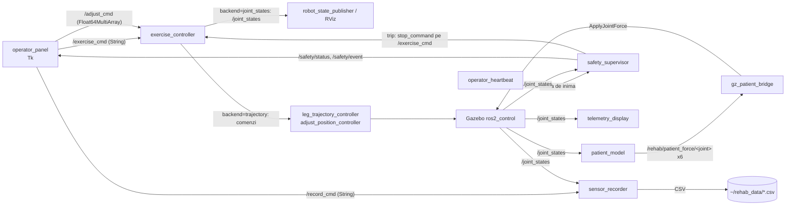

# rehab_exo_description — Documentatie tehnica

Exoscheletul de reabilitare pentru membrele inferioare: 6 servomotoare
(2 sold + 2 genunchi + 2 glezna) + 5 axe prismatice de ajustare. Pachet ament
complet: URDF/xacro, 10 fisiere de lansare, controler de exercitii cu repertoriu
clinic de demonstratie, supervizor de siguranta, model de pacient, panou de
operator, inregistrare de senzori si raportare PDF. Versiunea: `rehab-v0.3.0`.

NOTA MEDICALA: valorile exercitiilor sunt de DEMONSTRATIE, nu prescriptii clinice.

## 1. Graful de noduri si topicuri



## 2. Fisierele de lansare (ce porneste fiecare + sintaxa)

| Launch | Ce porneste | Sintaxa |
|---|---|---|
| `display.launch.py` | rsp + joint_state_publisher_gui + RViz — inspectia URDF cu slidere | `ros2 launch rehab_exo_description display.launch.py` |
| `demo.launch.py` | rsp + RViz + exercise_controller in asteptare — comanzi tu pe `/exercise_cmd` | `ros2 launch rehab_exo_description demo.launch.py` |
| `demo_all.launch.py` | lantul demo + ruleaza automat exercitiul ales | `ros2 launch rehab_exo_description demo_all.launch.py exercise:=knee_extension reps:=3` |
| `exercitii_sold.launch.py` | demo_all cu `exercise:=hip_session` (~49 s) | `ros2 launch rehab_exo_description exercitii_sold.launch.py reps:=1` |
| `exercitii_genunchi.launch.py` | demo_all cu `exercise:=knee_session` (~55 s) | `ros2 launch rehab_exo_description exercitii_genunchi.launch.py reps:=1` |
| `exercitii_glezna.launch.py` | demo_all cu `exercise:=ankle_session` (~57 s) | `ros2 launch rehab_exo_description exercitii_glezna.launch.py reps:=1` |
| `exercitii_combinat.launch.py` | demo_all cu `exercise:=combined_session` (~61 s) | `ros2 launch rehab_exo_description exercitii_combinat.launch.py reps:=1` |
| `gazebo.launch.py` | gz sim + rsp (xacro) + punte /clock + spawn model + lantul de controllere: joint_state_broadcaster -> leg_trajectory_controller -> adjust_position_controller -> exercise_controller (backend=trajectory) + sensor_recorder; use_sim_time | `ros2 launch rehab_exo_description gazebo.launch.py` |
| `operator.launch.py` | statia operatorului FARA fizica: rsp + RViz + exercise_controller (backend=joint_states) + sensor_recorder + operator_panel | `ros2 launch rehab_exo_description operator.launch.py` |
| `telerehab.launch.py` | lantul complet de TELE-reabilitare peste Gazebo: + safety_supervisor (watchdog heartbeat) + optional patient_model + puntea de forte | `ros2 launch rehab_exo_description telerehab.launch.py telerehab:=true with_patient:=true` |

Argumentele `telerehab.launch.py`:

| Argument | Implicit | Semnificatie |
|---|---|---|
| `telerehab` | false | activeaza watchdog-ul pe bataia de inima a operatorului (timeout 0.6 s) |
| `with_patient` | false | porneste patient_model + gz_patient_bridge (fortele pacientului in Gazebo) |
| `profile` | `config/patient_demo.yaml` | profilul pacientului (rigiditate, repaus, tremor) |
| `limits` | `config/safety_limits.yaml` | pragurile supervizorului (effort_max, velocity_max) |
| `stop_command` | `neutral` | comanda publicata pe `/exercise_cmd` la declansare |

## 3. Repertoriul de exercitii (exercise_core.py)

12 exercitii atomice + 4 sesiuni; orice nume merge in `exercise:=` sau pe `/exercise_cmd`:

| Grupa | Exercitii (reps implicite) |
|---|---|
| glezna | `ankle_pump` (3), `ankle_alternating` (3), `ankle_holds` (2) |
| genunchi | `knee_extension` (3), `knee_alternating` (2), `knee_pulses` (2) |
| sold | `hip_raise` (3), `hip_alternating` (2), `hip_hold` (2) |
| combinat | `alternating_march` (3), `full_extension` (2), `leg_wave` (2) |
| SESIUNI | `ankle_session`, `knee_session`, `hip_session`, `combined_session` |
| STOP | `neutral` — revenire lina (2 s) la postura sezut, din pozitia curenta |

Conventia de semn (identica cu URDF): `hip +` ridica coapsa [-0.45..+0.70 rad];
`knee +` extensie [0..+1.75]; `ankle +` dorsiflexie [-0.60..+0.60]. `VEL_MAX = 2.0 rad/s`
— programul REFUZA la constructie segmentele care ar cere viteza de varf mai mare.
Traiectoria: interpolare cosinus (viteza zero la capete). Siguranta gleznei:
exercitiile de glezna ridica intai gambele (knee 0.30 rad) ca varful piciorului
sa nu coboare sub podea (verificat prin FK pe varf/calcai).

## 4. Scripturile (noduri + instrumente)

| Script | Rol | Interfata |
|---|---|---|
| `exercise_controller.py` | redă programele de exercitii | params: `exercise`, `reps`, `backend:=joint_states\|trajectory`, `rate_hz`, `loop`; sub `/exercise_cmd` (nume sau JSON `{"exercise":..,"reps":..}`), `/adjust_cmd` (Float64MultiArray, 5 axe [m]: seat_lift, left_thigh_ext, right_thigh_ext, left_shank_ext, right_shank_ext; rampa 0.03 m/s; regula shank_ext <= lift+0.03); porneste din pozitia CURENTA |
| `safety_supervisor.py` | supravegherea sigurantei | pub `/safety/status` (OK\|TRIPPED), `/safety/event`; sub `/safety/reset` (Empty); trip pe `effort_max`/`velocity_max` din `safety_limits.yaml` sau pe pierderea heartbeat-ului (0.6 s) -> publica `stop_command` pe `/exercise_cmd` |
| `patient_model.py` | pacientul virtual | params `profile_file`, `rate` (100), `scale`; sub `/joint_states`, `/patient_model/scale`; pub `/rehab/patient_force/<joint>` x6 (Float64); tau = -k(q-q_rest) - b*qd + tremor 4-6 Hz, plafonat la 15 N*m |
| `operator_panel.py` | panoul Tk al operatorului | pub `/exercise_cmd`, `/adjust_cmd`, `/record_cmd` |
| `operator_heartbeat.py` | bataia de inima + jurnalul legaturii | param `label` (ex. `zenoh_loss15`); scrie `~/rehab_data/network_health_<label>.csv` |
| `sensor_recorder.py` | inregistrarea senzorilor | sub `/joint_states`, `/record_cmd` ("start [nume]" / "stop"); CSV `~/rehab_data/<nume>.csv` cu `t_sec` + `<joint>_pos/_vel/_eff` pentru toate cele 11 articulatii |
| `telemetry_display.py` | afisaj live Tk: pozitie/viteza/torque (ultimele ~12 s) | citeste `/joint_states`; necesita `python3-tk` |
| `plot_recording.py` | CSV -> figura PNG (3 panouri) + statistici, fara ROS | `python3 scripts/plot_recording.py ~/rehab_data/sesiune_X.csv` |
| `session_report.py` | CSV -> raport PDF | iesire in `~/rehab_data/rapoarte/`; `--inspect` pentru sumar in consola |
| `netem_profiles.sh` | degradarea legaturii (tc netem) | `sudo scripts/netem_profiles.sh loss15\|loss30\|sar\|wifi_slab\|clear` |
| `patch_urdf_extensions.py` | adauga plugin-urile ApplyJointForce + IMU in URDF | dupa rulare: `colcon build --packages-select rehab_exo_description` |

## 5. Comenzi utile pe topicuri

```bash
# porneste un exercitiu / o sesiune din terminal
ros2 topic pub --once /exercise_cmd std_msgs/String "data: 'knee_extension'"
ros2 topic pub --once /exercise_cmd std_msgs/String "data: '{\"exercise\":\"hip_session\",\"reps\":2}'"

# STOP lin (revenire la sezut)
ros2 topic pub --once /exercise_cmd std_msgs/String "data: 'neutral'"

# ajustarea cadrului: [seat_lift, l_thigh, r_thigh, l_shank, r_shank] in metri
ros2 topic pub --once /adjust_cmd std_msgs/Float64MultiArray "data: [0.05, 0.02, 0.02, 0.0, 0.0]"

# inregistrare senzori
ros2 topic pub --once /record_cmd std_msgs/String "data: 'start sedinta_test'"
ros2 topic pub --once /record_cmd std_msgs/String "data: 'stop'"

# rearmarea supervizorului dupa un trip
ros2 topic pub --once /safety/reset std_msgs/Empty "{}"

# scalarea fortelor pacientului in mers
ros2 topic pub --once /patient_model/scale std_msgs/Float64 "data: 1.5"
```

## 6. Fluxul de tele-reabilitare (doua statii, comparatia RMW)

```bash
# STATIA ROBOT (lant complet + supraveghere + pacient)
ros2 launch rehab_exo_description telerehab.launch.py telerehab:=true with_patient:=true

# STATIA OPERATOR
python3 scripts/operator_heartbeat.py --ros-args -p label:=cyclone_ideal
python3 scripts/operator_panel.py          # + optional telemetry_display.py

# degradarea legaturii in timpul sedintei
sudo scripts/netem_profiles.sh loss15      # apoi: clear

# comparatia middleware: pe AMBELE statii, inainte de pornire
export RMW_IMPLEMENTATION=rmw_zenoh_cpp    # + ros2 run rmw_zenoh_cpp rmw_zenohd
# sau: export RMW_IMPLEMENTATION=rmw_cyclonedds_cpp
```

Watchdog-ul: la disparitia bataii de inima > 0.6 s, supervizorul publica
`stop_command` (implicit `neutral`) — exoscheletul revine lin la repaus.

## 7. Compilare si verificare

```bash
cd ~/ros2_ws && source /opt/ros/jazzy/setup.bash
colcon build --packages-select rehab_exo_description --symlink-install
source install/setup.bash
python3 -m py_compile ~/ros2_ws/src/rehab_exo_description/scripts/*.py   # nivelul 0
```

## 8. Legatura cu joint_emulator

Cele 3 perechi ale bancului ABB = sold / genunchi / glezna (un picior). Pe fier,
fizica si bucla rapida traiesc in `joint_emulator` (Raspberry Pi langa drive-uri,
interfata `drive_iface`/Modbus); acest pachet ramane stratul de descriere,
exercitii si lansare. Testul 6a (failsafe pe `down:=true`) — in lucru.
