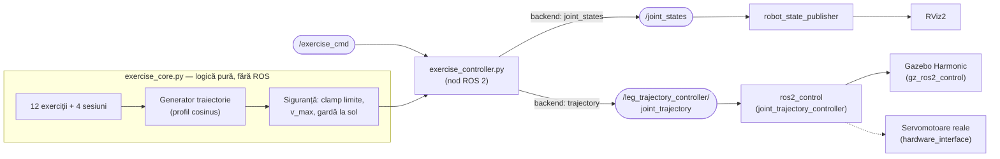

# Sistem robotic de recuperare locomotorie — ROS 2 Jazzy

**Scaun medical de reabilitare cu 6 servomotoare (2 șold · 2 genunchi · 2 gleznă), pacient integrat în model, control prin traiectorii sigure și backend interschimbabil: RViz → Gazebo → servomotoare reale.**

-blue)  

Modelul reproduce structura unui dispozitiv de reabilitare șezândă (bază · șezut · spătar · baze picioare mecanice · picioare mecanice acționate), cu un model uman integrat ale cărui membre inferioare sunt **antrenate de mecanism** — exact funcția dispozitivului real. Toate componentele software au fost verificate automat înainte de livrare (limite, continuitate, viteze, cinematică directă anti-coliziune).

---

## Cuprins

1. [Demo rapid](#demo-rapid)
2. [Arhitectura sistemului](#arhitectura-sistemului)
3. [Structura workspace-ului](#structura-workspace-ului)
4. [Fișierele proiectului, unul câte unul](#fișierele-proiectului-unul-câte-unul)
5. [Cum este construit modelul (URDF)](#cum-este-construit-modelul-urdf)
6. [Procesul de control al celor 6 servomotoare](#procesul-de-control-al-celor-6-servomotoare)
7. [Exerciții și sesiuni](#exerciții-și-sesiuni)
8. [Instalare](#instalare)
9. [Utilizare](#utilizare)
10. [Simularea fizică în Gazebo](#simularea-fizică-în-gazebo)
11. [Verificările efectuate](#verificările-efectuate)
12. [Direcții viitoare](#direcții-viitoare)

---

## Demo rapid

```bash
# vizualizare + sesiune completă de exerciții, dintr-o singură comandă:
ros2 launch rehab_exo_description exercitii_combinat.launch.py

# comutare live a exercițiului, din alt terminal:
ros2 topic pub --once /exercise_cmd std_msgs/msg/String "data: ankle_session"
```

## Arhitectura sistemului

Controlul este organizat pe straturi; **executantul este interschimbabil** — aceeași comandă merge în RViz (vizualizare), în Gazebo cu `ros2_control` (fizică) sau pe servomotoarele reale:



Conexiunile dintre aplicații:

| De la | Către | Canal | Conținut |
|---|---|---|---|
| utilizator | `exercise_controller` | parametri ROS / topic `/exercise_cmd` | numele exercițiului/sesiunii + repetări |
| `exercise_controller` | `robot_state_publisher` | topic `/joint_states` (50 Hz) | pozițiile celor 6 articulații |
| `robot_state_publisher` | RViz2 | TF | transformările tuturor link-urilor |
| `exercise_controller` | `ros2_control` | topic `.../joint_trajectory` | traiectoria completă eșantionată la 10 Hz |
| Gazebo | ROS | `/clock` (pod `ros_gz_bridge`) | timpul simulării |
| URDF `<ros2_control>` | `gz_ros2_control` | plugin | interfețele de comandă/stare ale articulațiilor |

## Structura workspace-ului

```text
ros2_ws/
├── src/
│   └── rehab_exo_description/        ← acest depozit
│       ├── CMakeLists.txt            instalare resurse + scripturi executabile
│       ├── package.xml               manifest (ament_cmake, Apache-2.0)
│       ├── README.md                 acest fișier
│       ├── .gitignore                exclude build/, install/, log/, __pycache__/
│       ├── urdf/
│       │   ├── rehab_exo.urdf        modelul v2 (scaun + pacient + picioare mecanice)
│       │   └── rehab_exo.xacro       [ÎNVECHIT — varianta v1; păstrat doar ca referință]
│       ├── config/
│       │   └── controllers.yaml      ros2_control: broadcaster + trajectory controller
│       ├── launch/
│       │   ├── display.launch.py     RViz + glisiere manuale (explorare model)
│       │   ├── demo.launch.py        RViz fără glisiere (control extern)
│       │   ├── demo_all.launch.py    RViz + controler, totul dintr-o comandă
│       │   ├── exercitii_glezna.launch.py     sesiunea de gleznă (57 s)
│       │   ├── exercitii_genunchi.launch.py   sesiunea de genunchi (55 s)
│       │   ├── exercitii_sold.launch.py       sesiunea de șold (49 s)
│       │   ├── exercitii_combinat.launch.py   sesiunea combinată (61 s)
│       │   └── gazebo.launch.py      simulare fizică: Gazebo + ros2_control
│       ├── rviz/
│       │   └── rehab.rviz            configurația RViz (Fixed Frame: world)
│       └── scripts/
│           ├── exercise_core.py      nucleul: exerciții, traiectorii, siguranță
│           └── exercise_controller.py nodul ROS 2 (cele două backend-uri)
├── build/  install/  log/             generate de colcon (NU se versionează)
```

## Fișierele proiectului, unul câte unul

| Fișier | Rol | Detalii-cheie |
|---|---|---|
| `urdf/rehab_exo.urdf` | Modelul complet al sistemului | 11 link-uri, 10 articulații (6 revolute + 4 fixe); generat parametric; conține blocul `<ros2_control>` și pluginul `gz_ros2_control` pentru Gazebo |
| `urdf/rehab_exo.xacro` | **Învechit** (v1: doar picioarele) | Păstrat ca referință istorică; nimic nu îl mai folosește — poate fi șters |
| `config/controllers.yaml` | Configurarea `ros2_control` | `joint_state_broadcaster` + `leg_trajectory_controller` (toate 6 articulațiile, interfață `position`, constrângeri de urmărire pentru siguranță medicală) |
| `scripts/exercise_core.py` | Nucleul de control (Python pur, fără ROS — testabil integral) | 12 exerciții atomice + 4 sesiuni; interpolare cosinus (viteză zero la capete); clamp la limite; validarea vitezei de vârf < 2 rad/s la construcție |
| `scripts/exercise_controller.py` | Nodul ROS 2 | Parametri: `exercise`, `reps`, `backend`, `rate_hz`, `loop`; backend `joint_states` (RViz, 50 Hz) sau `trajectory` (ros2_control); comutare live pe `/exercise_cmd` (nume simplu sau JSON) |
| `launch/display.launch.py` | Explorare manuală | `robot_state_publisher` + `joint_state_publisher_gui` (glisiere) + RViz. **A nu se rula simultan cu controlerul** — două surse pe `/joint_states` |
| `launch/demo.launch.py` | Vizualizare pentru control extern | Ca `display`, dar fără glisiere |
| `launch/demo_all.launch.py` | Demonstrație all-in-one | RViz + controler împreună; argumente: `exercise:=`, `reps:=` |
| `launch/exercitii_*.launch.py` | Cele 4 sesiuni pe grupe | Includ `demo_all` cu sesiunea fixată; argument `reps:=` repetă întreaga sesiune |
| `launch/gazebo.launch.py` | Simulare fizică | Gazebo (lume goală) + `robot_state_publisher` (use_sim_time) + pod `/clock` + spawn din `/robot_description` + pornirea în lanț a controllerelor |
| `rviz/rehab.rviz` | Config RViz | Fixed Frame `world`, RobotModel pe `/robot_description`, TF |
| `CMakeLists.txt` | Build | Instalează `urdf/ config/ launch/ rviz/` în `share/` și scripturile ca executabile în `lib/` (→ `ros2 run`) |
| `package.xml` | Manifest | `ament_cmake`, dependințe de rulare, licență Apache-2.0 |

## Cum este construit modelul (URDF)

Modelul v2 reproduce structura dispozitivului de referință (Fig. 2.2 din documentul-sursă), cu maparea:

| Reper document | Componenta din model |
|---|---|
| 001 — baza șezutului | `base_link` (placă la podea + coloană de susținere) |
| 002 — șezutul | `seat_link` (pernă + cotiere + suporți) |
| 003 — baza piciorului mecanic | blocurile laterale de pe `seat_link`, sub actuatoarele de șold |
| 007 — piciorul mecanic | lanțul `thigh → shank → foot` (șine + actuatoare vizibile) |
| spătar + tetieră | `backrest_link`, înclinat 12° |
| pacientul | `human_torso` (trunchi, cap, brațe pe cotiere) — fix pe șezut |

**Decizii de proiectare esențiale:**

- **Postura zero = ȘEZUT** (nu ortostatism): coapsele orizontale înainte, gambele verticale, șoldul la înălțimea șezutului (0.52 m). Verificat prin cinematică directă.
- **Membrele pacientului sunt atașate de segmentele mecanice** (vizualuri pe aceleași link-uri): când mecanismul se mișcă, picioarele pacientului se mișcă împreună cu el — funcția dispozitivului, vizibilă direct în simulare.
- **Geometrie parametrică**: întregul URDF este generat dintr-un script Python cu dimensiuni antropometrice (coapsă/gambă 0.40 m, masă totală 92.4 kg), inerții calculate analitic pentru fiecare formă (cutie/cilindru/sferă) — nu valori inventate.
- **Convenția de semn** (axe `0 -1 0`, aleasă ca pozitivul să fie intuitiv pe glisiere):

| Articulație | + înseamnă | Interval [rad] |
|---|---|---|
| `*_hip_joint` | ridică coapsa | −0.45 … +0.70 |
| `*_knee_joint` | extensie (gamba în față) | 0.00 … +1.75 |
| `*_ankle_joint` | dorsiflexie (vârful sus) | −0.60 … +0.60 |

- Lanțul cinematic per picior: `seat_link → [hip] → thigh → [knee] → shank → [ankle] → foot`, cu numele articulațiilor `{left|right}_{hip|knee|ankle}_joint` — folosite identic în URDF, `controllers.yaml` și `exercise_core.py`.

## Procesul de control al celor 6 servomotoare

| Strat | Responsabilitate | Unde |
|---|---|---|
| 1. Program | CE se mișcă: segmente (durată, ținte) | `exercise_core.py` |
| 2. Traiectorie | CUM: interpolare cosinus — viteză **zero** la capete, vârf = Δ·π/(2T) | `Player.sample(t)` |
| 3. Siguranță | clamp la limite; validare v_vârf < 2 rad/s la construcție; gardă la sol | `Program.__init__`, teste FK |
| 4. Executant | UNDE: `/joint_states` (RViz) sau `JointTrajectory` (ros2_control) | `exercise_controller.py` |

Pentru un dispozitiv care mișcă membrele unui pacient, pornirea și oprirea fără smucitură nu sunt estetică, ci **cerință de siguranță** — de aici profilul cosinus.

**Garda la sol (vârf/călcâi):** exercițiile de gleznă ridică întâi ușor gambele (genunchi +0.30 rad) înainte de plantarflexie. Testul de cinematică directă pe punctele vârf/călcâi ale plăcii de picior a demonstrat necesitatea: fără această ridicare, plantarflexia ar fi coborât vârful pantofului 2.4 cm sub nivelul podelei; cu ea, rămâne la minimum +3.4 cm.

> **Notă medicală:** amplitudinile/vitezele sunt valori de **demonstrație**, nu prescripții clinice. Pe hardware real: intervale stabilite per pacient de personal medical, limitare de cuplu și oprire de urgență **independente de software**.

## Exerciții și sesiuni

**12 exerciții atomice** (toate încep și se termină în postura neutră):

| Grupă | Exerciții | Mișcarea |
|---|---|---|
| Gleznă | `ankle_pump`, `ankle_alternating`, `ankle_holds` | pompări, alternat stânga/dreapta, mențineri dorsi/plantar (toate cu ridicarea de siguranță a gambelor) |
| Genunchi | `knee_extension`, `knee_alternating`, `knee_pulses` | extensii bilaterale, alternate, pulsuri scurte la capăt de cursă |
| Șold | `hip_raise`, `hip_alternating`, `hip_hold` | ridicări bilaterale, alternate, menținere izometrică 4 s |
| Combinate | `alternating_march`, `full_extension`, `leg_wave` | marș șezut, extensie completă, val coordonat șold→genunchi→gleznă |

**4 sesiuni** (înlănțuiri continue — cusătura dintre exerciții e la postura neutră):

| Sesiune | Conținut | Durată | Launch |
|---|---|---|---|
| `ankle_session` | pump ×3 + alternating ×3 + holds ×2 | 57 s | `exercitii_glezna.launch.py` |
| `knee_session` | extension ×2 + alternating ×2 + pulses ×2 | 55 s | `exercitii_genunchi.launch.py` |
| `hip_session` | raise ×2 + alternating ×2 + hold ×2 | 49 s | `exercitii_sold.launch.py` |
| `combined_session` | leg_wave ×2 + march ×3 + full_extension ×2 | 61 s | `exercitii_combinat.launch.py` |

## Instalare

Cerințe: **Ubuntu 24.04** + **ROS 2 Jazzy** ([ghid oficial](https://docs.ros.org/en/jazzy/Installation.html)).

```bash
# dependințe pentru vizualizare:
sudo apt install -y ros-jazzy-joint-state-publisher-gui ros-jazzy-rviz2 ros-jazzy-xacro

# dependințe pentru simularea fizică (Gazebo):
sudo apt install -y ros-jazzy-ros-gz ros-jazzy-gz-ros2-control \
                    ros-jazzy-ros2-control ros-jazzy-ros2-controllers

# clonare + build:
mkdir -p ~/ros2_ws/src && cd ~/ros2_ws/src
git clone <URL-ul-acestui-depozit> rehab_exo_description
cd ~/ros2_ws
colcon build --packages-select rehab_exo_description
source install/setup.bash
```

## Utilizare

| Comandă | Ce face |
|---|---|
| `ros2 launch rehab_exo_description display.launch.py` | model + glisiere manuale (explorare) |
| `ros2 launch rehab_exo_description demo_all.launch.py exercise:=full_extension reps:=3` | RViz + controler, exercițiu la alegere |
| `ros2 launch rehab_exo_description exercitii_glezna.launch.py` | sesiunea de gleznă (analog: `_genunchi`, `_sold`, `_combinat`; `reps:=2` repetă sesiunea) |
| `ros2 run rehab_exo_description exercise_controller.py --ros-args -p exercise:=hip_raise` | doar controlerul (RViz pornit separat cu `demo.launch.py`) |

Comutare live (orice exercițiu sau sesiune), fără restart:

```bash
ros2 topic pub --once /exercise_cmd std_msgs/msg/String "data: knee_session"
ros2 topic pub --once /exercise_cmd std_msgs/msg/String \
  'data: "{\"exercise\": \"leg_wave\", \"reps\": 2}"'
```

⚠️ Nu rulați `display.launch.py` (glisierele) simultan cu controlerul — ambele publică pe `/joint_states`.

## Simularea fizică în Gazebo

Transpunerea folosește **același lanț de control**, schimbând doar executantul: `gz_ros2_control` citește blocul `<ros2_control>` din URDF și expune cele 6 articulații către `leg_trajectory_controller`.

```bash
# Terminal 1 — Gazebo + robot + controllere (pornite în lanț):
ros2 launch rehab_exo_description gazebo.launch.py

# Verificare (Terminal 2):
ros2 control list_controllers       # ambele "active"
ros2 topic echo /joint_states --once

# Exercițiu executat CU FIZICĂ (același controler, alt backend):
ros2 run rehab_exo_description exercise_controller.py \
  --ros-args -p backend:=trajectory -p exercise:=knee_extension -p reps:=2
```

Ce face `gazebo.launch.py`: pornește `gz sim` (lume goală), publică `robot_description` (URDF procesat prin xacro, cu `use_sim_time`), face podul `/clock` Gazebo→ROS, creează robotul în simulare din topic și pornește în lanț `joint_state_broadcaster` → `leg_trajectory_controller`. Robotul este fixat de lume prin articulația `world → base_link` (scaunul nu se răstoarnă).

> **Stare:** lanțul Gazebo este construit conform tiparului oficial Jazzy și verificat sintactic; spre deosebire de nucleul de control (testat integral), **prima rulare end-to-end se face pe o mașină cu Gazebo instalat** — mediul de dezvoltare al acestui depozit nu include simulatorul. Depanare tipică: dacă `list_controllers` e gol, verificați instalarea `ros-jazzy-gz-ros2-control` și calea din pluginul URDF (`$(find rehab_exo_description)/config/controllers.yaml` — rezolvată de xacro la lansare).

## Verificările efectuate

Nucleul fiind Python pur, a fost testat integral înainte de livrare, pe **toate cele 12 exerciții + 4 sesiuni**:

- limite articulare respectate la fiecare eșantion (100 Hz, toată durata);
- continuitate: viteza discretă < 2.0 rad/s în orice moment (măsurat: 0.39–1.10 rad/s);
- start și sfârșit exact în postura neutră;
- **FK pe URDF**: glezna ≥ 0.12 m și punctele vârf/călcâi ale plăcii de picior > 0 m pe toată durata fiecărui program (ambele picioare);
- URDF: arbore conex (11 link / 10 joint), inerții pozitive cu inegalitățile triunghiulare satisfăcute, masă totală 92.4 kg;
- toate fișierele Python/launch compilate; XML/YAML validate.

## Direcții viitoare

- **Mesh-uri realiste**: export STL din Fusion360, montate pe aceleași cadre (geometria primitivă actuală e precisă structural/cinematic, nu estetic).
- **Hardware real**: înlocuirea pluginului `GazeboSimSystem` cu un `hardware_interface` pentru driverele servomotoarelor (serial/CAN/EtherCAT) — programele și controlerul rămân neschimbate.
- **Teleoperare la distanță**: controlul exercițiilor peste rețea cu middleware interschimbabil (CycloneDDS / **Zenoh**) sub degradare de rețea — direcția de cercetare doctorală din care face parte acest proiect (tele-reabilitare).

## Licență

Apache-2.0 (vezi `package.xml`).
