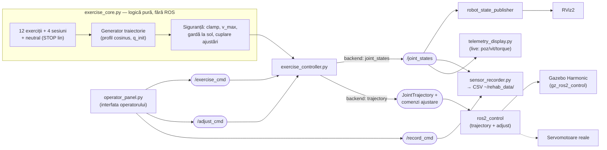

# Sistem robotic de recuperare locomotorie — ROS 2 Jazzy

**Scaun medical de reabilitare cu 6 servomotoare (2 șold · 2 genunchi · 2 gleznă), pacient integrat, axe de ajustare la pacient (scaun ridicabil + segmente telescopice), senzori (encodere absolute, senzor de unghi, torque), interfață de operator, înregistrare de date și telemetrie live. Control prin traiectorii sigure cu backend interschimbabil: RViz → Gazebo → servomotoare reale.**

-blue)   

**Stare: simularea fizică în Gazebo execută exercițiile complet** — cu panou de operator, înregistrare de senzori (CSV) și afișaj de telemetrie. Toate componentele de logică au fost verificate automat înainte de livrare (limite, continuitate, viteze, cinematică directă anti-coliziune), iar lanțul complet a fost confirmat funcțional pe mașina de lucru.

---

## Cuprins

1. [Demo rapid](#demo-rapid)
2. [Arhitectura sistemului](#arhitectura-sistemului)
3. [Structura pachetului](#structura-pachetului)
4. [Fișierele proiectului, unul câte unul](#fișierele-proiectului-unul-câte-unul)
5. [Cum este construit modelul (URDF v3)](#cum-este-construit-modelul-urdf-v3)
6. [Procesul de control al celor 6 servomotoare](#procesul-de-control-al-celor-6-servomotoare)
7. [Exerciții și sesiuni](#exerciții-și-sesiuni)
8. [Interfața de operator, înregistrarea și telemetria](#interfața-de-operator-înregistrarea-și-telemetria)
9. [Instalare](#instalare)
10. [Utilizare](#utilizare)
11. [Simularea fizică în Gazebo](#simularea-fizică-în-gazebo)
12. [Verificările efectuate](#verificările-efectuate)
13. [Lecții învățate (jurnal de dezvoltare)](#lecții-învățate-jurnal-de-dezvoltare)
14. [Direcții viitoare](#direcții-viitoare)

---

## Demo rapid

```bash
# Stația de operator pe RViz (robot + panou + înregistrare, o comandă):
ros2 launch rehab_exo_description operator.launch.py

# Simulare fizică completă (3 terminale):
ros2 launch rehab_exo_description gazebo.launch.py        # T1: Gazebo + controllere
ros2 run rehab_exo_description operator_panel.py          # T2: panoul operatorului
ros2 run rehab_exo_description telemetry_display.py       # T3: telemetrie live
```

## Arhitectura sistemului

Controlul este organizat pe straturi; **executantul este interschimbabil** — aceeași comandă merge în RViz (vizualizare), în Gazebo cu `ros2_control` (fizică) sau pe servomotoarele reale:



Conexiunile dintre aplicații:

| De la | Către | Canal | Conținut |
|---|---|---|---|
| panoul de operator | `exercise_controller` | `/exercise_cmd` (String) | exercițiul/sesiunea + repetări (sau `neutral` = STOP) |
| panoul de operator | `exercise_controller` | `/adjust_cmd` (Float64MultiArray) | țintele celor 5 axe de ajustare [seat, coapsă stg/dr, gambă stg/dr] |
| panoul de operator | `sensor_recorder` | `/record_cmd` (String) | `start [nume]` / `stop` |
| `exercise_controller` | RViz (prin `robot_state_publisher`) | `/joint_states` (50 Hz) | pozițiile + vitezele celor 11 articulații |
| `exercise_controller` | `ros2_control` | `.../joint_trajectory` + `.../commands` | traiectoria exercițiului + comenzile de ajustare (cu rampă) |
| Gazebo (`joint_state_broadcaster`) | recorder + telemetrie | `/joint_states` | poziție / viteză / **torque** (effort) pentru toate articulațiile |
| Gazebo | ROS | `/clock` (pod `ros_gz_bridge`) | timpul simulării |

## Structura pachetului

```text
rehab_exo_description/
├── CMakeLists.txt                instalare resurse + scripturi executabile (ros2 run)
├── package.xml                   manifest (ament_cmake, Apache-2.0)
├── README.md                     acest fișier
├── urdf/
│   ├── rehab_exo.urdf            modelul v3: 15 link / 14 joint, instrumentat
│   └── rehab_exo.xacro           [ÎNVECHIT — v1; doar referință istorică]
├── config/
│   └── controllers.yaml          ros2_control: broadcaster + trajectory + adjust
├── launch/
│   ├── display.launch.py         RViz + glisiere manuale (explorare model)
│   ├── demo.launch.py            RViz fără glisiere (control extern)
│   ├── demo_all.launch.py        RViz + controler dintr-o comandă
│   ├── exercitii_glezna.launch.py     sesiunea de gleznă (57 s)
│   ├── exercitii_genunchi.launch.py   sesiunea de genunchi (55 s)
│   ├── exercitii_sold.launch.py       sesiunea de șold (49 s)
│   ├── exercitii_combinat.launch.py   sesiunea combinată (61 s)
│   ├── operator.launch.py        stația de operator pe RViz (tot, o comandă)
│   └── gazebo.launch.py          simulare fizică: lanțul complet de controllere
├── rviz/
│   └── rehab.rviz                configurația RViz (Fixed Frame: world)
└── scripts/
    ├── exercise_core.py          nucleul: exerciții, sesiuni, traiectorii, siguranță
    ├── exercise_controller.py    nodul ROS 2 (backend RViz / ros2_control)
    ├── operator_panel.py         panoul grafic al operatorului (Tkinter)
    ├── sensor_recorder.py        înregistrarea senzorilor în CSV
    ├── telemetry_display.py      afișaj LIVE: poziție / viteză / torque
    └── plot_recording.py         figurile din înregistrări (fără ROS)
```

## Fișierele proiectului, unul câte unul

| Fișier | Rol | Detalii-cheie |
|---|---|---|
| `urdf/rehab_exo.urdf` | Modelul v3 complet | 15 link-uri, 14 articulații (6 revolute exercițiu + 5 prismatice ajustare + 3 fixe); `<ros2_control>` instrumentat: comandă poziție+viteză, stare poziție/viteză/effort, `position_proportional_gain=15.0`; generat parametric, verificat FK |
| `config/controllers.yaml` | Configurarea `ros2_control` | `joint_state_broadcaster` + `leg_trajectory_controller` (6 servo) + `adjust_position_controller` (5 axe); toleranțele de urmărire dezactivate intenționat (vezi Lecții) |
| `scripts/exercise_core.py` | Nucleul de control (Python pur — testabil integral) | 12 exerciții + 4 sesiuni + `neutral` (STOP lin); cosinus cu viteză zero la capete; `q_init` = pornire din poziția curentă; `clamp_adjust` cu regula `shank_ext ≤ lift+0.03` |
| `scripts/exercise_controller.py` | Nodul ROS 2 | backend `joint_states` (publică 11 articulații + viteze, 50 Hz) sau `trajectory` (JointTrajectory + comenzi ajustare cu rampă 0.03 m/s); comutare live pe `/exercise_cmd`; taie ajustările la valori sigure |
| `scripts/operator_panel.py` | Interfața operatorului (Tkinter) | 3 zone: exerciții (Start/STOP lin), glisiere de ajustare la pacient, Start/Stop înregistrare; vorbește doar pe topicuri → identic peste RViz și Gazebo |
| `scripts/sensor_recorder.py` | Înregistrarea datelor de la senzori | `/joint_states` → CSV în `~/rehab_data/`: t + poziție/viteză/**torque** ×11 articulații, antet cu semantica senzorilor; comenzi pe `/record_cmd` |
| `scripts/telemetry_display.py` | Telemetrie LIVE | 3 grafice derulante (12 s): poziție / viteză (cu limitele ±2 rad/s) / torque + cifrele momentului și pozițiile ajustărilor |
| `scripts/plot_recording.py` | Figurile din înregistrări | CSV → figură cu 3 panouri + statistici (maxime per articulație); fără ROS — ideal pentru figurile de teză/articol |
| `launch/operator.launch.py` | Stația de operator pe RViz | rsp + RViz + controler + recorder + panou, dintr-o singură comandă |
| `launch/gazebo.launch.py` | Simulare fizică | Gazebo + pod `/clock` + spawn + pornirea **în lanț**: broadcaster → trajectory → adjust → (controler `trajectory` + recorder) |
| `launch/display / demo / demo_all / exercitii_*` | Căile RViz | explorare cu glisiere / control extern / all-in-one / cele 4 sesiuni pe grupe |
| `urdf/rehab_exo.xacro` | **Învechit** (v1) | nimic nu îl mai folosește — poate fi șters |

## Cum este construit modelul (URDF v3)

Modelul reproduce dispozitivul de referință (Fig. 2.2 din documentul tehnic): **001** bază șezut (`base_link`), **002** șezut cu cotiere (`seat_link`), **003** bazele picioarelor mecanice, **007** picioarele mecanice acționate (`thigh → shank → foot`), spătar înclinat 12° cu tetieră, și **pacientul integrat** — trunchi/cap/brațe fixe pe scaun, iar coapsa/gamba/laba umană **atașate de segmentele mecanice**: când mecanismul se mișcă, membrele pacientului se mișcă împreună cu el.

**Decizii esențiale:** postura zero = **ȘEZUT** (șold z = 0.52 m, gleznă z = 0.12 m, verificat FK); geometrie parametrică generată din script (inerții analitice, masă totală 95.2 kg); convenția de semn (axe `0 -1 0`):

| Articulație | + înseamnă | Interval |
|---|---|---|
| `*_hip_joint` | ridică coapsa | −0.45 … +0.70 rad |
| `*_knee_joint` | extensie (gamba în față) | 0.00 … +1.75 rad |
| `*_ankle_joint` | dorsiflexie (vârful sus) | −0.60 … +0.60 rad |

**Noutățile v3 — axele de ajustare la pacient** (prismatice):

| Articulație | Interval | Rol |
|---|---|---|
| `seat_lift_joint` | 0 … 0.15 m | ridică/coboară scaunul față de bază — șezut + pacient + mecanism urcă **solidar** |
| `*_thigh_ext_joint` | 0 … 0.08 m | coapsa (hip link) **telescopică**: secțiunea distală culisează și poartă genunchiul |
| `*_shank_ext_joint` | 0 … 0.08 m | gamba (calf link) **telescopică**: secțiunea distală poartă glezna |

**Instrumentarea** (blocul `<ros2_control>`): encoder absolut la șold și genunchi + senzor de unghi la gleznă (`state position`), senzor de torque per motor (`state effort`), comandă **poziție și viteză** pe toate cele 6 servomotoare; axele de ajustare cu comandă de poziție și stare completă.

## Procesul de control al celor 6 servomotoare

| Strat | Responsabilitate |
|---|---|
| 1. Program | CE se mișcă: segmente (durată, ținte) — 12 exerciții, 4 sesiuni, `neutral` |
| 2. Traiectorie | CUM: interpolare cosinus — viteză **zero** la capete, vârf = Δ·π/(2T); pornire din **poziția curentă** (`q_init`) |
| 3. Siguranță | clamp la limite; v_vârf < 2 rad/s validat la construcție; gardă la sol; regula de cuplare a ajustărilor |
| 4. Executant | `/joint_states` (RViz) sau `JointTrajectory` + comenzi ajustare (ros2_control) |

Mecanisme de siguranță demonstrate prin teste:

- **Gardă la sol**: FK pe punctele vârf/călcâi ale plăcii de picior, pe toată durata fiecărui program. Testul a prins un defect real: vechiul `ankle_pump` ducea vârful pantofului 2.4 cm **sub** podea la plantarflexie; corecția (ridicarea prealabilă a gambelor, genunchi +0.30 rad) îl ține la minimum +3.4 cm.
- **Comutare live fără salt**: programele pornesc din poziția curentă — măsurat Δ = 0. `neutral` = STOP lin (revenire cosinus la șezut în 2 s).
- **Regula de cuplare**: extensia gambei coboară glezna, deci `shank_ext ≤ seat_lift + 0.03 m`; verificat FK pe 4 combinații permise × 16 programe (marjă minimă a vârfului: +5 mm). Controlerul taie automat comenzile nesigure.

> **Notă medicală:** valorile sunt de **demonstrație**, nu prescripții clinice. Pe hardware real: intervale per pacient stabilite de personal medical, limitare de cuplu și oprire de urgență **independente de software**.

## Exerciții și sesiuni

**12 exerciții atomice** (toate încep și se termină în postura neutră):

| Grupă | Exerciții |
|---|---|
| Gleznă | `ankle_pump`, `ankle_alternating`, `ankle_holds` — toate cu ridicarea de siguranță a gambelor |
| Genunchi | `knee_extension`, `knee_alternating`, `knee_pulses` (pulsuri la capăt de cursă) |
| Șold | `hip_raise`, `hip_alternating`, `hip_hold` (izometrie 4 s) |
| Combinate | `alternating_march`, `full_extension`, `leg_wave` (val coordonat șold→genunchi→gleznă) |

**4 sesiuni** (înlănțuiri continue, lansabile dintr-o comandă):

| Sesiune | Durată | Launch |
|---|---|---|
| `ankle_session` | 57 s | `exercitii_glezna.launch.py` |
| `knee_session` | 55 s | `exercitii_genunchi.launch.py` |
| `hip_session` | 49 s | `exercitii_sold.launch.py` |
| `combined_session` | 61 s | `exercitii_combinat.launch.py` |

## Interfața de operator, înregistrarea și telemetria

- **`operator_panel.py`** — fereastra operatorului, 3 zone: (1) exerciții/sesiuni + repetări, Start, **STOP** = revenire lină; (2) ajustarea la pacient: glisiere pentru scaun + cele 4 extensii, aplicate cu rampă lentă și tăiate la valorile sigure; (3) pornirea/oprirea înregistrării.
- **`sensor_recorder.py`** — scrie CSV în `~/rehab_data/`: timp + poziție/viteză/torque pentru toate cele 11 articulații; în Gazebo coloanele de torque conțin efortul **real** al actuatorilor (în RViz sunt 0 — fără fizică).
- **`telemetry_display.py`** — afișaj live cu 3 grafice derulante (poziție/viteză/torque, ultimele 12 s) + cifrele momentului (|v|max, |τ|max, pozițiile ajustărilor).
- **`plot_recording.py`** — `python3 plot_recording.py ~/rehab_data/sesiune_X.csv` → figură cu 3 panouri + tabel de maxime în consolă. Fără ROS — figurile de teză direct din datele de senzori.

## Instalare

Cerințe: **Ubuntu 24.04** + **ROS 2 Jazzy** ([ghid oficial](https://docs.ros.org/en/jazzy/Installation.html)).

```bash
# vizualizare + interfețe:
sudo apt install -y ros-jazzy-joint-state-publisher-gui ros-jazzy-rviz2 ros-jazzy-xacro python3-tk

# simulare fizică (Gazebo + ros2_control):
sudo apt install -y ros-jazzy-ros-gz ros-jazzy-gz-ros2-control \
                    ros-jazzy-ros2-control ros-jazzy-ros2-controllers

# clonare + build:
mkdir -p ~/ros2_ws && cd ~/ros2_ws
git clone https://github.com/alexandru-tech-web/ROS2.git src
colcon build && source install/setup.bash
```

## Utilizare

| Comandă | Ce face |
|---|---|
| `ros2 launch rehab_exo_description operator.launch.py` | **stația de operator pe RViz**: robot + panou + înregistrare, o comandă |
| `ros2 launch rehab_exo_description gazebo.launch.py` | simularea fizică completă (apoi panoul/telemetria în terminale separate) |
| `ros2 launch rehab_exo_description exercitii_glezna.launch.py` | sesiunea de gleznă (analog `_genunchi`, `_sold`, `_combinat`; `reps:=2` repetă) |
| `ros2 launch rehab_exo_description demo_all.launch.py exercise:=full_extension reps:=3` | RViz + un exercițiu la alegere |
| `ros2 run rehab_exo_description telemetry_display.py` | telemetria live (peste RViz sau Gazebo) |
| `python3 .../scripts/plot_recording.py ~/rehab_data/sesiune_X.csv` | figura + statisticile unei înregistrări |

Comutare live (orice exercițiu sau sesiune; `neutral` = STOP lin):

```bash
ros2 topic pub --once /exercise_cmd std_msgs/msg/String "data: knee_session"
```

⚠️ Nu rulați `display.launch.py` (glisierele) simultan cu controlerul — ambele publică pe `/joint_states`.

## Simularea fizică în Gazebo

`gazebo.launch.py` pornește: Gazebo (lume goală) → `robot_state_publisher` (URDF prin xacro, `use_sim_time`) → podul `/clock` → spawn-ul robotului → **în lanț**: `joint_state_broadcaster` → `leg_trajectory_controller` → `adjust_position_controller` → controlerul de exerciții (backend `trajectory`) + înregistratorul. Robotul e fixat de lume (scaunul nu se răstoarnă). **Stare: confirmat funcțional** — mișcările se execută complet, cu torque real în înregistrări.

Verificare rapidă: `ros2 control list_controllers` → toate 3 `active`.

## Verificările efectuate

- URDF v3: arbore conex (15/14), 6 revolute + 5 prismatice, inerții valide, masă 95.2 kg; FK la zero identic cu v2; efectul fiecărei axe de ajustare verificat numeric.
- Toate cele 12 exerciții + 4 sesiuni: limite la 100 Hz pe toată durata, continuitate, viteze 0.39–1.10 rad/s, start/sfârșit exact în neutru.
- Gardă la sol: vârf/călcâi > 0 pe toate programele, inclusiv pe 4 combinații permise de ajustări (marjă minimă +5 mm).
- Comutare live: Δ = 0; STOP lin verificat. `plot_recording.py` testat cap-coadă pe înregistrare sintetică în formatul recorder-ului.
- Lanțul Gazebo + interfețele grafice: confirmate funcțional pe mașina de lucru.

## Lecții învățate (jurnal de dezvoltare)

Problemele reale întâlnite în acest proiect și ce au învățat despre ROS 2 / Gazebo / proces — fiecare legată de locul din aplicație unde s-a manifestat:

| # | Lecția | Cum s-a manifestat aici |
|---|---|---|
| 1 | **Toleranțele de urmărire JTC nu sunt un mecanism de siguranță în simulare.** `trajectory: 0.05` rad în `controllers.yaml` abortează traiectoria la prima eroare tranzitorie din fizica reală. | Simptom recognoscibil: robotul „mișcă puțin apoi se oprește". Rezolvare: toleranțe dezactivate; pe hardware real siguranța = limitare de cuplu + oprire de urgență, nu abort de traiectorie. |
| 2 | **`gz_ros2_control` aplică comanda de poziție ca viteză = k × eroare**, iar k implicit e foarte mic → urmărire anemică. | `position_proportional_gain = 15.0` setat explicit în blocul `<hardware>` din URDF. |
| 3 | **Comutarea de program trebuie să pornească din poziția curentă.** Un program care pornește din zero produce un salt violent al articulațiilor în fizică. | `Program(q_init=...)` în `exercise_core.py`: salt măsurat Δ = 0; butonul STOP = exercițiul `neutral` (revenire cosinus, nu oprire bruscă). |
| 4 | **Verificarea geometrică prin FK prinde defecte pe care limitele articulare nu le văd.** | Testul vârf/călcâi a descoperit că `ankle_pump` băga vârful pantofului 2.4 cm sub podea → ridicarea de siguranță a gambelor; tot el a impus regula `shank_ext ≤ lift + 0.03` (marjă +5 mm). |
| 5 | **Un singur emițător pe `/joint_states`.** Două surse simultane (glisiere + controler) fac robotul să sară între ele. | Launch-uri separate pe roluri: `display` (explorare manuală) vs `demo`/`operator` (control automat). |
| 6 | **Link-uri albe + Status: Error în RViz ≠ model corupt** — înseamnă doar că nimeni nu publică încă `/joint_states` pentru articulațiile mobile. | Dispare în secunda în care controlerul publică prima postură; `operator.launch.py` pornește totul împreună. |
| 7 | **Tkinter + rclpy cer shutdown ordonat** (`try_shutdown` → `join` → `destroy_node`), altfel `terminate called without an active exception` la închiderea ferestrei. | Reparat în `operator_panel.py` și aplicat din start în `telemetry_display.py`. |
| 8 | **Git: un `.git` imbricat într-un repo părinte devine submodul-fantomă** — fișierele apar ca folder gri gol pe GitHub. | `rm -rf <pachet>/.git` înainte de `git add` la nivelul workspace-ului. Conexe: PAT în loc de parolă pe HTTPS; `pull.rebase false` + `--allow-unrelated-histories` la istorii divergente. |
| 9 | **Nucleul de logică separat de ROS = testabilitate totală.** | `exercise_core.py` (Python pur) a permis baterii complete de teste (limite/continuitate/FK) înainte de orice rulare ROS; arhitectura pe straturi face ca RViz → Gazebo → hardware să fie aceeași comandă cu alt executant. |

## Direcții viitoare

- **Mesh-uri realiste** din Fusion360 (STL pe aceleași cadre) — rezolvă și culorile mai șterse din Gazebo.
- **Hardware real**: `hardware_interface` pentru driverele servomotoarelor (serial/CAN/EtherCAT) în locul `GazeboSimSystem` — programele, controlerul și interfețele rămân neschimbate.
- **Tele-reabilitare**: controlul exercițiilor peste rețea cu middleware interschimbabil (CycloneDDS / **Zenoh**) sub degradare de rețea — direcția de cercetare doctorală (benchmarking `rmw_zenoh` vs DDS în condiții realiste, țintă SSRR 2026).

## Licență

Apache-2.0 (vezi `package.xml`).
