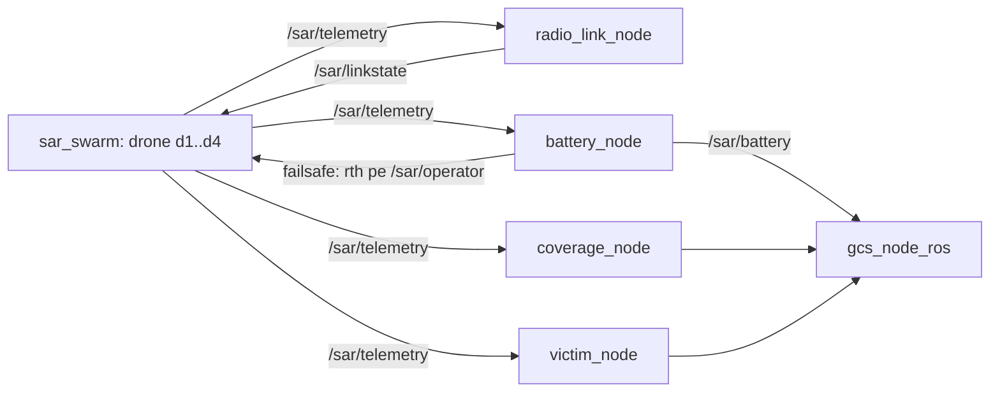

# sar_plugins -- etajul de misiune si add-on-uri de teleoperare (stratul aplicativ C1)

Etajul de misiune si add-on-urile de teleoperare: canal radio dependent de distanta,
acoperire, victime, baterie cu failsafe, garda de obstacole, afisaj predictiv, legatura
video degradata. Module pure (testate fara ROS: 55/55) impachetate in noduri subtiri
care se ataseaza roiului (`sar_swarm`) sau roverului (`teleop_rover`) FARA modificari de
cod in acestea. Pachet "zero-build": fara `package.xml`/`setup.py`; nodurile ruleaza cu
`python3`, launch-urile cu `ros2 launch <cale>`.

## 1. Scop

Furnizeaza, ca add-on-uri reutilizabile, (a) degradarea dependenta de DISTANTA (canal
radio cu atenuare pe profil de teren) si (b) telemetria de misiune (baterie, acoperire,
victime). Serveste stratul aplicativ al contributiei C1: completeaza degradarea UNIFORMA
din `sar_swarm` (`fault_injector_node`, campania C1, validitate interna) cu degradare
dependenta de distanta (campania M, validitate ecologica).

## 2. Context si loc in arhitectura

Nodurile asculta telemetria roiului/roverului si publica metrici de misiune sau starea
legaturii. Se ataseaza prin topicuri, fara sa modifice `sar_swarm` sau `teleop_rover`.

REGULA UNUI SINGUR PUBLISHER: `radio_link_node` publica pe `/sar/linkstate`. Foloseste-l
NUMAI cu scenariul `baseline`/`none` in roiul de baza -- niciodata simultan cu un
`fault_injector_node` activ (doua surse pe `/sar/linkstate` fac gating-ul nedeterminist).

## 3. Arhitectura

Principiul (ca pe tot repo-ul): modul pur (fara ROS, cu selftest) -> nod ROS subtire
(mesaje JSON pe `std_msgs/String`).



Module pure si nodurile lor:

| Modul pur | Nod | Rol / interfata |
|---|---|---|
| `channel.py`, `radio_link.py` | `radio_link_node.py` | canal radio cu atenuare pe distanta; params `pose_topic`, `profile`, `seed`, `linkstate_topic` |
| `coverage.py` | `coverage_node.py` | grila de acoperire; params `xmin/xmax/ymin/ymax`, `sensor_r`, `pose_topic` |
| `victims.py` | `victim_node.py` | victime deterministe; params `n`, `seed`, aria, `sensor_r` |
| `battery.py` | `battery_node.py` | descarcare + failsafe; `failsafe_template` (`{"type":"drone","id":"%ID%","action":"rth"}`) |
| `guard.py` | `obstacle_guard_node.py` | poarta de siguranta pe comanda, cu lidar |
| `predictor.py` | `predictive_display_node.py` | predictia pozei la latenta mare |
| -- | `video_link_node.py` | fluxul video prin legatura degradata |
| -- | `quad_adapter_node.py` | punte catre fizica reala de multicopter din Gazebo (MulticopterMotorModel / VelocityControl) |
| `nodes/node_utils.py` | toate | QoS in conventia proiectului (RELIABLE comenzi / BEST_EFFORT telemetrie) + parsare flexibila a pozelor JSON |

Stratul Gazebo (`gz/`): `bridge_rover.yaml`, `bridge_swarm.yaml` (poduri `ros_gz`),
`patch_world_sensors.py` (injecteaza senzori intr-o lume), `wind_world.sdf.xml` (efect de
vant), `battery_plugin.sdf.xml` (baterie simulata de Gazebo, alternativa de fizica la
`battery_node.py`), `test_world_mini.sdf`.

## 4. Inventar fisiere

| Fisier | Rol | Cum se verifica |
|---|---|---|
| `channel.py`, `radio_link.py`, `coverage.py`, `victims.py`, `battery.py`, `guard.py`, `predictor.py` | nucleele pure (fara ROS) | `python3 test_plugins.py` |
| `nodes/*_node.py` (8) | nodurile ROS subtiri | rulare via launch |
| `nodes/node_utils.py` | QoS + parsare poze | folosit de toate nodurile |
| `nodes/*.launch.py` (3) | lansatoarele de misiune / add-on rover | `ros2 launch nodes/<x>.launch.py` |
| `demo_plugins_sim.py` | demo integrat (fara ROS) | `python3 demo_plugins_sim.py` |
| `tools/manifest.py` | manifestul JSON al rularii | apelat de scripturi |
| `tools/run_experiment.sh` | inregistreaza topicurile `/sar/*` | `tools/run_experiment.sh` |
| `tools/mission_experiment.sh` | campanie de misiune: 2 RMW x 2 profiluri x N rep (degradare din distanta) | `DRY=1 tools/mission_experiment.sh` |
| `tools/mission_experiment_severe.sh` | campanie sub degradare SEVERA (din scenarii fault_injector) | `tools/mission_experiment_severe.sh` |
| `tools/preflight_misiune.sh` | garda de mediu GO/NO-GO inainte de campanie | `tools/preflight_misiune.sh` |
| `tools/analyze_missions.py` | agregare + figuri (T90, acoperire, victime, RTL) | `python3 tools/analyze_missions.py ~/mission_results` |
| `tools/verdict_misiune.py` | verdictele M1-M4 din `mission_summary.csv` | `python3 tools/verdict_misiune.py ~/mission_results` |
| `gz/*` | poduri `ros_gz`, lumi si plugin de baterie Gazebo | folosite la rularile cu Gazebo |
| `test_plugins.py` | suita de verificare (55) | `python3 test_plugins.py` |
| `README_PLUGINS.md` | fisa detaliata per nod (in/out, `ros2 topic echo`) | document |

## 5. Date tehnice

Argumente `mission_sar.launch.py` (valori reale din launch):

| Argument | Implicit | Semnificatie |
|---|---|---|
| `profile` | `open_field` | profilul canalului radio: `open_field` sau `urban_rubble` |
| `seed` | `42` | samanta determinista (victime + canal) |
| `n_victims` | `6` | numarul de victime generate |
| `sensor_r` | `6.0` | raza senzorului de detectie [m] |

Argumente `teleop_addons.launch.py`: `d_stop` (`0.6` m), `d_slow` (`1.5` m), `guard_msg`
(`json`). Argumente `mission_plugins.launch.py` (generatia veche `/swarm/*`): `area`
(`30.0`), `pose_topic` (`/swarm/telemetry`), `profile` (`open_field`), `seed` (`1`),
`sensor_r` (`6.0`).

Variabile pentru `mission_experiment.sh`: `RMWS`, `PROFILES`, `REPS`, `DUR`, `SEED0`,
`BATT_WH` (implicit `8`), `OUT` (implicit `~/mission_results`).

## 6. Sintaxe de pornire

```bash
source /opt/ros/jazzy/setup.bash
cd ~/ros2_ws/src/sar_plugins

# demo fara ROS
python3 demo_plugins_sim.py

# etajul de misiune pe topicurile /sar/* (cu roiul de baza pe scenariul none/baseline)
ros2 launch nodes/mission_sar.launch.py profile:=urban_rubble seed:=42

# add-on-urile roverului (garda obstacole + afisaj predictiv + video)
ros2 launch nodes/teleop_addons.launch.py d_stop:=0.8 guard_msg:=json

# comparatia middleware: acelasi profil, doua RMW
export RMW_IMPLEMENTATION=rmw_cyclonedds_cpp   # sau rmw_zenoh_cpp
ros2 launch nodes/mission_sar.launch.py profile:=urban_rubble
```

Limitari de mediu: nodurile se lanseaza cu `python3` prin `ExecuteProcess` (nu
`ros2 run sar_plugins ...`, neexistand pachet inregistrat); rularile cu Gazebo
(`gz/`) cer ogre2/GPU; aceeasi implementare RMW in toate terminalele.

## 7. Verificare

```bash
cd ~/ros2_ws/src/sar_plugins
python3 test_plugins.py        # 55/55 verificari (ultima rulare)
python3 demo_plugins_sim.py    # demo integrat al modulelor pure
```

`test_plugins.py` (55/55) acopera modulele pure: canalul radio (atenuare pe distanta,
determinism pe seed), grila de acoperire, generarea de victime, descarcarea bateriei si
failsafe-ul, poarta de obstacole, extrapolarea predictorului (plafonata, integrare exacta
pe arc).

## 8. Igiena datelor si reproductibilitate

Iesirile de campanie (`~/mission_results`, manifeste, figuri, inregistrari) NU se
versioneaza -- se regenereaza cu `tools/mission_experiment*.sh` si `tools/analyze_missions.py`.
In git intra codul, modulele pure, scripturile si figurile reprezentative.

Note: un singur publisher pe `/sar/linkstate` (vezi sectiunea 2); profilul de canal
(`open_field` / `urban_rubble`) si seed-ul fac rularile repetabile; pentru detalii pe nod
(intrari/iesiri, `ros2 topic echo`) vezi `README_PLUGINS.md`.
