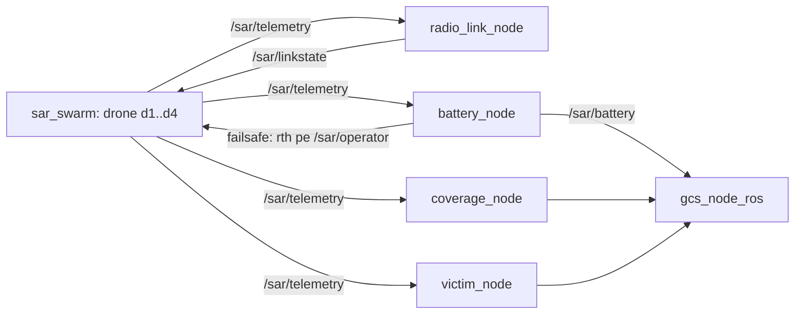

# sar_plugins — Documentatie tehnica

Etajul de misiune si add-on-urile de teleoperare: canal radio dependent de
distanta, acoperire, victime, baterie cu failsafe, garda de obstacole, afisaj
predictiv, legatura video degradata. Module pure (testate fara ROS: 55/55)
impachetate in noduri subtiri care se ataseaza roiului (`sar_swarm`) sau
roverului (`teleop_rover`) FARA modificari de cod in acestea.

## 1. Graful de noduri si topicuri (generatia /sar/*)

## 2. Fisierele de lansare (ce porneste fiecare + sintaxa)

| Launch | Ce porneste | Sintaxa |
|---|---|---|
| `nodes/mission_sar.launch.py` | etajul de misiune pe topicurile `/sar/*`: radio_link + coverage (aria -5..65) + victim (6 victime, 0..60) + battery cu failsafe `rth` pe `/sar/operator` | `ros2 launch nodes/mission_sar.launch.py profile:=urban_rubble seed:=42` |
| `nodes/mission_plugins.launch.py` | aceleasi noduri pe generatia veche `/swarm/*` (compatibilitate) | `ros2 launch nodes/mission_plugins.launch.py profile:=open_field seed:=7 area:=40.0` |
| `nodes/teleop_addons.launch.py` | add-on-urile roverului: garda de obstacole (`/teleop/cmd -> /teleop/cmd_safe` cu `/scan`), afisajul predictiv (`/teleop/pose_pred`), legatura video (`/teleop/video`) | `ros2 launch nodes/teleop_addons.launch.py d_stop:=0.8 guard_msg:=json` |

Argumentele `mission_sar.launch.py`:

| Argument | Implicit | Semnificatie |
|---|---|---|
| `profile` | `open_field` | profilul canalului radio: `open_field` \| `urban_rubble` |
| `seed` | 42 | samanta determinista (victime + canal) |
| `n_victims` | 6 | numarul de victime generate |
| `sensor_r` | 6.0 | raza senzorului de detectie [m] |

Argumentele `teleop_addons.launch.py`: `d_stop` (0.6 m), `d_slow` (1.5 m),
`guard_msg` (`json`), `linkstate` (`/teleop/linkstate`).

ATENTIE (regula unui singur publisher): `mission_sar.launch.py` porneste
`radio_link_node`, care publica pe `/sar/linkstate`. Foloseste-l NUMAI cu
scenariul `baseline`/`none` in roiul de baza — nu simultan cu un
`fault_injector` activ.

## 3. Modulele pure si nodurile

| Modul pur | Nod | Rol / interfata |
|---|---|---|
| `channel.py` | `radio_link_node.py` | canal radio cu atenuare pe distanta; params `pose_topic`, `profile`, `seed`, `linkstate_topic` |
| `coverage.py` | `coverage_node.py` | grila de acoperire; params `xmin/xmax/ymin/ymax`, `sensor_r`, `pose_topic` |
| `victims.py` | `victim_node.py` | victime deterministe; params `n`, `seed`, aria, `sensor_r` |
| `battery.py` | `battery_node.py` | descarcarea + failsafe; params `state_topic`, `failsafe_cmd_topic`, `failsafe_template` (`{"type":"drone","id":"%ID%","action":"rth"}`) |
| `guard.py` | `obstacle_guard_node.py` | poarta de siguranta pe comanda, cu lidar |
| `predictor.py` | `predictive_display_node.py` | predictia pozei la latenta mare |
| — | `video_link_node.py` | fluxul video prin legatura degradata |

Verificari: `python3 test_plugins.py` (55); demo integrat: `python3 demo_plugins_sim.py`.

## 4. Instrumentele de campanie

| Instrument | Rol | Sintaxa |
|---|---|---|
| `tools/manifest.py` | manifestul JSON al rularii | apelat de scripturi |
| `tools/run_experiment.sh` | inregistrarea topicurilor `/sar/*` intr-o rulare | `tools/run_experiment.sh` |
| `tools/mission_experiment.sh` | campania de misiune: 2 RMW x 2 profiluri x N rep | `DRY=1 tools/mission_experiment.sh` apoi `tools/mission_experiment.sh` |
| `tools/analyze_missions.py` | agregarea + figurile (T90, acoperire, victime, RTL) | `python3 tools/analyze_missions.py ~/mission_results` |

Variabile pentru `mission_experiment.sh`: `RMWS`, `PROFILES`, `REPS`, `DUR`,
`SEED0`, `BATT_WH` (implicit 8), `OUT` (implicit `~/mission_results`).

## 5. Anexa

Fisa detaliata per nod (in/out, verificarea cu `ros2 topic echo`):
`README_PLUGINS.md` din acelasi pachet.
