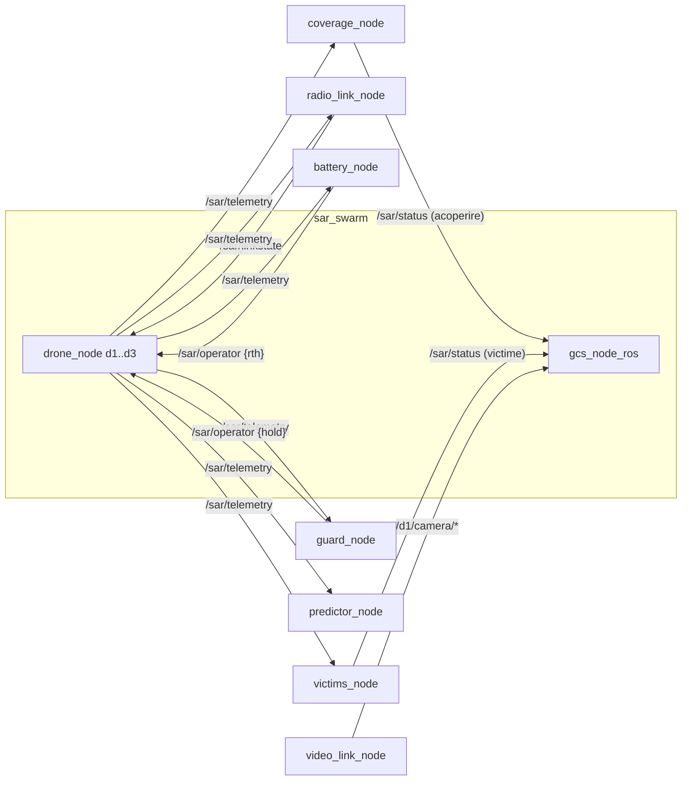

# sar_plugins — Documentatie tehnica

Plugin-urile de mediu ale roiului SAR: canal radio dependent de distanta, baterie cu
failsafe, acoperire de zona, victime, paznic de siguranta, predictor. Module pure
(testate fara ROS) impachetate in noduri subtiri; se ataseaza roiului din `sar_swarm`
prin topicurile `/sar/*`.

## 1. Graful de noduri si topicuri



Regula de exclusivitate (identica cu `sar_swarm`): pe `/sar/linkstate` publica
UN SINGUR nod — `radio_link_node` SAU `fault_injector_node`, niciodata ambele.

## 2. Modulele pure si rolurile lor

| Modul | Functie | Nod corespondent |
|-------|---------|------------------|
| `channel.py` | modelul canalului radio: atenuare cu distanta, praguri | `radio_link_node` |
| `battery.py` | descarcarea bateriei + pragul de failsafe | `battery_node` |
| `coverage.py` | grila de acoperire a zonei de cautare | `coverage_node` |
| `victims.py` | generarea si detectia victimelor (seed determinist) | `victims_node` |
| `guard.py` | paznicul: conditii de oprire de siguranta | `guard_node` |
| `predictor.py` | predictia traiectoriei la pierderea legaturii | `predictor_node` |

Verificari automate: 55/55 pe modulele pure (`python3 -m pytest` sau suita proprie).

## 3. Failsafe-ul de baterie (legarea reala)

Configurat in `launch/mission_sar.launch.py`:

```
failsafe_cmd_topic   := /sar/operator
failsafe_template    := {"type":"drone","id":"%ID%","action":"rth"}
```

Drona cu baterie sub prag (implicit 30%) primeste automat comanda `rth` — exact
mecanismul folosit in experimentele de misiune.

## 4. Sintaxe de pornire

```bash
source /opt/ros/jazzy/setup.bash
cd ~/ros2_ws/src/sar_plugins

# misiunea completa cu plugin-uri (profiluri: open_field | urban_rubble)
ros2 launch launch/mission_sar.launch.py profile:=open_field seed:=42

# camera pe drona d1 (fluxul video greu care streseaza RMW)
python3 gz/patch_drone_camera.py            # idempotent, modifica modelul d1
ros2 run ros_gz_bridge parameter_bridge --ros-args -p config_file:=gz/bridge_camera_d1.yaml
ros2 run image_transport republish raw compressed \
  --ros-args -r in:=/d1/camera/image -r out/compressed:=/d1/camera/image/compressed
```

## 5. Instrumentele de campanie

| Instrument | Rol | Iesire |
|------------|-----|--------|
| `tools/manifest.py` | manifestul JSON al rularii (seed, versiuni, conditie) | `manifest.json` |
| `tools/run_experiment.sh` | inregistrarea topicurilor `/sar/*` intr-o rulare | CSV-uri |
| `tools/mission_experiment.sh` | campania de misiune: 2 RMW x 2 profiluri x N rep | `~/mission_results/` |
| `tools/analyze_missions.py` | agregarea + figurile de misiune | `analysis/mission_*.png` |

```bash
# campania de misiune (~45 min; NU simultan cu campania C1)
DRY=1 tools/mission_experiment.sh           # planul
tools/mission_experiment.sh                 # executia
python3 tools/analyze_missions.py ~/mission_results
```

## 6. Anexa

Fisa detaliata per aplicatie (ce face, in/out, verificarea cu `ros2 topic echo`):
vezi `README_PLUGINS.md` din acelasi pachet.
