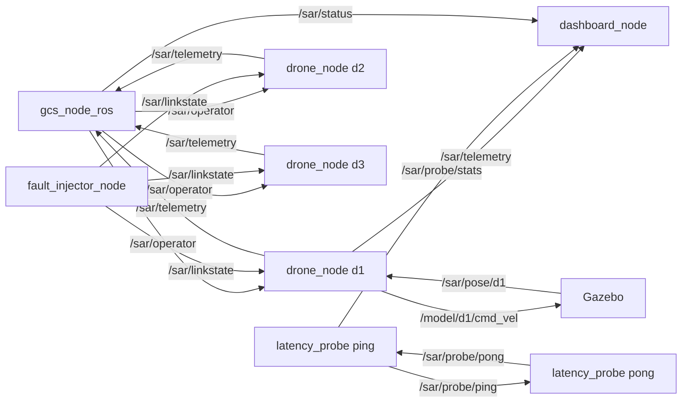

# sar_swarm — Documentatie tehnica

Roiul SAR simulat: trei drone autonome, statie de control la sol (GCS), injector de
defecte de legatura, sonda de latenta si dashboard. Stratul de aplicatie al
benchmarkului C1: misiunile ruleaza identic peste `rmw_zenoh` si CycloneDDS.

## 1. Graful de noduri si topicuri



Regula de exclusivitate: pe `/sar/linkstate` publica UN SINGUR nod — injectorul de
defecte SAU `radio_link_node` din `sar_plugins`, niciodata ambele simultan.

## 2. Schema mesajelor (JSON pe std_msgs/String)

```json
// /sar/operator — comanda individuala
{"type": "drone", "id": "d2", "action": "goto|hold|resume|rth"}

// /sar/operator — comanda de misiune
{"type": "mission", "action": "start|pause|resume|abort"}

// /sar/linkstate — starea legaturii
{"ms": 200, "jit": 50, "loss": 0.15, "down": false}
```

Telemetria (`/sar/telemetry`) si starea misiunii (`/sar/status`) sunt obiecte JSON
cu pozitie, baterie, faza misiunii si acoperire; campurile exacte sunt definite in
`drone_node.py`, respectiv `gcs_node_ros.py`.

## 3. Inventarul fisierelor

| Fisier | Rol |
|--------|-----|
| `drone_node.py` | drona autonoma: waypoints, telemetrie, failsafe de baterie |
| `gcs_node_ros.py` | GCS: comenzile operatorului, starea misiunii |
| `sar_launcher.py` | lansatorul roiului (procese, fara ROS launch) |
| `fault_injector_node.py` | publica degradarea simulata pe `/sar/linkstate` |
| `latency_probe.py` | sonda ping/pong + statistici RTT live |
| `netem_core.py` | wrapper tc netem |
| `dashboard_node.py` | tablou de bord text in terminal |
| `sil_run.py` | simulare Software-in-the-Loop completa, fara ROS |
| `gen_world.py`, `worlds/apocalypse.sdf` | generatorul si lumea Gazebo |
| `scenarios/*.yaml` | conditiile: `none`, `ideal`, `loss_*`, `lat200_*` |
| `config/zenoh_session_config.json5` | configurarea sesiunii Zenoh |
| `launch/sar_ros.launch.py` | roiul complet, fara Gazebo (L1) |
| `launch/sar_gazebo.launch.py` | roiul + Gazebo (L2) |

Verificari automate: trei suite (drone/GCS, injector/probe, SIL) — peste 100 de
asertii; rulate integral de `~/ros2_ws/src/smoke_all.sh`.

## 4. Sintaxe de pornire

```bash
source /opt/ros/jazzy/setup.bash
cd ~/ros2_ws/src/sar_swarm

# L0 — fara ROS (instant, sigur oricand)
python3 sil_run.py

# L1 — roiul fara Gazebo
ros2 launch launch/sar_ros.launch.py scenario:=ideal.yaml
ros2 launch launch/sar_ros.launch.py scenario:=loss_30.yaml

# L2 — roiul cu Gazebo
ros2 launch launch/sar_gazebo.launch.py scenario:=ideal.yaml
```

Rulare peste Zenoh (doua terminale):

```bash
# T1 — routerul Zenoh
ros2 run rmw_zenoh_cpp rmw_zenohd

# T2 — roiul peste Zenoh
export RMW_IMPLEMENTATION=rmw_zenoh_cpp
ros2 launch launch/sar_ros.launch.py scenario:=ideal.yaml
```

Comenzi operator din terminal:

```bash
ros2 topic pub --once /sar/operator std_msgs/String \
  "data: '{\"type\":\"drone\",\"id\":\"d2\",\"action\":\"rth\"}'"
ros2 topic pub --once /sar/operator std_msgs/String \
  "data: '{\"type\":\"mission\",\"action\":\"pause\"}'"
```

## 5. Note de utilizare

1. In campaniile C1, scenariul ramane `none.yaml`: degradarea este exclusiv fizica
   (tc netem), pentru ca diferentele masurate sa apartina middleware-ului.
2. Failsafe-ul de baterie publica automat `rth` pe `/sar/operator` sub pragul
   configurat (legarea reala se face din `sar_plugins/launch/mission_sar.launch.py`).
3. Pachet sub INGHET DE COD pana la submisia articolului.
