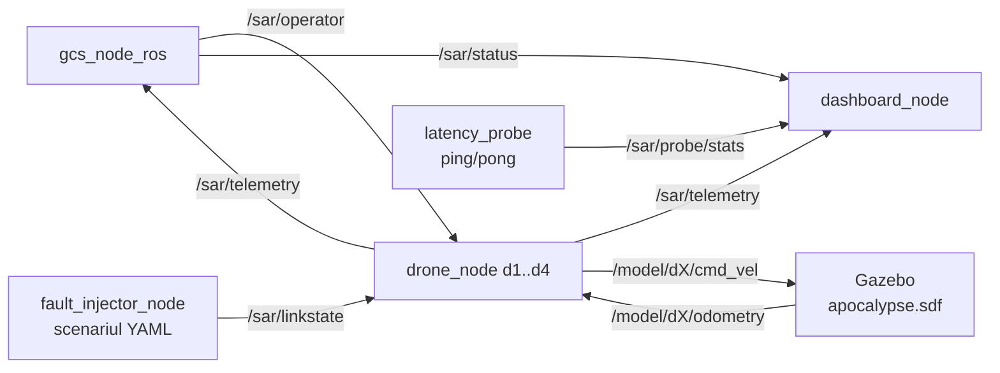

# sar_swarm — Documentatie tehnica

Roiul SAR simulat: PATRU drone autonome (d1–d4), statie de control la sol (GCS),
injector de defecte de legatura, sonda de latenta si tablou de bord. Stratul de
aplicatie al benchmarkului C1: aceleasi noduri si acelasi trafic, rulate o data
peste CycloneDDS si o data peste rmw_zenoh.

## 1. Graful de noduri si topicuri



Regula de exclusivitate: pe `/sar/linkstate` publica UN SINGUR nod —
`fault_injector_node` (scenarii statice YAML) SAU `radio_link_node` din
`sar_plugins` (degradare dependenta de distanta). Niciodata ambele.

## 2. Schema mesajelor (JSON pe std_msgs/String)

```json
// /sar/operator — comanda individuala / de misiune
{"type": "drone", "id": "d2", "action": "goto|hold|resume|rth"}
{"type": "mission", "action": "start|pause|resume|abort"}

// /sar/linkstate — starea legaturii
{"ms": 200, "jit": 50, "loss": 0.15, "down": false}
```

## 3. Fisierele de lansare (ce porneste fiecare + sintaxa)

| Launch | Ce porneste | Sintaxa |
|---|---|---|
| `launch/sar_ros.launch.py` | FARA Gazebo: 4 x drone_node (cinematica interna, pozitii initiale fixe) + gcs_node_ros + fault_injector (scenariul ales) + latency_probe + dashboard | `ros2 launch launch/sar_ros.launch.py scenario:=loss_30.yaml` |
| `launch/sar_gazebo.launch.py` | + gz sim `worlds/apocalypse.sdf` + parameter_bridge (/clock + cmd_vel/odometry per drona) si dronele cu `use_gazebo:=true` | `ros2 launch launch/sar_gazebo.launch.py scenario:=partition_2v2.yaml` |

Argumente comune:

| Argument | Implicit | Semnificatie |
|---|---|---|
| `scenario` | `baseline.yaml` | fisier din `scenarios/` (ex.: `none`, `baseline`, `loss_30`, `lat200_l15`, `partition_2v2`) |
| `autostart` | `true` | GCS porneste misiunea singur |
| `dashboard` | `true` | porneste tabloul de bord text |

Lista scenariilor disponibile: `ls scenarios/`.

## 4. Inventarul nodurilor

| Fisier | Rol |
|---|---|
| `drone_node.py` | drona: waypoints, telemetrie, failsafe; params `id`, `x0`, `y0`, `use_gazebo` |
| `gcs_node_ros.py` | GCS: comenzile operatorului, starea misiunii; param `autostart` |
| `fault_injector_node.py` | publica degradarea din scenariul YAML pe `/sar/linkstate` |
| `latency_probe.py` | ping/pong + statistici RTT live pe `/sar/probe/stats` |
| `dashboard_node.py` | tablou de bord text in terminal |
| `sar_launcher.py` | lansator alternativ pe procese (fara ros2 launch) |
| `sil_run.py` | misiunea completa Software-in-the-Loop, fara ROS: `python3 sil_run.py [scenarios/partition_2v2.yaml]` |
| `netem_core.py` | wrapper tc netem |
| `gen_world.py` / `worlds/apocalypse.sdf` | generatorul si lumea Gazebo |
| `config/zenoh_session_config.json5` | configurarea sesiunii Zenoh |

Verificari: `test_sar_core.py` (25+41), `test_operator_core.py` (24),
`test_launcher_core.py` (11) — rulate de `~/ros2_ws/src/smoke_all.sh`.

## 5. Sintaxe de pornire (de la zero la Gazebo)

```bash
source /opt/ros/jazzy/setup.bash
cd ~/ros2_ws/src/sar_swarm

# L0 — fara ROS
python3 sil_run.py

# L1 — roiul fara Gazebo
ros2 launch launch/sar_ros.launch.py scenario:=baseline.yaml

# L2 — roiul cu Gazebo
ros2 launch launch/sar_gazebo.launch.py scenario:=baseline.yaml

# comparatia RMW (doua terminale)
# T1: ros2 run rmw_zenoh_cpp rmw_zenohd
# T2: export RMW_IMPLEMENTATION=rmw_zenoh_cpp
#     ros2 launch launch/sar_ros.launch.py scenario:=baseline.yaml

# comenzi operator
ros2 topic pub --once /sar/operator std_msgs/String \
  "data: '{\"type\":\"drone\",\"id\":\"d2\",\"action\":\"rth\"}'"
ros2 topic pub --once /sar/operator std_msgs/String \
  "data: '{\"type\":\"mission\",\"action\":\"pause\"}'"
```

## 6. Note

1. In campaniile C1 scenariul ramane `none.yaml`: degradarea e exclusiv fizica
   (tc netem) — diferentele masurate apartin middleware-ului.
2. Etajul de misiune (acoperire, victime, baterie cu failsafe `rth`) se ataseaza
   din `sar_plugins/nodes/mission_sar.launch.py`.
3. Pachet sub INGHET DE COD pana la submisia articolului (18 iunie).
