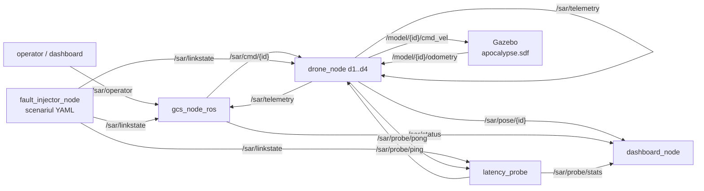

# sar_swarm

Roi de PATRU drone autonome (d1-d4) pentru cautare-salvare (SAR) intr-o lume
post-dezastru, cu statie de control la sol (GCS), degradare de retea injectabila,
sonda de latenta si ecran de misiune. Este stratul de APLICATIE al benchmarkului
de middleware din teza: aceleasi noduri si acelasi trafic, rulate o data peste
CycloneDDS si o data peste rmw_zenoh, ca sa masuram efectul middleware-ului pe
metrici de MISIUNE (acoperire, victime raportate, timp), nu doar pe mesaje
sintetice.

Pachet "zero-build": nodurile se ruleaza direct cu `python3 nod.py`, launch-urile
prin `ros2 launch`. Logica grea sta in nuclee pure (fara ROS), testabile oriunde.

---

## 1. Descrierea proiectului

O echipa de 4 drone exploreaza cooperativ o zona de 60x60 m presarata cu ruine
(zone no-fly), fum (reduc raza senzorului) si 5 victime. Fiecare drona dezvaluie
celule in jurul ei, isi trimite harta partiala la GCS, care le fuzioneaza
(cooperative mapping) si realoca frontierele de explorare. Cand o drona pierde
legatura cu GCS, trece autonom prin comportamente de avarie (LOCAL_EXPLORE ->
RETURN_TO_LINK -> LOITER) si tamponeaza telemetria (store-and-forward) pana la
reconectare.

Intregul trafic trece printr-un singur middleware ROS 2 (RMW), schimbat din
variabila de mediu. Degradarea retelei (latenta, jitter, pierdere, izolare,
partitie) e injectata identic la fiecare rulare, ca diferentele masurate sa
apartina middleware-ului, nu hazardului.

Rol in teza: stratul aplicativ al firului "comparatie de middleware sub conditii
SAR realiste". Vine in doua variante:
- campania **C1**: degradare uniforma (`tc netem`) - validitate interna;
- campania **M** (etajul din `sar_plugins`): degradare dependenta de distanta -
  validitate ecologica.

---

## 2. Grafic de comunicatie (topicuri)



REGULA DE EXCLUSIVITATE: pe `/sar/linkstate` publica UN SINGUR nod -
`fault_injector_node` (scenarii YAML, campania C1) SAU `radio_link_node` din
`sar_plugins` (degradare dependenta de distanta, campania M). Niciodata ambele.

Degradarea se aplica LA RECEPTIE: fiecare nod citeste `/sar/linkstate` si, la
fiecare mesaj primit, decide pe baza ei daca il ignora (legatura jos / pierdere)
sau il intarzie (latenta + jitter). Asa, acelasi RMW duce tot traficul, iar
gating-ul e identic peste noduri.

---

## 3. Work tree (structura proiectului)

```
sar_swarm/
├── world_config.py          SURSA UNICA DE ADEVAR: lumea (ruine, fum, victime,
│                            drone) - folosita de SIL, noduri, dashboard, Gazebo
│
├── NUCLEE PURE (fara ROS, testabile oriunde)
│   ├── sar_core.py           GridWorld, DiscoveredMap (reveal/merge/frontiers/
│   │                         A*), allocate_frontiers, cohesion, FallbackPolicy
│   ├── swarm_core.py         DroneKinematics, formatii, goto/separation_velocity,
│   │                         lawnmower, FlightStateMachine, HeartbeatWatchdog
│   ├── netem_core.py         Channel degradat (latenta/jitter/pierdere/S&F) +
│   │                         load_scenario / apply_due_events
│   ├── operator_core.py      OperatorState: misiune (IDLE/RUNNING/PAUSED/ABORTED)
│   │                         + mod drona (AUTO/HOLD/GOTO/RTH)
│   └── launcher_core.py      build_plan: alegeri meniu -> comanda executabila
│
├── NODURI ROS (invelisuri subtiri peste nuclee)
│   ├── drone_node.py         drona: control 20 Hz, telemetrie 5 Hz, fallback,
│   │                         store-and-forward, jurnal local per drona
│   ├── gcs_node_ros.py       GCS: fuziune harti, alocare frontiere, status,
│   │                         mission_metrics.csv + op_commands.csv
│   ├── fault_injector_node.py publica degradarea (scenariu YAML) pe /sar/linkstate;
│   │                         optional tc netem real (use_tc)
│   ├── latency_probe.py      ping/pong 2 Hz -> RTT mediu/p95 + pierdere 10 s
│   └── dashboard_node.py     ecran Tk: harta live + panou per drona + control op
│
├── GUI / TOOLING
│   ├── sar_launcher.py        meniu Tk: middleware x mod x scenariu -> pornire
│   ├── fault_panel.py         banc de defecte per-legatura (deschis din dashboard)
│   └── gen_world.py           genereaza worlds/apocalypse.sdf din world_config
│
├── SIL + ANALIZA
│   ├── sil_run.py             misiunea completa FARA ROS (figuri repetabile)
│   ├── analyze_disconnect.py  cronologia unei drone la pierderea legaturii
│   └── plot_comparison.py     figura comparativa intre scenarii (din SIL)
│
├── TESTE
│   ├── test_sar_core.py       8 grupuri (world/frontiere/A*/fallback/canal/S&F/...)
│   ├── test_operator_core.py  10 grupuri (misiune, moduri, abort, cmd_id, ...)
│   └── test_launcher_core.py  build_plan pe toate combinatiile + invalide
│
├── launch/
│   ├── sar_ros.launch.py      roiul FARA Gazebo (cinematica interna)
│   └── sar_gazebo.launch.py   + gz sim + bridge-uri cmd_vel/odometry per drona
│
├── scenarios/                 cazurile de degradare (YAML)
│   ├── baseline.yaml          referinta (40 ms, 0% pierdere)
│   ├── loss_30.yaml           pierdere 30%
│   ├── loss_70.yaml           pierdere severa 70%
│   ├── gcs_delay_spike.yaml   varf 50->2000 ms intre t=40..80 s
│   ├── partition_2v2.yaml     partitie de roi 2 vs 2, t=30..70 s
│   └── drone_isolation.yaml   izolarea d2, t=25..60 s
│
└── worlds/
    └── apocalypse.sdf         (generat de gen_world.py)
```

---

## 4. Descrierea detaliata (topicuri, functii, launch)

### 4.1 Topicuri

| Topic | Tip (JSON pe String unde e cazul) | Producator -> consumator |
|---|---|---|
| `/sar/operator` | `{type:mission/drone/fault, action, id?, cell?}` | dashboard/CLI -> GCS + fault_injector |
| `/sar/cmd/{id}` | `{k:goto_frontier/op/map_ack, ...}` | GCS -> drona (prin link degradat) |
| `/sar/telemetry` | `{k:telemetry, id, pos[x,y,z], state, from, cells, victims}` | drona -> GCS + peers |
| `/sar/pose/{id}` | `{id, pos, state}` | drona -> dashboard (pozitie rapida) |
| `/sar/status` | `{t, coverage, mission, victims, drones:{...}}` | GCS -> dashboard |
| `/sar/linkstate` | `{down:[], lat_ms:{}, jit_ms:{}, loss:{}}` | fault_injector -> TOATE (unic!) |
| `/sar/probe/ping` | `{to, seq, t}` | latency_probe -> drona |
| `/sar/probe/pong` | `{id, seq, t}` | drona -> latency_probe |
| `/sar/probe/stats` | `{id:{rtt_mean_ms, rtt_p95_ms, loss_10s}}` | latency_probe -> dashboard |
| `/model/{id}/cmd_vel` | `geometry_msgs/Twist` | drona -> Gazebo |
| `/model/{id}/odometry` | `nav_msgs/Odometry` | Gazebo -> drona |

### 4.2 Functii-cheie din nucleele pure

`sar_core.py`:
- `GridWorld` - adevarul-teren (ruine no-fly, fum, victime); `to_cell`/`to_xy`,
  `in_smoke`.
- `DiscoveredMap` - harta cunoscuta: `reveal_disc` (dezvaluie un disc, raza scade
  in fum, intoarce celule noi + victime), `merge_cells` (fuziune cooperativa),
  `coverage`, `frontiers` (celule libere la marginea necunoscutului), `astar`
  (drum 4-vecini ce ocoleste ruinele).
- `allocate_frontiers` - alocare lacoma cu separare minima intre tinte.
- `cohesion` - fractia perechilor de drone sub o raza (compactarea roiului).
- `FallbackPolicy` - masina LINKED -> LOCAL_EXPLORE -> RETURN_TO_LINK -> LOITER.

`swarm_core.py`:
- `DroneKinematics` - model de ordinul I (viteza urmarita cu constanta tau).
- `goto_velocity` / `separation_velocity` - ghidare P + evitare prin repulsie.
- `lawnmower_waypoints` - acoperire boustrophedon impartita pe drone.
- `FlightStateMachine` - tranzitii de zbor legale (refuza ordinele tardive ilegale).
- `HeartbeatWatchdog` - failsafe local pe ceas monotonic (OK/HOVER/LAND).

`netem_core.py`:
- `Channel` - canal determinist (seed) cu latenta/jitter/pierdere per legatura,
  store-and-forward, si modul de inregistrare (sent/lost/delivered, RTT, timp
  deconectat, timp de recuperare). `send`/`deliver`/`set_link`/`isolate`/`partition`.
- `load_scenario` / `apply_due_events` - scenarii din YAML.

`operator_core.py`:
- `OperatorState.handle` - traduce comanda operatorului in comenzi per drona;
  `on_event` (ack/done/fail), `auto_eligible` (cine primeste frontiere automat).

`launcher_core.py`:
- `build_plan` - traduce {mod, rmw, scenariu, optiuni} in {pre, cmd, env, router};
  `rmw_available` - detecteaza ce middleware e instalat.

### 4.3 Launch files

| Launch | Ce porneste | Sintaxa |
|---|---|---|
| `sar_ros.launch.py` | FARA Gazebo: 4 drone (cinematica interna) + GCS + fault_injector + latency_probe + dashboard | `ros2 launch launch/sar_ros.launch.py scenario:=loss_30.yaml` |
| `sar_gazebo.launch.py` | + `gz sim apocalypse.sdf` + `ros_gz_bridge` (/clock + cmd_vel/odometry per drona); dronele cu `use_gazebo:=true` | `ros2 launch launch/sar_gazebo.launch.py scenario:=partition_2v2.yaml` |

Argumente: `scenario` (fisier din `scenarios/`, implicit `baseline.yaml`),
`autostart` (GCS porneste misiunea singur, implicit true), `dashboard` (implicit true).

---

## 5. Learning: sintaxe de pornire + teste

### 5.1 Pornire (de la zero la Gazebo)

```bash
source /opt/ros/jazzy/setup.bash
cd ~/ros2_ws/src/sar_swarm

# L0 - fara ROS (cel mai rapid; figuri repetabile)
python3 sil_run.py scenarios/baseline.yaml

# L1 - roiul fara Gazebo (demo intr-un minut)
ros2 launch launch/sar_ros.launch.py scenario:=loss_30.yaml

# L2 - roiul cu Gazebo (lumea apocalipsa)
python3 gen_world.py                    # o data: genereaza worlds/apocalypse.sdf
ros2 launch launch/sar_gazebo.launch.py scenario:=partition_2v2.yaml

# comparatia middleware (C1) - acelasi scenariu, doua RMW:
export RMW_IMPLEMENTATION=rmw_cyclonedds_cpp   # sau rmw_zenoh_cpp
ros2 launch launch/sar_ros.launch.py scenario:=loss_30.yaml
# pt Zenoh: porneste mai intai routerul intr-un terminal separat:
#   ros2 run rmw_zenoh_cpp rmw_zenohd

# comenzi operator (din CLI):
ros2 topic pub --once /sar/operator std_msgs/String \
  "data: '{\"type\":\"drone\",\"id\":\"d2\",\"action\":\"rth\"}'"
ros2 topic pub --once /sar/operator std_msgs/String \
  "data: '{\"type\":\"mission\",\"action\":\"pause\"}'"
```

Curatare intre rulari (proceses ramase / shared memory Fast DDS):
```bash
pkill -f 'drone_node\|gcs_node\|fault_injector\|latency_probe'; sleep 1
rm -f /dev/shm/fastrtps_*          # daca apare RTPS_TRANSPORT_SHM (non-fatal)
```

### 5.2 Teste si ce verifica fiecare

```bash
cd ~/ros2_ws/src/sar_swarm
python3 test_sar_core.py            # nucleul misiunii
python3 test_operator_core.py       # stratul de comanda al operatorului
python3 test_launcher_core.py       # logica meniului de pornire
```

| Test | Ce verifica (pe grupuri) |
|---|---|
| `test_sar_core.py` | (1) dezvaluirea discului + acoperire + fumul reduce raza; (2) frontiere si alocare cu tinte distincte; (3) A* ocoleste ruinele si e mai lung ca linia dreapta; (4) fallback LINKED->LOCAL->RETURN->LOITER si revenirea la contact; (5) canalul: pierderea masurata ~ configurata, latenta medie corecta, livrate+pierdute=trimise; (6) store-and-forward: nimic pierdut pe legatura cazuta, ordinea pastrata, timp deconectat/recuperare inregistrate; (7) partitie/izolare din YAML taie exact legaturile asteptate; (8) coeziune compact=1, dispersat=0 |
| `test_operator_core.py` | starea initiala (autostart), start/pauza/reluare trimit comenzile corecte doar dronelor AUTO, goto trunchiaza celula la intregi si scoate drona din alocarea automata, done/fail->HOLD, abort->RTH la toate, restart dupa abort, cmd_id unic crescator, comenzi invalide ignorate fara efect |
| `test_launcher_core.py` | rmw_available pe radacini controlate; build_plan pentru SIL (fara RMW), ROS+Zenoh (env + router), Gazebo (gen_world inainte), FastDDS mapat corect; combinatii invalide ridica ValueError |

### 5.3 Learnings (capcane platite, valabile pentru tot repo-ul)

- **Degradarea se aplica LA RECEPTIE**, nu intr-un nod-link separat. Toate nodurile
  (drona, GCS, sonda) citesc `/sar/linkstate` si filtreaza identic. Un singur
  publisher pe `/sar/linkstate` - altfel doua surse se bat si gating-ul devine
  nedeterminist.
- **Metrica trebuie sa masoare ce conteaza OPERATIONAL, nu ce e usor de numarat.**
  "Victime gasite la final" e 5/5 in aproape orice scenariu (store-and-forward +
  timp suficient livreaza tot) - deci nu separa degradarea. Metrica utila e
  *cand AFLA GCS-ul* de victima (timp de raportare): baseline ~77 s vs degradare
  severa ~120-130 s. O victima vazuta de o drona izolata dar neraportata e
  inutila pentru echipa de salvare. (Aceeasi lectie ca la teleop_rover, unde CTE
  scadea inselator si a trebuit inlocuit cu metrici end-to-end.)
- **Ceas comun in SIL, ceas per-masina in ROS.** RTT-ul masoara dus-intors pe
  acelasi ceas (ecou de timestamp) - valid fara sincronizare NTP.
- **world_config.py e sursa unica de adevar** - aceeasi lume in SIL, noduri si
  Gazebo. Nu duplica ruine/victime in alta parte.

---

## 6. Documentatie tehnica

### 6.1 Bucla de misiune (un pas)

1. GCS aloca frontiere dronelor vazute recent (la 1 Hz) si trimite `goto_frontier`
   pe `/sar/cmd/{id}` (prin link degradat).
2. Fiecare drona: aplica fallback dupa starea legaturii, planifica A* spre tinta,
   se misca (ghidare P + separare), dezvaluie celule, detecteaza victime.
3. Drona trimite telemetrie (5 Hz) pe `/sar/telemetry`: harta partiala neconfirmata
   + victime. Daca GCS e cazut, intra in store-and-forward.
4. GCS fuzioneaza harta, confirma cu `map_ack` (drona poate uita celulele
   confirmate), actualizeaza acoperirea, victimele raportate si statusul.
5. Sonda masoara RTT/pierdere in paralel, pe acelasi canal.

### 6.2 Comportamentul de avarie (fallback)

La pierderea legaturii cu GCS, drona trece autonom prin:
`LINKED -> LOCAL_EXPLORE` (continua misiunea pe harta locala t_local=15 s) `->
RETURN_TO_LINK` (zboara spre ultimul punct cu legatura) `-> LOITER` (cerc lent).
Orice mesaj de la GCS readuce in LINKED. Jurnalul per-drona se scrie LOCAL, deci
e complet inclusiv in perioada in care GCS-ul n-o mai vede - exact fereastra
analizata de `analyze_disconnect.py`.

### 6.3 Metrici de misiune (mission_metrics.csv)

| Coloana | Sens |
|---|---|
| `coverage` | fractia celulelor libere vazute (fuzionate la GCS) |
| `victims_found` | victime cunoscute de GCS (din telemetrie livrata) |
| `cohesion` | compactarea roiului (perechi sub raza) |
| `drones_linked` | cate drone au legatura cu GCS acum |
| `victims_reported` | victime raportate la GCS pana acum (NOU) |
| `last_report_s` | timpul ultimei raportari de victima (NOU) |

`victims_reported` / `last_report_s` sunt metrica de degradare care chiar separa
scenariile (vezi 5.3): masoara CAND afla GCS-ul, nu cand vede drona local.

### 6.4 Rolul in teza (doua straturi)

| Strat | Artefact | Ce masoara |
|---|---|---|
| Transport (microbenchmark) | `c1_benchmark` | latenta/jitter/pierdere pe mesaje sintetice |
| **Aplicatie (acest pachet)** | `sar_swarm` (+ etajul `sar_plugins`) | acoperire, victime raportate, timp, sub degradare |

Golul de cercetare: nu exista benchmarkuri `rmw_zenoh` vs CycloneDDS sub conditii
de retea degradate realiste SAR (doar in conditii ideale). Acest pachet operationa-
lizeaza evaluarea aplicativa.

### 6.5 Limite oneste

- Totul e in SIMULARE; validarea pe hardware e o contributie ulterioara.
- Detectarea victimei e geometrica (celula dezvaluita), nu perceptie reala.
- Modelul de drona e de ordinul I (fara aerodinamica fina) - adecvat pentru
  studiul middleware-ului, nu al controlului de zbor.
- Camera/lidar in Gazebo cer ogre2/GPU.
- Aceeasi implementare RMW trebuie exportata in TOATE terminalele, altfel nodurile
  nu se descopera ("Waiting for matching subscription").

### 6.6 Stratul mesh multi-hop (`mesh_plugin`)

Peste roi se poate adauga `mesh_plugin` (contributia C3): cand o partitie sau
distanta izoleaza o drona de GCS, telemetria ei ajunge prin RELAY multi-hop
(d3 -> d1 -> gcs) in loc sa se piarda. Nu modifica `sar_swarm`; se ataseaza
prin topicuri.

- `mesh_node.py` asculta `/sar/telemetry`, calculeaza rutele (Dijkstra pe ETX)
  si publica `/mesh/routes` + `/mesh/status` (bilant star vs mesh).
- Comenzi `block`/`unblock` pe `/mesh/control` -> blochezi o drona si vezi
  reteaua reconfigurandu-se (demo live `mesh_demo.py`).
- Scenariul tinta e `partition_2v2`: stea pierde d3/d4, mesh le recupereaza.

Vezi `mesh_plugin/README.md`. Rezultat tipic (urban_rubble): stea livreaza
~78% din pachete, mesh 100% (+28%); la final stea ajunge la 2/4 drone, mesh la
4/4.

### 6.7 Injectarea defectelor: chiar se intampla? (verificat in cod)

Da. Lantul complet, verificabil:

1. `fault_injector_node.tick()` (la 0.2 s) parcurge timeline-ul scenariului
   YAML si, la momentul `t` al fiecarui eveniment, modifica starea legaturilor
   (`isolate`, `partition`, `set_all`, `set_link`, `heal_partition`...) si
   publica `/sar/linkstate` cu `{down:[...], lat_ms:{}, jit_ms:{}, loss:{}}`.
   Logheaza fiecare eveniment: `t=30s EVENIMENT: partition {...}`.

2. `drone_node._enqueue()` (gating la RECEPTIE) aplica efectiv degradarea:
   - daca legatura e in `down` -> mesajul se ARUNCA (pierdut);
   - altfel, cu probabilitatea `loss` -> se ARUNCA;
   - altfel se intarzie cu `lat_ms +/- jit_ms` (pus in `inbox` cu timestamp de
     procesare viitor).

3. La caderea legaturii cu GCS, drona intra in FALLBACK (LINKED -> LOCAL ->
   RETURN -> LOITER) si pune telemetria in tamponul store-and-forward; la
   restabilire, livreaza tot tamponul.

Verificare la rulare:
```bash
# urmaresti evenimentele injectate (warning-uri din fault_injector):
ros2 run sar_swarm fault_injector_node --ros-args -p scenario:=partition_2v2.yaml
# intr-un alt terminal, vezi linkstate-ul publicat:
ros2 topic echo /sar/linkstate
# si in jurnalul dronei: "d3: legatura GCS PIERDUTA -> fallback"
```

Testul `test_sar_core.py` grup (7) verifica deterministic ca partitia/izolarea
din YAML taie EXACT legaturile asteptate, iar grup (5) ca pierderea masurata pe
canal ~ cea configurata. Deci defectele nu sunt doar "afisate" -- sunt aplicate
si masurate.
