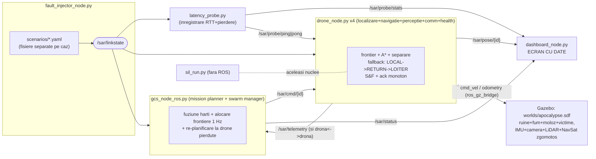

# SAR Swarm — Misiune Search & Rescue multi-dronă sub degradare de rețea

**4 drone UAV autonome + Ground Control Station, în mediu apocaliptic (ruine, fum, moloz, victime): explorare frontier-based cu A*, cartografiere cooperativă cu confirmări monotone, evitare de coliziuni, comportamente de avarie la pierderea legăturii, store-and-forward, injecție de defecte de rețea din fișiere de scenariu separate, ecran cu date live și module de înregistrare a latenței/pierderii. Două straturi de execuție pe aceleași nuclee: SIL (rulează oriunde, fără ROS) și ROS 2 + Gazebo (cu sau fără simulator), cu middleware interschimbabil CycloneDDS / rmw_zenoh.**

   

**Stare:** nucleele (explorare, rețea, metrici) + simulatorul SIL sunt **testate integral** (66 verificări, inclusiv statistice) și toate cele 6 scenarii au fost **rulate efectiv**, cu rezultatele măsurate de mai jos. Nodurile ROS 2, lumea Gazebo (XML valid, 26 modele) și launch-urile sunt validate static — prima rulare live se face pe mașina de lucru.

---

## Rezultate măsurate (SIL, 4 drone, 60×60 m, 5 victime, store-and-forward activ)

| Scenariu (fișier separat) | Timp misiune | Acoperire | Victime | Pierdere măsurată | Deconectat | RTT p95 | Recuperare |
|---|---|---|---|---|---|---|---|
| `baseline.yaml` | **106.5 s** | 95.2 % | 5/5 | 0 % | 0 s | 98 ms | — |
| `loss_30.yaml` | 129.3 s (+21 %) | 95.1 % | 5/5 | 30.6 % | 0 s | 151 ms | — |
| `loss_70.yaml` | plafon 150 s | 85.1 % | 5/5 | 70.8 % | 0 s | 205 ms | — |
| `gcs_delay_spike.yaml` (50→2000 ms) | 130.5 s | 95.7 % | 5/5 | 2.2 % | 0 s | 4403 ms | — |
| `partition_2v2.yaml` | plafon 150 s | 91.6 % | 5/5 | 4.7 % | 80 s | 123 ms | 0.05 s |
| `drone_isolation.yaml` | 112.5 s | 95.3 % | 5/5 | 4.7 % | 35 s | 124 ms | 0.06 s |

**Constatări:** misiunea reușește (5/5 victime) în *toate* scenariile — degradarea costă timp, nu misiunea; pierderea de 30 % costă doar +21 % timp (mulțumită confirmărilor + S&F); un vârf de latență de 2 s perturbă coordonarea comparabil cu pierderea de 30 %; partițiile sunt absorbite de explorarea locală de avarie. Figura: `results/comparatie_scenarii.png`; per scenariu: `results/{nume}_metrics.csv`, `_summary.json`, `_map.png`.

## Arhitectura



Degradarea se aplică **la recepție** (gating + întârziere din `/sar/linkstate`), o singură dată per mesaj. Pentru rulări pe mașini separate, injectorul poate aplica și **tc netem real** (`use_tc:=true iface:=wlan0`) — exact unealta din planul de benchmark al tezei.

## Structura

```text
sar_swarm/
├── world_config.py        SURSA UNICĂ: grila 60×60, ruine, fum, victime, drone
├── sar_core.py            explorare: hartă, frontiere, A*, alocare, coeziune, fallback
├── netem_core.py          canal degradat: latență/jitter/pierdere/izolare/partiție,
│                          store-and-forward, statistici (modul de înregistrare)
├── swarm_core.py          cinematică, goto, separare (41 teste — proiectul roi)
├── sil_run.py             simulatorul SIL: misiunea completă fără ROS → CSV+PNG
├── plot_comparison.py     figura de comparație între scenarii
├── test_sar_core.py       25 verificări noi (66 cu swarm_core)
├── scenarios/             6 FIȘIERE SEPARATE: baseline, loss_30, loss_70,
│                          gcs_delay_spike, partition_2v2, drone_isolation
├── drone_node.py          nodul ROS 2 al dronei (Gazebo SAU cinematică internă)
├── gcs_node_ros.py        GCS: planificator + manager roi + metrici CSV
├── fault_injector_node.py scenarii → /sar/linkstate (+ tc netem opțional)
├── latency_probe.py       ping/pong 2 Hz → ~/sar_data/rtt_log.csv + statistici
├── dashboard_node.py      ecranul cu date (Tkinter): hartă live + legături + RTT
├── gen_world.py           generează lumea din world_config (sursă unică)
├── worlds/apocalypse.sdf  lumea Gazebo (26 modele, XML valid)
├── config/zenoh_session_config.json5
├── launch/sar_gazebo.launch.py   totul cu Gazebo
└── launch/sar_ros.launch.py      totul FĂRĂ Gazebo (demo + banc RMW)
```

## Instalare și rulare

```bash
# dependențe (pe lângă ROS 2 Jazzy):
sudo apt install -y ros-jazzy-ros-gz python3-tk python3-yaml python3-matplotlib

# (1) SIL — rulează oriunde, fără ROS (recomandat ca prim pas):
cd ~/ros2_ws/src/sar_swarm
python3 sil_run.py scenarios/partition_2v2.yaml     # un scenariu
python3 test_sar_core.py                            # bateria de teste
python3 plot_comparison.py                          # figura (după toate 6)

# (2) ROS 2 fără Gazebo — demo într-un minut + bancul de comparație RMW:
source /opt/ros/jazzy/setup.bash
ros2 launch ~/ros2_ws/src/sar_swarm/launch/sar_ros.launch.py scenario:=loss_30.yaml

# (3) ROS 2 + Gazebo (lumea apocaliptică):
ros2 launch ~/ros2_ws/src/sar_swarm/launch/sar_gazebo.launch.py scenario:=gcs_delay_spike.yaml
```

Ieșiri: `~/sar_data/mission_metrics.csv` (GCS), `~/sar_data/rtt_log.csv` (sonda), plus ecranul cu date. Argumente: `scenario:=<fișier din scenarios/>`, `dashboard:=false` pe mașini fără interfață grafică.

### Zenoh (miezul tezei)

`rmw_zenoh` se comută din mediu — aceleași noduri, același trafic, alt middleware:

```bash
# terminalul 1 — routerul Zenoh (obligatoriu pentru rmw_zenoh):
ros2 run rmw_zenoh_cpp rmw_zenohd
# terminalul 2 — misiunea peste Zenoh:
export RMW_IMPLEMENTATION=rmw_zenoh_cpp
ros2 launch ~/ros2_ws/src/sar_swarm/launch/sar_ros.launch.py scenario:=loss_30.yaml
# comparația: rulează identic cu export RMW_IMPLEMENTATION=rmw_cyclonedds_cpp
```

Config opțional de sesiune (client → router, inclusiv pe 2 mașini): `config/zenoh_session_config.json5`. Pentru degradare **reală** de rețea între mașini: `fault_injector` cu `use_tc:=true iface:=<interfața>` aplică `tc netem` conform scenariului.

## Controlul operatorului (om-în-buclă) — NOU

Tot ce era „default de la pornire" e acum comandabil **LIVE** din bara de sub harta ecranului cu date (sau de pe topicul `/sar/operator`, JSON):

| Control | Cum | Efect |
|---|---|---|
| Misiunea | Start / Pauză / Reluare / Abort→RTH | GCS pornește/oprește alocarea automată; Abort cheamă toate dronele acasă |
| O dronă | selectorul + **click pe hartă** | `goto` exact în celula pe care ai dat click; plus Staționează / Auto / Acasă |
| Defecte LIVE | butoanele „Defecte" | izolează/restabilește drona selectată, partiție 2v2, vârf de latență 2 s, vindecă tot — fără fișier de scenariu |

- pornire în așteptare (nimic nu mișcă până apeși Start): `ros2 launch ./launch/sar_ros.launch.py autostart:=false scenario:=none.yaml` — `none.yaml` = fără scenariu, doar butoanele;
- o dronă comandată manual (goto/staționare/acasă) **iese din alocarea automată** până o treci înapoi pe Auto; la atingerea țintei rămâne pe loc (HOLD) și raportează `done` (sau `fail` dacă ținta e inaccesibilă);
- comenzile operatorului circulă **GCS → dronă prin aceeași legătură degradată** (gating + latență + store-and-forward), iar fiecare comandă e jurnalizată în `~/sar_data/op_commands.csv` ca `sent → ack → done/fail` cu timpi — adică exact metrica de **„control la distanță în timp real"** a tezei: cât durează și cât de des reușește o comandă umană sub degradare de rețea;
- logica e în `operator_core.py` (pur Python, 24 de teste în `test_operator_core.py`).

## Meniul de misiune (middleware + mod + scenariu) — NOU

```bash
python3 sar_launcher.py
```

O fereastră din care alegi totul fără să mai scrii comenzi: **middleware-ul** (CycloneDDS / **Zenoh** / FastDDS — cele neinstalate apar dezactivate, cu pachetul apt de instalat), **modul** (SIL fără ROS / ROS pur / ROS + Gazebo), **scenariul** (toate fișierele din `scenarios/` + `none.yaml` = manual), autostart și dashboard. „Pornește" setează `RMW_IMPLEMENTATION` pentru toate nodurile, pornește **automat routerul Zenoh** (`rmw_zenohd`) când e cazul, regenerează lumea Gazebo dacă ai bifat, și rulează misiunea cu jurnalul live în fereastră; „Oprește" închide ordonat tot. Logica meniului e în `launcher_core.py` (pură, 11 teste) — comparația de teză devine: aceeași misiune, rulată o dată pe CycloneDDS și o dată pe Zenoh, din două click-uri.

## Banc de defecte custom, per-legătură — NOU

Din ecranul cu date → butonul **„Defecte custom…"**: o fereastră cu toate cele 10 legături (gcs-d1…d4 + între drone), fiecare cu **latență [ms], jitter [ms], pierdere [0..1] și tăiere (JOS)**, plus rândul „TOATE legăturile" pentru setări globale (`fault_panel.py`, comenzi `set_link`/`set_all` pe `/sar/operator`).

Odată cu asta, stratul ROS a fost adus la paritate cu SIL-ul: **pierderea și jitter-ul se aplică acum real la recepție** în dronă, GCS și sonda de latență (înainte doar căderea și latența erau aplicate; `loss_30.yaml` în ROS pur era de fapt fără pierderi). Sonda măsoară acum simetric (dus + întors), deci RTT ≈ 2×latența legăturii și pierderea efectivă ≈ 1−(1−p)².

## Ce se întâmplă când se pierde legătura cu GCS?

Comportament implementat în `FallbackPolicy` și **demonstrat cu date** (figura `results/drone_isolation_drone_d2_timeline.png`, generată din rulare):

| Faza | Durata (măsurat, izolarea d2 la t=25…60 s) | Ce face drona |
|---|---|---|
| `LINKED` | 0–25.1 s | misiune normală, alocări de la GCS |
| `LOCAL_EXPLORE` | 15.0 s | continuă singură pe frontierele hărții LOCALE; restanța de celule neconfirmate crește (vârf 96) |
| `RETURN_TO_LINK` | 3.0 s | zboară înapoi spre ultimul punct unde a avut legătură (distanța scade de la ~5 m) |
| `LOITER` | 17.2 s | cercuri de ~3 m în jurul acelui punct, continuă să scaneze |
| reconectare | instant la t=60 s | tamponul store-and-forward + restanța de hartă se golesc dintr-o rafală; GCS realocă |

Cheia observabilității: drona scrie un **jurnal LOCAL** (`~/sar_data/drone_{id}_log.csv` în ROS, `results/{scenariu}_drone_{id}.csv` în SIL) — complet inclusiv în perioada în care GCS-ul n-o mai vede. Analizorul `analyze_disconnect.py` produce cronologia cu 3 panouri (stare / restanță de date / distanță față de ultimul punct cu legătură) + rezumatul tranzițiilor:

```bash
# SIL (reproduce figura de mai sus):
python3 sil_run.py scenarios/drone_isolation.yaml
python3 analyze_disconnect.py results/drone_isolation_drone_d2.csv --down 25:60

# ROS/Gazebo (după o rulare în care ai apăsat „Izolează d2"):
python3 analyze_disconnect.py ~/sar_data/drone_d2_log.csv
```

Comenzile operatorului trimise CÂT legătura e jos se pierd (fără retransmisie) — în `op_commands.csv` rămân `sent` fără `ack`: rata de reușită a comenzii umane sub degradare, măsurată.

## Maparea cerințelor → fișiere

| Cerință | Unde |
|---|---|
| Noduri per dronă (localizare/percepție/navigație/comm/health) | consolidate în `drone_node.py` (secțiuni: odom/cinematică, reveal+victime, frontier+A*+separare, gating+S&F+ack, fallback+stare); senzorii fizici (IMU/cameră/LiDAR/NavSat) în modelul dronei din lume |
| GCS (mission planner / swarm manager / dashboard) | `gcs_node_ros.py` + `dashboard_node.py` |
| Controller de simulare / injecție scenarii | `fault_injector_node.py` + `scenarios/*.yaml` (SIL: `netem_core.apply_due_events`) |
| Lume apocaliptică (ruine, fum, moloz dinamic, victime, lumină joasă) | `worlds/apocalypse.sdf` generată din `gen_world.py` |
| Senzori dronă: cameră RGB, LiDAR, IMU, GPS degradat | în modelul SDF al fiecărei drone (NavSat cu zgomot σ=1.5/3 m) |
| Zenoh: telemetrie, C2, evenimente; fallback S&F / delay-tolerant | topicurile `/sar/*` peste `rmw_zenoh`; S&F în `drone_node` + `netem_core` (tampon + livrare la restabilire, ordine păstrată) |
| Degradări: latență 50→2000 ms, pierdere 0→70 %, jitter, izolare, intermitență | `netem_core.py` + cele 6 scenarii (toate rulate, vezi tabelul) |
| Comportament dronă: frontier+A*, evitare coliziuni, hărți cooperative, fallback 3 trepte | `sar_core.py` (+ `separation_velocity` din `swarm_core`) |
| Metrici: timp misiune, acoperire, impact pierderi, timp deconectat, recuperare, coeziune | `sil_run.py` → CSV/JSON; ROS: GCS CSV + sonda RTT |
| Ecran cu date | `dashboard_node.py` |
| Module de înregistrare latență/pierdere | SIL: statisticile canalului; ROS: `latency_probe.py` (CSV + fereastră 10 s) |
| Bonus realizat | map merging (fuziunea hărților cu ack monoton); replay = scenarii deterministe cu seed |

## Lecții prinse de SIL înainte de orice rulare live

1. **Diff-urile de hartă fără confirmare mor sub pierderi** — la 30 % loss, acoperirea îngheța la 9 %; soluția: fereastră netransmisă + `map_ack` idempotent.
2. **Ack-urile trebuie să fie monotone (`from`/`upto`)** — cu 2 s latență și 5 Hz telemetrie, 10 mesaje în zbor produceau ștergeri suprapuse care aruncau celule noi → platou permanent chiar și după vindecarea rețelei. Simptomul (curba plată post-heal) a fost vizibil în figura de comparație înainte de a fi înțeles în cod.
3. **RTT-ul se măsoară la timpul exact de livrare**, altfel pasul simulării (0.1 s) domină percentilele; probele mai vechi de 5 s se tratează ca pierdute, nu ca latență.

## Direcții (bonus rămas)

SLAM multi-dronă pe LiDAR-ul deja montat; detecție AI a victimelor pe camera RGB (acum: proximitate); mediu Docker; înregistrare/replay prin `ros2 bag`.

## Licență

Apache-2.0.
