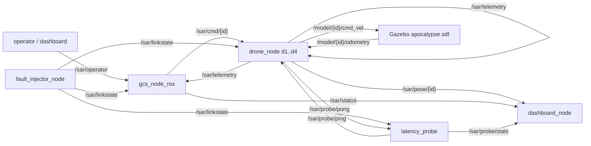

# sar_swarm -- demonstrator SAR cu roi de 4 drone (stratul de APLICATIE al benchmarkului C1)

Roi de PATRU drone autonome (d1-d4) pentru cautare-salvare (SAR) intr-o lume
post-dezastru, cu statie de control la sol (GCS), degradare de retea injectabila,
sonda de latenta si ecran de misiune. Serveste contributia C1 (comparatie de
middleware `rmw_zenoh` vs `rmw_cyclonedds_cpp` sub degradare controlata): aceleasi
noduri si acelasi trafic rulate o data peste fiecare RMW, ca sa masuram efectul
middleware-ului pe metrici de MISIUNE (acoperire, victime raportate, timp), nu doar
pe mesaje sintetice. Stratul de transport al aceleiasi linii este `c1_benchmark`
(articolul A1, SSRR 2026); acest pachet este stratul aplicativ.

Pachet "zero-build": nodurile se ruleaza direct cu `python3 nod.py`, launch-urile
prin `ros2 launch <cale>`. Nu are `package.xml`/`setup.py`, deci NU se foloseste
`ros2 run sar_swarm ...`. Logica grea sta in nuclee pure (fara ROS), testabile oriunde.

## 1. Scop

Cuantifica efectul middleware-ului la nivel de MISIUNE SAR sub retea degradata. O
echipa de 4 drone exploreaza cooperativ o zona de 60x60 m presarata cu ruine (zone
no-fly), fum (reduce raza senzorului) si 5 victime. Diferentele de metrici intre
rulari identice atribuite exclusiv RMW-ului (acelasi trafic, aceeasi degradare,
acelasi seed) constituie dovada aplicativa care lipseste din literatura (studiile
existente compara middleware doar in conditii ideale de retea).

## 2. Context si loc in arhitectura

Fiecare drona dezvaluie celule in jurul ei, isi trimite harta partiala la GCS, care
le fuzioneaza (cooperative mapping) si realoca frontierele de explorare. Cand o drona
pierde legatura cu GCS, trece autonom prin comportamente de avarie (LOCAL_EXPLORE ->
RETURN_TO_LINK -> LOITER) si tamponeaza telemetria (store-and-forward) pana la
reconectare. Intregul trafic trece printr-un singur middleware ROS 2 (RMW), schimbat
din variabila de mediu `RMW_IMPLEMENTATION`.

Pachetul vine in doua variante de degradare:
- campania C1: degradare uniforma (`tc netem` / scenarii YAML) -- validitate interna;
- campania M (etajul din `sar_plugins`): degradare dependenta de distanta -- validitate
  ecologica.

Cele doua straturi ale liniei de cercetare:

| Strat | Artefact | Ce masoara |
|---|---|---|
| Transport (microbenchmark) | `c1_benchmark` | latenta/jitter/pierdere pe mesaje sintetice |
| Aplicatie (acest pachet) | `sar_swarm` (+ etajul `sar_plugins`) | acoperire, victime raportate, timp, sub degradare |

## 3. Arhitectura

Principiul (valabil pe tot repo-ul): nucleu pur (fara ROS, cu selftest) -> nod ROS
subtire (mesaje JSON pe `std_msgs/String`) -> SIL (model software, fara ROS) ->
optional Gazebo. Degradarea se aplica LA RECEPTIE: fiecare nod citeste `/sar/linkstate`
si, la fiecare mesaj primit, decide pe baza ei daca il ignora (legatura jos / pierdere)
sau il intarzie (latenta + jitter). Asa acelasi RMW duce tot traficul, iar gating-ul e
identic peste noduri.

### 3.1 Graficul de comunicatie (topicuri)



REGULA DE EXCLUSIVITATE: pe `/sar/linkstate` publica UN SINGUR nod --
`fault_injector_node` (scenarii YAML, campania C1) SAU `radio_link_node` din
`sar_plugins` (degradare dependenta de distanta, campania M). Niciodata ambele.

### 3.2 Structura (nucleu pur -> nod -> SIL)

```
sar_swarm/
  world_config.py            SURSA UNICA DE ADEVAR: lumea (ruine, fum, victime,
                             drone), folosita de SIL, noduri, dashboard, Gazebo.

  Nuclee pure (fara ROS, testabile oriunde):
    sar_core.py              GridWorld, DiscoveredMap (reveal/merge/frontiers/A*),
                             allocate_frontiers, cohesion, FallbackPolicy
    swarm_core.py            DroneKinematics, formatii, goto/separation_velocity,
                             lawnmower, FlightStateMachine, HeartbeatWatchdog
    netem_core.py            Channel degradat (latenta/jitter/pierdere/store-and-
                             forward) + load_scenario / apply_due_events
    operator_core.py         OperatorState: misiune (IDLE/RUNNING/PAUSED/ABORTED)
                             + mod drona (AUTO/HOLD/GOTO/RTH)
    launcher_core.py         build_plan: alegeri meniu -> comanda executabila

  Noduri ROS (invelisuri subtiri peste nuclee):
    drone_node.py            drona: control 20 Hz, telemetrie 5 Hz, fallback,
                             store-and-forward, jurnal local per drona
    gcs_node_ros.py          GCS: fuziune harti, alocare frontiere, status,
                             mission_metrics.csv + op_commands.csv
    fault_injector_node.py   publica degradarea (scenariu YAML) pe /sar/linkstate;
                             optional tc netem real (use_tc)
    latency_probe.py         ping/pong 2 Hz -> RTT mediu/p95 + pierdere pe 10 s
    dashboard_node.py        ecran Tk: harta live + panou per drona + control op

  GUI / tooling:
    sar_launcher.py          meniu Tk: middleware x mod x scenariu -> pornire
    fault_panel.py           banc de defecte per-legatura (deschis din dashboard)
    gen_world.py             genereaza worlds/apocalypse.sdf din world_config

  SIL + analiza:
    sil_run.py               misiunea completa FARA ROS (figuri repetabile)
    run_sil_campaign.py      ruleaza SIL pe toate scenariile (campanie repetabila)
    analyze_disconnect.py    cronologia unei drone la pierderea legaturii
    analyze_rmw.py           agregare comparativa intre RMW-uri (din rulari)
    plot_comparison.py       figura comparativa intre scenarii (din SIL)

  Teste:                     test_sar_core, test_operator_core, test_launcher_core,
                             test_degradation

  launch/                    sar_ros.launch.py, sar_gazebo.launch.py
  scenarios/                 cazuri de degradare (YAML)
  worlds/                    apocalypse.sdf (generat de gen_world.py)
```

### 3.3 Functii-cheie din nucleele pure

`sar_core.py`: `GridWorld` (adevarul-teren: ruine no-fly, fum, victime),
`DiscoveredMap.reveal_disc` (dezvaluie un disc, raza scade in fum, intoarce celule
noi + victime), `merge_cells` (fuziune cooperativa), `coverage`, `frontiers`, `astar`
(drum 4-vecini ce ocoleste ruinele), `allocate_frontiers` (alocare lacoma cu separare
minima), `cohesion` (compactarea roiului), `FallbackPolicy`
(LINKED -> LOCAL_EXPLORE -> RETURN_TO_LINK -> LOITER).

`swarm_core.py`: `DroneKinematics` (model de ordinul I, viteza urmarita cu constanta
tau), `goto_velocity` / `separation_velocity` (ghidare P + evitare prin repulsie),
`lawnmower_waypoints` (acoperire boustrophedon impartita pe drone), `FlightStateMachine`
(tranzitii legale, refuza ordinele tardive), `HeartbeatWatchdog` (failsafe local pe
ceas monotonic: OK/HOVER/LAND).

`netem_core.py`: `Channel` (canal determinist cu seed, latenta/jitter/pierdere per
legatura, store-and-forward, inregistrare sent/lost/delivered, RTT, timp deconectat,
timp de recuperare), `send`/`deliver`/`set_link`/`isolate`/`partition`, `load_scenario`
/ `apply_due_events` (scenarii din YAML).

`operator_core.py`: `OperatorState.handle` (traduce comanda operatorului in comenzi per
drona), `on_event` (ack/done/fail), `auto_eligible` (cine primeste frontiere automat).

`launcher_core.py`: `build_plan` (traduce {mod, rmw, scenariu, optiuni} in
{pre, cmd, env, router}), `rmw_available` (detecteaza ce middleware e instalat).

### 3.4 Bucla de misiune si comportamentul de avarie

Un pas de misiune: (1) GCS aloca frontiere dronelor vazute recent (1 Hz) si trimite
`goto_frontier` pe `/sar/cmd/{id}`; (2) fiecare drona aplica fallback dupa starea
legaturii, planifica A* spre tinta, se misca, dezvaluie celule, detecteaza victime;
(3) drona trimite telemetrie (5 Hz) pe `/sar/telemetry` (harta partiala + victime);
daca GCS e cazut, intra in store-and-forward; (4) GCS fuzioneaza harta, confirma cu
`map_ack`, actualizeaza acoperirea/victimele/statusul; (5) sonda masoara RTT/pierdere
in paralel.

Fallback la pierderea legaturii cu GCS: `LINKED -> LOCAL_EXPLORE` (continua misiunea pe
harta locala, t_local=15 s) `-> RETURN_TO_LINK` (spre ultimul punct cu legatura)
`-> LOITER` (cerc lent). Orice mesaj de la GCS readuce in LINKED. Jurnalul per-drona se
scrie LOCAL (complet inclusiv in fereastra in care GCS n-o mai vede -- exact ce
analizeaza `analyze_disconnect.py`).

### 3.5 Injectarea defectelor (lant verificat in cod)

1. `fault_injector_node.tick()` (0.2 s) parcurge timeline-ul scenariului YAML si, la
   momentul `t` al fiecarui eveniment, modifica starea legaturilor
   (`isolate`/`partition`/`set_all`/`set_link`/`heal_partition`) si publica
   `/sar/linkstate` cu `{down:[...], lat_ms:{}, jit_ms:{}, loss:{}}`.
2. `drone_node._enqueue()` (gating la receptie) aplica degradarea: legatura in `down`
   -> mesaj ARUNCAT; altfel cu probabilitatea `loss` -> ARUNCAT; altfel intarziat cu
   `lat_ms +/- jit_ms`.
3. La caderea legaturii, drona intra in fallback si pune telemetria in store-and-forward;
   la restabilire livreaza tot tamponul.

Testul `test_sar_core.py` grup (7) verifica deterministic ca partitia/izolarea din YAML
taie EXACT legaturile asteptate; grup (5) ca pierderea masurata pe canal aproximeaza
configuratia. Defectele sunt aplicate si masurate, nu doar afisate.

## 4. Inventar fisiere

| Fisier | Rol | Cum se verifica |
|---|---|---|
| `world_config.py` | sursa unica a lumii (ruine/fum/victime/drone) | folosit de SIL/noduri/Gazebo |
| `sar_core.py` | nucleul misiunii (harta, frontiere, A*, fallback, canal) | `test_sar_core.py` |
| `swarm_core.py` | cinematica + masini de stare de zbor | selftest in `test_sar_core.py` (+41) |
| `netem_core.py` | canal degradat + scenarii YAML | `test_sar_core.py` grup (5)(6)(7) |
| `operator_core.py` | stratul de comanda al operatorului | `test_operator_core.py` |
| `launcher_core.py` | logica meniului de pornire (build_plan) | `test_launcher_core.py` |
| `drone_node.py` | nod drona (control/telemetrie/fallback/S&F) | rulare via launch |
| `gcs_node_ros.py` | nod GCS (fuziune/alocare/status/CSV) | rulare via launch |
| `fault_injector_node.py` | publica degradarea pe `/sar/linkstate` | `ros2 topic echo /sar/linkstate` |
| `latency_probe.py` | RTT/pierdere ping-pong | `/sar/probe/stats` |
| `dashboard_node.py` | ecran Tk (harta + paneluri + control) | rulare cu `dashboard:=true` |
| `sar_launcher.py`, `fault_panel.py` | GUI de pornire / banc de defecte | rulare Tk |
| `gen_world.py` | genereaza `worlds/apocalypse.sdf` | ruleaza o data inainte de Gazebo |
| `sil_run.py` | misiunea completa fara ROS | `python3 sil_run.py scenarios/baseline.yaml` |
| `run_sil_campaign.py` | SIL pe toate scenariile | rulare directa |
| `analyze_disconnect.py`, `analyze_rmw.py`, `plot_comparison.py` | analiza/figuri | rulare pe iesirile SIL/rulari |
| `test_*.py` | suite de verificare (vezi sectiunea 7) | `python3 test_*.py` |

## 5. Date tehnice

### 5.1 Topicuri

| Topic | Continut (JSON pe `std_msgs/String` unde e cazul) | Producator -> consumator |
|---|---|---|
| `/sar/operator` | `{type:mission/drone/fault, action, id?, cell?}` | dashboard/CLI -> GCS + fault_injector |
| `/sar/cmd/{id}` | `{k:goto_frontier/op/map_ack, ...}` | GCS -> drona (prin link degradat) |
| `/sar/telemetry` | `{k:telemetry, id, pos[x,y,z], state, from, cells, victims}` | drona -> GCS + peers |
| `/sar/pose/{id}` | `{id, pos, state}` | drona -> dashboard |
| `/sar/status` | `{t, coverage, mission, victims, drones:{...}}` | GCS -> dashboard |
| `/sar/linkstate` | `{down:[], lat_ms:{}, jit_ms:{}, loss:{}}` | fault_injector -> TOATE (unic) |
| `/sar/probe/ping` | `{to, seq, t}` | latency_probe -> drona |
| `/sar/probe/pong` | `{id, seq, t}` | drona -> latency_probe |
| `/sar/probe/stats` | `{id:{rtt_mean_ms, rtt_p95_ms, loss_10s}}` | latency_probe -> dashboard |
| `/model/{id}/cmd_vel` | `geometry_msgs/Twist` | drona -> Gazebo |
| `/model/{id}/odometry` | `nav_msgs/Odometry` | Gazebo -> drona |

### 5.2 Scenarii de degradare (`scenarios/*.yaml`)

| Scenariu | Continut |
|---|---|
| `baseline.yaml` | referinta (40 ms, 0% pierdere) |
| `loss_30.yaml` | pierdere 30% |
| `loss_70.yaml` | pierdere severa 70% |
| `gcs_delay_spike.yaml` | varf 50 -> 2000 ms intre t=40..80 s |
| `partition_2v2.yaml` | partitie de roi 2 vs 2, t=30..70 s |
| `drone_isolation.yaml` | izolarea d2, t=25..60 s |
| `mesh_relay.yaml` | scenariu pentru releu multi-hop (vezi `mesh_plugin`) |

### 5.3 Metrici de misiune (`mission_metrics.csv`)

| Coloana | Sens | Unitate |
|---|---|---|
| `coverage` | fractia celulelor libere vazute (fuzionate la GCS) | 0..1 |
| `victims_found` | victime cunoscute de GCS (din telemetrie livrata) | numar |
| `cohesion` | compactarea roiului (perechi sub raza) | 0..1 |
| `drones_linked` | drone cu legatura la GCS acum | numar |
| `victims_reported` | victime raportate la GCS pana acum | numar |
| `last_report_s` | timpul ultimei raportari de victima | s |

`victims_reported` / `last_report_s` sunt metrica de degradare care chiar separa
scenariile: masoara CAND afla GCS-ul de victima, nu cand o vede drona local. (Lectie:
"victime gasite la final" e 5/5 in aproape orice scenariu cu store-and-forward, deci nu
separa degradarea.)

## 6. Sintaxe de pornire

```bash
source /opt/ros/jazzy/setup.bash
cd ~/ros2_ws/src/sar_swarm

# L0 -- fara ROS (cel mai rapid; figuri repetabile)
python3 sil_run.py scenarios/baseline.yaml

# L1 -- roiul fara Gazebo (demo intr-un minut)
ros2 launch launch/sar_ros.launch.py scenario:=loss_30.yaml

# L2 -- roiul cu Gazebo (lumea apocalipsa)
python3 gen_world.py                    # o data: genereaza worlds/apocalypse.sdf
ros2 launch launch/sar_gazebo.launch.py scenario:=partition_2v2.yaml

# comparatia middleware (C1) -- acelasi scenariu, doua RMW:
export RMW_IMPLEMENTATION=rmw_cyclonedds_cpp   # sau rmw_zenoh_cpp
ros2 launch launch/sar_ros.launch.py scenario:=loss_30.yaml
# pentru Zenoh: porneste mai intai routerul intr-un terminal separat:
#   ros2 run rmw_zenoh_cpp rmw_zenohd

# noduri individuale (zero-build: direct python3, NU 'ros2 run sar_swarm'):
python3 fault_injector_node.py --ros-args -p scenario:=partition_2v2.yaml
ros2 topic echo /sar/linkstate

# comenzi operator (din CLI):
ros2 topic pub --once /sar/operator std_msgs/String \
  "data: '{\"type\":\"drone\",\"id\":\"d2\",\"action\":\"rth\"}'"
ros2 topic pub --once /sar/operator std_msgs/String \
  "data: '{\"type\":\"mission\",\"action\":\"pause\"}'"
```

Argumente launch: `scenario` (fisier din `scenarios/`, implicit `baseline.yaml`),
`autostart` (GCS porneste misiunea singur, implicit true), `dashboard` (implicit true).

Limitari de mediu: Gazebo (camera/lidar) cere ogre2/GPU; `tc netem` real cere sudo
(altfel se foloseste gating-ul software din `netem_core`); aceeasi implementare RMW
trebuie exportata in TOATE terminalele, altfel nodurile nu se descopera.

Curatare intre rulari (procese ramase / shared memory Fast DDS):
```bash
pkill -f 'drone_node\|gcs_node\|fault_injector\|latency_probe'; sleep 1
rm -f /dev/shm/fastrtps_*          # daca apare RTPS_TRANSPORT_SHM (non-fatal)
```

## 7. Verificare

Nucleele pure ruleaza fara ROS (numere reale, ultima rulare):

```bash
cd ~/ros2_ws/src/sar_swarm
python3 test_sar_core.py            # 25 verificari (+41 selftest swarm_core)
python3 test_operator_core.py       # 24 verificari
python3 test_launcher_core.py       # 11 verificari
python3 test_degradation.py         # gradientul de degradare pe SIL (vezi mai jos)
```

| Test | Ce verifica |
|---|---|
| `test_sar_core.py` (25, +41) | dezvaluire disc + acoperire + fum; frontiere si alocare cu tinte distincte; A* ocoleste ruinele; fallback LINKED->LOCAL->RETURN->LOITER si revenirea; canal (pierdere ~ configurata, livrate+pierdute=trimise); store-and-forward (nimic pierdut pe legatura cazuta, ordine pastrata); partitie/izolare taie exact legaturile; coeziune compact=1 / dispersat=0 |
| `test_operator_core.py` (24) | autostart; start/pauza/reluare doar la dronele AUTO; goto trunchiaza celula si scoate drona din alocare; done/fail->HOLD; abort->RTH la toate; restart dupa abort; cmd_id unic crescator; comenzi invalide ignorate |
| `test_launcher_core.py` (11) | `rmw_available` pe radacini controlate; `build_plan` pentru SIL / ROS+Zenoh (env + router) / Gazebo (gen_world inainte) / FastDDS; combinatii invalide ridica ValueError |
| `test_degradation.py` | pe o scara de scenarii (nominal -> sever), cu repetitii pe seed-uri: goodput SCADE cu severitatea, latenta e2e CRESTE, partitia produce timp in fallback > 0 (baseline = 0). Ruleaza SIL; nu a fost rulat la aceasta editare a documentatiei. |

## 8. Igiena datelor si reproductibilitate

Iesirile de rulare (`results/`, `mission_metrics.csv`, `op_commands.csv`, jurnalele per
drona, figurile de campanie) NU se versioneaza -- vezi `.gitignore` si `CONTRIBUTING.md`.
Se regenereaza cu `sil_run.py` / `run_sil_campaign.py` si cu launch-urile. In git intra
codul, scenariile, scripturile de analiza si figurile reprezentative din `docs/`.

Note de reproductibilitate si limite oneste:
- Canalul SIL e determinist (seed); RTT-ul masoara dus-intors pe acelasi ceas (ecou de
  timestamp), valid fara sincronizare NTP.
- Un singur publisher pe `/sar/linkstate` (altfel doua surse se bat, gating nedeterminist).
- Totul e in SIMULARE; validarea pe hardware e o contributie ulterioara.
- Detectarea victimei e geometrica (celula dezvaluita), nu perceptie reala.
- Modelul de drona e de ordinul I (fara aerodinamica fina) -- adecvat pentru studiul
  middleware-ului, nu al controlului de zbor.
- Stratul mesh multi-hop optional (`mesh_plugin`, contributia C3) recupereaza prin releu
  hop-by-hop telemetria unei drone partitionate; scenariul tinta este `partition_2v2`.
  Cifrele de releu sunt SIL ilustrative (N=1) si trebuie inlocuite cu date de campanie
  (N=5) inainte de orice submisie. Vezi `mesh_plugin/README.md`.
