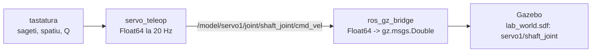

# servo_control — Documentatie tehnica

Demonstratorul istoric al tezei: un servomotor in Gazebo comandat din tastatura
(directie + viteza), pe ROS 2 Jazzy. Prima validare a lantului complet
operator -> middleware -> simulator pe masina de lucru; pastrat ca material de
demonstratie. Pachet ament_python construit de colcon.

## 1. Graful lantului



## 2. Continut

| Fisier | Rol |
|---|---|
| `servo_control/servo_teleop.py` | nodul de teleoperare din tastatura (executabil `servo_teleop`) |
| `launch/servo_launch.py` | gz sim + puntea (dupa 5 s) + teleop in fereastra `xterm` (dupa 6 s) |
| `worlds/lab_world.sdf` | lumea cu servomotorul `servo1` (instalata si in share/) |

## 3. Sintaxe de pornire

```bash
cd ~/ros2_ws && source /opt/ros/jazzy/setup.bash
colcon build --packages-select servo_control --symlink-install && source install/setup.bash

# pregatirea lumii (launch-ul o cauta in ~/.gz/worlds/)
mkdir -p ~/.gz/worlds
cp ~/ros2_ws/src/servo_control/worlds/lab_world.sdf ~/.gz/worlds/

# varianta 1 — totul dintr-un launch (necesita xterm: sudo apt install -y xterm)
ros2 launch servo_control servo_launch.py

# varianta 2 — manual, trei terminale
gz sim -r ~/.gz/worlds/lab_world.sdf
ros2 run ros_gz_bridge parameter_bridge \
  "/model/servo1/joint/shaft_joint/cmd_vel@std_msgs/msg/Float64]gz.msgs.Double"
ros2 run servo_control servo_teleop
```

## 4. Comenzile din tastatura

| Tasta | Actiune |
|---|---|
| sageata DREAPTA | rotire in sens orar |
| sageata STANGA | rotire in sens antiorar |
| sageata SUS / JOS | viteza +/- 0.5 rad/s (intre 0.5 si 10.0) |
| SPATIU | stop imediat |
| Q | iesire (publica 0 inainte) |

Nodul publica permanent la 20 Hz pe
`/model/servo1/joint/shaft_joint/cmd_vel` (std_msgs/Float64; semnul = sensul).

```bash
# verificare fara tastatura
ros2 topic pub --once /model/servo1/joint/shaft_joint/cmd_vel std_msgs/Float64 "data: 2.0"
```

## 5. Statut

Arhiva activa: nu se mai dezvolta. Functia de cercetare a fost preluata de
`teleop_rover` (teleoperare cu link degradat), `sar_swarm` (roiul) si
`joint_emulator` (impedanta pe banc).
