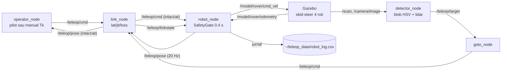

# teleop_rover — Documentatie tehnica

Roverul teleoperat printr-o legatura degradata: operator (pilot automat repetabil
sau comanda manuala) -> link cu latenta/jitter/pierdere -> robot cu poarta de
siguranta -> (optional) Gazebo cu teren accidentat, lidar si camera + perceptie
si go-to-goal. Bancul de comparatie RMW pe metrici de APLICATIE (CTE, timp pana
la tinta), complementar microbenchmarkului de transport din `c1_benchmark`.

## 1. Graful de noduri si topicuri



Add-on-uri optionale (din `sar_plugins/nodes/teleop_addons.launch.py`): garda de
obstacole `/teleop/cmd -> /teleop/cmd_safe` (cu `/scan`), afisajul predictiv
`/teleop/pose_pred`, legatura video degradata `/teleop/video`.

## 2. Fisierele de lansare (ce porneste fiecare + sintaxa)

| Launch | Ce porneste | Sintaxa |
|---|---|---|
| `launch/teleop.launch.py` | FARA Gazebo (cinematica interna): link_node + robot_node + operator_node | `ros2 launch ./launch/teleop.launch.py lat:=200 jit:=40 loss:=0.1 mode:=pilot` |
| `launch/teleop_gazebo.launch.py` | + gz sim `worlds/teleop_course.sdf` + puntea cmd_vel/odometry | `python3 gen_rover_world.py && ros2 launch ./launch/teleop_gazebo.launch.py lat:=500 jit:=100 mode:=manual` |
| `launch/teleop_perception.launch.py` | terenul accidentat `teleop_rough.sdf` (heightmap, lidar, camera) + punti + detector + goto; porneste SINGUR routerul Zenoh la `rmw:=zenoh` | `ros2 launch ./launch/teleop_perception.launch.py rmw:=zenoh goal_source:=object target_class:=red lat:=200 jit:=40` |

Argumente:

| Argument | Launch | Implicit | Semnificatie |
|---|---|---|---|
| `lat`, `jit`, `loss` | toate | 0 | degradarea legaturii [ms, ms, 0..1] |
| `mode` | teleop, teleop_gazebo | pilot / manual | `pilot` = PilotModel pure-pursuit (repetabil); `manual` = Tk W/A/S/D |
| `rmw` | perception | cyclone | `cyclone` sau `zenoh` (routerul pornit automat) |
| `goal_source` | perception | object | `object` (tinta detectata) sau `waypoint` (`goal_x`, `goal_y`) |
| `target_class` | perception | red | culoarea tintei cautate |

## 3. Nodurile si nucleele pure

| Fisier | Rol | Interfata |
|---|---|---|
| `operator_node.py` | operatorul | param `mode`; pub `/teleop/cmd` 20 Hz; in manual, Tk arata varsta feedback-ului |
| `link_node.py` | legatura degradata | params `lat_ms`, `jit_ms`, `loss`; intarzie ambele sensuri; pub `/teleop/linkstate` (format multi-link: `{down:[], lat_ms:{...}, jit_ms, loss}`) |
| `robot_node.py` | robotul | sub `/teleop/cmd` filtrat prin linkstate; SafetyGate (watchdog 0.4 s -> oprire); pub `/teleop/pose`; params `use_gazebo`, `use_hardware`/`port`; jurnal `~/teleop_data/robot_log.csv` |
| `detector_node.py` | perceptia | blob HSV + pinhole + sol-plat, refinare optionala lidar (`scan_topic:=/scan`); pub `/teleop/target` + `detections.csv` |
| `goto_node.py` | go-to-goal | params `goal_source`, `goal_x/goal_y`, `target_class`; pub `/teleop/cmd` |
| `fake_camera_pub.py` | camera sintetica pentru teste fara Gazebo | param `color` |
| `rover_core.py` / `nav_core.py` / `vision_core.py` | nucleele pure: DiffDrive, Course, SafetyGate, PilotModel; navigatie; viziune | `test_nav_core.py` (11), `test_vision_core.py` (11) |
| `gen_rover_world.py`, `gen_rough_world.py` | generatoarele de lumi (curse + heightmap 129x129) | validate `gz sdf -k` |
| `sil_teleop.py` | misiunea SIL fara ROS | `python3 sil_teleop.py --lat 200 --jit 40 --loss 0.1 --trace /tmp/tr.csv` |
| `sweep_teleop.py` | maturarea parametrilor (75 rulari; include regimul de actuator) | figuri in `results/` |
| `analyze_perception.py` | metricile Zenoh vs Cyclone | `python3 analyze_perception.py --goal 8 3 --run cyclone ~/teleop_data_cyclone --run zenoh ~/teleop_data_zenoh` |
| `plot_trace.py` | traseul din jurnal | acelasi format SIL si live |

## 4. Verificare fara Gazebo (nivelul 0/1)

```bash
cd ~/ros2_ws/src/teleop_rover
python3 test_nav_core.py && python3 test_vision_core.py     # nucleele pure
python3 sil_teleop.py --lat 200 --jit 40 --loss 0.1         # misiune SIL completa

# lantul de perceptie pe CPU, fara simulator:
python3 fake_camera_pub.py --ros-args -p color:=red &
python3 detector_node.py
```

## 5. Limite oneste

Proiectia monoculara presupune sol-plat — pe heightmap eroarea de distanta creste
cu panta (de aceea exista refinarea lidar). Camera si gpu_lidar cer ogre2/GPU.
Add-on-ul de garda cere remaparea robotului pe `/teleop/cmd_safe`.
