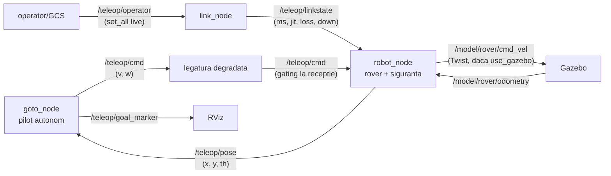

# teleop_rover

Rover cu tractiune diferentiala teleoperat printr-o legatura degradata, in
bucla inchisa. Un "pilot" (autonom sau operator) trimite comenzi de viteza
catre rover; comenzile trec printr-o legatura care poate fi degradata
controlat (latenta, jitter, pierdere, cadere), iar roverul le primeste tarziu
sau deloc. Pe rover, un strat de siguranta respinge comenzile invechite si
opreste la obstacol. Pachetul e al treilea demonstrator al tezei: controlul in
bucla inchisa (nu doar telemetrie unidirectionala) sub link degradat, unde
intarzierea feedback-ului destabilizeaza bucla.

Gasire-cheie a proiectului: pragul de "breakdown" al teleoperarii (~300-400 ms
latenta) e determinat de **invechirea feedback-ului** (operatorul vede o poza
veche si suprareactioneaza), nu de inertia actuatorului.

---

## 1. Descrierea proiectului

Bucla: pilot -> /teleop/cmd -> [legatura degradata] -> rover -> /teleop/pose ->
[legatura degradata] -> pilot. Doua surse de comanda interschimbabile:
- pilot AUTONOM (goto_node.py): conduce roverul spre o tinta (waypoint, obiect
  detectat, sau tinta data de GCS), cu evitare de obstacole LA DISTANTA (scan
  prin link, deci si perceptia e degradata);
- operator UMAN (prin GCS / RViz), aceleasi topicuri.

Pe rover (robot_node.py), comenzile NU se aplica direct: trec prin gating la
receptie (din /teleop/linkstate) + un strat de siguranta (watchdog 0.4 s,
respingerea comenzilor mai vechi de 1 s, oprire locala la obstacol pe lidarul
de bord). Asa, chiar daca o comanda veche "scapa" prin link, roverul nu intra
in obstacol.

Degradarea e produsa de link_node.py (setabila la pornire sau LIVE pe
/teleop/operator). Roverul ruleaza pe cinematica interna (use_gazebo:=false)
sau pe fizica reala Gazebo (use_gazebo:=true), sau chiar pe hardware
(use_hardware:=true, firmware Arduino/ESP32).

---

## 2. Graficul de comunicatie (topicuri)



Comanda circula pilot -> rover prin legatura degradata; poza se intoarce la
pilot tot prin legatura. link_node decide ce trece. Cu Gazebo, robot_node
traduce comanda interna in Twist si citeste odometria reala.

---

## 3. Work tree

```
teleop_rover/
├── goto_node.py        pilot autonom: conduce spre tinta, evitare la distanta
│                       (goal_source: waypoint | object | gcs)
├── robot_node.py       roverul: gating la receptie + siguranta (watchdog,
│                       comenzi invechite, oprire la obstacol) + cinematica/Gazebo
├── link_node.py        produce degradarea pe /teleop/linkstate (static sau live)
│
├── rover_core.py       nucleu pur: DiffDrive (cinematica diferentiala),
│                       Course (traseu + cross-track), PilotModel (lege de
│                       comanda), SafetyGate (watchdog + comenzi invechite)
│
├── launch/
│   ├── teleop_perception.launch.py   pilot + rover + evitare + scan
│   └── teleop_gazebo.launch.py        rover pe fizica Gazebo
└── tests/
    └── test_rover_core.py             cinematica, traseu, siguranta
```

---

## 4. Descrierea detaliata (noduri, topicuri, functii)

### Noduri ROS

| Nod | Aboneaza | Publica | Rol |
|---|---|---|---|
| goto_node.py | /teleop/pose, /teleop/goal, /teleop/target | /teleop/cmd, /teleop/goal_marker | pilot autonom spre tinta, cu evitare la distanta |
| robot_node.py | /teleop/cmd, /teleop/linkstate, /model/rover/odometry | /teleop/pose, /model/rover/cmd_vel | rover: gating + siguranta + cinematica/Gazebo |
| link_node.py | /teleop/operator | /teleop/linkstate | produce degradarea (latenta/jitter/pierdere/cadere) |

### Parametri cheie

- goto_node: goal_source (waypoint | object | gcs), goal_x/goal_y (la waypoint),
  goal_topic (unde asculta tinta de la GCS), use_avoidance, scan_topic.
- robot_node: use_gazebo (fizica reala), use_hardware + port (Arduino/ESP32),
  watchdog (0.4 s), pragul comenzilor invechite (1 s).
- link_node: lat_ms, jit_ms, loss, down (statice la pornire) sau set_all live
  pe /teleop/operator.

### rover_core.py (nucleu pur, testabil fara ROS)

| Clasa | Rol |
|---|---|
| DiffDrive | cinematica diferentiala cu acceleratii limitate (a_max, w_acc) |
| Course | traseu din waypoint-uri; tinta curenta, cross-track error, avans |
| PilotModel | legea de comanda: vireaza spre tinta, regleaza viteza |
| SafetyGate | watchdog + respingerea comenzilor mai vechi de un prag |

---

## 5. Learning: pornire + teste

```bash
cd ~/ros2_ws/src/teleop_rover

# --- A) testele nucleului pur (orice masina) ---
python3 tests/test_rover_core.py
# verifica: cinematica DiffDrive, cross-track pe traseu, SafetyGate (watchdog
# opreste cand nu vin comenzi; comenzile invechite sunt respinse)

# --- B) bucla completa pe cinematica interna (ROS2, fara Gazebo) ---
ros2 launch launch/teleop_perception.launch.py \
    goal_source:=waypoint goal_x:=8.0 goal_y:=3.0
# in alt terminal, degradeaza legatura LIVE:
ros2 topic pub --once /teleop/operator std_msgs/String \
    'data: "{\"action\":\"set_all\",\"ms\":300,\"jit\":50,\"loss\":0.1}"'
# vei vedea roverul devenind instabil (suprareactie la poza veche)

# --- C) pe fizica reala Gazebo ---
ros2 launch launch/teleop_gazebo.launch.py

# --- D) campanie de degradare (daca ai scriptul run_rmw_campaign) ---
GOAL_X=8.0 GOAL_Y=3.0 REPS=5 DURATION=90 bash run_rmw_campaign.sh
```

Ce verifica testele (test_rover_core.py):
- DiffDrive: integrarea cinematicii (pozitia evolueaza corect la v, w date).
- Course: tinta curenta, cross-track error (distanta laterala fata de traseu),
  avansul la atingerea waypoint-ului.
- PilotModel: comanda vireaza spre tinta.
- SafetyGate: watchdog opreste cand nu mai vin comenzi; comenzile mai vechi
  decat pragul sunt respinse (nu se aplica o comanda din trecut).

---

## 6. Documentatie tehnica

### Bucla inchisa vs telemetrie unidirectionala

Spre deosebire de roi (unde telemetria curge intr-un sens), aici comanda si
feedback-ul circula in bucla, ambele prin legatura degradata. Asta inseamna ca
intarzierea se aduna de doua ori (comanda intarzie sa ajunga + poza intarzie
sa se intoarca), iar bucla de control devine instabila peste un prag de
latenta. Acesta e fenomenul central pe care il studiaza pachetul.

### Cele trei straturi de siguranta

1. gating la receptie (din /teleop/linkstate): modeleaza pierderea reala de
   comenzi pe link;
2. respingerea comenzilor invechite (mai vechi de ~1 s): o comanda care a stat
   prea mult in retea nu mai e relevanta pentru starea curenta -> ignorata;
3. watchdog (0.4 s): daca nu vine nicio comanda valida, roverul opreste (nu
   continua orbeste ultima comanda).
Optional, un al patrulea strat (oprire la obstacol pe lidarul de bord) cand se
foloseste evitarea.

### Evitarea la distanta vs locala

goto_node evita obstacole din SCAN-ul primit prin link (perceptie degradata,
ca o "poza" intarziata) -- demonstreaza cum se degradeaza decizia cand intrarea
senzoriala e veche. robot_node pastreaza o oprire LOCALA de urgenta pe lidarul
de bord (fara link), ca plasa de siguranta independenta de retea.

### Gasirea-cheie (rezultat publicabil)

Pragul de breakdown al teleoperarii (~300-400 ms) e determinat de invechirea
feedback-ului (staleness), nu de inertia actuatorului: roverul devine
instabil pentru ca pilotul (uman sau autonom) decide pe o poza veche si
suprareactioneaza, nu pentru ca motoarele raspund prea incet. Implicatie:
predictia pozei (predictive display, vezi sar_plugins/predictor) ataca exact
cauza reala.

### Limite oneste

- Cinematica diferentiala e idealizata (fara alunecare a rotilor); cu
  use_gazebo:=true se trece la fizica cu frecare reala.
- Evitarea la distanta foloseste un scan simplificat; un lidar real ar adauga
  zgomot si unghiuri moarte.
- Modelul de pilot autonom e o lege proportionala simpla, nu un controler optim
  -- suficient pentru a evidentia efectul latentei, nu pentru performanta maxima.
