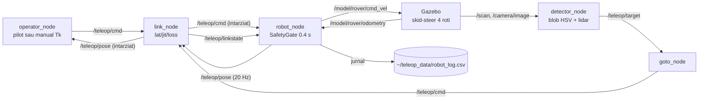

# teleop_rover — Documentatie tehnica

Roverul teleoperat printr-o legatura degradata: operator (pilot automat repetabil
sau comanda manuala) -> link cu latenta/jitter/pierdere -> robot cu poarta de
siguranta -> (optional) Gazebo cu teren accidentat, lidar si camera + perceptie
si go-to-goal cu EVITARE DE OBSTACOLE. Bancul de comparatie RMW pe metrici de
APLICATIE (CTE, timp pana la tinta) si de DEGRADARE end-to-end (latenta e2e p95,
jitter, drop-rate, opriri de siguranta), complementar microbenchmarkului de
transport din `c1_benchmark`.

NOU (vezi sectiunile 6-8): evitare de obstacole hibrida (planificare VFH/potential-
fields la distanta, prin link degradat + strat de siguranta lidar LOCAL pe rover),
pozitionare absoluta din Gazebo (coordonate-lume reale), si 6 metrici end-to-end
care CRESC cu degradarea - spre deosebire de CTE, ele arata clar cum reteaua
compromite misiunea SAR.

## 1. Graful de noduri si topicuri



Add-on-uri optionale (din `sar_plugins/nodes/teleop_addons.launch.py`): garda de
obstacole `/teleop/cmd -> /teleop/cmd_safe` (cu `/scan`), afisajul predictiv
`/teleop/pose_pred`, legatura video degradata `/teleop/video`.

## 2. Fisierele de lansare (ce porneste fiecare + sintaxa)

| Launch | Ce porneste | Sintaxa |
|---|---|---|
| `launch/teleop.launch.py` | FARA Gazebo (cinematica interna): link_node + robot_node + operator_node | `ros2 launch ./launch/teleop.launch.py lat:=200 jit:=40 loss:=0.1 mode:=pilot` |
| `launch/teleop_gazebo.launch.py` | + gz sim `worlds/teleop_course.sdf` + puntea cmd_vel/odometry | `python3 gen_rover_world.py && ros2 launch ./launch/teleop_gazebo.launch.py lat:=500 jit:=100 mode:=manual` |
| `launch/teleop_perception.launch.py` | terenul accidentat `teleop_rough.sdf` (heightmap, lidar, camera, **5 obstacole + poza-lume**) + punti + detector + goto **cu evitare**; porneste SINGUR routerul Zenoh la `rmw:=zenoh` | `ros2 launch ./launch/teleop_perception.launch.py rmw:=zenoh goal_source:=waypoint goal_x:=8.0 goal_y:=3.0 arrive_r:=1.0 lat:=200 jit:=40` |

Argumente:

| Argument | Launch | Implicit | Semnificatie |
|---|---|---|---|
| `lat`, `jit`, `loss` | toate | 0 | degradarea legaturii [ms, ms, 0..1] |
| `mode` | teleop, teleop_gazebo | pilot / manual | `pilot` = PilotModel pure-pursuit (repetabil); `manual` = Tk W/A/S/D |
| `rmw` | perception | cyclone | `cyclone` sau `zenoh` (routerul pornit automat) |
| `goal_source` | perception | object | `object` (tinta detectata), `waypoint` (`goal_x`, `goal_y`) sau `gcs` (LIVE de la pupitru) |
| `target_class` | perception | red | culoarea tintei cautate |
| `goal_x`, `goal_y` | perception | 8.0, 3.0 | **tinta in mod waypoint; foloseste ZECIMALE (8.0 nu 8), altfel nodul cade pe tip INTEGER** |
| `arrive_r` | perception | 1.0 | **NOU** raza de sosire [m]; pe traseu lung cu obstacole, 1.0 e mai potrivit decat 0.5 |
| `use_avoidance` | perception | true | **NOU** navigare cu evitare VFH (lidar prin link degradat) |

## 3. Nodurile si nucleele pure

| Fisier | Rol | Interfata |
|---|---|---|
| `operator_node.py` | operatorul | param `mode`; pub `/teleop/cmd` 20 Hz; in manual, Tk arata varsta feedback-ului |
| `link_node.py` | legatura degradata | params `lat_ms`, `jit_ms`, `loss`; intarzie ambele sensuri; pub `/teleop/linkstate` (format multi-link: `{down:[], lat_ms:{...}, jit_ms, loss}`) |
| `robot_node.py` | robotul | sub `/teleop/cmd` filtrat prin linkstate; SafetyGate (watchdog 0.4 s -> oprire); pub `/teleop/pose`; params `use_gazebo`, `use_hardware`/`port`; jurnal `~/teleop_data/robot_log.csv` |
| `detector_node.py` | perceptia | blob HSV + pinhole + sol-plat, refinare optionala lidar (`scan_topic:=/scan`); pub `/teleop/target` + `detections.csv` |
| `goto_node.py` | go-to-goal | params `goal_source`, `goal_x/goal_y`, `target_class`; pub `/teleop/cmd` |
| `fake_camera_pub.py` | camera sintetica pentru teste fara Gazebo | param `color` |
| `rover_core.py` / `nav_core.py` / `vision_core.py` | nucleele pure: DiffDrive, Course, SafetyGate, PilotModel; navigatie; viziune | `test_nav_core.py` (11), `test_vision_core.py` (11) |
| `avoidance_core.py` | **NOU** nucleu pur de evitare: VFH/potential-fields (atractie spre tinta + repulsie din lidar), `avoid_command()`, `front_blocked()` (siguranta), `AvoidParams` | testabil cu scanuri sintetice, fara ROS |
| `gen_rover_world.py`, `gen_rough_world.py` | generatoarele de lumi (curse + heightmap 129x129) | validate `gz sdf -k` |
| `sil_teleop.py` | misiunea SIL fara ROS | `python3 sil_teleop.py --lat 200 --jit 40 --loss 0.1 --trace /tmp/tr.csv` |
| `sweep_teleop.py` | maturarea parametrilor (75 rulari; include regimul de actuator) | figuri in `results/` |
| `analyze_perception.py` | metricile Zenoh vs Cyclone | `python3 analyze_perception.py --goal 8 3 --run cyclone ~/teleop_data_cyclone --run zenoh ~/teleop_data_zenoh` |
| `plot_trace.py` | traseul din jurnal | acelasi format SIL si live |

## 4. Verificare fara Gazebo (nivelul 0/1)

```bash
cd ~/ros2_ws/src/teleop_rover
python3 test_nav_core.py && python3 test_vision_core.py     # nucleele pure
python3 sil_teleop.py --lat 200 --jit 40 --loss 0.1         # misiune SIL completa

# lantul de perceptie pe CPU, fara simulator:
python3 fake_camera_pub.py --ros-args -p color:=red &
python3 detector_node.py
```

## 5. Limite oneste

Proiectia monoculara presupune sol-plat — pe heightmap eroarea de distanta creste
cu panta (de aceea exista refinarea lidar). Camera si gpu_lidar cer ogre2/GPU.
Add-on-ul de garda cere remaparea robotului pe `/teleop/cmd_safe`.

## 6. Evitare de obstacole - arhitectura HIBRIDA (NOU)

Doua straturi cu roluri distincte, ca in sistemele SAR reale:

1. **Navigare cu evitare LA DISTANTA** (`goto_node` + `avoidance_core`): operatorul/
   pilotul primeste `/scan` PRIN LINK DEGRADAT (acelasi gating ca poza: down + loss
   + latenta + jitter) si planifica evitarea cu VFH/potential-fields. Sub link prost,
   "orbeste" si manevreaza pe perceptie veche -> se poate rataci.
2. **Siguranta LOCALA pe rover** (`robot_node`): lidarul de bord (FARA link, senzor
   local) suprascrie comanda cu STOP daca un obstacol e sub `d_crit`, INDIFERENT ce
   zice operatorul. Previne coliziunea critica chiar cand link-ul a cedat.

Asa demonstram doua lucruri: (a) navigarea la distanta se degradeaza cu reteaua;
(b) un strat local minim previne dezastrul. Metoda VFH: Borenstein & Koren 1991;
potential-fields: Khatib 1986.

Parametri cheie (in capul `avoidance_core.py`, usor de reglat):

| Parametru | Implicit | Rol |
|---|---|---|
| `D_SAFE` | 2.5 m | sub atata un obstacol incepe sa respinga (reactie din timp) |
| `D_CRIT` | 0.6 m | sub atata = coliziune iminenta -> STOP (siguranta locala) |
| `K_REP` | 3.0 | cat de tare resping obstacolele (mai mare = ocolire mai larga) |
| `K_ATT` | 1.0 | atractia spre tinta |
| `GOAL_CLEAR_R` | 4.0 m | sub atata de tinta, IGNORA repulsia (tinta e destinatia, nu obstacol - altfel roverul orbiteaza in jurul ei) |

## 7. Obstacole in lume (NOU)

`worlds/teleop_rough.sdf` contine acum 5 obstacole statice (`obs_1..obs_5`, cilindri
gri r=0.4 h=1.5, `<static>true</static>`) asezate pe linia spawn->tinta, decalate
lateral alternativ (~1.0 m) ca roverul sa serpuiasca. Toate sunt la >4 m de tinta
(peste `GOAL_CLEAR_R`), ca sa nu fie ignorate gresit. Spawn-ul roverului e langa
statia GCS (`-14.5, -14.0`), tinta = turnul rosu `(8, 3)`, traseu util ~28 m.

## 8. Metrici end-to-end de DEGRADARE (NOU)

Pe langa CTE / timp / reusita, jurnalul are acum coloane care CRESC cu degradarea
(spre deosebire de CTE, care pe traseu simplu scade inselator):

| Coloana log | Metrica in summary | Ce arata |
|---|---|---|
| `e2e_lat` | `e2e_lat_med_ms`, `e2e_lat_p95_ms` | latenta emitere(goto)->executie(robot): link+jitter+coada |
| `cmd_jitter` | `jitter_med_ms` | variatia intervalului real intre comenzi executate |
| `cmd_gap` | `gap_max_ms` | cel mai mare interval fara comanda noua |
| `stops` | `opriri` | opriri din watchdog (comanda invechita) |
| `drop_rate` | `drop_rate` | fractia de comenzi pierdute pe link |
| `safety_stops` | `opriri_siguranta` | de cate ori siguranta LOCALA a oprit roverul |

Rezultat tipic (campanie pe traseu cu obstacole, 4 conditii de retea): timpul creste
cu degradarea (33 s baseline -> 60 s mediu), `e2e_lat_p95` urca 18 -> 482 ms, iar la
loss 30% misiunea ESUEAZA (reusita 0) - roverul se rataceste pe perceptie degradata.
Aceasta e povestea SAR pe care CTE-ul singur nu o spunea.

## 9. Comenzi rapide - campania pe traseu cu obstacole (NOU)

```bash
cd ~/ros2_ws/src/teleop_rover
# proba de timp (1 repetare, durata generoasa ca sa nu taie misiunea):
GOAL_X=8.0 GOAL_Y=3.0 REPS=1 DURATION=90 bash run_rmw_campaign.sh
# campania completa (5 repetari, durata calibrata):
GOAL_X=8.0 GOAL_Y=3.0 REPS=5 DURATION=90 bash run_rmw_campaign.sh
# analiza (acelasi arrive_r ca in campanie):
python3 analyze_campaign.py --camp results/<campanie> --goal 8.0 3.0 --arrive 1.0
```

Verificare ca poza-LUME ajunge (nu odometrie relativa): prima linie de date din
`robot_log.csv` trebuie sa arate ~(-14.5, -14.0), NU (0, 0):
```bash
head -3 results/<campanie>/zenoh/1_baseline/rep1/robot_log.csv
```
